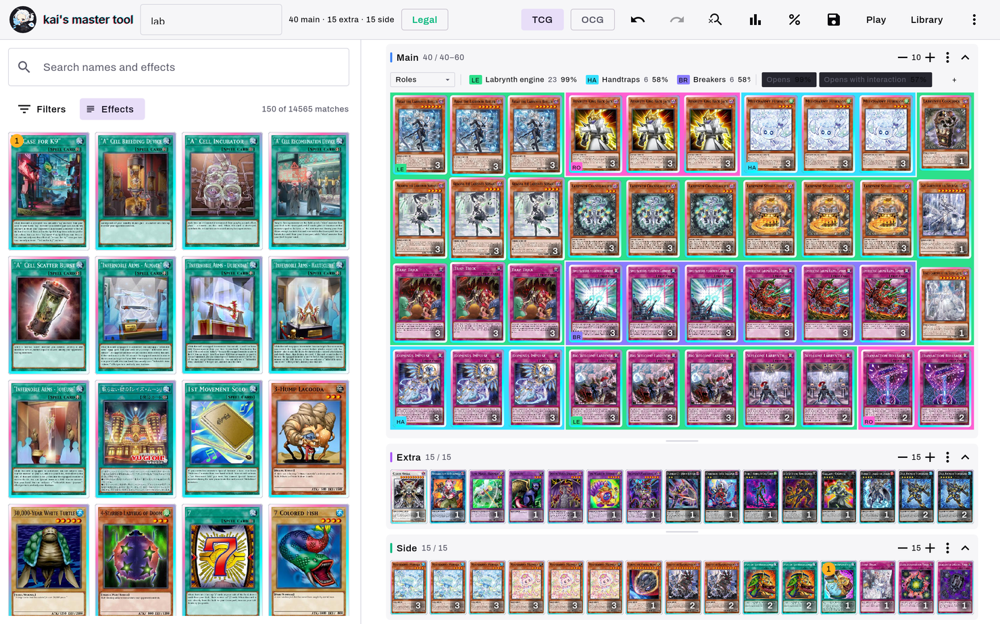
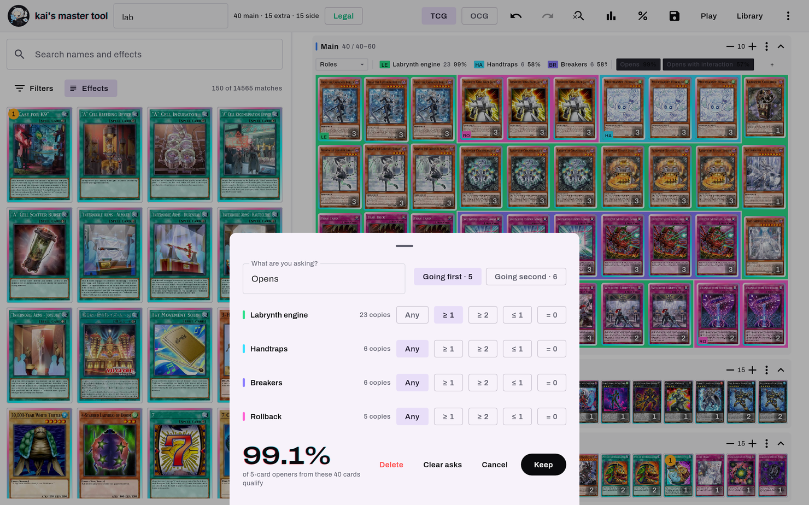
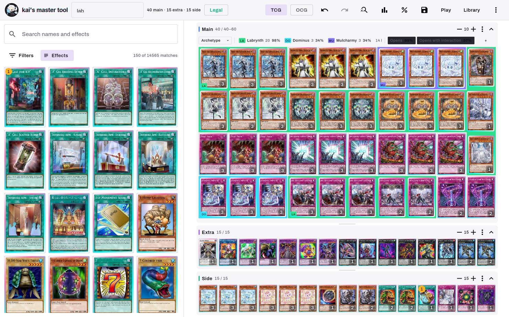
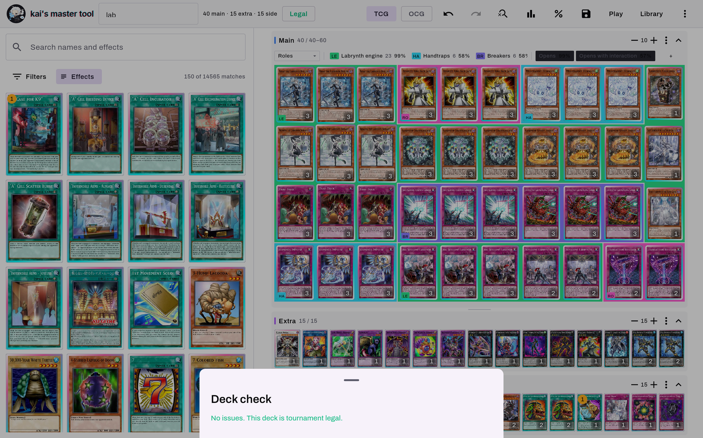
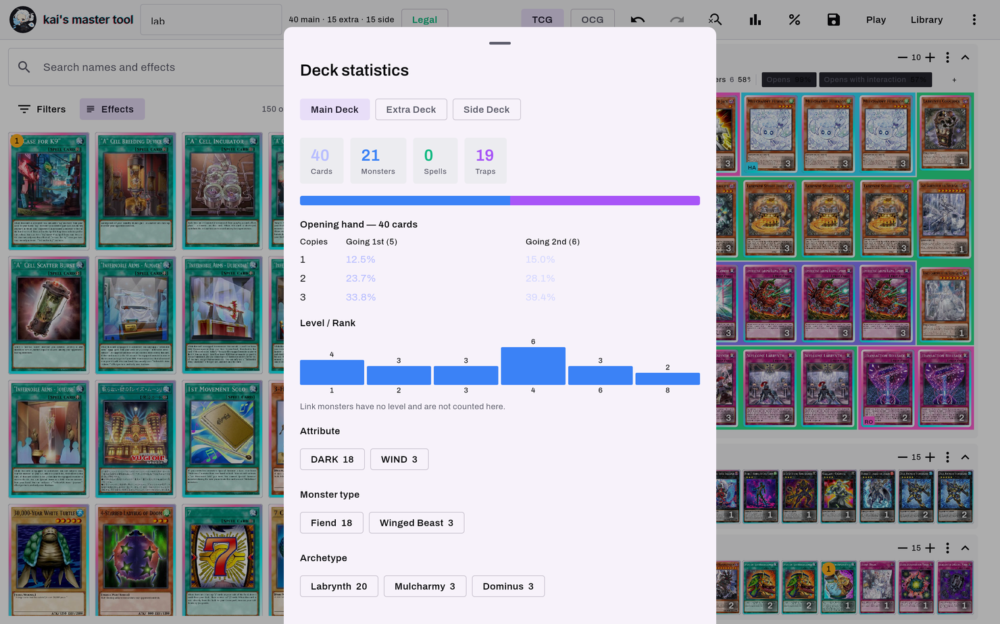
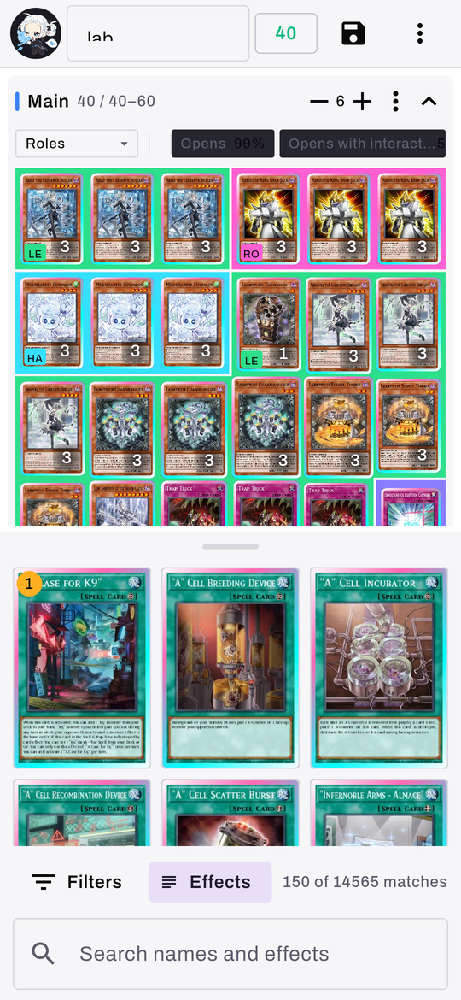

# kai's master tool

**A Yu-Gi-Oh! deck builder that answers the questions a deck list cannot —
then lets you play the deck out on a 3D table.** One Kotlin codebase, for
Android, desktop and the New 3DS.

Build the deck, then ask it things. What are the *exact* odds this opens? Which
cards are actually the engine and which are the twelve you keep drawing
alongside it? What does the 41st card cost? The maths is exact rather than
simulated, the breakdown repartitions on demand, and the answers are stored in
the deck file rather than in a sheet you closed.

[](https://github.com/kaiharimoto/kai-master-tool/releases/latest)
[](https://github.com/kaiharimoto/kai-master-tool/actions/workflows/build-app.yml)
[](LICENSE)

---

<p align="center">
  
</p>

<p align="center"><sub>
The tablet builder, reading a deck by the roles its owner gave it.
</sub></p>

## Install

### Android

1. Download **`kai-master-tool-<version>.apk`** from the
   [latest release](https://github.com/kaiharimoto/kai-master-tool/releases/latest).
2. Open it. Android asks once for permission to install unknown apps — a
   one-time, per-app setting.
3. After that the app updates itself: it checks this repository's latest release
   on launch, and tapping the version number in the top bar forces a check.

Android 8.0 (API 26) or newer. Built against a Samsung Tab S11 Ultra in
landscape; phones get a different arrangement, not a squeezed one.

### Desktop — macOS, Windows, Linux

No prebuilt download yet. Build one:

```bash
cd app
./gradlew :desktopApp:packageDistributionForCurrentOS   # .dmg / .msi / .deb
./gradlew :desktopApp:run                               # or just run it
```

The desktop build does not self-update; it opens the release page instead.

### New 3DS

Install **`kai-master-tool-1.0.0.cia`** from the
[`3ds-v*` track](https://github.com/kaiharimoto/kai-master-tool/releases/tag/3ds-v1.0.0)
with FBI. A `.3dsx` is attached for the Homebrew Launcher, but **test the
`.cia`** — a `.3dsx` inherits its host title's permissions while a `.cia` gets
only what its own RSF grants, so a missing service is a black screen in one and
not the other.

> The 3DS releases are pre-releases *on purpose, and are not unfinished.*
> `/releases/latest` returns the newest non-pre-release of any tag shape, and
> the Android updater reads exactly that endpoint. Without the flag every tablet
> would ask a 3DS release for an APK it does not have.

---

# Building decks

## Searching the pool

Some archetypes are not a word in anybody's name. The deck built out of cards
that *mention* "Light and Darkness Ritual" is unfindable by name unless you
already know every card in it — so the search reads printed card text, and does
it by default.

That is only safe because of where text ranks. Every name tier scores above
every text tier:

| | match | score |
|---|---|---|
| name | exact | 1000 |
| name | starts with the query | 900 |
| name | a word of it starts with the query | 800 |
| name | contains the query | 700 |
| name | every word you typed prefixes some word, any order — `blossom ash` | 650 |
| name | fuzzy, whole name, `d` typos | 520 − 40·d |
| name | fuzzy, one word | 500 − 40·d |
| name | fuzzy, multi-word | 460 |
| **text** | **the whole query, contiguous** | **400** |
| **text** | **every term present, scattered** | **300** |

So widening the scope can only ever *append* rows to the bottom of a list whose
top is unchanged. Fuzzy matching needs four characters before it engages, and
allows two typos at eight characters or more, one at four. The readout counts
both halves — `150 of 3,214 matches · 37 by effect`.

**Scope prefixes**, at the start of the query:

| prefix | searches |
|---|---|
| `effect:` `text:` `e:` `t:` | printed card text only |
| `name:` `n:` | names only |
| `"a run of words"` | must appear contiguous and in order |

An unclosed quote is treated as closed, so the list never blanks the moment you
type `"`. The trailing word always matches as a prefix — until you close it with
a space — so results are never empty just because you have not finished typing.

**There are no `atk:` / `level:` / `type:` operators.** Those are the filter
sheet's nine facets, which is a deliberate split: a prefix costs no chrome and
belongs on the screen that has none, but nine numeric facets in a query language
is a syntax to memorise. The facets are card type, main/extra, attribute,
level/rank, banlist status, ATK range, DEF range, monster type, and archetype
(searchable, capped at 40 chips because there are thousands). OR within a facet,
AND across them, and every active one becomes a pill you can pull off
individually.

## Knowing whether the deck opens

<p align="center">
  
</p>

<p align="center"><sub>
Two questions kept with the deck. 23 of the 40 cards are the engine, so it opens on one 99.1% of the time — and the same sheet is where you watch that number move when you cut a card.
</sub></p>

**The odds are exact, not simulated.** A multivariate hypergeometric,
enumerated over hand compositions with multiplicative binomials — no sampling,
no convergence, no "run 10,000 hands". Ask the same question twice and you get
the same number, because it is *the* number.

A question is built from your own roles:

- Five positions per role — **Any**, **≥ 1**, **≥ 2**, **≤ 1**, **= 0** —
  rather than two spinners, because those are the questions people actually ask.
- Two hand sizes: **going first (5)** and **going second (6)**.
- An **ungrouped** pseudo-role covering every card no role claims, which is how
  *"opens, and no more than one dead card"* becomes expressible at all.
- Asks are keyed by role **id**, so renaming a role does not detach the question
  from it, and deleting a role prunes its asks rather than corrupting them.

**Questions are a list, and they live in the deck file.** One question cannot
hold both halves of a ratio argument — "do I open" and "do I brick" pull against
each other and you need to watch both move when you cut a card. And they travel
with the deck rather than with the install, so the description of your deck is
not something you rebuild in a sheet every time you open it.

Alongside that, two cheaper readings are always on: every key on the breakdown
bar carries its own *at least one* rate, and the statistics panel gives the
1/2/3-copies × 5/6-cards table computed against the deck's **actual** size — so
the cost of the 41st card is a number you can see rather than a principle you
half-remember.

## Reading the deck six ways

<p align="center">
  
</p>

<p align="center"><sub>
The same deck read by archetype instead. The top four are coloured and <b>the other 14 are not</b> — that uncoloured block is the non-engine, and finding it is most of what this lens is for.
</sub></p>

The deck is a mosaic that **cracks open only where two groups meet** — a 4dp
gutter, traced around whole blocks, with the group's colour drawn solid in the
space that opens. Nothing is rearranged to make tidier blocks; a grid position
is always a deck position, so what you are looking at is the deck.

The partition is a parameter, so the same machinery draws six readings:

| lens | what it partitions by |
|---|---|
| **Deck** | nothing — the plain mosaic, the quiet position |
| **Roles** | your own groups. The only editable one |
| **Archetype** | the top four, and **everything past the fourth is left unclaimed** — which is where the non-engine shows itself, and is most of the point |
| **Type** | Monster / Spell / Trap, in that fixed order because "20 / 12 / 8" is read in it |
| **Copies** | ×1 / ×2 / ×3, brightest is rarest, counted *within the section being drawn* |
| **Legality** | only restricted cards are keyed, so what lights up is exactly what the banlist constrains |

Tap a key to isolate it — everything else drops back rather than disappearing.
Every key gets an automatic two-letter mark, and collisions resolve properly
(Brick is **BR**, Breaker is **BE**).

**Roles are drawn on the deck itself.** Press `N` or pick one of eight presets
(Engine, Starter, Extender, Non-engine, Brick, Handtrap, Breaker, Outs), then
tap the cards that belong to it — they lift, wear the mark, and appear as a
provisional block *while you are choosing*, so you are looking at the shape of
the decision as you make it. Assignment is by passcode rather than per copy,
because ratios are what you are reasoning about. Nothing touches the deck until
you save, so cancelling costs nothing.

## Editing

Drag, tap and the steppers all go through **one editor**, so they cannot
disagree about what is legal:

- Copies count **across main, extra and side together**, against
  `min(3, banlist limit)`.
- Extra-deck membership keys off `frameType`, not `type` — so a **Pendulum
  Effect Fusion Monster** resolves to the Extra Deck, where it belongs.
- A **move** is never blocked by the banlist, because the copy count does not
  change. Only adds are.
- Steppers **clamp instead of refusing**, so dragging one never dead-ends, and
  they re-insert at the original position so the grid does not jump under you.
- An illegal drop outlines the pane **red before you let go** — a Link monster
  held over Main says so while you are still holding it.
- Five refusal reasons, each with a sentence: *"Called by the Grave is Limited
  in TCG."*, *"Accesscode Talker belongs in the Extra Deck."*

**Undo is 50 deep** and covers group and goal edits on the same stack. It
carries deck identity and group snapshots only on the edits that change them, so
undoing a card you added does not revert a rename you made afterwards, and the
snackbar's Undo is tokenised — a stale one can only undo its own edit.

**Sorting is an edit, not a view setting.** Six modes (manual, type, name, level,
ATK, banlist); the stored order is exactly what gets written back to the `.ydk`,
and undo puts it back. A Link monster has no level, so it sorts *last* rather
than as zero.

## Legality, and what it will not pretend to know

<p align="center">
  
</p>

<p align="center"><sub>
A deck with nothing wrong with it. When there is, the panel splits into
“Not legal — <i>n</i> to fix” and “Worth a look”, and every row carries a
<b>Show</b> that scrolls that card into view and flashes it.
</sub></p>

Seven checks: each section under its minimum, each over its maximum, copies over
the format's limit, cards that cannot be played at all (Tokens, Skill Cards), a
card sitting in a section it cannot occupy, and — the one people lose decks to —
**a passcode not in the card database, named explicitly rather than silently
dropped**. One warning: a Main Deck over 40.

Every row has a **Show** that scrolls the card into view and flashes it. The
TCG/OCG toggle re-badges the pool, re-runs the search and re-validates.

**Ban status is whatever the cached card pool says.** There is no separate
banlist feed and no effective-date handling — if a new list has just dropped and
the pool has not refreshed, this will not know. Refreshing is one menu item.

## Statistics

<p align="center">
  
</p>

<p align="center"><sub>
Computed against the deck’s actual size, so the cost of a 41st card is a number rather than a principle.
</sub></p>

Per section: counts by card type, a proportional distribution bar, a level/rank
histogram (with Link monsters noted as uncounted rather than quietly folded in),
and chips for attribute, monster type and archetype. Cards not in the database
get an explicit warning that says they still count toward deck size and odds,
because they do.

## Files, the library and the card pool

- **YDK and YDKX**, parsed permissively: either marker style, sections in any
  order or missing entirely, BOM and CRLF tolerated, and a line that makes no
  sense becomes a warning rather than a failed import. Losing a whole list to
  one odd line is the worse outcome.
- **Written back in canonical order** so the file re-imports into EDOPro.
- **`#ydkx-extended` is held opaque and written back verbatim.** Siding
  patterns, notes and view configs from the original desktop tool survive a
  round trip untouched, and a deck that never used roles round-trips
  **byte-identically**.
- **Alternate-artwork passcodes resolve to the real card**, which is what stops
  an imported list from showing holes.
- **The pool is offline-first.** A failed sync never clears the cache and an
  empty response is refused, so an outdated pool always beats no pool at a venue
  with no signal. It refreshes weekly — banlists move monthly.
- A deck library of large targets rather than a dense list, for one-handed use
  at an event, badging the decks that carry siding data.

## Keyboard

Shortcuts are data, and the in-app help sheet renders that same table — so it
can never describe a binding that does not exist or miss one that does.
Press `?`.

| | |
|---|---|
| `Ctrl`/`⌘ + S` | Save deck |
| `Ctrl`/`⌘ + F`, `/` | Jump to search |
| `Esc` | Close what is open, then clear the search |
| `Ctrl + Z` / `Ctrl + Shift + Z` | Undo / redo |
| `Ctrl + Shift + F` | Filters |
| `S` | Statistics |
| `I` | Deck check |
| `C` | Ask the deck about its opening hand |
| `B` / `Shift + B` | Next / previous lens |
| `N` | New role, then tap the cards |
| `G` | Manage roles |
| `D` | Show or hide the card database |
| `1` `2` `3` | Give Main / Extra / Side the whole column |
| `←` `→` | Page through cards in the inspector |

## Things you find by using it

- **Hover a card for a third of a second** and it previews full size beside the
  tile, flipping sides to stay on screen. A press cancels it — a press means the
  card is being used, not considered.
- **The inspector opens onto the result *list*, not one card**, so you can walk
  every candidate for a slot with the arrow keys, adding and removing as you go.
  It carries "TCG: Limited • 2 of 3 in deck" and that card's own opening odds.
- **Hold a card to pick it up in 3D** — it lifts off the table, tilts to the
  drag, catches the light, and flips.
- **Stack duplicates** to collapse a section to one tile per card with a count.
  Dragging switches off in that mode and the stepper takes over, because the
  deck is an ordered multiset and a stack is a projection of it.
- **Fit the whole deck on screen** is on by default: row widths are the input
  and card size is solved for. Taking hold of a divider *is* the decision to
  size it by hand, so that turns it off.
- Per-section density steppers, 3 to 20 across, defaulting to 10 for Main and 15
  for Extra and Side — four rows of ten is forty at a glance.

---

# The play stage

<p align="center">
  
</p>

<p align="center">
  
  
</p>

Goldfishing the deck you just built, on a table rather than in a list.

- **A freeform table.** Cards go anywhere, stack, and set face-down — and where
  a set card lands decides how it lies: sideways in a monster zone, upright in a
  spell/trap zone, and off the zones it is the card's own category that decides.
- **Two hands at once.** Ten independent gesture lanes behind one arbiter, so a
  second finger starts its own drag instead of fighting the first.
- **Any pile can be searched.** Tap it and it spreads across the board at full
  size — a search shows you the cards, so they do not shrink. Drag one out
  anywhere, or tap it to your hand. The deck fans in its own order and closing
  it shuffles, which is correct by the rules.
- **Hold a card to read it**, which is what pays for a camera angle low enough
  to see the room.
- **A camera that is a camera.** Focal length is focal length, four seats on
  `1 2 3 4`, free flight between them, and a flick that coasts.
- **Two rooms and a void.** The minimal stage is sharp white on true black; the
  desk scenes are a photographic room — real geometry, a real light rig, cast
  shadows, a window and a lamp.

# On a phone as well as a tablet

<p align="center">
  
</p>

<p align="center"><sub>
The same builder on a phone. The pool is docked where the thumbs are, with its search field immediately above the keyboard.
</sub></p>

One rule decides, and it is not a dp threshold: **a window taller than it is
wide gets the portrait arrangement, everything else gets the tablet one.** A
threshold has to be re-chosen for every new device and gets foldables wrong in
both directions; the aspect ratio is what the two layouts actually turn on, so a
portrait tablet gets the portrait builder too — correctly.

One sentence generates the rest of it: **the pool goes where the thumbs are.**
It docks along the bottom in three stops, its search field at the very bottom
immediately above the keyboard, and the deck takes what is left. Typing opens
the dock; letting go brings it back, but never far enough to hide the results of
the search you just typed.

---

# How it is built

| Module | What it is | Needs Google Maven |
|---|---|---|
| **`app/core`** | Pure Kotlin: models, YDK/YDKX codec, deck rules, search, hand odds, layout solving, gesture machines, 3D geometry and lighting, SQLite. No Compose, no platform code. | No |
| **`app/ui`** | Compose Multiplatform screens shared by every platform. | Yes |
| **`app/androidApp`** | The APK. | Yes |
| **`app/desktopApp`** | JVM app, packaged as `.dmg` / `.msi` / `.deb`. | Yes |
| **`app/studio`** | Draws the app to PNG headlessly — every picture above. Opt-in, ships in nothing. | Yes |
| **`3ds/`** | A separate C rewrite for the New 3DS. Shares no code — shares the arithmetic, and proves it. | No |

Four ideas do most of the work:

**`:core` compiles with no Android SDK, and nearly everything is in it.** Around
ninety test files. The build detects whether an SDK is present and skips the
Compose modules when it is not, so the rules stay testable in a bare container.
That constraint is why the rules are separable from the screen at all.

**Layout is solved, not negotiated.** Row widths are the input, row counts follow
from the deck, and card size is the single free variable across all three panes
in one pass. Per-pane auto-fitting against dragged heights was tried and put
cards out of bounds.

**There is no 3D engine, and there is not going to be.** None reaches Kotlin
Multiplatform common code and all of them would cost the desktop target. So
`core/render/` is a small tested renderer — a card is a solid with six faces,
lighting is Lambert plus Blinn-Phong, shadows are cast by projecting corners,
anything round comes off a lathe — reaching the screen through Compose's
`graphicsLayer`, which is a real perspective-correct quad, plus a canvas.

**The 3DS port proves its arithmetic instead of trusting it.** A test in `:core`
sweeps each ported function over a grid and writes golden vectors; the C is
compiled with the *host* compiler and asserted against the same files, in about
a second, on any machine. CI diffs the committed vectors, so a change in `:core`
that moves a zone goes red until the console's copy of the rule moves too.

## Building

```bash
cd app

# The domain layer. Works with no Android SDK and no Google Maven.
./gradlew :core:jvmTest -Pmastertool.android=false

# Debug APK -> androidApp/build/outputs/apk/debug/
./gradlew :androidApp:assembleDebug

# Desktop
./gradlew :desktopApp:run
```

```bash
make -C 3ds/test test   # the 3DS conformance suite: host gcc, no devkitARM
```

Every Android artifact — AGP, `androidx.*`, the SDK — is served only from
Google's Maven, unreachable from many sandboxes. Force the toggle either way
with `-Pmastertool.android=true|false`.

Kotlin Multiplatform · Compose Multiplatform · Ktor · SQLDelight · Coil · JDK 21
· `minSdk` 26, `targetSdk` 36. Card data from the
[YGOPRODeck API](https://ygoprodeck.com/api-guide/).

## Repository map

| | |
|---|---|
| `app/` | The cross-platform app. [`app/README.md`](app/README.md) has the detail. |
| `3ds/` | The New 3DS port. [`3ds/README.md`](3ds/README.md). |
| `docs/` | Nine documents behind the decisions in this app — below. |
| `tools/` | `shoot.sh` (render the app headlessly), `contact.py`, `compare.py`, `crop.py`. |
| `legacy/` | The archived original: a ~36k-line single-file HTML tool this replaces. Kept as a record, not developed. |
| `ydk/`, `lab.ydkx` | Sample decks. `ydk/lab.ydkx` carries roles and hand goals, and is what the builder screenshots are of. |
| `CLAUDE.md` | The working brief and the accumulated hard-won rules. Long, and the most honest document here. |

## Documentation

| | |
|---|---|
| [`docs/DESIGN.md`](docs/DESIGN.md) | **The handbook.** Palette, type scale, spacing, motion, components, anti-patterns — with the reasoning attached. Read before drawing anything. |
| [`docs/TUNING.md`](docs/TUNING.md) | The in-app tuning panel: thirty-one live numbers behind a long-press, persisted and exportable. |
| [`docs/TABLE.md`](docs/TABLE.md) | What DuelingBook knows, where this beats it, where it loses, and the ordered backlog that falls out. |
| [`docs/DEVICES.md`](docs/DEVICES.md) | Every device, not just the tablet — how the phone arrangement was arrived at. |
| [`docs/PHOTOREAL.md`](docs/PHOTOREAL.md) | The road to a photographic card table, in eleven phases. |
| [`docs/AAA.md`](docs/AAA.md) | A hundred numbered changes toward a game. The authoritative numbering everything else cites. |
| [`docs/FIDELITY.md`](docs/FIDELITY.md) | The play stage as a ranked backlog, from a survey of rendering literature. |
| [`docs/LOOP.md`](docs/LOOP.md) | The autonomous loop pointed at making the room real. |
| [`docs/PORT.md`](docs/PORT.md) | The 3DS port — why it is a rewrite rather than a port. |
| [`CONTRIBUTING.md`](CONTRIBUTING.md) | How to change something without breaking a device that already has the app. |

Every screenshot above is rendered from the real screens by
[`:studio`](app/studio) on a CI runner
([`shots.yml`](.github/workflows/shots.yml)) — no window, no GPU, a seeded deal,
so two runs are bit-identical and every pixel that moves is a change in the
code.

## About the signing key

`app/androidApp/keystore/kai-master-tool.jks` is committed on purpose, with its
password in plain text. That looks alarming and is a deliberate trade: Android
refuses an update whose signing certificate differs from the installed app's, so
the in-app updater only works if every build — CI's included — is signed with
the same key.

It guarantees an update is installable over what you already have. It does
**not** authenticate the publisher. The app only ever downloads from this
repository's releases over HTTPS, so the realistic risk is an APK you were
handed from somewhere else. The full argument is in
[`app/androidApp/keystore/README.md`](app/androidApp/keystore/README.md).

## License

[MIT](LICENSE).

Card data and images are fetched at runtime from the YGOPRODeck API and are not
part of this repository. Yu-Gi-Oh! is a trademark of Konami; this is an
unofficial fan-made tool with no affiliation. The card back and other original
artwork bundled with the app are kai's own.
