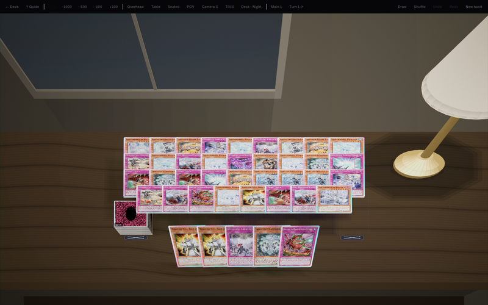
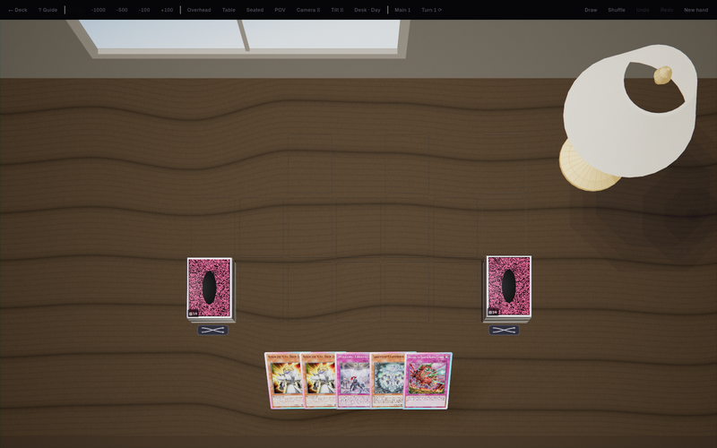
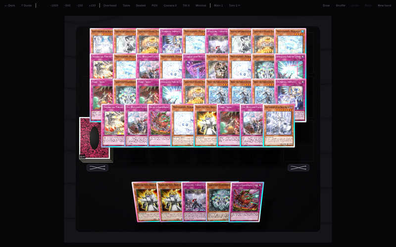

# kai's master tool

**A Yu-Gi-Oh! deck builder and a 3D play stage, in one Kotlin codebase — Android,
desktop, and the New 3DS.**

Build a deck with drag-and-drop and exact opening-hand mathematics, then play it
out on a table that is a *room*: a desk lit by a window in the day and a lamp at
night, cards that lift and lean and throw shadows, and a camera you can get out
of your chair and walk around with.

[](https://github.com/kaiharimoto/kaihari-s-master-tool/releases/latest)
[](https://github.com/kaiharimoto/kaihari-s-master-tool/actions/workflows/build-app.yml)
[](LICENSE)

---

<p align="center">
  
</p>

<p align="center">
  
  
</p>

<p align="center"><sub>
The night desk from the seat the stage opens at · the same desk in daylight · the
minimal stage. Rendered headlessly from the real screen by
<a href="app/studio"><code>:studio</code></a>.
</sub></p>

## Install

### Android

1. Download **`kai-master-tool-<version>.apk`** from the
   [latest release](https://github.com/kaiharimoto/kaihari-s-master-tool/releases/latest).
2. Open it. Android will ask once for permission to install unknown apps — that
   is a one-time, per-app setting.
3. After that the app updates itself: it checks this repository's latest release
   on launch, and you can force a check by tapping the version number in the top
   bar.

Android 8.0 (API 26) or newer. Built against a Samsung Tab S11 Ultra in
landscape; phones work too, in portrait, with a different arrangement of the
builder.

### Desktop — macOS, Windows, Linux

There is no prebuilt desktop download yet. Build one:

```bash
cd app
./gradlew :desktopApp:packageDistributionForCurrentOS   # .dmg / .msi / .deb
./gradlew :desktopApp:run                               # or just run it
```

The desktop build does not self-update; it opens the release page instead.

### New 3DS

Grab **`kai-master-tool-1.0.0.cia`** from the
[`3ds-v*` release track](https://github.com/kaiharimoto/kaihari-s-master-tool/releases/tag/3ds-v1.0.0)
and install it with FBI. A `.3dsx` is attached too, for the Homebrew Launcher,
but **test the `.cia`** — a `.3dsx` inherits its host title's permissions while a
`.cia` gets only what its own RSF grants, so a missing service is a black screen
in one and not the other.

> The 3DS releases are flagged as pre-releases *on purpose, and they are not
> unfinished.* GitHub's `/releases/latest` hands back the newest non-pre-release
> of any tag shape, and the Android app's updater reads exactly that endpoint.
> Without the flag, every tablet would ask a 3DS release for an APK it does not
> have.

---

## What it does

### Deck builder

- **Drag and drop** between the card pool and all three sections, with copy
  limits, banlist status and section legality decided in one place
  (`DeckEditor`) — so drag, tap and the steppers can never disagree.
- **Search by what a card *says*, not only what it is called.** Some archetypes
  are not a word in anybody's name; `text:` / `effect:` / `name:` scope a query,
  and a quoted `"run of words"` must appear contiguous. Text matches always rank
  below name matches, so widening the search can only append to the bottom of a
  list whose top is unchanged.
- **Deck library, YDK and YDKX import/export/share.** The `#ydkx-extended` JSON
  payload other tools write is preserved byte-for-byte, so editing a deck here
  never destroys work done elsewhere.
- **Alternate-artwork passcodes resolve to the same card**, because deck files
  from other tools reference printings a database does not call canonical.
- **Sorting a deck is an edit, not a view setting** — the stored order is exactly
  what gets written back to `.ydk`, and undo puts it back.

### Knowing whether the deck actually works

- **Exact opening-hand odds**, not a simulation — hypergeometric, per key, at
  whatever hand size you ask for (five going second, six on the draw).
- **The breakdown is a lens.** The same machinery draws your own roles, the
  deck's archetypes, its type split, its copy counts and its banlist exposure,
  because the partition is a parameter.
- **The consistency question is stored with the deck** as a `HandGoal`, rather
  than rebuilt in a sheet every time you open it.
- **A deck-check panel that jumps to the card an issue names**, and a TCG/OCG
  toggle.

### The play stage

- **A freeform table.** Cards go anywhere, stack on each other, and can be set
  face-down. Where a set card lands decides how it lies: sideways in a monster
  zone, upright in a spell/trap zone, and off the zones it is the card's own
  category that decides.
- **Two hands at once.** Ten independent gesture lanes behind one arbiter, so a
  second finger starts its own drag instead of fighting the first.
- **Any pile can be searched.** Tap it and it spreads across the board at full
  size, ten to a row. Drag one out anywhere, or tap it into your hand. The deck
  fans in its own order and closing it shuffles, which is correct by the rules.
- **Hold a card to read it.** The card reader stays up until dismissed, which is
  what pays for a camera angle low enough to see the room.
- **A camera that is a camera.** Focal length is focal length, four seats on
  `1 2 3 4`, free flight between them, a flick that coasts, and rise-and-fall on
  the lens so sitting lower actually fits.
- **Two rooms and a void.** `MINIMAL` is sharp white on true black. The **Desk**
  scenes are a photographic desk — real geometry, a real light rig, cast shadows,
  a window and a lamp — and are a deliberately different contract.

### On a phone as well as a tablet

One rule decides: a window taller than it is wide gets the portrait arrangement,
everything else gets the tablet one. No dp threshold, because a threshold has to
be re-chosen for every new device. In portrait the pool docks along the bottom
where the thumbs are, with its search field immediately above the keyboard.

---

## How it is built

| Module | What it is | Needs Google Maven |
|---|---|---|
| **`app/core`** | Pure Kotlin: models, YDK/YDKX codec, deck rules, search, hand odds, layout solving, gesture machines, 3D geometry and lighting, SQLite. No Compose, no platform code. | No |
| **`app/ui`** | Compose Multiplatform screens shared by every platform. | Yes |
| **`app/androidApp`** | The APK. | Yes |
| **`app/desktopApp`** | JVM app, packaged as `.dmg` / `.msi` / `.deb`. | Yes |
| **`app/studio`** | Draws the play stage to PNG headlessly, for reviewing fidelity without a tablet. Opt-in, ships in nothing. | Yes |
| **`3ds/`** | A separate C rewrite for the New 3DS. Shares no code — shares the arithmetic, and proves it. | No |

Four ideas do most of the work:

**`:core` compiles with no Android SDK, and nearly everything is in it.**
Around ninety test files. `settings.gradle.kts` detects whether an SDK is present
and skips the Compose modules when it is not, so the domain layer stays testable
in a bare container. That constraint is why the rules are separable from the
screen at all.

**There is no 3D engine, and there is not going to be.** None reaches Kotlin
Multiplatform common code and all of them would cost the desktop target. So
`core/render/` is a small tested renderer — a card is a solid with six faces, the
lighting is Lambert plus Blinn-Phong, shadows are cast by projecting corners,
anything round comes off a lathe — and it reaches the screen through Compose's
`graphicsLayer`, which is a real perspective-correct quad, plus a canvas.

**Layout is solved, not negotiated.** `core/layout/DeckFit.kt` sizes all three
deck panes in one pass with card size as the single free variable. Per-pane
auto-fitting was tried and put cards out of bounds.

**The 3DS port proves its arithmetic instead of trusting it.** A test in `:core`
sweeps each ported function over a grid and writes golden vectors into
`3ds/test/vectors/`; the C is compiled with the *host* compiler and asserted
against the same files, in about a second, on any machine. CI diffs the committed
vectors, so a change in `:core` that moves a zone goes red until the console's
copy of the rule moves too.

### Building

```bash
cd app

# The domain layer. Works with no Android SDK, no network to Google's Maven.
./gradlew :core:jvmTest -Pmastertool.android=false

# Debug APK -> androidApp/build/outputs/apk/debug/
./gradlew :androidApp:assembleDebug

# Desktop
./gradlew :desktopApp:run
```

```bash
# The 3DS conformance suite: host gcc, no devkitARM.
make -C 3ds/test test
```

Every Android artifact — AGP, `androidx.*`, the SDK itself — is served only from
Google's Maven, which is unreachable from a lot of sandboxes. Force the toggle
either way with `-Pmastertool.android=true|false`. Android Studio and CI pick
everything up on their own.

Kotlin Multiplatform · Compose Multiplatform · Ktor · SQLDelight · Coil · JDK 21
· `minSdk` 26, `targetSdk` 36.

---

## Repository map

| | |
|---|---|
| `app/` | The cross-platform app. [`app/README.md`](app/README.md) has the detail. |
| `3ds/` | The New 3DS port. [`3ds/README.md`](3ds/README.md). |
| `docs/` | Nine documents behind the decisions in this app — see below. |
| `tools/` | `shoot.sh` (render the stage headlessly), `compare.py`, `crop.py`, sound generators. |
| `legacy/` | The archived original: a ~36k-line single-file HTML tool this replaces. Kept as a record of the original vision, not developed. |
| `ydk/`, `lab.ydkx` | Sample deck files. |
| `CLAUDE.md` | The working brief and the accumulated hard-won rules. Long, and the most honest document here. |

## Documentation

| | |
|---|---|
| [`docs/DESIGN.md`](docs/DESIGN.md) | **The handbook.** Palette, type scale, spacing, motion, components, anti-patterns — with the reasoning attached. Read before drawing anything. |
| [`docs/TUNING.md`](docs/TUNING.md) | The in-app tuning panel: thirty-one live numbers behind a long-press, persisted and exportable as JSON. |
| [`docs/TABLE.md`](docs/TABLE.md) | What DuelingBook knows, where this app already beats it, where it loses, and the ordered backlog that falls out. |
| [`docs/DEVICES.md`](docs/DEVICES.md) | Every device, not just the tablet — how the phone arrangement was arrived at. |
| [`docs/PHOTOREAL.md`](docs/PHOTOREAL.md) | The road to a photographic card table, in eleven phases. |
| [`docs/AAA.md`](docs/AAA.md) | A hundred numbered changes toward a game. The authoritative numbering everything else cites. |
| [`docs/FIDELITY.md`](docs/FIDELITY.md) | The play stage as a ranked backlog, from a survey of rendering literature. |
| [`docs/LOOP.md`](docs/LOOP.md) | The autonomous loop pointed at making the room real: six steps, five gates, and a ledger of what has been tried. |
| [`docs/PORT.md`](docs/PORT.md) | The 3DS port — why it is a rewrite rather than a port, and what it deletes. |
| [`CONTRIBUTING.md`](CONTRIBUTING.md) | How to change something without breaking a device that already has the app. |

### Seeing the stage without a tablet

```bash
tools/shoot.sh                                    # the default contact sheet
tools/shoot.sh --shots=desk-night-seated --keys=n # one shot, after a fresh deal
tools/compare.py shots/before shots/after         # what actually moved
```

`:studio` composes the real play screen into an off-screen raster — real theme,
real dependencies, real card art, a frame clock advanced by hand, no window and
no GPU. The deal is seeded, so two runs are bit-identical and every pixel that
moves is a change in the code. It needs an Android SDK (because `:ui` has an
`androidTarget`); the pictures at the top of this file are produced by
[`.github/workflows/shots.yml`](.github/workflows/shots.yml), which is that
script on a runner.

---

## About the signing key

`app/androidApp/keystore/kai-master-tool.jks` is committed to this repository on
purpose, and its password is in plain text. That looks alarming and is a
deliberate trade: Android refuses an update whose signing certificate differs
from the installed app's, so the in-app updater only works if every build — CI's
included — is signed with the same key.

It guarantees that an update is installable over what you already have. It does
**not** authenticate the publisher. The app only ever downloads from this
repository's releases over HTTPS, so the realistic risk is an APK you were handed
from somewhere else. The full argument is in
[`app/androidApp/keystore/README.md`](app/androidApp/keystore/README.md).

## License

[MIT](LICENSE).

Card data and card images are fetched at runtime from the
[YGOPRODeck API](https://ygoprodeck.com/api-guide/) and are not part of this
repository. Yu-Gi-Oh! is a trademark of Konami; this is an unofficial fan-made
tool with no affiliation. The card back and the other original artwork bundled
with the app are kai's own.
