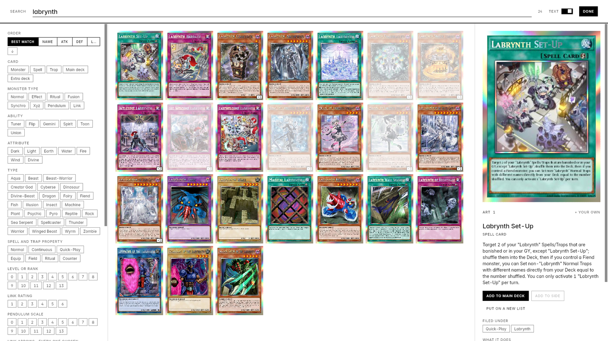
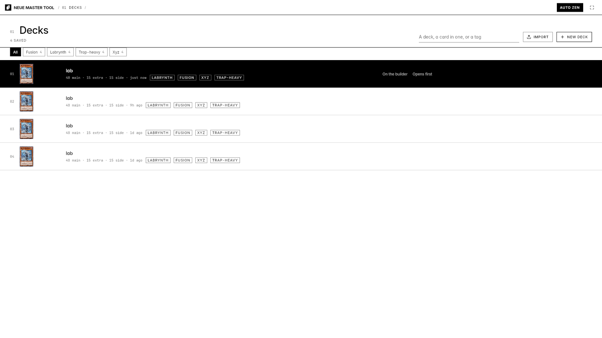
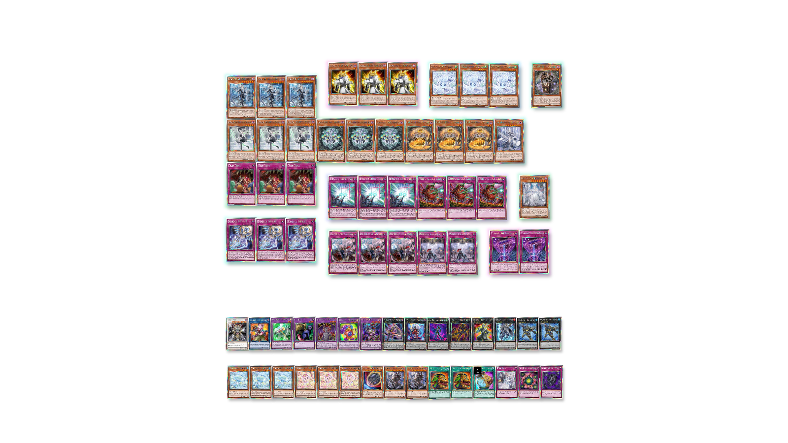
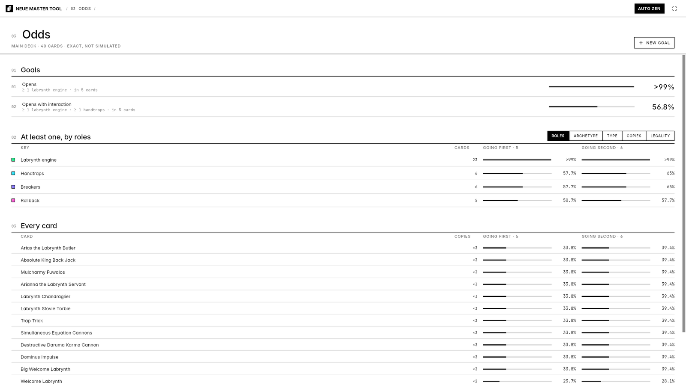

# Neue Master Tool

**kai's master tool — a Yu-Gi-Oh! deck builder that answers the questions a deck
list cannot.** For Windows, macOS and Linux, and for Android tablets, from the
same code.

Build the deck, then ask it things. What are the *exact* odds this opens? Which
cards are the engine and which are the twelve you keep drawing alongside it?
What does the 41st card cost? The maths is exact rather than simulated, the deck
breaks apart into the groups you give it, and the answers are stored in the deck
file rather than in a sheet you closed.

[](https://github.com/kaiharimoto/kai-master-tool/releases)
[](https://github.com/kaiharimoto/kai-master-tool/actions/workflows/build-app.yml)
[](LICENSE)

---

<p align="center">
  
</p>

<p align="center"><sub>
The builder, with the deck broken into the groups its owner drew — each named once on its border.
</sub></p>

It is drawn in **Master UI** — paper and ink, square corners, no shadows, Inter,
`01` numerals — with colour allowed in exactly two places: the holographic foil
on a card's face, and the groups you draw on your deck. Card art keeps its
colour, because it is the content.

## Install

### Windows, macOS, Linux

Download from the newest **`neue-v*`** release on the
[releases page](https://github.com/kaiharimoto/kai-master-tool/releases):

| | |
|---|---|
| **Windows** | `neue-master-tool-<version>.msi` — installs for your user, no administrator. |
| **macOS** | `neue-master-tool-<version>-arm64.dmg` (Apple silicon) or `-x64.dmg` (Intel) — drag it into Applications; the first time, right-click the app and choose **Open** (it is not notarised yet). After that it updates itself in place. |
| **Linux** | `neue-master-tool-<version>.deb` |

Once installed it checks for the next version on launch and offers to install it.

### Android

Neue is the Android app from **v1.3.0**, for landscape tablets: install
`kai-master-tool-<version>.apk` from the
[latest release](https://github.com/kaiharimoto/kai-master-tool/releases/latest).
It replaced the tablet app in place — same app, same signing key — so a tablet
that had it updates itself onto Neue and keeps its saved decks. Tap reads a card,
double-tap adds or removes it, press and hold opens it large, drag moves it; a
mouse and a keyboard work exactly as on the desktop.

### New 3DS

Install **`kai-master-tool-1.0.0.cia`** from the
[`3ds-v*` track](https://github.com/kaiharimoto/kai-master-tool/releases/tag/3ds-v1.0.0)
with FBI. See [`3ds/README.md`](3ds/README.md).

> The `neue-v*` and `3ds-v*` releases are pre-releases *on purpose*.
> `/releases/latest` returns the newest non-pre-release of any tag shape, and
> every installed APK reads exactly that endpoint for its next version.

---

## What it does

- **A deck that fits the window.** Main, extra and side are sized together in one
  pass, so every card is as large as the screen allows; the wheel shrinks the
  deck toward the middle, and the panes hide from their own buttons.
- **Groups that break the deck apart.** Draw your roles onto the deck and it
  splits into pieces, flush inside and a gap between — each named once, each
  with its opening rate, and slides of what the groups add up to.
- **Exact odds.** Every group, every lens key and every hand goal reports its
  exact chance to open, going first and second.
- **Finding cards.** Search by name or by what a card says; filter by everything
  DuelingBook, Master Duel and Neuron filter by — monster type, ability, link
  arrows, ATK and DEF, and what a card *does* (search, negate, hand trap…). The
  search pop-out gives the whole window to it, with the card read large.
- **Lists of cards for consideration**, kept apart from any deck, and shown in the
  pool at a click.
- **A library** that tags each deck from its cards, finds a deck by a card in it,
  duplicates and exports without opening it.
- **Your artwork.** Alternate arts from the pool, or your own picture for a card
  whose alternates the database does not have.
- **Zen.** Leave it alone in full screen and the deck floats to the middle of the
  window; the cards are yours to arrange.
- **Ai, an assistant that acts.** A panel beside every page (`Ctrl I`): chat about
  the game, or have it build a deck, tune and group the one that is open, write
  siding plans, change any setting — or read the latest tournament results on
  YGOPRODeck and build a web of the field by itself. It remembers you in markdown files you can
  read, and connects to your Claude or ChatGPT plan through their command-line
  apps, to an API key (Anthropic, OpenAI, Gemini, OpenRouter), or to a model on
  your own machine — a wizard walks you through each. **Fine Tuning** teaches it your
  deck — you explain it, or it studies the cards and the internet itself, thinking out
  loud — into a guide it reads whenever the deck is open,
  and it learns from ordinary conversations too, always with Undo. It knows the rules,
  checks a card's rulings, searches the web, draws tables and charts, and shows its
  thinking as it works. Settings can
  turn it off entirely.
- **The keyboard and the mouse, both whole.** Every action has a shortcut
  (`F1` lists them, `Ctrl K` finds them), and the mouse has a grammar: right-click
  adds from the pool and removes from the deck, holding opens the card large.

[`docs/NEUE.md`](docs/NEUE.md) is the whole of it, with the reasoning.

<p align="center">
  
</p>
<p align="center"><sub>The search pop-out: every filter, a thousand results, and the card read large.</sub></p>

<p align="center">
  
  
</p>
<p align="center"><sub>Ink, the exact inversion of Paper · the library, each deck tagged from its cards.</sub></p>

<p align="center">
  
  
</p>
<p align="center"><sub>Zen, each group a block over its own shadow · the odds, exact rather than simulated.</sub></p>

---

# How it is built

| Module | What it is |
|---|---|
| **`app/core`** | Pure Kotlin: models, YDK/YDKX codec, deck rules, search and filters, hand odds, layout solving, the keyboard and mouse tables, SQLite. No Compose, no platform code; compiles and tests with no Android SDK. |
| **`app/builder`** | The builder's state and plumbing that is not a look: `DeckBuilderState`, the app's dependencies, the updater seam, the image loader, the shader seam, the card foil. |
| **`app/neue`** | **Neue Master Tool** — every screen, in Master UI. Packaged as `.msi` / `.dmg` (Apple silicon and Intel) / `.deb`. |
| **`app/androidApp`** | The APK: Neue on an Android tablet, from v1.3.0. |
| **`app/studio`** | Draws the app to PNG headlessly — every picture above. Opt-in, ships in nothing. |
| **`3ds/`** | A separate C rewrite for the New 3DS. Shares no code — shares the arithmetic, and proves it. |

Three ideas do most of the work:

**`:core` compiles with no Android SDK, and nearly everything is in it.** The
rules are tested in a bare container; the screens are a view of them.

**Layout is solved, not negotiated.** Row widths are the input, row counts follow
from the deck, and card size is the single free variable across all three
sections in one pass — the gaps between groups and every pixel of chrome are
declared to the fitter, so the cards pay for them honestly.

**The design language is a test.** `MasterUiLawTest` fails the build on a
radius, a shadow, a gradient, a colour literal, a Material import or a spring
anywhere in Neue, except in the few files where kai asked for one.

## Building

```bash
cd app

# The domain layer. Works with no Android SDK and no Google Maven.
./gradlew :core:jvmTest -Pmastertool.android=false

# Neue: tests (the design law included), run it, package it
./gradlew :neue:jvmTest
./gradlew :neue:run
./gradlew :neue:packageDistributionForCurrentOS

# Debug APK -> androidApp/build/outputs/apk/debug/
./gradlew :androidApp:assembleDebug

# Photograph Neue headlessly
../tools/shoot.sh --neue --page=builder --theme=ink
```

Every Android artifact — AGP, `androidx.*`, the SDK — is served only from
Google's Maven, unreachable from many sandboxes; every module but `:core` needs
it. Force the toggle either way with `-Pmastertool.android=true|false`.

Kotlin Multiplatform · Compose Multiplatform · Ktor · SQLDelight · Coil · JDK 21
· `minSdk` 26, `targetSdk` 36. Card data from the
[YGOPRODeck API](https://ygoprodeck.com/api-guide/).

## Repository map

| | |
|---|---|
| `app/` | The app. [`app/README.md`](app/README.md) has the detail. |
| `docs/` | [`NEUE.md`](docs/NEUE.md), the authority on the app; `master-ui/` for the design kit's cursor; [`PORT.md`](docs/PORT.md) for the 3DS; `classic/` for the tablet app and its play stage. |
| `3ds/` | The New 3DS port. |
| `tools/` | `shoot.sh` (render the app headlessly), `compare.py`, `neue/mark.py` (the app's mark), `foil/` (the Blender foil mockups). |
| `legacy/` | The archived original: a ~36k-line single-file HTML tool. Kept as a record. |
| `ydk/`, `lab.ydkx` | Sample decks. `ydk/lab.ydkx` carries groups and hand goals, and is what the screenshots are of. |
| `CLAUDE.md` | The working brief and the accumulated hard-won rules. |

## Documentation

| | |
|---|---|
| [`docs/NEUE.md`](docs/NEUE.md) | **The app.** Master UI and its two exceptions, the window, the mouse and the keyboard, groups, zen, finding cards, the library, releases — with the reasoning attached. |
| [`docs/master-ui/CURSOR.md`](docs/master-ui/CURSOR.md) | The Master UI family cursor, ported. |
| [`docs/PORT.md`](docs/PORT.md) | The 3DS port — why it is a rewrite rather than a port. |
| [`docs/classic/`](docs/classic) | The tablet app and its play stage: the design handbook, the tuning panel, the photoreal road. Retired; kept for play mode's rebuild inside Neue. |
| [`CONTRIBUTING.md`](CONTRIBUTING.md) | How to change something without breaking an installed app. |

## About the signing key

`app/androidApp/keystore/kai-master-tool.jks` is committed on purpose, with its
password in plain text. Android refuses an update whose signing certificate
differs from the installed app's, so the in-app updater only works if every
build — CI's included — is signed with the same key. It is also what lets Neue
replace the tablet app in place.

It guarantees an update is installable over what you already have. It does
**not** authenticate the publisher. The full argument is in
[`app/androidApp/keystore/README.md`](app/androidApp/keystore/README.md).

## License

[MIT](LICENSE).

Card data and images are fetched at runtime from the YGOPRODeck API and are not
part of this repository. Yu-Gi-Oh! is a trademark of Konami; this is an
unofficial fan-made tool with no affiliation. The card back and other original
artwork bundled with the app are kai's own. Inter and JetBrains Mono are under the
SIL Open Font License.
