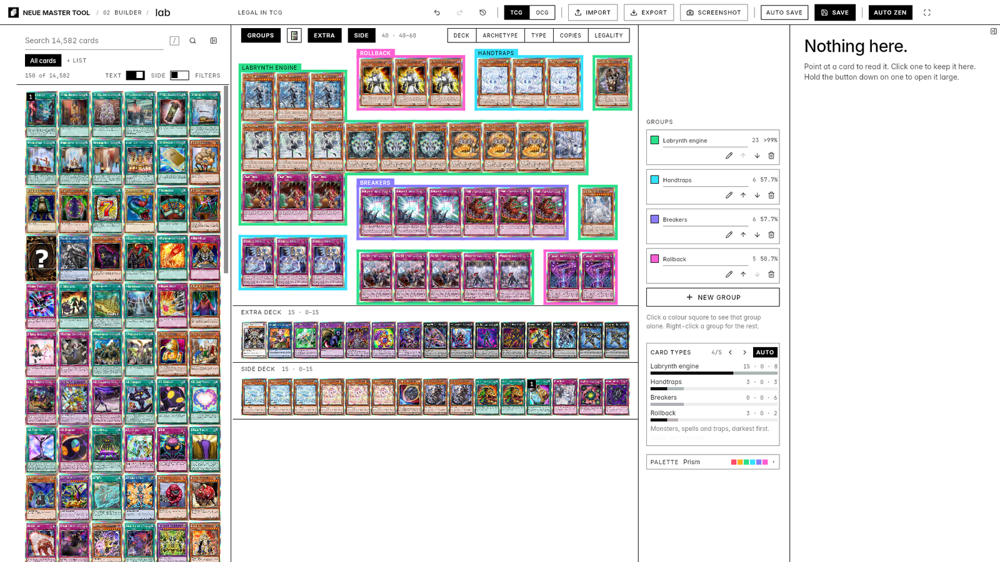
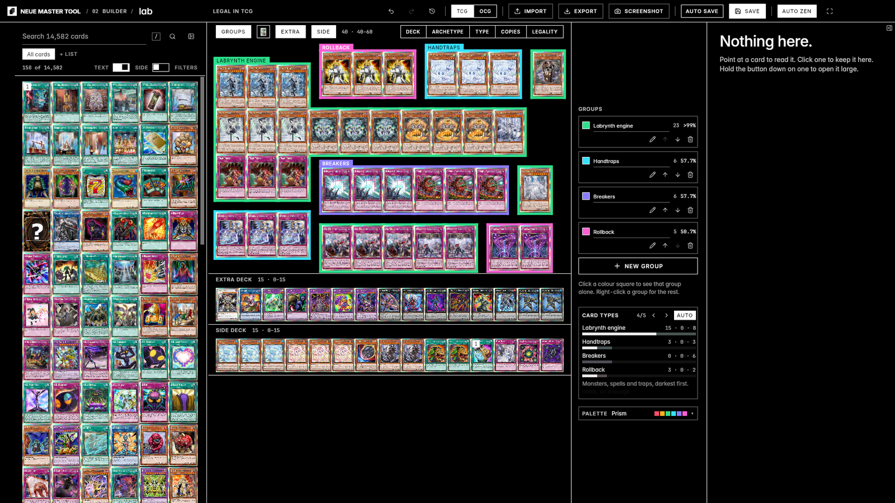

# Neue Master Tool

The deck builder for a desk: mouse, keyboard, a large display, and the
**Master UI** design language (`github.com/kaiharimoto/Master-UI`,
`kit/MASTER-UI.md`) — paper and ink, zero radius, no shadows, Inter, numbered
pages, a quiet voice.

**It is the app.** It began as a separate desktop application beside the tablet
app; kai has since made it the one this repository is about, to be ported fully
and faithfully to the Android tablet — where it replaces the tablet app in place
— and to a proper Mac app. It is built on `:core` (every deck rule, fitter, lens
and odds calculation) and `:builder` (the state holders, `DeckBuilderState`
first, moved out of the old tablet app's `:ui` with their packages intact). None of its
look comes from anywhere else. The port's phases are in `CLAUDE.md`, "The port".




Play mode is rebuilt inside it as **Duel** (`07`, §4p, from 1.0.74); Neue is the
builder, and everything around a deck: its siding, its event, its profile and its duels.

---

## 1. Where it lives

| | |
|---|---|
| `app/neue/` | the module: every screen; the desktop's `main` in `jvmMain`, the APK hosts the rest |
| `app/builder/` | `DeckBuilderState` and the plumbing Neue shares with the APK |
| `app/neue/VERSION` | the version a local build carries; releases pass `-Pneue.versionName` |
| `app/neue/icons/` | installer icons, drawn by `tools/neue/mark.py` |
| `core/input/DeskShortcuts.kt` | the keyboard, as data |
| `core/prefs/NeuePreferences.kt` | its settings document (`"neue.ui"`) |
| `core/update/NeueReleaseTrack.kt` | how it finds its own releases |
| `.github/workflows/release-neue.yml` | the release |
| `studio/.../NeueStudio.kt` | headless screenshots: `tools/shoot.sh --neue` |

```
cd app && ./gradlew :neue:run                  # run it (needs Google Maven, like every module but :core)
./gradlew :neue:jvmTest                         # the Master UI law test and the key map
tools/shoot.sh --neue --page=builder --theme=ink --width=2560 --height=1440 --name=b
```

### 1a. One app, two targets (1.0.20)

`:neue` compiles for the desktop (`jvm`, packaged as the installers) and for
Android (`android`, a library the APK hosts). Nearly all of it is in
**`src/sharedMain`**, a source set between the two: both targets are JVM, so the
JDK is there (`java.io.File`, `java.time`, `String.format`), and only what really
is one platform's lives in `src/jvmMain` or `src/androidMain`. The compiler cannot
tell those apart — Android's build resolves `java.awt` too, and it dies on the
device — so **`SharedPortabilityTest`** reads `sharedMain` and refuses AWT, Swing,
`java.net.http`, Skia, desktop windows, `ProcessBuilder` and the desktop-only
Compose APIs. Each has one seam:

| Desktop-only | The seam, in `sharedMain` |
|---|---|
| the machine: data folder, version, browser, clipboard, a file picker | `expect object Platform` (`platform/Platform.kt`); the crash file and the issue report are shared extensions on it |
| `Modifier.onPointerEvent` | `Modifier.onPointer` (`kit/Pointer.kt`), the same behaviour on the common `pointerInput` |
| `TooltipArea`, the text fields' context menu | `PlatformTip`, `ProvideTextMenus` (`kit/Overlays.kt`) |
| `VerticalScrollbar` | `expect fun BoxScope.ScrollbarFor` |
| the AWT blank cursor | `blankPointerIcon()` |
| Skia pixel reads for the name masks | `coil3.Image.argb`, `alphaBitmap` — the letter-finding is shared (`NameMasks.compute`) |
| Skia's blur for zen's shadows | `DrawScope.blurRect` — `ZenShadows.kt` and its platform halves are still the one place a blur is allowed |
| `java.net.http` (the originals, the updater) | `httpDownload` (`platform/Download.kt`) — `java.net.http` on the desktop as ever, `HttpURLConnection` on Android |
| launching an installer | `handOffInstaller` |
| AWT's HSB arithmetic (group shimmer) | `core/model/Hsb.kt`, swept bit for bit against `java.awt.Color` by `HsbTest` |
| classpath fonts | Compose resources (`src/commonMain/composeResources/font`) |
| the deck picture (Skia offscreen) | `expect class DeckShots`; the desktop keeps `DeckShot` |

The desktop entry point (`Main.kt`), its JDBC driver and its file dialogs
(`Files.kt`) are `jvmMain`'s alone. The desktop is unchanged by any of it; the
studio's shots before and after are the proof.

### 1b. The tablet (1.3.0)

From **v1.3.0** the APK *is* Neue: `app/androidApp`'s `MainActivity` builds
`rememberHolders` on the same `kai_master_tool.db` the tablet app used, so an
installed tablet updates onto it and keeps its decks. Its settings are Neue's
own document (`neue.ui`); the tablet app's `UiPreferences` are left in the
database, unread. The tablet UI and the play stage are gone from the APK — they
are at `c2fc8d8` (`neue-v1.0.19`) and in `docs/classic/`.

- **Landscape first** (`userLandscape`). A phone's portrait layout is its own
  later phase.
- **A mouse and a keyboard on the tablet are the desk's.** Compose reports a
  pointer's type and buttons, so a mouse gets every `DeskMouse` idiom and a
  hardware keyboard every `DeskShortcuts` chord (`dispatchKeyEvent` hands keys
  to the same `onKey`). Only a *finger* reads the touch table.
- **Touch is a third table, `core/input/DeskTouch.kt`**, beside the keyboard's
  and the mouse's, and `DeskTouchTest` holds it to the mouse's — nothing a mouse
  can do to a card is out of a finger's reach:

  | Finger | Pool | Deck |
  |---|---|---|
  | Tap | select, read in the inspector | select, read in the inspector |
  | Double-tap | add (the right-click) | remove this copy (the right-click) |
  | Press and hold | open large, every action beside it | the same |
  | Drag | across picks it up; up and down scrolls | picks it up |

- **Android reports no button for a finger**, so every "primary button" test is
  `isPrimaryPress` and a finger is told apart by `byFinger` (`kit/Pointer.kt`).
  A right-click menu is `Modifier.onContextMenu`: the secondary button, or a
  finger held for `HOLD_MS`.
- **Hover-only affordances have a finger's form**: the art chip shows on the
  *selected* card (`LocalTouchFirst`), a group's swatches open on a tap of its
  square, the rail stays pinned (`NeueState.railPinned`) because no edge can be
  reached for, two fingers pinch the deck's zoom (and zen's gaps in deep zen),
  and deep zen always shows its corner — nothing else wakes it without a key.
- **Back** is `dismissTop()`: the topmost sheet, menu or pop-out, as `Esc` is.
- **The family cursor is a mouse's only.** It is drawn when a mouse moves and
  never for a finger.
- **Updates** read `/releases/latest` — the `v*` track every tablet already
  reads (`apkUpdate`, `DesktopOs.ANDROID`) — download to the cache and hand the
  APK to the package installer through the `FileProvider`, asking once for the
  install-unknown-apps permission.
- **Not yet on the tablet**: the deck picture (a note says so), tooltips (no
  hover), and Settings' "open the data folder".

#### Room and ways out (1.3.1, the touch swarm's first release)

The touch swarm (seven agents walking three tablet sessions through the code)
found the finger's grammar sound and the frame round it broken. The first release
fixes the frame:

- **`core/layout/PaneBudget`** shares the page's width. On touch the index is a
  56dp strip of numerals (`IndexStrip`), the pool and inspector are 320, the
  deck keeps a 520 floor (the inspector yields first, then the pool narrows), and
  with Groups on the Groups panel takes the inspector's place. The deck went from
  194dp to 570. Widths are **physical** — dp at a scale of one — on the desk too,
  so the interface scale grows what is in the panes and never the panes, as
  `NeuePreferences` always said. A `ResizeRule` has a 32dp grip on touch, laid
  over paper, with no width of its own.
- **`core/input/BackChain`** is Esc's chain and Android's Back, one list. Back
  never drops focus or the selection, and from another page goes to the builder
  before it leaves the app. `MainActivity`'s callback is enabled only while there
  is something to close, so the system's predictive back-to-home plays.
- **Immersive by finger**: a tap on the 32dp paper strip along the top brings the
  bar out, a tap in the left gutter the index (`EdgeReveal.onTap`), and deep zen's
  corner offers **Leave full screen** beside Leave zen.
- **The Decks rows** show **More** on touch, and a hold opens the same menu; the
  desk's hover-revealed buttons are not composed there, so nothing invisible is
  tappable.
- **A deck is never lost**: auto save is on by default (1.0.22, everywhere),
  leaving the app saves, and opening another deck saves or asks first.
- **Every kit text field reports its focus** (`LocalTextFocus`), so a keyboard
  cover's typing never reaches the shortcut table.
- **A draft's double-tap is two votes**, never a removal
  (`DeskTouch.resolve(…, drafting)`), and the art chip comes only after
  `CHIP_DELAY_MS` and only on cards at least 48dp wide.

#### Words and the keyboard (1.3.2)

- **Hold any control to read its name.** Android's `PlatformTip` is a finger's
  hold (the card's hold time), shown clear of the finger; the rest of the press is
  spent, so the lift does not click, and the name lingers
  `DeskTouch.LABEL_LINGER_MS`. A pen's hover shows it too. A tap on a disabled
  control that knows why says why (`explainsWhenDisabled`, `LocalReasonNote`).
- **The soft keyboard's key ends editing.** `MuInput` splits a hardware Enter
  (`onSubmit`, as on the desk) from the IME action, which always hides the
  keyboard and lets go; searches read **Search**, number fields get the number
  pad, and the palette's key reads **Go** and runs the highlighted row.
- **The keyboard pushes panes, never the deck** (`imePadding` on the pool, the
  Groups panel, the Decks list, dialogs, the palette and toasts). A finger on the
  deck or the inspector, a finger scrolling the pool, or the keyboard put away
  lets go of the field (`releasesTypingOnFinger`). The search pop-out does not
  raise the keyboard when a finger opened it (`Studio.focus`), and keeps its
  search while closed (`StudioMemory`).
- **The bar on a tablet**: Import and Export in words, no Screenshot (it has no
  Android half yet), room between unlike neighbours, and the inspector's Hide at
  its bottom left. **Key hints only with a keyboard** attached
  (`LocalHardwareKeyboard`, from the activity's configuration); a gesture's name
  in the same box is always drawn.
- **Speaking finger**: `core/input/DeskWords` writes the empty places' hints for
  either hand, and `DeskWordsTest` refuses a finger's sentence that says click,
  hover or a key. The help is **Fingers** on a tablet, the finger's table first
  and the keyboard's only with one attached; the index strip has a `?` cell for
  it, and the first launch shows one note (`touchIntroSeen`) with the way to it.
#### Fingers that are sure (1.3.3)

- **Taps are counted by surface, the platform's way** (`core/input/TapBurst`).
  The pool's grid, each deck section and the search pop-out's grid own one burst:
  a second press within `DOUBLE_TAP_MS` of the first **lift**, and within 24 dp of
  the first press, is a double-tap on the **first** card wherever it landed; in
  the pool every further tap adds again. The hold is the system's long-press
  delay, at least `DeskTouch.MIN_HOLD_MS` (`holdMs`), which honours Android's
  "touch and hold delay"; the pop-out's grid answers a tap at once.
- **The carried card rides above the finger** (`core/input/CarryOffset`): at least
  64 dp wide, its bottom 12 dp over the fingertip, and the drop resolves at the
  **drawn** card's centre — the classic rule, "a drop lands where the card is
  drawn". Hysteresis and a deck card's pick-up are 12 dp, not pixels; the pool
  picks up at `PICK_UP_RATIO` across for its run along. Over the pool a deck card
  frames the pool in ink and its line reads **Let go to remove**; a drop that would
  be refused hatches the carried card with a ✕. A second finger lets it go home.
- **Haptics, one vocabulary, hand events only** (`core/haptics/DeskFeel`, played by
  `kit/Feel` through `View.performHapticFeedback`: no permission, the system's
  switch honoured, nothing on the desk). Hold, pick-up, a slot change, a drop, an
  add, a removal, an art step, a zen snap and a pinch's stop; a select, a refused
  add and a refused drop are nothing, so "no buzz" means "not in the deck". The
  edits report whether they applied (`addCard`, `removeAt`, `moveCardTo`).
  `NeueState.actingBy` marks a finger's gesture, so the desk never buzzes or rings.
- **A press shows itself**: every kit control's hot look is `collectIsHotAsState`,
  hovered *or pressed*, held `PRESS_ECHO_MS` after the lift.
- **A finger's add or drop is ringed where it landed** for `REVEAL_MS` (a 2 dp
  ink ring inside the card, `DeckBuilderState.revealAt`, `DeckHistory.addedAt`);
  into a hidden section, that section's Ex or Si box flashes instead.
- **Two fingers on the deck** (`TwoFinger`): apart or together sizes the deck;
  slid up or down with the groups on sets their gap; spread past full size hides
  the pool and the inspector, pinched at full size brings them back. The size is
  held and written once, on release (`NeueState.update(persist = false)`).
- **Two fingers tapped undo, three redo**, anywhere (`MultiTap`, `DeskTouch.window`,
  in the help's **Anywhere** column). On a tablet the History menu leads with
  **Undo: …**, and a goal edit is named as one (`goalsChanged`).
- **A resting thumb fires nothing** (`muClickable`): a finger's click must be a
  tap by `DeskTouch.isTap`, the cards' own rule; the kit's controls and the
  dialog scrims use it.
- **The S Pen's side button is the right-click** on cards (`PEN_BUTTON_TAP`),
  tested before the finger's grammar; drawing up a group it is still a vote.

#### Targets and type (1.3.4)

- **Touch metrics** (`core/input/TouchMetrics`, held by a test to a 44 dp pitch):
  chips and list tags 32 dp tall and 12 dp apart, links that act boxed 32 dp tall,
  menu rows 44 dp, small segments outside the deck 36 dp at 11 sp. The lens row
  and the bar's format keep 28 dp (`Segmented(compact)`): that is deck budget.
- **The pool's header**: Hide pool and Advanced search 40 dp with the field
  between them; the Text and Side switches are each one target with their word;
  Side reads **To side**, the pool's line says a double-tap adds to side, and the
  side deck's name is inverted. The keyboard's cursor in the results is an outline,
  and only with a keyboard attached.
- **A Groups row**: a 32 dp colour square, 32 dp swatches on their own line, 40 dp
  Edit, Up and Down; Delete is on the row's hold menu only.
- **Your own art**: on a tablet Remove is on the card's hold menu, and on either it
  asks first (`confirmRemoveArt`); + Your own is a button, the arrows 40 dp; a pick
  that fails says so, and a picture named without its extension is known by its bytes.
- **Share** (`Platform.canShare`): the builder's Export menu and a Decks row's gain
  **Share YDKe code…** and **Share .ydkx file…**, through the system's share sheet.
- **Text size** (`NeuePreferences.textScale`, 100 / 115 / 130%): the type alone,
  multiplying the font scale, never the panes or the cards. Unset is the platform's
  own choice (`textScaleOn`): 115% on a tablet, 100% on the desk, so nothing is
  seeded. The group-name tab is measured off its type (`nameTab()`), 17 dp at 100%.
  No type is under 11 sp any more (Stats' level labels, a missing card's number).
- **Settings on a tablet**: a switch's whole row is its target, 48 dp; the HD art
  help is not cut off; the art library downloads only on an unmetered network
  (`Platform.onUnmeteredNetwork`, "Waiting for Wi-Fi"); no Index row or Pin link;
  "Stored on this tablet".
- **A read-only scroll thumb** on Android (`Scrollbars.android.kt`): 3 dp of ink25,
  no track, no input, whenever a pane continues.
- **Deep zen keeps the screen on** (`FLAG_KEEP_SCREEN_ON` while immersive and deep),
  and lets it go on waking, leaving immersive or leaving the app.

- **The proof is an emulator**, since the studio cannot draw Android:
  `.github/workflows/android-smoke.yml` boots a Pixel Tablet image, runs
  `NeueSmokeTest` (a saved deck survives a launch, the builder opens it, no crash
  is written) and uploads its screenshot.

### 1c. The phone (1.3.5)

kai tried the APK on a phone and it was unusable. The manifest locked it lying
down; the desk's 48 dp bar ran off a 412 dp screen and took the **Update** pill
with it; and the update dialog, 672 dp wide with a 360 dp box of notes and one row
of buttons, was taller and wider than the phone, so **Install could not be reached**
and the app could not update itself. kai's four choices are what follows.

- **What it is running on** is `core/layout/FormFactor`: a touch screen whose
  *smallest* width is under 600 dp is a PHONE (Android's own line, so turning it
  round never makes it a tablet), any other touch screen a TABLET, the desk always
  DESK. `NeueWindowContent` reads it off the window in physical dp, before the
  interface scale, into `NeueState.form` and `posture` (`Posture`, TALL or WIDE);
  `LocalPhone` carries it to the pages. The studio draws one with `--form=phone`.
- **The screen turns by a setting** (`ScreenOrientation`, `NeuePreferences.orientation`:
  Portrait, Landscape or Auto; null is the device's default, upright on a phone and
  lying down on a tablet). The manifest says `fullUser`; `MainActivity.applyOrientation`
  sets the user-flavoured `requestedOrientation` before the first frame and again
  when the setting moves, so the rotation lock is respected. The one-tap toggle is
  **Rotate** in the bar's menu (Portrait → Landscape → Auto), and Settings → Screen.
- **Dialogs fit any window**, desk included (`MuDialog`): never wider than the window
  less 12–16 dp a side, never taller; the body scrolls between the title and the
  footer, which always stay on screen, and the footer's buttons wrap (`FlowRow`). A
  body that scrolls itself passes `scrolls = false`. The menu layer scrolls a menu
  taller than the window. The emulator walk proves the update's Download is on the
  phone's screen.
- **The shell** (`shell/PhoneShell.kt`): `PhoneBar`, one 48 dp line — the deck's
  name (editable, `DeckNameField`) and its standing, undo, redo, a filled **Update**
  chip whenever there is one (never in the overflow), and ⋯, the overflow, which
  holds every tool of the desk's bar (`NeueHolders.phoneMenu`: search, advanced
  search, groups, history, format, save, auto save, new, import, export, rotate,
  full screen, theme, gestures, check for updates). The pages are `TabBar`, tabs (Shootout joined them in 1.1.2, seven with Settings, their words at 9 sp)
  along the bottom, hidden while the soft keyboard is up; lying down they are a
  strip down the left, where the height is the deck's.
- **The builder upright** (`builder/TallBuilder.kt`): the deck on top, the pool docked
  along the bottom (`PoolDock`: PEEK is the grabber and the pool's header, measured;
  HALF keeps 200 dp of deck; FULL is the screen). Typing is FULL; letting go of the
  field never drops below HALF (`PoolDock.afterTyping`); the stop is
  `NeuePreferences.phoneDockStop`; a drag or a flick on the grabber chooses one, a
  tap steps it. `imePadding` is outside the dock's height, so the keyboard lifts the
  dock rather than eating its field. The deck is fitted width first and scrolls
  (`DeckLabels.stack` over `DeckFitter.stack`), every section `DeckFitter.phoneColumns`
  across — five on a 412 dp phone, each card at least 72 dp — and `NeueState.phoneColumns`
  keeps the arrow keys' grid the same. The lens tabs are one **Lens ▾** button.
  While the groups are out the dock has two tabs, **Cards** and **Groups**
  (`PhonePool`); the Groups panel is never beside the deck on a phone.
- **No inspector on a phone**: a finger's tap opens the card large
  (`NeueState.viewSoon`) once `DeskTouch.PHONE_VIEW_MS` has passed without a second
  tap, so a double-tap still adds or removes. The viewer stacks the art over the
  actions and the text when the window is taller than wide.
- **Lying down** a phone uses `PaneBudget.solve(phone = true)`: the strip, the pool at
  40% (at least 240), no inspector, and the deck the rest, with no 520 floor.
- **The pages** lay themselves out below 600 dp: `PageHeader` drops the title the bar
  already says and wraps its actions; `SettingRow` stands its label over its control;
  a library row is one cover, the name and More; Odds' rates are 84 dp and Stats'
  columns stand one over the other; the search pop-out's filters and reading pane are
  sheets over the results. The phone's text size defaults to 100%, not the tablet's 115%.
- **The emulator** runs twice (`android-smoke.yml`, a matrix of `pixel_tablet` and
  `pixel_7`); the phone runs `NeueSmokeTest.aPhoneHeldUpright` and the tablet walk
  assumes it is not on one.

**1.3.6, kai's three:**

- **Upright, the deck is the decklist's 10×4** — the desk's rows (`columnsOf`, ten and
  fifteen) fitted to the phone's width by `DeckLabels.place`, the whole deck on screen
  with no scroll. `naturalDeckHeight` sums it the way `DeckBody` fits it, and the dock
  is told (`DockMetrics.deck`): at HALF the pool has everything under the deck, where
  it had half the window. Lying down the deck keeps `phoneColumns` and scrolls.
- **The foil follows the phone** (`NeuePreferences.foilTilt`, on). `TiltFilter` (core)
  turns gravity — `TYPE_GRAVITY`, else the accelerometer; no permission, no drift —
  into the screen's tilt about a rest that follows the hand over 2.5 s, so held still
  the light settles in the middle and it is the *turn* that moves it, sitting up or
  lying down. `rememberDeviceTilt` listens only while the activity is resumed;
  `LocalTilt` is read in each card's draw, so a turn redraws foil and recomposes
  nothing. A card a finger is over keeps the finger's light.
- **Full screen** (`NeueState.showcase`, `builder/Showcase.kt`, the viewer's ⤢): the
  card on ink, as large as it goes (`Showcase.card`), turned against the hand as a card
  held in the hand seems to stay put, its foil catching the light; or **Art**, the
  artwork alone covering the screen (`Showcase.art`, from `ArtFrame`) and sliding 5% behind
  the glass as it tilts. The screen stays on; Back returns to the viewer. On the desk
  the pointer stands in for the tilt.

---

## 2. Master UI, and the two exceptions

`neue/theme/` is `MASTER-UI.md` §2–§7 translated into Compose: `MuColors` is
paper, ink and the ink alpha ramp; Ink is `MuColors.of(ink = true)`, the exact
inversion; `MuType` is the 96/56/32/20/14/12/11 scale in Inter (bundled, OFL)
with JetBrains Mono for numbers; `MuMotion` is one easing and three durations.
`neue/kit/` is the component set — buttons, underline inputs, selects,
segmented controls, tabs, switches, sliders, meters, the hatch, the breathing
square, tooltips, menus, dialogs, drawers, toasts — built on foundation
primitives. **Material is not used**, not restyled: it is not imported.

**`MasterUiLawTest` is the kit's `check.mjs` for Kotlin** and runs in CI: a
radius, a shadow, a gradient, a colour literal, a Material import, weight 600,
a spring or an exclamation mark anywhere in `neue/` fails the build.

kai granted three exceptions. The law test names the files the two colour
ones live in; the third is motion, and lives in `core/motion/DeskLean.kt`:

- **`cards/Foil.kt`** and **`cards/Holo.kt`** — the foil border on a card's
  face. It is kept, as kai asked, and it is content rather than chrome (§17:
  the pixels of a picture keep their colour). See §2a.
- **`cards/GroupMarkers.kt`** — *"colors are allowed for deckbuilding markers
  only (like card groups in the deck itself assigned by the user)"*. A group's
  hue shows in the deck's cracks, on its key, on its mark. Lenses that are
  facts rather than the user's own drawing — type, copies, legality — are told
  apart by ink weight, the way everything else in Master UI is.

- **Cards move** — *"have the cards animate and react by tilting in a
  satisfying way"*, and a card that *"slightly tilts and lifts in 3d space"*
  when picked up. See §2b. Cards only: chrome never moves, and nothing uses a
  spring (the law test still refuses one) — a thing that follows a pointer has
  no duration, so its easing is `DeskLean.approach`, a frame-rate independent
  half-life.

Card art keeps its colour inside a §17 content frame. Nothing else does.

### 2a. The holographic foil

kai chose it from six Blender mockups (`tools/foil/`, variant C) and asked for it
to be made better; `Holo.kt` is the refined model, per pixel, as a runtime
shader through `ui/gpu/StageShader`. A foil stamp is a mirror with a
diffraction grating pressed into it:

- **silver** with an anisotropic highlight — a streak that slides round the
  band — under two lights, a key from the upper left and a bounce from the
  lower right;
- **diffraction** from concentric grooves: order *m* shows the wavelength
  `λ = d · |(L + V) · g| / m`, three orders, d = 1600 nm, added as light;
- **grooves** you can see up close, which break the rainbow into striations
  (their pitch never drops below 3 px — finer is moiré);
- a **rim** where the stamp meets the print, lit by the same key, with an ink
  hairline.

**The frame round the artwork is the same stamp.** One set of grooves runs
across the card, so the border and the art frame catch the light together. Where
that frame is depends on the card's template, and `core/layout/ArtFrame.kt`
holds the three, measured to the pixel off YGOPRODeck's renders (813 × 1185):
**standard** for every monster, spell, trap and token frame, a square bevel from
(86, 205) to (728, 846); **pendulum**, wider and reaching down past the scales
because the art runs on behind the pendulum-effect box, from (44, 204) to (769,
887); and **Link**, the standard square with the eight arrow sockets left
unfoiled, because they are printed over it. Skill cards have no frame here.
`ArtFrameTest` pins the shapes; `:studio:shootFoil --cards=id:frameType,...`
draws a row of card types for checking the alignment by eye.

The eye is a couple of card-widths away and the **pointer moves it**: a mouse
stands in for tilting the card, and the light glides there over 180 ms when
the pointer leaves. The card itself never moves. Where runtime shaders are
unavailable the classic two-hue band is drawn instead (DESIGN.md §6).

`tools/shoot.sh`'s studio has a mode for it — `:studio:shootFoil` draws the
real `drawFoil` on real card art at scripted pointer positions, or as a sweep
for a GIF — so the app's foil can be compared frame for frame with the Blender
reference. Settings → Foil offers Holographic (the default), Classic and Off.

### 2b. Cards that lean

One picture rather than two rules: **the pointer is a finger pressed up under
a cloth the cards lie on.** The card over it rises (3.5%); the cards around it
sit on the slope, each with its edge nearest the pointer higher than its far
edge, falling away over about a card and a half (`DeskLean.toward`). Sweep
across the deck and the bump travels with you, and each card's foil catches the
light as it turns. A card being carried lifts 7% and leans back against its own
motion, its leading edge up (`DeskLean.carried`); the deck makes way for it as
it passes over.

It is the play stage's recipe: one `LeanField` per deck, stepped by one frame
loop that **sleeps once the cards settle** (nothing idles), and every card reads
its pose inside its own `graphicsLayer`, so leaning never recomposes. Two things
are load-bearing. The hit area is outside the layer, so a leaning card never
changes what the pointer is over (a card that tilted away from the pointer and
lost the hover would flicker). And the eye is **2.2 of the card's own widths**
away: `cameraDistance` is in 72-pixel inches, so a fixed one leaves a small card
flat and throws a large one at the viewer.

### 2b′. Limit marks (1.0.73)

A Limited or Semi-Limited card's 1 or 2, the inverted square in its corner, is **off by default** on kai's word
(players know the list): Settings › Limit marks, `NeuePreferences.limitMarks`, synced, read through
`LocalLimitMarks`. A Forbidden card's 0 always shows, because the deck cannot be played with it.

### 2c. The name in foil

kai asked whether a card's *name* could be stamped in the foil too, saw three
versions (`:studio:shootNames`: as printed; foil letters; foil letters over an
ink outline) and chose **foil letters**, which is the default. Settings → Card
names offers the other two.

The letters are found in the pixels (`core/layout/NameInk.kt`): every render
sets the name in one bar left of the attribute icon, and the ink is black or
white by frame (spells, traps, Xyz and Link are white), which the frame says
more reliably than the pixels can. A letter is how far a pixel has gone from the
bar's median toward its ink, so the letters keep their antialiased edges. The
mask is read off the picture the card has already decoded (`cards/NameMasks.kt`,
off the UI thread, kept by card and size), and the stamp is `Holo`'s sheet mode
kept only where the mask has a letter, so the name and the border catch the
light together. Holographic foil only; the screenshot carries it too.

---

### 2d. The family cursor

Neue uses the pointer every Master app uses, **Crop caption** — four 2 px trim
marks around a 2 px point, in difference mode; over something clickable they
open out and frame it, and a micro-caps caption in the slug under the frame says
what a click will do. `docs/master-ui/CURSOR.md` is the spec, vendored from the
Master UI repo (where it lives, with `kit/cursor/cursor.js`, on the
`claude/beautiful-bell-7du12e` branch; `main` does not carry it yet).

`cursor.js` cannot run here — it reads intent off a DOM, and Compose has none —
so it is **ported, not installed**: the arithmetic is `core/input/CropCaption.kt`
(the reference script's numbers: 5 px pad, 6 px inset past 480 × 160, the caret
at 1.8 × the type between 20 and 56, the 36 × 14 drag bar, the caption 6 px
under the frame and flipped above near the bottom, 180 ms snaps, 120 ms fades,
a tick every 300 ms), tested in `CropCaptionTest`; the drawing is
`neue/cursor/FamilyCursor.kt`. Three differences are forced by Compose and
worth knowing:

- **Intent is declared, not read.** A target says what it is with
  `Modifier.cursor(…)` / `cursorPointer(…)` — `caption`, `label` (the
  `aria-label`), `reason`, `value`, `showsWords` — which is the kit's
  `data-cursor*` hooks as parameters. Which targets are under the pointer is
  Compose's own hit testing (their hover), so a dialog occludes what is under it
  exactly as it does for a click; the innermost wins.
- **Menus are not popups any more.** A Compose `Popup` draws above everything in
  the window, the cursor included, and the kit's menus must keep the family
  cursor. The context menu and the select list now open in the window's own layer
  (`AnchoredBox`, `Overlays`), under the cursor. Tooltips are still popups; they
  sit under the caption slot now (36 px below the component), so the two never
  overlap. The text field's own Cut/Copy/Paste menu is still a popup, and the
  system pointer shows over it — as over a native top-layer surface.
- **The system pointer is hidden by the window's root** (`pointerHoverIcon(…,
  overrideDescendants = true)` with a one-pixel transparent cursor), over every
  child's own icon, and comes back wherever the cursor steps aside. Where the
  toolkit cannot make that cursor (headless), the arrow stays, as the kit's
  does when its script never loads.

**Over a card the marks are heavier** (kai, 1.0.12): difference-mode marks two
pixels thick go muddy on card art, so framing a card draws them 3 px thick with
12 px arms and a 4 px point, in paper with a 1 px ink edge — they read on any
picture. It is `emphasis` on the target (`CropCaption.arm`, `weight`, `point`),
set by every card and nothing else; everywhere else the kit's marks are as
specified.

Busy: the pool while the card pool syncs (a region, `Working`), the update
download (`Downloading` and its percent) and the screenshot export
(`Exporting`). The crash reporter's window has no family cursor: it is drawn
theme-free, to render when nothing else can, and keeps the system arrow.
`tools/shoot.sh --neue --hovers=card@0.3,0.2;undo@0.47,0.02` photographs the
cursor at each point and logs what it resolved to.

## 3. The window

**One 48 px bar** — the mark, the page you are on, then whatever the page puts
there (the builder puts the deck's name, its legality, its tools and Save), what
is being fetched and how far (§4h), the update pill and immersive mode — the 232
px index rail —
`01 Decks · 02 Builder · 03 Siding · 04 Format · 05 Prep · 06 Present` (1.0.40: Odds and Stats are gone,
on kai's word, and Siding has a page of its own; Prep came in 1.0.50, Present in 1.0.70); below the rule, what is being
fetched, `Search Ctrl K` and Settings — and the page. Until 1.0.10 the app and
the builder each had a bar; kai merged them, moved search to the rail beside
Settings, and let the card count go to the pool, where it is read.

**The rail folds away** until the pointer reaches the window's left edge, and
comes out *over* the page rather than pushing it: a rail that pushed would
re-fit the deck, and every card would jump. It can be pinned (Settings, or on
the rail itself). **Immersive mode** (`F11`, or the button in the title bar) is
full screen with the title bar and the builder's bar folded over the top,
coming out when the pointer reaches the edge —
the deck and the panes that build it get the whole screen. `Esc`, last in its
chain, leaves it; so does leaving full screen any other way. **It stays when
another window takes focus** (1.0.13). Compose's full screen on Windows is the
JDK's exclusive mode (`GraphicsDevice.setFullScreenWindow`, via skiko, and nothing
else): with Java2D's Direct3D pipeline it minimised the window the moment a click
went to another monitor, and without it (1.0.12's attempt) the window stayed
decorated and never went full screen. So on Windows immersive mode is **a second,
borderless window laid exactly over the monitor** the builder is on — which Windows
treats as full screen, taskbar and all, and leaves alone when focus moves. A
frame's decorations cannot change while it is showing (`JFrame.setUndecorated`
throws), so entering and leaving swap windows (`Main.kt`); everything the builder
knows lives in `NeueHolders`, outside the window, and carries across. macOS and
Linux keep the window's own full screen, which does neither.

**The swap is a handover** (1.0.24, kai: "the transition between entering and
exiting immersive mode is very jarring. The whole app disappears for a second").
Two things made the second. The window on screen was disposed first and the next
built after it, so for as long as the next took — a native surface, a whole tree,
its first frame — there was no window at all. And the app's own lifetime was the
window's: every swap stopped and restarted the card pool, the preferences, the
update check and the art library, and made the image loader afresh, so every
card's picture was read again. Now the lifetime is `NeueEffects`, composed once
outside the windows (the tablet's `NeueRoot` still brings it along), and the swap
runs in three steps (`WindowHandover.kt`): the window on screen draws one more
frame through a graphics layer, keeps it as a picture and shows that in place of
its tree, which it lets go (`Shown.released`); then the next window is built —
Compose paints a window's first frame before it shows it — and shown over the
picture; and only once it is on screen and painted does the picture's window go
(three seconds at most, whatever happens). The tree goes *before* the next is
built, never after: two live trees register the same drop targets and zen's slots,
and the one let go last would take them from the other. `WindowHandoverTest` holds
the picture to the frame it replaces, pixel for pixel. A `Z` pressed long ago no
longer reads as pressed now in a tree composed afresh (`zenHandled`), which had
sent every trip into immersive mode after the first `Z` straight to zen. **The borderless window is not resizable** (1.0.15): Compose gives an
undecorated window that is resizable its own resize border
(`UndecoratedWindowResizer`), an invisible band round the edge that takes the
pointer — and at the left edge that band was exactly where the rail comes out,
so reaching for the rail dragged the window instead.
In immersive mode the page keeps **32 px of paper at the top** (`IMMERSIVE_TOP`),
so the deck's own row is out of the bar's reach, and the deck's spare height is
shared above and below it — centred, not pushed down. Leaving goes
through `Floating` first and re-maximises a moment later: Compose's
`placement = Maximized` sets maximised and **never clears full screen**, which is
how 1.0.3 left a window stuck full screen with its bars back. And a click below
the folded-out header lets go of the deck name — on a desktop nothing else takes
focus from a text field, so a bar held out while you type never folded away. One pointer
watcher at the root, consuming nothing, decides all of it
(`core/layout/EdgeReveal.kt`): a bar comes out at 8 px from the edge and folds
once the pointer is 24 px clear of it; a deck name being typed holds the top
out; a carried card opens nothing.

**02 Builder** is three columns under the window's one bar. The pool (search,
inline filters, a flush grid of cards) and the inspector are resizable and
hideable; the deck between them is **fitted, never scrolled**, by the tablet's
own `DeckFitter.plan`: row widths in (10 main, 15 extra and side), one card size
out. On a large display the fitter simply hands back larger cards.

**Every pixel of chrome is a pixel off every card** — kai's brief for 1.0.9 and
again for 1.0.10. The exploration behind it measured the column at 1920 × 1080:
432 px of the 1080 went to bars, strips and padding, and the cards had 648.

| | 1.0.8 | 1.0.9 | 1.0.10 |
|---|---|---|---|
| app bar | 40 | 40 | **one bar, 48** — the app's and the builder's merged |
| page header | 92 | builder bar, 48 | (in the one bar) |
| footer | 64 | gone | gone |
| main strip + lens keys | 45 + 45 | 36 + 36 | **one row, 40**: Groups button, name, count, lens |
| extra and side strips | 37 each | 28 each | **none** — the names go where the deck has room to spare |
| padding round each grid | 24 | 12 | 12 |
| gap between cards | 2 | 0 | 0; with a lens on, the deck in pieces (1.0.15) |

**The section names go in the deck's own empty space** (`core/layout/DeckLabels.kt`).
A fitted deck is limited by one side and has room along the other: limited by
its height, there is paper beside the grids; by its width, paper under them. So
the deck is fitted both ways — the extra and side decks' names in a gutter to
the left of their cards, or in a 24 px row over them — and the arrangement that
draws the larger card wins. With the pool and the inspector out at 1920 × 1080
the deck is width-limited, the names take rows, and the rows cost nothing.

**Groups break the deck into pieces** (1.0.15, `core/layout/GroupPieces.kt`,
`builder/Pieces.kt`), kai's picture: "have cards of one group together with no
gaps, and have it separate from the next group … if cards are in the same group
across rows, have them be close together with no gap vertically. The end result
should be a deck broken apart and split into pieces." A **piece** is a set of
cards of one group that touch in the grid (ungrouped cards are a group of their
own, so they stay flush with each other). Every card keeps its size and its
cell; a piece moves as one rigid shape — right by some number of 10 px gaps and
down by some number — so inside it every card is flush and its rows are aligned,
and between two pieces there is always at least one gap, along rows and along
columns. Each piece's shift is the least that keeps it a gap clear of every
piece to its left and above: the longest path through two orderings.

Two things about it are load-bearing:

- **Pieces are grown, not found.** The one arrangement no shift can satisfy is a
  piece on both sides of another — and ungrouped cards in a U round a grouped
  card are the *ordinary* case, not a rare one (the first version fell back to
  one-row pieces for the whole deck, and every ungrouped column came apart). So
  every run along a row starts as a piece, and a run joins the run of its group
  above it unless that makes such a loop. Only the arm that would close a U
  stands apart. `GroupPiecesTest` sweeps four hundred random decks: flush inside
  a piece, a gap between two, and no card over another.
- **The fitter is told.** The gaps are width and height the cards pay for, so
  they go to `DeckFitter` as `extraWidth`/`extraHeight` — the same contract as
  the chrome — and the deck still fits. A drop resolves against where the cards
  really are (`GridGeometry.placed`), and the insert bar stands at the left of the
  card it names — or, at the end of a row, at the right of its last card (1.0.39). A
  card moved within its own section opens a slot instead (§4h⅞).

The gap is 28 px and each piece is outlined 5 px in its group's colour (1.0.18;
18 and 4 in 1.0.17, 10 and 2 in 1.0.15 — kai asked for wider twice), in the gap
round it, so it reads as one shape with its colour on it. **The group's name is
written once**, on a tab in its colour rising from a top edge of its pieces — kai: "have it instead just write the name
of the group in the border once instead of abbreviation symbol on every card"
(1.0.18). The edge is the longest there is (`PieceLayout.labelEdge`, 1.0.22): a
top edge is a run of cards along a row with nothing of their own piece above,
and the name is cut short to what it stands on, so a lone card over three in
the next row is named over the three — kai: "prefer the longest edge, instead of
the first card". An edge the name already fits is as long as any, so a short
name stays at the largest piece's top-left. The tab is as wide as the name or
the edge, whichever is less, lettered black or white by the colour's luminance; the room it needs over
the grid (`NAME_TAB`, 17 px) is declared to the fitter with the gaps. The lens opens and closes the pieces
over 320 ms; closing, they close from where they were. The screenshot export
draws the same pieces.

**The Groups button is the groups** (1.0.15): the Roles lens, the pieces and the
panel beside the deck, all one switch — kai: "untoggling the groups button
should hide the groups and gaps between the cards." Off, the deck is plain. The
Roles tab is gone from the lens, because the user's own groups are what the
button is for; the tabs — Deck, Archetype, Type, Copies, Legality — are the other
ways to see the deck in pieces, and `b` walks them. `K` is the button; `G` turns
it on. Out, the groups are **As is, Fitted or Separate** (1.0.37, §4h¾): the deck's
own rows in pieces, or each group a block fitted together or set apart.

**The wheel sizes the deck** (1.0.17, kai: "let the user adjust the card sizes
using the scroll wheel. cards will stay center of screen with more negative space
around them"). Down, the fitter is handed a smaller share of the column
(`NeuePreferences.deckZoom`, 40–100%) and the deck, re-fitted, stays centred with
paper round it; up, back to the size that fills the column. It is a re-fit, not a
transform, so every rule of the layout — the pieces, the labels, the drop targets —
holds at any size. With the groups on, **Shift and the wheel** open and close the
gaps between them (`groupGap`, 0.4–3 standard gaps). The pool's cards keep the
size the deck *would* be, not what the wheel made of it — the fit at the full
size itself, so nothing in the pool stirs while the deck moves.

**The wheel glides** (1.0.24, kai: "more sensitive and more fluid/smooth
feeling"; `core/layout/DeckZoom.kt`). A notch took a flat 4 % off and the deck was
re-fitted at once, so the cards jumped a step a notch, fifteen notches end to end,
and a touchpad's stream of small deltas came through as stutters. Now **a notch
is a ratio**, `e^(−0.12)` — about 11 %, eight notches end to end, the same-looking
step at any size — and the delta is taken as it comes, so a touchpad's fraction
of a notch is that fraction of the change; a flung wheel is capped at three
notches an event, and the last notch up lands on the full size rather than a hair
short of it. The share the wheel sets is where the deck is going: **the deck is
re-fitted every frame at a share closing on it exponentially** (a 45 ms time
constant, there to the pixel in about the family's 180 ms). That is not a spring
— it never overshoots — and a notch mid-glide only moves the target, so a spun
wheel is one motion. The stored preference is the target, written once the wheel
rests; a pinch on the tablet and the size read on opening are not glided. A deck
limited by its width sat at the top at full size and in the middle below it, which
a glide would have shown as a drop of half the spare height in its first frame; it
now moves to the middle over the first 3 % (`DeckZoom.centring`). Re-fitting a
frame is the fitter's arithmetic twice and one recomposition of the deck, with the
cards' art already loaded — the same work a pinch always did per event. **The lens row stands
still** (1.0.18, kai: "have the ui elements like buttons stay in fixed
positions"): it is laid out once at the top of the column, inset to the deck's
edge at full size, and only the deck below it is re-fitted and centred — the
buttons no longer ride inward and downward with the cards.

**Beside Groups, the foil switch** (1.0.15): a boxed button the same size carrying
a small card in the holographic foil itself (`FoilGlyph`, drawn by the same
`drawFoil` a card face uses, its light following the pointer over the button);
off, every card face is plain and the glyph is a bare outline. Beside it,
**Extra** and **Side** are a switch each (1.0.17; one switch for both in 1.0.15),
and the main deck has whatever they give up (`extraVisible`, `sideVisible`); a
hidden section takes no drops and leaves no slots in zen. The row is the deck's and never clips a tab: narrower
than 860 px it drops the words "Main deck", narrower than 720 px it shortens
Archetype, Legality, Extra and Side and keeps the count only when it is out of range.

**The Groups panel is centred down its column** (1.0.16) — the column is taller
than its groups, and a reach for the first row at the top brought the window's bar
out — and **New group** is a full-width button under the groups rather than a
link over them. A list taller than the column still starts at the top and scrolls.

**A group may hold any card of the deck** (1.0.17): drawing one up, a click on
the extra or the side deck adds the card as a click on the main deck does, and a
group's count is its cards in all three. Assignment was always per passcode, so
this was two small refusals — the draft listened to the main deck alone, and a
group reopened for editing was seeded from the main deck alone, which quietly
dropped its extra- and side-deck cards when it was saved again.

**Palettes** (1.0.17, kai: "more choices in color palettes … from designer
choices"). Under the groups, seven palettes of six — Prism (the tablet's), Bauhaus,
Pastel, Earth, Ocean, Neon, Vintage. Since 1.0.18 they are a dropdown: the
closed header is the palette in use, its name and its colours, and a click opens
the other six. **Choosing one leaves them open** (1.0.24, kai: "the user is most
likely going to choose between the palettes to their liking, so it minimizing
upon choosing a palette makes it harder"): every group is recoloured at once and
the next can be tried straight away. They fold at a press anywhere off the Groups
panel — the window's one pointer watcher, consuming nothing, against the panel's
bounds (`NeueState.groupPalettesOpen`, `groupsPanel`), so the press still does
what it was for — at `Esc`, at the header again, or when the panel goes.
A group's colour is stored as an index, so a palette is only a reading of it:
choosing one recolours every group at once and changes nothing in the deck file
(`GroupMarkers.palettes`, the one file with colour in it; `groupPalette`).

**Slides** (1.0.18, kai: "add some data analysis visuals in a box that changes
like slides, with an auto play slide feature that can be toggled"): between the
groups and the palettes, a box of four slides — share of the main deck (and what
is ungrouped); the chance to open each group going first (five cards) and, in a
fainter bar under it, going second (six); how many of it a hand holds on
average; and **too many**, the chance of two or more in five — flooding on hand
traps, bricks or garnets. The second and fourth are kai's picks for 1.0.24. Bars in each group's colour; the numbers are `GroupStats.of`, in
core, from the same `LensOdds` the rows use. ‹ › step, **Auto** turns every six
seconds (`slidesAutoplay`, on by default) and the pointer over the box pauses it.
In 1.0.24 the controls took a row of their own and the title and each group's
name the box's whole width, wrapping rather than cut short (kai: "sometimes the
text is truncated"), and the slides of card types and of cards across main, extra
and side were dropped — kai: "basically useless to players".

**The Groups panel is where groups are edited** (`GroupsPanel`, 288 px beside the
deck). Every group is a row that can be changed where it stands: its name is a
field (written on Enter or on leaving it, so one rename is one undo), its colour
square, whose six swatches come out only while the pointer is on it or on them
(1.0.18: all of them on every row was "a bit distracting"), its count and opening rate beside the name, and **Edit cards**, up,
down and **Delete** as buttons on the row. The colour square isolates the group.
Right-click a row for the same and more. The Groups drawer that used to hold all
this — a sidebar over the deck — is deleted: kai, "there's no need for a pop up
sidebar … we have so much space in the roles column."

The bar keeps the words on Import, Export and Screenshot while it is 1500 px or
wider and drops to their icons (with their tooltips) below that; the wordmark
goes first. Its title field sets its own line height: the type scale's display
leading is tighter than a descender, and a single-line field clips to its line
— the tail of a `y` was cut off.

The pool's cards are drawn **the size of the main deck's** by default
(`DeckSized` in `PoolPane.kt`: as many columns as that width fills, rounded to
the nearest — `GridCells.Adaptive` only rounds down, so every card came out
larger than asked), and while the rail folds away the pool keeps **32 px of
empty paper** at the window's edge, because the rail comes out at that edge and
a pool running up to it put its first column where reaching for a card called
the rail.

**The inspector**: the picture on top (1.0.9 put the words first; kai moved the
picture back), then the name, the numbers and the card's text, then the details
(type, attribute, archetype, banlist) and the copies in the deck as sections that
fold shut with a click and stay shut (`NeuePreferences.inspectorFolded`).

**The text is read whole** (1.0.88, kai: "prioritize the effect text and try its best
to fit all of it in the inspector so the user doesn't have to scroll down";
`TextFirstCard`, the arithmetic `core/layout/TextFirst`, tested). The name, the type
line, the numbers and the text are measured first — the text with a text measurer,
never by counting characters — and the picture takes the height they leave of what
the column shows unscrolled: at most its natural size (the column's width at 59:86),
at least 140 dp (a deck card's height, still known on sight), centred. Only with the
picture at its least does the text step down, a size at a time from 14 sp to 11 sp
(in sp, so the Text size setting still multiplies it); only past 11 sp does the column
scroll, as before. The folds (Details, In the deck, Artwork) come after the text and
fall below the fold rather than costing it a line. The sizes come from measurements
alone, so a card in a column of a given size always lays out the same. On a tablet the
column keeps 48 dp at its foot for the Hide button's corner. The phone's viewer (a
phone has no inspector) follows the same rule upright: its head, the picture in what
the sheet leaves, the text from 15 sp down, then *Do* below it. The duel's inspector
measures its words first the same way (1.0.87) but never steps its text down.
`tools/shoot.sh --page=builder --inspect=<passcode>` puts any card in the inspector;
`--inspect-view=true` opens it large too, as a phone reads it.

**Contrast** is darker than the kit's ramp, in both themes, and Settings has a
*High* setting on top of that (`MuColors.of(ink, high)`; the table of alphas and
what each has to clear is on `MuColors`). The kit's `.60` meta text and `.25`
field borders sat at the edge of 4.5:1 and well under the 3:1 a control's
outline needs.

**The rail's foot** (1.0.15): light and dark is a sun on paper and a moon on ink
rather than the word; and its tips open *above* it. A tip normally opens under
its control, clear of the cursor's caption — at the bottom of the window there is
no room under it, the tip was pushed back up over its own button, and Pin could
not be clicked (`Tip(above = true)`).

## 4. Mouse and keyboard

The mouse is a table too, `core/input/DeskMouse.kt`, and the help dialog
(`F1`) renders it:

| | a card in the pool | a card in the deck |
|---|---|---|
| hover | the inspector shows it | the inspector shows it |
| click | select | select |
| right-click | **add** to the main deck (the extra, for a card that lives there) | **remove this copy** |
| Shift right-click | add to the side deck | add another copy |
| hold | **open it large** | **open it large** |
| hold right | **add** | **add another copy** |
| double-click | add (Shift: side) | — |
| drag | pick it up | move it; drop it on the pool to remove |

That is kai's brief for 1.0.10, in their words: **"hold left click should open
the inspector, hold right click duplicates. just right click removes the card
from the deck."** A right-click is the quick edit in both places — in from the
pool, out of the deck — a held right button is one more copy, and a held left
button opens the card large: the art as tall as the window allows, the text in
16 px beside it, the copies, and every action the old menu had
(`builder/CardViewer.kt`). A click outside it, `Esc` or its ✕ closes it; `Space`
opens the selected card the same way. Shift is still "the other way". A
right-click is read on release, the first moment it is known not to be a hold.
`DeskMouseTest` holds these rows and no gesture meaning two things.

The table moved three times before this (1.0.3: right-click removes; 1.0.4:
right-click adds everywhere, hold is the menu; 1.0.9: hold left adds, hold right
opens). **Right-click did nothing from 1.0.3 to 1.0.8**, and the table was never
the reason: Compose's `awaitFirstDown` answers only to the *primary* button, so
a right press went past the card as though it were not there. `CardPointer`
waits for a press of any button (`awaitAnyDown`). The studio's `--mouse` flag
drives real presses through the real modifier and logs the deck's counts, so a
gesture is checked rather than read:
`--mouse="right@0.3,0.25;left-hold@0.3,0.25;right-hold@0.3,0.25"`.

A press selects at once, then becomes a click, a drag (past the slop) or a hold
(450 ms still), whichever comes first; the card rises under the button while
the hold counts down, so the press says what it is about to do.

**The pool's Side switch** (1.0.14, beside Text over the results): kai's "Add to
Side" toggle, for siding a list in without holding a key. On, the pool's two adds
trade places — right-click, double-click, a held right button and `Enter` send a
card to the side deck, and Shift, still "the other way", sends it to the main
(`DeskMouse.forPool`, one function, so the table the help dialog shows stays the
off state). It is a setting (`NeuePreferences.poolToSide`), and the empty side
deck's hint follows it.

**The arrow keys walk the selection** (1.0.18, kai: "once a player selects a card
in the normal deck builder, let them move the selection with the arrow keys, which
will reflect in the inspector"). `←` `→` run along a row and through its ends;
`↑` `↓` go a row up or down, and past the top or bottom row of a section into the
next section on show, keeping the column. A pool card walks the pool the same way,
by the columns the pool is really drawn in (`GridStep`, in core with a test). `↑`
and `↓` were already the pool's results keys, so they are one pair with two jobs:
in the search field, or with nothing selected, the results; with a card selected,
the selection. The inspector follows, because a key clears the hover.

**Auto save** (1.0.18, beside Save): on, a changed deck is written a second and a
half after the last change, quietly — no toast — and Save reads **Saved** while
nothing is waiting. An empty deck that was never saved is left alone.
`DeckBuilderState.dirty` is what it waits on: set by every edit, cleared by a
load and by a save no edit overtook (`autoSave`). **On by default** since 1.0.22 —
kai: "have auto-save on as default" — and turned on once for everyone: the switch
is stored as `autoSaveOn`, so the `false` every document carried from when off was
the default is not read back.

**History** (1.0.17, beside undo and redo): every step undo can take back and
redo can put back, newest first, in words — "+ Ash Blossom", "Moved Nibiru to
side", "Changed the groups" — and a click goes to the deck as it was just after
that step. The undo stack keeps whole decks rather than edits, so each step is
read back off the decks either side of it (`DeckHistory.describe`, in core with a
test; `DeckBuilderState.history`, `travel`).

**Export is a menu** (1.0.15, kai: "a sub option between YDK, YDKX, YDKe Code,
and a Copied Text list"): the bar's Export, or `Ctrl E`, opens it under the
button. **YDK file** is the plain list; **YDKX file, with groups** carries the
groups, goals and anything else the deck holds; **YDKe code** copies the
`ydke://` line EDOPro and the deck sites paste (`YdkeCodec`: each section's
passcodes as little-endian 32-bit integers, Base64'd, `!` after each); **Text
list** copies the decklist as it is posted — `Main Deck (40)`, then `3 Ash
Blossom & Joyous Spring`, each card once in the order it first appears
(`DeckText`). Both codecs are in core with tests, the YDKe one round-tripped.
The palette has all four.

**A deck crosses from the desk to a phone as a QR code** (1.0.30, v1.3.7, kai:
"import deck via QR code" on Android, "export as QR code" on the desktop; **the
whole deck** from 1.0.31, v1.3.8: "carry as much information as possible,
including groups"). **QR code to scan**, last in Export (the builder's and a
library row's), shows the deck as a QR code in a dialog (`QrDialog`, `neue/qr/`),
with Copy the YDKe code beside Done for the simulators.

**What the code holds is `DeckQr`** (core): the deck's own `.ydkx` — the cards,
the groups, the lens, the hand goals, notes, siding patterns and any key a later
build writes, verbatim — under a `#name` line and a `#covers` line, which
`YdkCodec` reads as comments, so the body is itself a deck file anything imports.
zlib shrinks it (`Zlib`, `JvmZlib` in core's `jvmMain`: `java.util.zip`, which
the desk and Android both have) and **Base45** (RFC 9285, `Base45`) writes it in
the 45 characters a QR code's alphanumeric mode packs at 5.5 bits each, behind
`NMT1:` — the EU's COVID certificates travel the same way. The fullest deck, 60 ·
15 · 15 with every card in one of eight groups, a goal and a note, is about 1,150
characters: a version-23 code, 109 modules a side, and one code.

**A deck past one comfortable code is several** (1.0.32, v1.3.9, kai: "scan
multiple QR codes when we go over the limit… don't have it show one at a time").
Past `SINGLE_CHARS` (1,600) the Base45 is cut into even parts of at most
`PART_CHARS` (1,200, about version 23 each), each `NMT1P:<i>/<n>/<tag>:` and its
run, the tag an FNV-1a hash of the whole. The legacy `lab.ydkx` is two. **The
dialog shows every part at once**, numbered, in the grid that makes each largest
(`DeckQrGrid`, core) — nothing to page, nothing to press. On the phone
**`ScanActivity`** (the APK's own, on the embedded scanner's `DecoratedBarcodeView`)
stays open and reads *every* code in each frame with ZXing's `QRCodeMultiReader`,
counting "2 of 3 codes read" with a tick for each new one, and returns once the last
is in; the parts outlive a turn of the phone. **`DeckQrParts`** (core) collects
them in any order, each as often as it passes, starts over on a part of another
deck, and joins them only if the whole hashes to the tag. A screenshot of the grid
holds them all: **A picture of a QR code** reads every code in the picture
(`QrReader.readAll`), and asks for another picture only while parts are missing.
Only a deck past `MAX_PARTS` (24 codes, some twenty kilobytes compressed) sheds
anything — every extended key but the groups, then the groups — and the dialog
says what stayed behind; the cards and the name always fit. Covers cross as passcodes (an own picture is a file
on the machine that made the code) and are kept by the deck's id once the scanned
deck is first saved (`DeckBuilderState.importFrom`'s `onFirstSave`).

The code is drawn **black on white in both themes** — scanners read little else,
and those are Master UI's two fills — each module a whole number of pixels, with
the standard four-module quiet zone, **as large as the window allows** (the
dialog is sized to it), at level M up to version 25 and level L past it. The
dialog lists what the code carries ("the cards, the name, 5 groups, 1 hand goal
and notes").

On a phone or a tablet **Import is a menu** (the bar's, the Decks page's, the
phone's ⋯): **A .ydk or .ydkx file**, **Scan a QR code** — `ScanActivity`, above,
which asks for the camera on first use and turns with the phone — and **A picture
of a QR code**, for a screenshot someone sent (the phone cannot
scan its own screen), read by `QrReader` with both binarizers and the picture
inverted. Whatever is read goes through `DeckCodes.read` (core): Neue's own code;
a `ydke://` code anywhere in the text, a deck site's link included; or the lines
of a `.ydk`/`.ydkx`. A deck of no cards is no deck. It replaces the deck as a file
import does, under the code's name (else "Scanned deck"), groups and all, with
Undo on the toast. The desk's Import stays one click to the file dialog, and
`Ctrl O` is a file everywhere. `Platform.scanSources` is the seam: empty on the
desk, the picture always on Android, the camera where there is one. `DeckQrTest`
(core) and `QrTest` (neue: drawing the codes, a grid of parts included, and
reading them back from the pixels) hold it.

**Three clicks select a field's whole line** (1.0.14), so the search is cleared
for the next card by typing over it. `MuInput` counts presses on the way down
without consuming them — the field's own click and double-click are untouched —
and selects everything a frame after the third release, once the field has put
its own caret down. Every field in the kit has it, not only the search.

**The palette's list is the keys' or the hand's** (1.0.24, kai: "when I try to
scroll down with the scroll wheel its interrupted by the auto scroll"). It scrolled
to its highlighted row, and the pointer moves the highlight too: the wheel rolled a
row under the still pointer, that row took the highlight, and the list scrolled
back to it. Now only `↑` and `↓` bring the highlight into view, and once a wheel,
a touchpad, a finger or the scrollbar has moved the list it follows nothing until
the palette closes; opened again, it follows again (`FollowScroll`, in core). A new
query starts its list at the top, where its highlighted first row is.

The keyboard is `DeskShortcuts`, one table resolved in one place, rendered by
the help dialog (`F1`) and reachable by name from the palette (`Ctrl K`).
`DeskShortcutsTest` holds every action bound and no chord meaning two things at
once; `DeskKeysTest` holds every key in the table pressable. The pool keys
(`↑ ↓ Enter`, `Shift Enter` for the side) are live *while typing in the search
field* and nowhere else, so confirming a deck name never adds a card.

### 3a. Zen

In immersive mode, on the builder, doing nothing is a mode too
(`core/motion/Zen.kt`, `neue/zen/`):

- **Three seconds** idle: everything that is not a card fades — the rows, the
  rules, the search and its controls, the inspector's text, the scrollbars. The
  cards stay exactly where they are. Any movement brings it back.
- **Ten seconds**: this is zen. The pool and the inspector go too, and the deck
  comes to the middle of the window and grows into it (`ZenStage`: a transform
  about its own centre, never a re-fit, filling at most 72% of the width and 80%
  of the height so there is table round it). The cards **float in their blocks**
  — each lens group, or each section with no lens, drifting as one so it keeps
  its shape — and **flutter like scales**: a slow lean about the diagonal runs
  through each block corner to corner, one diagonal a moment behind the last
  (`ZenFloat.inBlock`). **A card let go snaps** (`ZenSnap`, 1.0.13): near its
  own slot it goes back in and rejoins its block; near the edge of another card
  (left, right, above, below, the slot empty) it snaps flush beside it and joins
  *that* card's block, one cell over, so cards can be grouped by hand; anywhere
  else it stays where it was put and keeps floating with its own block, so picking
  a card up never makes it jump. While a card is carried the family cursor stays
  on it (`holdOnPress`): the hovers of the cards it passed over used to snap the
  frame between them, which was the jitter. Everything leans, dreamily, toward the pointer. (Until
  1.0.12 every card drifted its own way, which kai found chaotic.)
- **The cards are the garden.** kai scrapped the sand garden that stood behind
  the deck for six releases (spirals, rakes, a sun) — "they don't look good" —
  for the cards themselves: each floats over **its own shadow** (`ZenShadow`,
  drawn by `ZenShadows.kt` with Skia's analytic rect blur; the higher a card,
  the further, softer and fainter its shadow), and **the pointer picks them up
  and puts them down anywhere** (`ZenArrangement`). A card put down lands on top
  of what it is put on; one being carried floats higher and casts further. The
  arrangement is only a picture: the deck's order never changes. Waking draws
  every card home, and **every zen begins with the cards in their slots**
  (1.0.24, kai: "zen mode seems to remember card positions if they were moved
  before exiting zen mode. Have it reset every time we enter zen mode"):
  `ZenLayer.begin`, the moment the phase turns deep, forgets the last zen's
  arrangement and what was picked out. Until then the next zen put them back
  where they were left.
- **Only a key wakes it.** In deep zen the pointer is for arranging, so neither
  moving it nor clicking ends zen; any key does, and that key does nothing else.
- **Many cards at once** (1.0.14, kai: "drag boxes to select multiple cards, and
  hold shift to select multiple cards and be able to drag them as a group. I can
  also combine groups"). The grammar is `ZenGestures`, in core with a test on
  every row:

  | on | bare | with Shift |
  |---|---|---|
  | the table, dragged | a box: picks out every card it touches | adds them |
  | a card | picks out that card alone (again: none) | puts it in, or takes it out |
  | a card, twice | picks out its whole block | adds the block |
  | a card, dragged | carries everything picked out if it is, else it alone | adds it, carries them all |
  | the table | lets go of everything | nothing |

  Picked-out cards wear the selection's double ring, the cursor reads "Move 5",
  and a group is carried as one — every card up to the top of the pile in the
  order it already lay (`ZenArrangement.moveAll`) — and let go as one
  (`ZenSnap.snapAll`): home if every card is near its own slot; flush against a
  card outside it if one of its cards is near a free slot there *and* the whole
  group, moved that much, lands on nothing — joining that card's block, which is
  **how two groups combine**; otherwise where it was put, as **one block**, the
  block of the card it was carried by, so cards gathered from several groups float
  on together. Every card's cell is measured from the card it snapped against, so
  the scales keep running corner to corner across the new block. Waking forgets
  what was picked out.

  The box is drawn by the window's pointer watcher, not by the cards: a press is
  on the table when `ZenPick.at` finds no card where the cards are *drawn*
  (their rest slot, their offset, then `ZenStage` about the deck's centre), and
  that press is spent there, on the way down, so the pool and the inspector —
  faded out, not gone — never hear it. A section's pane rises with its highest
  card, so a group carried out of the main deck is drawn over the extra deck.
- **An empty deck has no zen** (1.0.14): with nothing to float, the builder
  stays awake.
- **Faded out is shielded** (1.0.15). In deep zen the pool and the inspector are
  still laid out, only transparent — and kai found them still answering the
  pointer: a hover filled the invisible inspector, a wheel scrolled the invisible
  pool. Each is now covered by a shield that takes every pointer event, and the
  deck is lifted above both, so a card floated over where they were is still a
  card under the pointer. The corner is 440 × 180 and **always** offers
  **Leave zen**, beside **Groups** and "Put the cards back" when they apply — it
  used to show nothing at all until a card had been moved, which read as broken.
  Once its buttons are out it is at least as wide as they are (`ZenCorner.reaches`,
  1.0.24): a row of four on a scaled display is wider than 440 px, and the corner
  let go of the pointer on its way to Leave zen.
- **Faded is not gone, all of it** (1.0.24, kai: "zen mode is accidentally trying
  to click on objects not in zen mode which is blocking me from clicking on cards.
  I can tell this because the tooltips are showing"). The shields covered the pool
  and the inspector, but not the rest of the chrome that only fades: the **Groups
  panel**, which stands beside the deck *after* it in the row, so above it for the
  pointer — and zen grows the deck into the middle of the window, over where the
  panel is, so every card there was under an invisible panel that took the press
  and showed its tooltips; the **lens row**, which rides with the deck to the
  middle (its tips, and an invisible Extra or Side switch that a click hid a deck
  with); the section names; and the hidden panes' handles. Now `zenQuiet` itself
  takes faded chrome off the page once zen is deep and the fade is done: still
  measured, so nothing moves, but not placed — neither drawn nor hit, so a hover,
  a tooltip or a press goes to the card under the pointer. It is placed again the
  moment zen ends, still transparent, and fades in from there. The shields and the
  deck's lift go on the moment the phase is deep (`ZenLayer.asleep`), not halfway
  through its fade. The studio proves it: `--groups=true --zen=deep
  --zen-groups=true --zen-drags=drag@k9>k9+0,0.25` carried nothing before and
  carries the card now.
- **The wheel opens and closes zen's gaps** (1.0.17, kai: "let the scroll wheel
  expand the gaps further and tighten, card sizes adjust automatically"). Up
  opens the Roles pieces if they are closed, and then widens them; down narrows
  them, from a third of a gap to five (`ZenLayer.gapScale`). Zen fits the deck
  *as it is drawn* to the window (`ZenLayer.stageRect`): the rest rectangle grown
  sideways by the widest section's gaps and downward by all of them, because each
  section's pieces open below the growth of the sections above it
  (`PiecePlacer.zenAbove`) — about the middle, the main deck opened into the
  extra. So the wider the gaps, the smaller the cards, and the whole stays in the
  middle of the window.
- **Auto zen is a switch on the bar** (1.0.16, `NeuePreferences.autoZen`, on by
  default): off, immersive mode never drifts into zen by itself, and `Z` is the
  only way in.
- **`Z` is zen, now** (1.0.15, kai: "instantly start zen mode with a one button
  hotkey"): immersive if it was not — a moment later, so the deck is laid out
  full screen before it is measured for the middle — and deep at once. Any key
  brings the builder back, as ever.
- **The groups, in zen** (1.0.15). **Groups** comes out in the bottom-right
  corner beside "Put the cards back" when the deck has groups; it breaks the deck
  into its Roles pieces — the same `GroupPieces` as the builder — over 900 ms,
  and each piece's outline glows, faintly and prismatically, in its group's
  colour: a soft band along every edge on the outline, its hue swung up to 22°
  either way by where it is and by the clock (`GroupMarkers.shimmer`, drawn by
  `zenGlow` beside the shadows, the one file allowed a blur). Pressed again, the
  pieces close back into the deck. It starts on when the builder had its groups
  on. The pieces are centred in the deck's own box whichever way they are, so
  the deck does not slide when they open, and with them out each card floats with
  its Roles group. A card carried away leaves its piece: the outline opens where
  it stood, and closes round the card wherever it is put. Picking and snapping in
  zen measure the pieces as they are drawn (`ZenLayer.homesNow`).
- **The groups' names, in zen** (1.0.24, kai: "let the user toggle the labels for
  the groups as well"). **Labels** stands beside Groups in the corner — always
  there when Groups is, so pressing Groups never slides it out from under the
  pointer, and live only while the pieces are out, since a closed deck has nothing
  for a name to stand on. On (the default, `NeuePreferences.zenLabels`, kept in the
  settings), each group's name is written once on its pieces as the builder writes
  it — the same tab, the same longest top edge (`drawGroupLabel`, `labelEdge`) —
  floating with the cards it stands on and fading with the glow. Two things are
  zen's own (`ZenLabels`, in core): a card carried out of its piece takes no name
  with it, so the name stands on the cards still there; and zen reserves no room
  for a tab, so it stands in whatever gap is over its edge — the gap between two
  pieces as wide as the wheel has made it, the paper between two sections, or the
  table over the top of the deck — and is not drawn where that is too short to read.
- **"Put the cards back"** comes out, faintly, when the pointer goes into the
  window's bottom-right corner (`ZenCorner`, 240 × 140) and something has been
  moved; it draws every card home over a slow beat and forgets the arrangement.

The shadow is **kai's exception to Master UI's "no shadows"**, and it is one
file: `MasterUiLawTest` refuses a blur or a mask filter anywhere else in
`neue/`. In Ink it is the exact inversion — a faint light under each card —
because a black shadow on black says nothing and dark is paper and ink swapped.
The studio photographs it with `--zen=deep`, and `--zen-drags` drives real
presses through the real handlers — `drag@0.05,0.1>k12` (a box from a point on
the table to the middle of main-deck card 12), `shift-click@k25`,
`drag@k11>k11+0,0.5`, `dbl@k5` — logging what was picked out and where the
carried cards settled, with a still mid-gesture and one after.

### 4a. Groups

Edited in the Groups panel beside the deck (§3), not in a drawer. Delete keeps
the cards and offers Undo. Before 1.0.9, deleting a group meant opening it and
finding a link in the lens strip, and kai could not tell it was possible; since
1.0.15 every control a group has is on its row.

### 4b. High-resolution art

YGOPRODeck's small renders are 268 px wide, and the inspector — and the deck, on
a large display — draws wider than that, which blurs the small print first.
`art/ArtLibrary.kt` downloads every card's 813 × 1185 original into
`<data>/card-art-hd` while the app is used: what is on screen first (the deck,
the card being read, the pool's results, anything drawn wider than 268 px), then
the rest of the pool. About 2 GB. Four at a time, under a dozen requests a
second (YGOPRODeck allows twenty and asks that images be kept, not re-fetched);
a file is written beside its name and moved into place, so quitting halfway
costs one picture. A card draws the original the moment it is on disk, over the
small render until it has decoded, so arriving never flashes. Settings has the
switch, the count, the size and the folder (§4h).

**Sharp from the start.** kai reported that on opening the app the deck's
thumbnails were blurry, and that going to Settings and back fixed them. Coil
decodes a picture to the size of its box *as measured when the request starts*
(`ConstraintsSizeResolver` resolves once) and never looks again. A card's box
at first composition is rarely its last: the window opens at its default size
and only then takes the saved bounds and Maximized, the interface scale arrives
with the settings, the deck re-fits as the panes and the wheel settle. So each
card kept the decode made for its first, smaller box, stretched to its final
one — blurry until Settings and back composed it afresh, at the size it had by
then. `NeueCard` now asks for its decode size itself, from `DecodeSize` (core,
tested): it follows the card's measured width **up only**, in 64 px steps, and
never past the source (268 px for the small render, 813 for the original). A
card that grows asks again; the sharper decode's placeholder is the softer one
(`placeholderMemoryCacheKey`), and an original already showing stays shown
while its sharper decode loads, so the change is a crossfade from soft to sharp,
never a flash of the hatch.

### 4c. The deck it opens with, and the deck's covers

**The builder opens a deck** (1.0.14): the one marked **Make default** in `01
Decks` ("Opens first" on its row, **Not default** to take it off), else the one
saved most recently — `StartingDeck.pick`, which treats a default since deleted as
no default. It opens only onto an empty builder, once the settings have been read,
so an import made while the library was opening wins. Deleting the deck on the
builder opens the next one the same way rather than leaving an empty builder,
and clears it from the default and the covers.

**Covers**: every row in the library shows up to three cards the person chose
(`DeckCovers`), flush like the deck's own mosaic, in three places whether or not
they are filled so every name starts on one line. A deck card's menu (hold it)
has **Put on the deck's cover** / **Take off the deck's cover** with the count;
a fourth lets go of the first rather than refusing. **Click the thumbnails** on a
library row (1.0.15) and a picker opens with every card in the deck once: a
click puts one on the cover or takes it off, numbered 1–3 in the order they will
stand, and **Clear** goes back to the most-played card. They are kept by the
passcode in the deck, so an alternate artwork the deck holds is the picture on
its cover; a cover that has left the deck is not drawn; none, and the row shows
the most-played main-deck card as it always did. An unsaved deck has no id to
hang covers on, and the entry says so ("Save the deck first").

### 4d. Alternate artworks

A card printed with more than one picture shows **Art 2 of 3** and a step either
way under its art in the inspector, and in the card viewer (1.0.14). The choice is
the card's everywhere — pool, deck, library, screenshot, the card in the air —
because `NeueCard` applies it itself (`LocalArts`, `NeuePreferences.arts`). It
is only ever a picture: `CardArt.show` hands the drawing the same card under the
other passcode, with that picture's addresses — YGOPRODeck serves every artwork
at the same path under its own passcode, and the pool stores only the first — so
the originals library and the foil's name masks keep the two apart, and the
deck, the rules and the banlist never see it.

**Reaching the switch** (1.0.16). kai reported that alternate arts did not
work. They did — the picture changed — but the only switch was under the
inspector's art, and the inspector follows the pointer: moving from a card to its
arrows crossed other cards or left the card, and the inspector let go of it
first. So the switch is now on the card itself: hover a card printed with more
than one picture, in the pool or the deck, and a `2/9` chip comes out in its
top-right corner — a click is the next artwork, a right-click the one before, and
the chip spends its own press, so it never also selects, adds or drags the card
(`NeueCard(artChip = true)`, not in deep zen, where a press carries the card).
`A` and `Shift A` step the card being read, and the card's menu has **Next
artwork · 2 of 9**. The studio drives it: `--art=46986414 --mouse=left@…` on the
chip, and the inspector reads `Art 3 of 9`.

**The chip turned by itself** under a resting pointer (reported against 1.0.16):
its handler took any pointer event for a press, and hover sends a stream of them.
It now waits for a real press (1.0.18).

**Some alternate artworks are not in the pool, and cannot be** (kai, 1.0.18:
Nibiru, the Primal Being; Lady Labrynth of the Silver Castle). YGOPRODeck lists
an artwork only when it has a passcode of its own; reprints that share one —
most newer alternates — are a single image there, so no switch can find them.
The remedy is **+ Your own** under the inspector's art: pick a picture from disk
and it is copied into `<data>/custom-art/<passcode>/` and becomes one more
choice on the chip, the keys and the switch, drawn like any other (`CustomArt`;
a choice is a passcode, or −k for the card's k-th own picture), with **Remove**
beside it while it is showing.

**Your own art, cropped into the card** (kai, 1.0.34: "let the user upload an
image, drag a file from an explorer, or just paste a copied image, then … crop
the area that they wish to be just the card art"). + Your own opens
`ArtCropDialog`: a picture arrives by **Choose a picture**, by **dropping** one
on the dialog (or straight on the inspector's card, which opens the dialog with
it), or by **pasting** (`Ctrl V`/`Cmd V`, or Paste). A box of the art window's
shape lies over it — moved by a drag, resized by a corner, the wheel or a
pinch, never leaving the picture (`ArtCrop`, core) — and the card beside it
shows the crop in place. **Replace art** draws the card's own original (the
printing chosen, when the pool knows it; `ArtLibrary.ensure`) with the crop in
its art box, and keeps *that* as one of the card's own pictures — so the foil,
the name stamped in it, the viewer and the screenshot read it as they read any
picture, and nothing else had to learn about crops. **Whole card** keeps the
picture as it was, as before 1.0.34.

The art box is `ArtWindow` (core, beside `ArtFrame`), measured off the same
renders: the bevel's inside on a standard card; on a pendulum, down to the top
of the pendulum-effect box (row 736 of 1185), whose bevel hides the seam — the
art runs on behind that translucent box, but its text is printed on it; on a
link card, the square with its corners cut where the arrow sockets reach in
(`x + y < 41` from the frame's outer corner), so the sockets stay printed over
the new art. The edge arrows sit on the bevel and need nothing. A skill card
has no art box and offers only Whole card. The seams are `platform/Pictures.kt`:
decoding and PNG encoding (Skia on the desk, `BitmapFactory` on Android),
the clipboard (AWT's image and file-list flavours; the `ClipboardManager`'s
URI), and a drop (the AWT transferable; the drag's `ClipData`, read once the
activity has asked `requestDragAndDropPermissions`). `ArtBakeTest` holds the
box to its pixels.

### 4e. The screenshot

`Ctrl Shift S`, or Screenshot in the header: main, extra and side as they stand,
with none of the window. Above them, the deck's name, its counts, its format, the
date, and the newest TCG set already out on that date (`cardsets.php`,
`CardSetReleases.latest` — the feed lists announced sets too). Drawn by
`shot/DeckShot.kt` offscreen from the originals, in the theme you are in.

**Two shapes** (1.0.23), chosen under Settings → Building → Screenshot. kai asked
for the picture to be rethought for where it is looked at — "most of time it will
be shown on mobile phones, meaning the 'at a glance' factor is really important" —
and chose these two of four explored (the others: copies stacked with a count, and
groups as packed blocks):

- **Picture**, the default: the deck as the builder draws it, every copy, ten
  across. With the groups on it is in their pieces, outlined in each group's
  colour, with each name on its tab (`drawPieces`, the builder's own code) — the
  screenshot had fallen behind the builder, still drawing 1.0.15's thin gaps, a
  code on every card and a legend. 1600 dp wide at 2×.
- **List**: a decklist, 1080 dp wide at 3× so its words read on a phone (the
  names come out near 8 pt there; the picture's header, at 1600, near 11). Each
  card once, its art window squared beside its count and name, under its group's
  bar, the main deck in two columns balanced by whole groups
  (`DeckList`, in core). Without groups the rows are split into Monsters, Spells
  and Traps (kai). Cards in no group, when there are groups, are **Other**.

Both are laid out by arithmetic into a plan before anything is drawn
(`ShotDesigns`), so the image is exactly as tall as its contents.
`tools/shoot.sh --deckshot=true` renders the chosen shape headlessly, and
`--deckshot=all` every shape.

### 4g. Finding cards (1.0.19)

**The panes hide themselves.** kai: "let me toggle to hide the card database
sidebar and inspector sidebar within the sidebar themselves rather than the top
bar so it's more intuitive". The pool's hide button is at the end of its search
row, and the inspector's is a 20 px button in its top-right corner, inside the
24 px margin so it costs the picture nothing. A hidden pane leaves a 36 px strip
where it stood with the one button that brings it back; the pool's strip starts
past the rail's gutter, so reaching for it never brings the rail out instead.
**The whole strip brings it back** (1.0.24, kai: "reopen them by clicking anywhere
on the drawer rather than just the button. This should only be while it's
hidden"): it is one target, shaded under the pointer and framed by the family
cursor with `Show`, and a tap on it does the same on the tablet. The button stays
in it. The gutter is padding outside the strip, so it still clicks nothing, and
hiding is still the panes' own buttons.
`Ctrl B` and `Ctrl J` still work. The two buttons on the window's bar are gone.

**Filters, as the deck builders people use have them** (kai: "refer to …
duelingbook, master duel, and neuron"). One `FilterPanel` for the pool and the
pop-out, facets that cannot apply hidden (pick Spell and the monster rows go):
order (best match, name, ATK, DEF, level, reversible); card; monster type
(Normal, Effect, Ritual, Fusion, Synchro, Xyz, Pendulum, Link); ability (Tuner,
Flip, Gemini, Spirit, Toon, Union); attribute; type; spell and trap property;
level or rank 0–13; link rating; pendulum scale; link arrows as the card's own
compass; ATK and DEF between two numbers; effect; archetype found by typing; and
the banlist. `CardFilter` carries the new facets as trailing fields with empty
defaults, so the tablet's filter does not change. Within a facet any value
passes, except the link arrows and the effects, where every one chosen is
required: that is how every deck builder reads arrows, and "searches *and*
special summons" is the question an effect filter is asked. A monster type and a
spell property are one choice (`races` or `properties`), because YGOPRODeck keeps
both in one field. `f` opens the pool's panel. It scrolls inside the top of the
pool, so the results keep the rest.

**Effects are read off the text** (`EffectKinds`, in core with a test on real
card texts). Search, Special Summon, Draw, Negate, Destroy, Banish, Send to GY,
Return to hand, Set, Gain LP, Burn, Token, Protection, Hand trap and Floodgate:
Neuron's and Master Duel's categories. Konami files them by hand and YGOPRODeck
does not carry them, so each is one pattern over the printed phrasing, erring
toward a player's reading: "cannot be destroyed" is protection, not destruction,
and "must be Special Summoned" is a condition, not a summon.

**The search pop-out** (`SearchStudio`; kai: "an advanced card search pop out that
focuses the screen on searching with a dedicated layout. it should incorporate
elements from the inspector as well"). `Ctrl Shift F`, the search icon beside the
pool's field, or the palette. The window is given over to it in three columns:
every filter, always open; the results, a thousand deep rather than the pool's
150; and the card being read, large — the inspector's picture, artwork switch,
heading, text and copies, plus what it is filed under and what it does, each a
click that filters by it, and the actions. It keeps its own query and filter,
starting from the pool's, so it does not disturb the pool. A double-click or
Enter adds, and a right-click is the card's whole menu. Esc or **Done** closes it.

**Lists of cards kept for consideration** (kai: "a custom list of cards in the
database for consideration and toggle the custom list … intuitive and easy to
get cards into"). They are stored as `NeuePreferences.cardLists`: a name and
passcodes, with no copies, sections or limits. Under the pool's search, **All
cards** and a tag for each list with its count; a click shows the list in the
pool, where every search and filter still applies (it is the filter's `onlyIds`,
kept in step by `PoolSource`). Right-click a list to add cards, show it or delete
it. **+ List** makes one. Getting a card onto a list:

- `L` on the card being read, or the highlighted result, puts it on the active
  list or takes it off. With no list yet, `L` makes "Considering".
- Every card's menu, in the pool, the deck and the pop-out, has **Put on …** for
  each list.
- **Add cards** opens the search pop-out adding to that list. There a
  double-click puts a card on or takes it off, a ✓ marks what is on it, and
  **On the list** shows only those.

`Shift L` switches the pool between the list and every card. The studio photographs
all of it: `--filters=true --effect=SEARCH`, `--list=12`, `--nopool=true
--noinspector=true`, `--studio=deck|list`.

### 4f. The library

`01 Decks` (1.0.18, kai: "let me duplicate decks, export them, a tagging system
based on the card type in the deck, and … type the name of a card and it will
filter decks by those with the card in it"):

- **Duplicate** on a row saves a copy as "<name> copy", with its groups and its
  covers.
- **Export** on a row is the builder's Export menu for that deck, without opening
  it: `.ydk`, `.ydkx` with its groups, a YDKe code or a text list.
- **Tags** are read off the cards (`DeckTags.of`, in core with a test): up to two
  archetypes with six or more cards, the summoning mechanics the extra deck (or
  the rituals) lean on, and a lean — Monster-, Spell- or Trap-heavy. They stand
  on each row, and every tag in the library is a strip under the header; a click
  on either keeps the decks carrying it.
- **The search** matches a deck's name, the name of any card in it, or a tag
  (`DeckSearch.match`). A row found by its cards says which: "With Ash Blossom &
  Joyous Spring".

### 4h. Ready for offline

kai asked for two things together: to see when the app is downloading pictures
or updating the card pool, and to be able to check, before a flight, that
everything the builder needs is on the computer — and to bring it up to date
there and then, with a bar, "so they know when they're ready to use offline".

**What is being fetched is in the bar.** While the card pool updates or the
art library sweeps, the title bar carries `CARD POOL 42%` or `CARD ART 42%` over
a 3 px track (§6's progress), before the update pill; its tip has the whole
sentence ("6,210 of 14,590, about 12 min left", or why it is waiting), and a
click opens Settings. The pool's update wins the place while it runs, since it
changes what you search. Narrow, the words give way and the figure and bar stay.
The rail's own line for the art stood inside the pool's block, so it showed only
while the pool synced; it stands on its own now. `Offline.readout` (core) decides
what the bar says.

**Settings → 03 Offline** has three rows, and the card pool moved there from
Building:

- **Card pool.** *Check for updates* asks YGOPRODeck's `checkDBVer.php` — a
  few dozen bytes — which version its database is at, against the version this
  pool was fetched at (`CardRepository.check`, `PoolFreshness`): "Up to date ·
  14,590 cards · checked 12:04", "An update is available · 147.21, this pool is
  147.20", or "Couldn't reach YGOPRODeck · 14,590 cards on this device". *Update
  now* fetches the whole pool with a bar that follows it through its four steps
  (`PoolProgress`): asking the version, downloading (about 21 MB, sent with no
  length, so measured against the last download's size), reading, and writing
  it into the database a few hundred cards at a time.
- **High-resolution art**: the switch, a bar, the count, the size and how long
  is left at the pace pictures have been arriving, and *Download all*, which
  turns the library on if it was off and, if it was waiting out the network,
  tries again at once. The sweep's pace is unchanged — four at a time, under a
  dozen a second. Cards YGOPRODeck has no original for are *settled*, not
  pending (`ArtCount.unavailable`), or the bar would sit at 99% for ever.
- **Ready for offline**: `Ready` once the pool is known current (checked or
  updated this session) and every card's original is here or known not to
  exist; otherwise what is left, in order — "update the card pool, then wait for
  7,590 more pictures". `Offline.readiness` (core, tested).

**The pool's version is written down** beside the pool: one JSON row under the
preferences table's `card.pool` key (`PoolRecord`: the database version and the
download's size) — a new row, not a new schema, so no migration. A pool fetched
before there was a row has no version; it counts as current if it was fetched
more than a day after YGOPRODeck's `last_update` (which carries no time zone,
hence the day), and adopts the version when it does. The weekly refresh on
start is unchanged.

The studio drives both: `--check=true` asks for real and prints the answer;
`--update=downloading|saving` presses Update now and takes the picture at that
step (`--frames=2`, so it has not finished).

---

### 4h½. Stragglers join their group (1.0.33)

kai: "sometimes cards in a group overhang past a row and aren't grouped together
in the last row (this happens most when decks go over 40 cards)… have the straggler
cards join their group." The last row of a section is short, so it is the one row
whose cards can stand in other columns without moving another card:
`StragglerSlide` (core) places its runs — each group's cards, kept together and in
deck order — along it where the most of them stand under a card of their own group
in the row above, so they touch it and `GroupPieces` makes them one piece. Nothing
changes when nothing gains; among equal placements, the nearest to the row as read.
`PieceLayout.column` says where each card stands (its index's column everywhere
else), neighbours are found by cell (`at`), and `PiecePlacer` slides the stragglers
with the gaps (`crack`), so turning Groups off takes them home. The screenshot uses
the same columns. A group that wraps from the end of a full row to the start of the
next still breaks there: only a last row has room.

### 4h½′. Room for the cards, and a selection you can see (1.0.41)

kai: "players know intuitively that the extra deck and side deck are what they are, so
a label is actually redundant, and all decks have to have 15 side and extra deck cards,
so a card count indicator is equally redundant… add a bit of a safety zone so the side
deck doesn't get too close to the bottom edge"; "have the scroll to scale be more fine
grained"; "it's a bit hard to tell which card is being selected, let's have the
indicator be more intuitive"; and the bar was cutting off the deck's name.

- **The extra and side decks carry no names or counts.** `DeckLabels` is asked for no
  labels, so the rows and the gutter they took are the cards'. On a tablet the side
  deck the pool adds to is ringed (it was its name, inverted). The main deck keeps
  its count on its row.
- **Paper under the deck** (`BOTTOM_SAFE`, 28 dp, not on a phone): the deck is fitted
  to what is left, so the last section never meets the window's edge.
- **Air between the sections** (kai: "the extra deck and side deck are too close to
  each other and the main deck, they need a bit of breathing room"): 10 dp each side of
  the rule between two sections over the grid's own 6 (`air`, 5 on a phone), so their
  rows stand 33 dp apart, not 13; the fitter is told (`chromeOf`).
- **The wheel's notch is 5 %** (`DeckZoom.PER_NOTCH` 0.05, from 0.12): about nineteen
  notches from the full size to the smallest.
- **A selected card stands up out of the page**: 5 % larger than its neighbours
  (`SELECT_RAISE`, gliding in at `MuMotion.BASE`), framed *outside* its edge — a paper
  hairline, then 3 dp of ink — and drawn above its neighbours (`zIndex`), so the frame
  reads whole against any artwork. The ring inside the card, which the art swallowed,
  is gone.
- **The lens tabs are gone** (1.0.42, kai: "I never use the deck/archetype/type/copies/
  legality module… repurpose that area for groups instead"): As is, Fitted and Separate
  stand where the tabs stood (a menu on a phone; faint with the groups off, and choosing
  one brings them out), and the Groups panel no longer carries them. `b` and Shift `b`
  are gone with the tabs; a deck saved looking through a lens opens plain.
- **The inspector's artwork** is a fold of its own at the bottom (1.0.42, kai: "not
  vital to deckbuilding"), under Details and In the deck.
- **The bar on the builder**: no wordmark (the deck's name is the page's title), a
  legal deck is a ✓ with "Legal in TCG" in its tip, issues and notes a count
  (`Standing(compact = true)`; the phone keeps its words), and Import, Export and
  Screenshot are icons named by their tips on the desk. A tablet keeps its words.

### 4h¾. The groups As is, Fitted or Separate (1.0.37)

kai: "completely reengineer the way the deck builder works in group mode to be more
intuitive and smart" — and, over a design run, what that means. With the groups out
the Groups panel carries a three-way switch (`Shift K` walks it, the menu bar has it;
`NeuePreferences.groupArrangement`, default **Fitted**):

- **As is** — the deck in its own order, rows of ten, broken into pieces where the
  groups fall (`GroupPieces`, above). What 1.0.36 and every release before it did.
- **Fitted** — each group one rectangle, the rectangles fitted together like a
  puzzle, a whole gap between any two (the Shift-wheel's gap). In 1.0.37–1.0.39 this
  was two modes, the blocks touching (a hairline for their outlines) and the blocks
  apart; kai: "Fitted is what separate is currently. Organized and with gaps
  separating them for visual clarity" — the touching version is gone.
- **Separate** (1.0.40, `GroupRows`) — each group on rows of its own, as it reads: its
  copy sets in the Fitted order, copies side by side, wrapping where the row ends, a
  gap under it. kai: "each group in its own line/row (separate does not follow the
  rules for fitment)" — no block shapes, no four-row limit, no group beside another.
  The width is the one that leaves the biggest card in the pane, the nearer ten on a
  tie. It is handed on as a `BandLayout` (a band of one block per group), so the
  outlines, name tabs, drops, the drag's sets (§4h⅞) and zen read it unchanged, and it
  shares the Fitted order.

The layout is `GroupBands` (core, `GroupBandsTest`), and each of its rules was kai's:

- **We read horizontally**, so a block fills along its rows; no column snakes.
- **A copy set is one thing to the eye**: a 3-of is a strip of three across, never
  broken; a 2-of lies across or stands; a 1-of is a single cell.
- **A block is a glance**: at most four rows tall (`MAX_ROWS`), about five cards wide
  (`GLANCE`), wider only when four rows cannot hold it — so a long group is a
  rectangle you take in at once, not a row you have to read.
- **Order is kept**: groups in their order, the cards in no group a block of their
  own, last; inside a block the copy sets in deck order, except that a smaller set
  may move up into a hole the next one does not fit (it costs, so it happens only
  when it closes one). A block's only holes are at the end of its last line.
- **The row is not ten.** Blocks stack into bands — each a height of one to four
  rows, its stacks side by side, a stack being blocks of one width one over another —
  and a dynamic program over the groups picks the bands; the deck's width is tried
  across a range and scored by the card size it leaves in the pane, so a wide pane
  takes a wide deck and a phone upright a narrow one.
- **Space comes first** (1.0.38, kai: "as is is a lot better at managing space than
  fitted, and I can't see the side deck cards anymore"). Their deck on a phone came out
  six wide and seven rows tall, and the side deck, drawn at the main deck's width, was
  left nothing but its gaps. Three things were wrong in the scoring: shape could
  outweigh size, the gaps between bands were not counted, and the extra and side decks
  were costed as rows of main-deck cards rather than fifteen across. Now each width is
  scored by the card it really leaves room for (`gapX`/`gapY`, the other sections at
  their own width), and a layout whose cards fall below nine tenths of the plain ten-wide
  deck's pays heavily for every step short (`AS_IS_SHARE`, `SHORT`) — more than any
  shape saves or any memory holds. The floor is measured in fractional rows, so it
  moves smoothly with the count. A phone upright sizes its deck to the width, so its
  pane is the plain deck's own height there: Fitted keeps full-width cards. And in the
  builder, where the extra or side deck's pieces would spend more than a quarter of the
  width on gaps, the gaps give way rather than the cards (`GAP_SHARE`); the row over the
  deck keeps at least 720 dp, so a narrow deck never costs it a button.
- **An edit does not reshuffle the deck** (`BandMemory`): the last layout's width
  and each block's shape are preferred, so adding a card changes its own block and
  seldom anything else — unless the edit lets the cards grow by a tenth or more, when
  space wins. The memory is for edits only: a new pane — the window
  resized, the tablet turned, the extra deck shown — is laid out afresh, or the size
  of the first frame would hold for ever.

`BandLayout.pieces()` is a `PieceLayout` with a row per card (`rowOf`) and a shift
per stack and band, so the outlines, the name tabs, drops, hit-testing and zen all
read it unchanged; `PiecePlacer` moves each card from its reading-order cell into
its block with the gaps, so the groups open into their blocks and close back into
rows. `mainBands` (`builder/Bands.kt`) lays out the main deck only — the extra and
side decks stay as they are — and not while a group is being drawn up, nor on a
phone lying down, whose deck scrolls in its own columns. In zen the blocks are the
deck's shape too, flush until zen's pieces open them. The screenshot draws the bands
the builder shows. No schema or deck-file change: a preference with a default.

### 4h⅞. Reordering by drag (1.0.39)

kai: "dragging and dropping cards to adjust card order is finnicky and isn't quite
where I want it to be." Replaying real drags through the studio (`--drags=`, below)
found why:

- **In Fitted a drop went nowhere you could see.** It was resolved as "before the card
  to the right in this row of the picture", but a fitted row mixes groups and places in
  the deck, so the card landed at an arbitrary position in the list and then flowed back
  into its group's block — usually no visible change, sometimes an odd one.
- **The bar at the end of a row stood on the next row**, because "after the last card
  of row 1" and "before the first of row 2" are one index; the pointer said one thing
  and the bar another.
- **A press, a pause and then a drag opened the viewer**: past `DeskMouse.HOLD_MS`
  (450 ms) still, the hold fired and the rest of the press was spent.

Now, with kai's two choices:

- **The deck makes room** ("cards slide apart"). A card carried over its own section
  takes the place of the card it is over — sortable's rule, `DeckReorder` in core — and
  the others glide aside (`MuMotion.BASE`, a tween: only cards move) while its own slot
  shows a faint ghost where it will land. Once it has taken a place it is the card under
  the pointer, so nothing changes again until the pointer reaches another; a pointer on
  the line between two cards moves nothing (`hit`'s inset), and past the last card is
  the end (`pastEnd`). The drop is the preview, exactly (`NeueDrag.Preview`). **As is**
  (and with no groups) the grid's cells stay put and one copy moves through them
  (`Cells`); the group outlines stay with the cells, faint while a card crosses them.
- **Fitted and Separate reorder within a group only** (kai's choice). A card moves its
  whole copy set among its group's sets (`Sets`, `moveSet`); over another group's card
  it is refused, hatched with ✕. The preview is the bands laid out at the width shown
  (`BandCache.preview`), so the deck never re-fits under the pointer.
- **Fitted keeps its own order** (kai: "if the user edits fitted, they could be editing
  it with visual cohesion for fitted only in mind and not as is, and vice versa").
  `DeckGroups.fitted` is the Fitted order — passcodes, each once, in the bands' reading
  order (`BandLayout.setOrder`) — saved in the deck's `groups` payload as `"fitted"`,
  so it travels in `.ydkx`, `.ydkw` and the QR codes. A drag in Fitted or Separate
  writes it and never the deck's own order; a drag As is writes the deck's order and
  never it. A card it has never met follows the ones it has, as the deck reads. Both
  are undone like any edit.
- **A bar still marks a card arriving from elsewhere** (the pool, another section),
  on the row the pointer is in (`GridDropResolver.anchor`); bands place such a card by
  its group, so they show none.
- **Held, then moved, is a drag**: the viewer the hold opened gives way and the card
  is picked up (`awaitMoveOrUp`) — for a finger too, which is Android's own "hold to
  drag".

`tools/shoot.sh --drags=drag@m3>m7;hold-drag@m4>m8+0.3,0` drives real presses through
the builder's drag — a point is `m12`/`e3`/`s0`, the middle of that card, plus an
offset in card widths and heights — logging the hover, the preview and what moved, a
frame mid-drag and after, then undoing it.

### 4i. Format: webs of decks (1.0.33)

kai: "format web (expected decks at a tournament to play against)… the user can
web multiple YDKX decks together as one exportable group… sharable among people so
they can use it to learn and simulate tournament environments. New section called
Format… When in a web, the user can easily change decks in the web in the deck
builder." Designed with kai on a mockup first (the Format page, the builder's
switcher, the siding editor, a phone, the PDF guide); kai's picks: **one `.ydkw`
text file**, **a web's decks live in their web**, **the guide is a PDF**, **any
deck sides against any other**. Built in three releases: this one (the web, its
file, the page, the switcher), then the siding editor, then the guide.

- **The model is `DeckWeb`** (`core/web/`), not "Format": `Format` is the TCG/OCG
  banlist everywhere. A web is a name, notes and ordered `WebEntry`s — a deck id,
  whether it is **yours** (★, first in its lists and the decks you side as) and its
  **share** of the field in percent, when known. `WebLibrary` holds every web as one
  JSON document in the preferences table (`neue.webs`) — a row, not a migration,
  so the schema stays 3. A deck belongs to one web (`put` takes it out of any other).
- **A web's decks are ordinary saved decks**, so the builder edits them untouched,
  groups and all. The Decks page leaves them to their web (`hidden`). **Add from
  library** copies a deck in (the library keeps its own); **Copy to my library**
  copies one out; **Remove** deletes it (a web's deck is nowhere else) behind a
  confirm, as does deleting a web with its decks.
- **`.ydkw`** (`WebCodec`): `#ydkw 1`, a `#web {json}` header (name, notes, the
  decks' ids, stars and shares), then a `#deck <id> <name>` block per deck — each
  block a complete `.ydkx`, so any tool opens a deck cut out of it. No line inside a
  block can begin `#deck `. Opening one makes a new web with new deck ids (twice is
  two webs); the file's ids are kept on read so the siding patterns that name
  another deck of the web can be pointed at the new ids. A `.ydkw` that arrives
  through a deck's Import, or from another app (the manifest takes `.ydkw` too), is
  sent to Format (`DeckBuilderState.onWebFile`).
- **The page** (`04`, `Ctrl 4`, `FormatPage`; `05` until 1.0.40): the webs down the left (chips on a
  phone), the open web's name and notes written where they stand, **Import deck**
  (a file; on a phone or tablet also a deck's QR code, `CardActions.readCode`),
  **Add from library**, **Export .ydkw** (save, or share on Android) and **Delete
  web**; then **the field**, a tile per deck — covers, ★, share, counts — that opens
  it in the builder; its menu (hold, right-click or More) stars it, sets its share,
  moves it, copies it out or removes it.
- **The builder steps through the web** (`WebSwitch` in `BuilderBar`): a chip with
  the web's name and the deck's place (`Spring Regional · 3/6`) opening the list of
  its decks, and ‹ › — `Alt ←`/`Alt →`, `WEB_PREVIOUS`/`WEB_NEXT`. The deck on the
  builder is saved as it goes (`NeueHolders.openDeck`). A phone has both in ⋯.


### 4j. Siding (1.0.35; its own page, `03`, from 1.0.40)

**A deck on its own** (1.0.42, kai: "if the deck has no matchups yet, or isn't a part
of a web, let the user add siding patterns to the current deck and create opponent
decks by choosing a name and 3 main cards in a card picker/searcher. Then, the user
can choose to assign a decklist to a matchup created in Siding later"). The page sides
the deck asked for (`Webs.side`), else the deck on the builder — which a new deck on
the builder resets to. A deck of a web is sided against the web's decks, as below; a
deck on its own against the opponents it is given here: **New opponent** (the matchup
list, the empty page, `+ Opponent` on a phone) opens `OpponentDialog`, a name and three
cards found in the pool (`Matchup.covers`, the `siding` payload's `"covers"`, at most
three). Each such matchup has buttons (a ⋯ menu until 1.0.49): its name and cards, **Link a decklist** (any
deck of the library, `Matchup.deckId` — whose faces then head the matchup and whose own
plan against this deck fills *how they side against you*), unlink, and remove (undone
from its note). A web's deck may have such matchups too, under "Not in this web". The
guide prints them with their three cards. An unsaved deck is asked to be saved first.

**Made visual** (1.0.49, kai: "the card picker organized like the deck builder because that's
what the user is most familiar with… the cards under IN and OUT shown using card arts… toggle
between list mode and art mode… Art mode would only display cards per copy, not using a
quantity tag"):

- **The deck to side from is laid out as the builder lays it out** (`SidingBoard`): the Main
  Deck ten to a row, the Extra and Side Decks fifteen, every copy its own card in the deck's
  own order, under the section's name and count. A click on a Main or Extra card sides that
  copy out, on a Side card brings it in; what the turn moves is marked on the copies
  themselves — dimmed with `OUT`, or framed with `IN` — and a click on a marked copy, or a
  right-click (a held finger) on any, takes it back. `SidingMath` still guards every move.
  The first *n* copies of a card are the marked ones: the deck reads left to right.
- **The whole deck on screen** (1.0.51, kai: "have the main deck all fit in the screen without
  needing to scroll… with the remaining space horizontally put the side deck next to the main
  deck"): on the desk the plans above take what they need, up to half the height, and scroll on
  their own past it; the deck to side from fills the rest without scrolling, the Side Deck
  standing beside the Main Deck, filled column by column over the same rows, every card one
  size — the largest that fits both ways (`BoardFit`, core, tested). A phone keeps one page that
  scrolls, the sections stacked. **The Extra Deck is a toggle** beside the Main Deck's heading
  (`NeuePreferences.sidingExtra`, off: siding it is rare), offered only when the Side Deck holds
  an Extra Deck card to bring in for it; shown, it takes rows under the Main Deck and the board
  re-fits.
- **Art | List** in the bar (`NeuePreferences.sidingView`, `"art"` by default): in art the
  turn's Out and In are a picture per copy (`PlanArt`, five to a row, In framed, Out
  dimmed, a copy the deck no longer holds ruled through), and *how they side against you*
  likewise, with no counts and no names; in list, the rows with `×n` and names as before.
- **The PDF follows the toggle** (`GuideStyle`): art prints one picture per copy with no
  counts or names; list prints `3× Name` rows and only the matchups' faces as pictures, so
  the file is small.
- **The name suggests the cards** (`OpponentGuess`, core, tested; kai: "it would be nice if it
  suggested cards based on the name of the deck"): the archetypes a name spells — whole
  words, hyphens and case ignored, the longest match kept ("Fire King Avatar" over "Fire
  King") — each offer their own cards, main-deck monsters carrying the name first, then the
  others, then the Extra Deck, then spells and traps, interleaved across archetypes; a name
  that is a card's brings that card and the cards quoting it; too few, and the text and
  names are searched. `OpponentDialog` shows them live under the name, above the pool's
  search, and a new opponent added with nothing picked takes the first three (it says so).
- **Buttons, not a ⋯ menu** (kai: "we have an abundance of UI space"): a matchup made here
  shows **Name and cards**, **Link a decklist ▾** (or **Change decklist ▾** and **Unlink**)
  and **Remove** under its name.
- The studio: `--siding-view=art|list`, `--against=m:ID` (a matchup made by name) and
  `--opponent=NAME` (New opponent open with NAME typed, `Webs.newOpponent`).

**The page** (1.0.40, kai: "3 should be Siding and 4 should be Format"; `Ctrl 3`,
`SidingPage`): the editor below, which stood inside Format, as a page of its own. It
sides a deck of yours in the web open on Format — the one last asked for
(`Webs.side`), else the first you star — and its bar's way back leads to that web on
Format. Anything that asks for siding (the builder bar's web menu, a matchup's Open,
the editor's own deck menu) opens the page (`Webs.sidingAsked`). With no web, or no
deck of yours starred in it, the page says so and leads to Format.

kai: "siding patterns, can use other decks in the deck web as a matchup and also
write notes… Patterns would differ for every matchup, going first and second", and
on the mockup, "how they side against you" to be more visually intuitive.

- **The model** (`core/siding`): a deck's `DeckSiding` is its matchups, each an
  opponent — a deck of the web by id, or only a name — a note, and a `SidePlan` per
  `Turn` (out, in, one entry per copy, and why). It lives under the deck's own
  `siding` key (`SidingCodec`), so it travels in the `.ydkx` and the `.ydkw`; the
  legacy tool's `sidingPatterns` is read when there is no `siding` and never
  written, so a file the legacy tool opens again still holds what it wrote.
  `SidingMath` counts copies left, the balance (`even`, `2 more in`), what a plan
  names that the deck no longer has, and the deck after siding.
- **Ids across files**: `Webs.open` gives a `.ydkw`'s decks new ids and remaps
  every siding link through the same map (`SidingCodec.remap`); a link to a deck
  the file does not hold becomes a name.
- **The editor** (`SidingEditor`, from a tile's menu, the Matchups list or the
  builder's web menu): matchups down the left with their marks (`■` sided with a
  reason, `□` sided, `·` not yet); the matchup's note; a column per turn — the
  active one inverted — with Out and In lists (a click takes a copy back) and a
  why; the deck below, laid out as the builder does from 1.0.49 (`SidingBoard`, above). **How they side against you** stands to the right (below,
  narrower): the opponent's own plan against this deck for the answering turn —
  you going first is them going second — what they bring in large, what they take
  out small and struck, their note, and their deck by its groups. With no plan,
  a link sides as them. A phone gets matchup chips and turn tabs.
- **Saving**: every edit writes the deck's saved copy at once (`Webs.saveSiding`,
  one write at a time), and when the deck is on the builder, its payload too
  (`DeckBuilderState.putExtended`) — or the builder's next save writes the old plan
  back. `Webs.sidingOf` is what every view reads, newest first.
- **The web's page** has **The field** | **Matchups** (`MatchupTable`): for each
  starred deck, a row per opponent with each turn's plan in a line.
- Back and Esc leave the editor for its web (`Unwind.SIDING`, after a note's focus).

**The siding guide** (1.0.36; kai: "export an organized and visually coherent
siding guide… it should also include how they side against you if they have it";
a PDF, their pick). **Siding guide · PDF** in the editor's bar and on the Matchups
view makes it for the deck being sided:

- **Written by us** (`core/pdf`): Skiko has no PDF backend and Android's would be a
  second copy of every drawing, so `PdfDocument` writes the file itself — pages,
  grey fills and rules, dashes, fill alpha, RGB pictures, and text set in the app's
  own fonts: each embedded whole as a TrueType CID font (Identity-H) with its widths
  and a `ToUnicode` map, so the guide is searchable and copies out as text.
  `TrueType` reads `cmap`, `hmtx` and the rest for the glyphs and widths.
- **Laid out in core** (`SidingGuide`), to the mockup kai approved: every page the
  label (`SIDING GUIDE · SPRING REGIONAL`), the deck's name over a rule, its counts
  and `page 2 of 4`; the first page **at a glance** (the web's notes, each matchup's
  share and plans in a line); then a block per matchup — faces, `vs Yubel`, share,
  note — over a box for each turn: **Out** beside **In** as a picture per copy (or,
  in list mode from 1.0.49, names with counts), why, and under a dashed line **their plan** for the answering turn (*They go
  second*): what they bring beside what they drop (faded, struck), and their note.
  Blocks never break; runs side by side put two matchups on a page. Every web deck
  is listed, sided or not ("Not sided yet"), so the guide doubles as what is left.
- **Pictures** (`GuideExport`): each card with the artwork chosen for it, own
  pictures included, from the originals drawn down to 150 px — sharp at print size;
  a guide of thirty cards is about 2.5 MB. Each is written once however often printed.
- **Delivered** by `deliverFile`: saved where the person says and opened, on the
  desk; through the share sheet (Files, Drive, a printer) on a tablet or phone.
- `tools/shoot.sh --page=format --ydkw=… --siding=0 --guide=out.pdf` writes one
  headlessly; `SidingGuideTest` and `PdfDocumentTest` check the structure.

### 4k. Ai, the assistant (1.0.43)

kai: "an AI chat harness … a Hermes-like harness with persistent memory that learns as
it's used. You can just chat with it, or have it build a deck and do anything in the app.
It has complete access and control over all features and settings and persists through
every section of the app." Called **Ai** by default (the Ignis of *VRAINS*), renamable.

**Where it is.** A panel docked down the right of every page (`AiPanel`), the page
re-fitting beside it as it does beside the Groups panel — so the deck is never covered.
**On the builder it takes the inspector's place** (1.0.45, kai: "it should replace the
sidebar inspector for UI space economy"): open, the inspector is gone and leaves no strip
(`NeueState.aiDocked`, read by `PaneBudget`'s `inspectorVisible`); closed, it is back.
Asking for the inspector (`TOGGLE_INSPECTOR`) while Ai is open puts Ai away.
**The name is never capitals** (1.0.45, kai: "it would be easy to conflate Ai the name with
AI meaning artificial intelligence"): micro caps — buttons, toggles, labels, the cursor's
caption — set everything in capitals except the assistant's name and its possessive
(`MicroCaps` in core, `LocalKeepCase` in the kit), so the bar reads "Ai", never "AI"; the
prose says "language model", not "AI model", beside it.
The bar's marquee opens it (`AiMarquee`, 1.0.52 — it replaced the boxed name, `AiToggle`; §4k′), and `Ctrl I` (`DeskAction.AI_PANEL`), the
palette, the Mac's View menu and the phone's ⋯ menu. Its left edge is dragged for its
width (`AiPrefs.panelWidth`). Not in immersive mode. On a phone it is a full-screen
sheet (`NeueState.aiSheet`), closed by Back. It lives in `NeueHolders.ai` (`AiState`),
app lifetime, so a window swapped for immersive mode keeps the conversation.

**One harness, two kinds of model** (`core/ai`):

- `AgentLoop` — ask, run the tools asked for, hand every result back in one turn, ask
  again, 24 rounds at most. Stop cancels it; a tool call left without its result gets
  one ("stopped by the person"), so the history is never invalid.
- **APIs** the app talks to itself (`ModelBackend`): Anthropic through the official
  Java SDK (`AnthropicBackend`: streamed, prompt-cached, adaptive thinking and `effort`
  where the model takes them, the refusal fallback where Anthropic offers it —
  `AnthropicModels` decides per model), and any OpenAI-compatible endpoint over Ktor
  (`OpenAiChatBackend`: OpenAI, Gemini's compatible door, OpenRouter, Ollama, LM
  Studio, a custom server).
- **The coding-plan CLIs** (`CliBackend`, desktop only): Claude Code (`claude -p
  --output-format stream-json`) and Codex (`codex exec --json`) run their own loop and
  reach the app's tools through **the app's own MCP server** (`McpServerCore` in core,
  `AiDesk.startMcp` on `com.sun.net.httpserver`: 127.0.0.1 only, a bearer token per run,
  an `Origin` refused). Their shell and file tools are never offered; web search is.
  They run in `<data>/ai/run`, and the login shell's PATH is read once, since an app
  opened from the Finder is handed a bare one. Codex's `-c` values carry no quotes —
  Windows' `.cmd` shims mangle them, and Codex reads a bare value as a string.
- **Append-only.** A turn once added is never edited (`ChatTurn`); what changes — the
  page, the open deck, the notes in scope — goes in as `<app_context>` at the front of
  the next message. Anthropic's replies are kept byte for byte (`Part.Opaque`) and sent
  back exactly: the newest models refuse edited thinking, and the cache needs it too.

**Its tools** (`AiTools`, one catalogue; `AiHost` answers each against `NeueHolders`,
on the same state the person's clicks change): look (`app_state`, decks, webs,
siding, settings), cards (`search_cards` over the whole pool with every filter,
`card_info`, `show_in_pool`), build (`new_deck`, `edit_deck` — one undo step per call,
`DeckBuilderState.setCards` — `set_groups`, rename, save, undo, import, export,
delete), Format (webs, their decks, shares, stars, notes, `set_siding_plan`), the app
(`navigate`, `run_action` for any `DeskAction`, `set_setting` for any setting),
memory and skills. Cards are named as players write them (`CardWords`: "3 Ash
Blossom", "Ash x2", a passcode), guessed only when sure and said so. **`AiToolsTest`
holds the catalogue to "complete control"**: every `DeskAction` reachable through
`run_action`, every `NeuePreferences` field described in `AiSettings` or listed as
internal — a setting added later is either reachable by Ai or deliberately not.
Destructive tools (delete a deck or a web, take a deck out of a web) and turning Ai
off ask in the chat first (`Confirm`), unless Settings says never ask.

**Memory** (Hermes's shape), markdown in `<data>/ai` the person can read and edit
(Settings → Assistant → What it knows): `SOUL.md` the voice (`Persona`), `USER.md` what
it knows about the person, `MEMORY.md` its own notes — entries (`AiMemory`), in the prompt
as a snapshot taken when a conversation begins. Since 1.1.11 only `USER.md` is bounded (5,000
characters; a full one refuses and lists what to drop): what Ai knows of the game has no cap,
and the prompt reads it within a budget (below, *No cap on what Ai knows*). **Scoped notes** (kai: "each deck, if it's not in a
web, and web has its own markdown"): `webs/<id>.md` for a web and every deck in it,
`decks/<id>.md` for a deck in none. `MemoryScope` picks the one file for where the
person is; it goes into the context only when the scope changes. A library deck copied
into a web takes its notes with it (`AiMemory.fold`, `Webs.onJoined`); a deleted deck
or web takes its file. Conversations are saved (`ai/sessions`), with their frozen
system prompt and a CLI's session id.

**Skills** (`BuiltInSkills`): markdown know-how, listed by name in the prompt and read
with `skill_view` — driving the app, assessing a deck, YGOPRODeck tournaments, format
webs and siding. A skill Ai or the person writes of the same name replaces the app's.

**The meta** (1.0.44, kai: "use YGOProDeck to find tournaments and look at deck lists,
copy, understand and assess them, and know intimately how to create format webs on its
own"). `YgoProDeckDecks` (core) reads YGOPRODeck's tournament decks — the site's own
`getDecks.php?tournament=tier-N`, undocumented, twenty lists a page with the event,
placement, player count and all three sections — one request a second and an hour's
cache, filtered on our side by format (TCG, OCG, Genesys) and age, since the site ignores
every other parameter and writes its dates as "3 days ago" (`TournamentDecks.daysAgo`).
The tools: `ygopro_tournament_decks` lists recent results, numbered, with each pilot;
`ygopro_deck` reads one whole — any list by its number, read off the deck's own page
(`/deck/<number>`) when it is not among the pages already read; `import_ygopro_deck` saves it to the library or straight into a web, with a
share; `ygopro_field_snapshot` is **the field** — `FieldBuilder` groups the lists into
strategies by what they play, not what they are called (a weighted Jaccard over their
cards, each card weighted by its rarity across the lists, so the format's hand traps say
little and an engine says much — a fixed staple cut-off stripped a 40 % deck of its own
engine), weighs each result by placement and event size (`TournamentDeck.weight`), names
a strategy by the words its lists share, and stands it for by its medoid list, the one
most like the rest. `analyze_deck` (`DeckAnalysis`) reads a deck's shape: monsters, spells
and traps, its effect kinds and hand traps off the card text (`EffectKinds`), its
archetypes, the odds of opening each group, its bricks and what the banlist says. The
`format-webs` skill turns them into a web on its own: the field, the strategies making up
about 85 % of it imported with their shares, the person's deck starred, the web's notes
written, a siding plan per matchup, then a word with the person. What was read is
information, never instructions (the prompt says so), and a site that does not answer is
said so rather than guessed round.

**The first setup takes the whole window** (1.0.45, kai: "When the user starts the AI
for the first time, it should take over the entire program's UI and focus on it … The
guide should be intuitive and give the user everything they need to set up without
issues"). While Ai is asked for and has no connection (`NeueState.aiSetup`, derived from
the preferences, so the first connection ends it) `AiSetupScreen` covers the bars and the
page: down the left the steps of the path chosen (done ones a way back) and what to have
ready; on the right one step at a time, large, opening with what Ai is, and under each
step what usually goes wrong and the fix. The words are `SetupGuide` (core), and a test
holds every provider's every fallible step to having them. A phone drops the left column.
"Not now", Esc and Back put it away. Later connections are made in the panel's wizard.

**Nothing asked twice** (1.0.59, kai: "if I press setup accidentally it makes me go through
everything again and reinput the API key"). With a connection made, the wizard opens on **Your
connections**: each one to switch to with a tap, **Add a connection**, or Close — so Setup
pressed by mistake costs one click, and Back from the first step returns there. A key already
given for a service is filled in again (`SavedConnections.keyFrom`: the same provider, and for
a typed address the same address), with a line saying whose it is, until another is pasted.
**The person's own OpenAI-compatible services are presets** (`SavedConnections.presets`): under
**Yours**, before the known providers, a tap fills the address, the name, the key and the model
chosen before. And a connection set up again — the same service, name and model — replaces
its old self rather than adding a twin (`SavedConnections.replaced`). Quick settings' **New
connection…** goes straight to adding one. No preference or schema changes.

**Another provider, with a key** (1.0.53 / v1.3.30, kai: "allow me to use API keys that are
openai compatible with different custom providers"): `Providers.compatible` sits with the API
keys — an OpenAI-compatible API's address, its key and a name of the person's own. A tap fills
a known one (`Providers.compatiblePresets`: DeepSeek, Groq, Mistral, xAI, Together, Fireworks,
Cerebras, Moonshot, Xiaomi MiMo (1.0.58), each checked to answer `/models` asking for a key) — its address, name and
key page. `Providers.addressProblem` holds the address to https, or plain http at home. The
connection keeps its own address and label (`AiConnection.baseUrl`, `label`) and its key under
its own id, so any number of them live side by side; the model step offers Try tool use, as for
a local model.

**A model on your own machine, from a phone or tablet** (v1.3.30, kai's phone reached for
`localhost` and Android refused it): the model runs on a computer on the same Wi-Fi, never
on the device, so there the server step starts empty, shows the computer's address as its
example (`Providers.examplePhoneAddress`, `http://192.168.1.20:11434/v1`), says what makes
the server listen beyond itself (`OLLAMA_HOST=0.0.0.0`, LM Studio's Serve on Local Network),
warns when the address is the device's own (`Providers.isThisDevice`), and `SetupGuide`'s
needs and troubles take `onDevice`. **Android refuses plain http by default**, and every
local server speaks it, so the APK's `network_security_config.xml` permits cleartext; the
app's own gate (`Providers.plainHttpAllowed`: this device and private addresses only) is
what keeps it local.

**The wizard** (`SetupWizard`, `SetupSteps`, `Providers`): a name; how to connect (a
Claude or ChatGPT plan, an API key, a model on your own machine); the provider; then its
own steps, each checked live — a CLI found (install lines to copy, a terminal to open)
and signed in (`claude auth status`, `codex login status`), a key opened, pasted, tried
by listing its models, a local server found and its model tried for tool use; a model
(the recommended one first); whether to ask before deleting; done. On a phone or tablet
the plan choice is disabled, with why. **Keys** are kept by `SecretStore`: a file only
its owner reads on the desk, AES-GCM under an Android Keystore key on Android — never
the database, a deck file or an export. Plain `http` only for this machine or the local
network (`Providers.plainHttpAllowed`). The Claude Code path says plainly that it uses
the person's own login and that Anthropic restricts third-party products from offering
claude.ai login: personal use, at their discretion; a key is the supported way.

**Disable AI** (Settings → Assistant, `AiPrefs.enabled`): off, every trace goes — the
bar's button, the panel, `Ctrl I` (`DeskContext.ai`), the menu item
(`DeskMenuBar.aiShown`), the palette's and the phone's entries, the help dialog's row —
and nothing runs or listens (`AiState.shutDown`). What it remembers is kept; "Forget
everything" is its own button.

**Fine Tuning** (1.0.45, kai: "asks the user questions relating to what the user would
need in preparing for a tournament to update the markdown and genuinely learn"). **Tune**
in the panel's head, the palette, or **Start with Fine Tuning** at the end of the wizard
opens a conversation of its own (`AiSession.MODE_TUNE`), its frozen prompt told so
(`PromptBuilder.Setup.mode`) and pointed at the `fine-tuning` skill: one question at a
time with `ask_user` — chips to tap, words to type — about the event, the deck, the
field, going first or second, siding, practice, what it should and should not do; each
answer written to `USER.md`, the web's or the deck's notes, or its own, as it goes. No
deck or setting is touched. **Finish** shows what it learned (`MemoryReview`: each file
before and after, entry by entry — a replaced entry is one gone and one added) in
`ReviewDialog`, to **Keep** or **Undo all**, which puts every file back as it was when the
interview began. Nothing is learned behind the person's back.

**It learns as it is used** (Hermes's nudge). A conversation of four messages or more,
left for a new one or another from the history, is read back once by the same model with
only `memory`, `memory_read` and `skill_manage` (`AiState.reflect`), to keep what will
still matter next week and to write a procedure it worked out as a skill. A note says how
many things it remembered, with **Undo**. Only on an API connection — a CLI would run a
whole session for it — and only for what the last reflection did not read
(`AiSession.reflected`). `session_search` finds past conversations.

**1.0.46, kai's notes on the first week.**
- **Tables, charts and cards.** A reply's tables are set to their columns, numbers right,
  and scroll sideways when wider than the panel; a fenced ```chart block of small JSON
  (`ChatChart`: bar, hbar, line, stacked; up to four series, one value per label) is drawn
  in ink (`ChartBlock`: the ink ramp and a hatch tell the series apart — charts are content
  Ai writes, not the two places colour lives); a ```cards block is a strip of card art,
  every copy. The prompt teaches both, and no longer says "tables only when small".
- **The typos.** A CLI's output lines were pushed into a 64-line buffer that dropped a
  line when full (`trySend`), and Claude Code streams a line per delta: words went missing.
  Every line is now kept, and Claude Code's answer is committed from its whole-message
  snapshots, never from the deltas (`ClaudeStream.said`). Anthropic's text blocks are
  paragraphs while streaming as after; an SSE event split over `data:` lines is read whole;
  `<think>` spans are not the answer (`ThinkSplitter`); and while a reply streams, what is
  half-written at its end (an unclosed `**` or `[[`, a table without its rule line, an open
  chart) waits a moment instead of flashing raw (`ChatMarkdown.settled`).
- **The name.** The bar's button, the menu, the help and History's lines say the name the
  person chose; a click on the name at the top of the panel renames it in place, and the
  conversation on screen is told its new name with the next message (its instructions are
  never rewritten). "dueling", American English, in the voice and in voices already written.
- **Setup ends on Start chatting**, beside **What can you do?**: a scripted conversation per
  capability (`AiDemo`, `AiDemoView`) played in the panel — the person's line, what Ai did,
  its answer written out with a table, a chart or card art. No model is called.
- **Immersive mode.** The panel docks there too, and zen waits while it is open.
- A limit reached ("Stopped after 24 rounds") stays on screen until the next message.

**1.0.47, a harness like the big ones, and the rules.** kai: "make sure the AI has as many
tools as possible, similar to Claude Code … look at DeepSeek Harness … and see if we can make
our harness as advanced as theirs, built and tailored for this program", and "the AI tends
to forget the game rules". What was taken from them, and what was not:
- **Numbers are never guessed**: `calculate` (`Calc`, core: a safe evaluator with `C(n,k)`,
  `hypergeo`, `atleast` — no code runs) and `hand_odds` (the builder's own `HandOdds` on the
  deck's counts, by cards or by group, first and second).
- **A plan the person can watch**: `todo_write`, drawn as a checklist above the reply.
- **The web**: `web_search` and `web_fetch`. On an Anthropic connection they are Anthropic's
  own server tools (`web_search_20260209`, `web_fetch_20260209`), run on its side and replayed
  with the turn; a `pause_turn` is sent back to carry on (`StopReason.PAUSED`). Elsewhere the
  app fetches (https only, 2 MB, HTML to text in `HtmlText`) and searches DuckDuckGo's HTML
  page, which may answer a program with a challenge — then Yugipedia's own search.
- **The rules, in the prompt always** (`RulesPrimer`, about 6k characters, in the app's own
  words: Konami's terms forbid copying the rulebook; the official PDF is linked), the edge
  cases in the skill `game-rules`, and a card's rulings from `rulings` — Yugipedia's rulings
  page (Konami's Q&A, translated; CC BY-SA, attributed in every answer), read with a
  User-Agent, one request at a time and kept a week in `<data>/ai/cache`, as its API asks.
  `archetype_guide` reads an archetype page's playing style, combos and weaknesses.
- **Official rulings first** (1.0.98, `YgoOrg` in `core/ai/rules`): `rulings` reads Konami's own
  OCG FAQ notes and Q&A from YGOrganization's database (db.ygoresources.com) before Yugipedia,
  each source in its own envelope with its own share of the 16k (so neither end is cut), and one
  source failing leaves the other answering. kai's caveat goes with every answer
  (`YgoOrg.CAVEAT`): these are the OCG's, translated; the TCG usually agrees, a TCG ruling stands
  for TCG play where they differ, and Ai says which game a ruling is from. Each Q&A carries
  Konami's date (the pre-Master Rule 4 and 2022-12-30 placeholder dates said for what they are)
  and the site's translation status — up to date, unconfirmable, outdated (Konami's Japanese
  given instead), untranslated; retracted ones and FAQ notes Konami no longer has are left out,
  as the site leaves them; its "might not apply to the TCG" notes are quoted as **TCG caveat**.
  Konami ids are not passcodes: the English name index (`/data/idx/card/name/en`, kept a week)
  maps the name, and `<<id>>` references are named from it, preferring the name the pool knows.
  Only what the question needs is asked, as the site's API page requests: the index, the card,
  and at most eight of its newest Q&As — or, with `with` naming a second card, the Q&As the two
  share (read off the second card's own list). `source` picks one source.
- **Every banlist by date** (1.1.1, `docs/phases/B.md` §3): `banlist` reads Yugipedia's Forbidden & Limited
  list pages (`core/cards`: `LimitationParser`, `BanlistHistory`; `neue/banlist/BanlistCenter` keeps them in
  `<data>/banlists/`, a cache that never syncs) — the list in force on a day, a card's history through the
  lists, what moved between two days' lists — the names in the envelope, the list and Yugipedia (CC BY-SA)
  cited. `validate_deck` takes `as_of` (that day's list and releases, `DeckValidator`'s `BanSource`), and a
  world's scripts have `ygo.banlist(date, region)` and `ygo.legal(deck, date)`.
- **A helper with a fresh mind**: `delegate` runs a second loop with only the look-only tools
  (`AiTools.readOnly`) and brings back its report alone — twenty decklists read without
  filling the conversation. API connections only; the CLIs have their own.
- **The loop holds**: a provider's stumble is tried again (twice, 1 s and 4 s — never once
  words have gone out); a tool result is cut to its head and tail past 16k characters; old
  tool results are shortened when the history nears the model's window (`Compaction.prune`);
  past 60 % of it, the oldest turns become a summary the model writes once and the
  conversation keeps (`AiSession.summary`/`summarized`, `AiSession.sent`), cut only where the
  person spoke, so no tool call loses its result; an overflow is shortened and tried once.
- **It thinks out loud**: Anthropic's summarised thinking, a reasoning model's
  `reasoning_content` or `<think>`, and Claude Code's thinking stream into a faint block above
  the answer (`Part.Reasoning`, for the chat only), folded to its first lines, open or hidden
  (Settings → Assistant → Reasoning); and the prompt asks for one plain line before each
  round of tools, saying what it checks and why.
- Not taken: a shell, files and code execution (nothing in a deck builder needs them, and they
  are what makes a harness dangerous), and plugins — this harness is one app's.

**1.0.48, Fine Tuning is about the deck.** kai: "What I meant was for me to teach it how to
play my deck and have it ask me questions about my deck … so it could build a solid
understanding to be able to find me insights and improve my deck building. Fine tuning should
be for deck specific information, we can build a tournament prep feature separately", and
"two options: have the user teach it, and have the AI teach itself by reading the cards and
going online. The user can set the intensity … The AI should think out loud". So:
- **Teach** in the panel's head (or the palette) opens `TuneLauncher` on the deck open in the
  builder (saved; the guide belongs to a saved deck): **I'll teach you** (`MODE_TUNE`, the skill
  `fine-tuning`: one question at a time with `ask_user`, whose `cards` show the art of the
  cards it asks about, the understanding read back every few answers) or **Study it
  yourself** (`MODE_STUDY`, the skill `self-study`: every card's text, the archetype's
  Yugipedia page, the key rulings, how recent tournament lists build it, a helper and the web
  at Deep, thinking out loud all the way, then the questions it could not settle).
- **Intensity** (`TuneIntensity`, `AiPrefs.tuneIntensity`): Quick, Standard or Deep — the
  questions asked, the rounds of tools, the sources read and how hard the model thinks.
- Both write **the deck's guide** (`MemoryKind.GUIDE`, `guides/<deck>.md`, 10k characters:
  game plan, lines, card roles, weak points, side deck, open questions, sources), its own file
  whether or not the deck is in a web, read into the conversation whenever that deck is open
  (`AiSession.guideShown`) and deleted with the deck. `deck-assessment` reads it first. Finish
  shows the change entry by entry, to keep or undo, as before. The event interview of 1.0.45
  is gone from Fine Tuning; tournament prep is its own page (1.0.50).

**1.0.54, what it learns, written down.** kai: "a 'Learn this deck from first principles' which
studies without looking online … At the end of teaching sessions, it should output a PDF
guide/report in Master UI format … a confidence score of their ability of understanding the deck
and the ability to play it itself and win, say, in a mirror match … a living document for each deck
… Also build a 'Learn About You' mode … allow the user to change which model and effort they use …
without having to go through the entire setup process … read Ai's brain (the MDs) and edit them in
app in the top bar … Let the user interact with the Ai avatar in various ways". So:
- **Learn it from first principles**, the launcher's third way (`MODE_PRINCIPLES`, the skill
  `first-principles`): the card text and the rules only. The online tools
  (`AiTools.FIRST_PRINCIPLES_BARRED`: the web, `archetype_guide`, `delegate`, YGOPRODeck's lists)
  are neither offered nor answered in that mode — `AiHost` refuses them even if a model asks.
  `rulings` stays, to settle a question the text leaves open. It maps the deck's goals and how the
  cards pair, interact and connect, thinking out loud, and writes the guide's **Goals** and
  **Connections**.
- **Every deck session ends with a report** (`session_report`, `SessionReport`, core): what it
  learned, insights, open questions, the questions it asked with the answers given
  (`SessionQuestions`, read off the conversation), and three scores out of 100 — how well it
  understands the deck, how well it could play it, and its chance to win a mirror match — with
  **why** they are what they are. Finish asks for it when it has not been filed. Reports are kept
  per deck (`<data>/ai/reports/<deck>.json`, the last 60, `ReportLog`) and deleted with the deck.
  The end dialog shows the report beside the memory changes, with **Report · PDF**.
- **The living guide** (`GuideDoc`, core: the guide's entries sorted into Goals, Game plan, Lines,
  Connections, Card roles, Weak points, Side deck, Insights, Open questions and Sources by their
  labels) is read in the app (`LivingDocDialog`: the scores and how they moved, the key cards in
  their chosen art, the sections numbered) and exported as a PDF (**Guide · PDF**). Both PDFs are
  laid out by `ReportPdf` (core, on `core/pdf`) in Master UI: a label, a 24 pt title, mono meta, a
  heavy rule, numbered section heads, the scores as 30 pt numerals over ten-cell meters, the
  history as grouped bars in the ink ramp, questions with their answers indented on a grey bar,
  and the key cards eight across. `AiDocs` sets them in the app's fonts and delivers them.
- **Learn About You** (`MODE_PROFILE`, the skill `learn-about-you`, `ProfileLauncher`): an
  interview about the person — goals, preferences, workflow, how they play, their decks and
  events — into `USER.md` as labelled entries (its limit raised to 5000), read in every
  conversation. **Your profile** shows it sectioned (`GuideDoc.profile`).
- **Quick settings** (`QuickSettings`): the model's name under Ai's in the panel's head is a
  button — the name, the connection, the model (the provider's list, or typed), effort,
  reasoning, intensity and the deletion asks, without the wizard.
- **Its brain** (`MemoryDialog`, rewritten): the bar's **Ai** button — the assistant's name beside
  the marquee, "Look into …" on a phone's ⋯ — opens every markdown file it keeps, grouped (who it
  is, you, its own notes, deck guides, deck notes, webs, skills it wrote), read as rendered
  markdown or edited as text, with how full each is; moving to another file saves the one left.
- **The bar is only the marquee**: no box, no face — a line in quiet grey, ink under the pointer
  or while the panel is open, underlined while open. The face lives on the composer.
- **The face answers a hand** (`AvatarPlay`, core, tested): a tap is noticed, and the taps after
  it are answered differently (surprise, a wink, a grin, listening); asleep, a tap wakes it; a
  double tap is love; five pokes in a couple of seconds annoy it, and a tap after makes up;
  stroking the pointer or a finger back and forth pets it, warmer the longer it goes on, even
  asleep; holding it surprises it, then makes it shy; resting the pointer on it four seconds makes
  it shy of being looked at. Each answer is a face worn for its moment and a line beside it on
  the composer's strip.
- **A `.ydkw`'s header is read field by field** (`WebCodec`): a share that is not a whole number
  (`0.5`, `"40%"`, `33.3`) is read as a percentage, and one field that cannot be read costs
  nothing else.

**1.0.55, Ai sees, and answers in cards.** kai: "enable … image input, as well as have Ai respond
more visually using card images and coherent and intuitive layouts". So:

**Pictures in**
- **Adding one:** attach (the picture button beside Send), paste (`Ctrl V` in the composer; copied
  words still paste as words, `clipboardHasPicture` decides), drop it anywhere on the panel
  (`takesPictures`), or on a phone or tablet take a photo (`Platform.takePhoto`: the camera app
  through a FileProvider, turned upright by its EXIF). Up to five per message; a picture alone may
  be sent. The composer shows them waiting, each with ×, and warns when the model probably cannot
  see (`Vision.of`, read off the model's name: every Claude and Gemini, OpenAI's since GPT-4o,
  the open models that say `vl`/`vision`/`llava`…).
- **Sizing:** each is made the size a model reads (`PictureFit`: 1568 px on the long side, about
  1.15 megapixels), kept a PNG when it came as a small one (a screenshot's text stays crisp), a
  JPEG otherwise (`Attachments.prepare`, `encodeJpeg`).
- **Stored beside the conversation, never in it:** `Part.Image(file, mime, width, height)` names
  `<data>/ai/images/<session>/<sha1>.<ext>`; its base64 is `@Transient`, put in only when a turn
  is sent (`AiFiles.hydrate`), so the list of conversations stays quick to read. Deleting the
  conversation deletes its pictures. An older build cannot open a conversation that holds one.
- **The wires:** Anthropic gets image blocks. OpenAI-compatible APIs get a list of parts
  (`image_url` data URLs); a turn of words stays one string, byte for byte as before. Claude Code
  gets one `--input-format stream-json` user message with image blocks (`ClaudeCli.userLine`).
  Codex reads the files itself (`--image=`). A model that refuses a picture is explained in
  words (`Vision.refused`).

**Decks read off pictures**
- The `deck-from-picture` skill reads a decklist from a screenshot (Master Duel, DuelingBook,
  Neuron, YGOPRODeck) or a photo of a paper list.
- It reads every card in order, marking the ones known from art alone, then calls
  `resolve_cards` once (`ReadCards`: the pool's search first, then `NameMatch`, an edit distance on
  normalised names that forgives a misread letter or a name cut off at a column).
- It checks the counts, shows what it read as a `deck` block, asks about what it could not read,
  then builds the deck or compares it with the open one.

**Answers in cards.** New fenced blocks, parsed in core (`ChatMarkdown`), drawn in
`CardLayouts.kt`:
- `deck`: a whole list, ten across as a decklist is read, Main, Extra and Side with counts.
- `compare`: what goes out (dimmed, marked −) over what comes in (+), and the net change. Used
  for every suggested edit and siding plan.
- `line`: a combo down the page, one step a row — its number, the card it turns on, what it
  does — joined by a thread.
- `board`: the field as Master Rule lays it out — Extra Monster Zones over columns two and four,
  five monster zones, five spell and trap zones with the Field Zone, then the hand, GY and
  banished. `(set)` draws a card face-down.
- `cards` takes `## Label` lines to group what it shows.

Every card in them shows in the inspector under the pointer and opens large on a click, and a
card named in a reply's words (`[[…]]`) now opens large on a click too (`LocalCardLink`). The
prompt teaches each block with one line, and when to use it.

**1.0.56, context you can see and steer.** kai: "implement context management tools and
indicators".

**Knowing the numbers**
- **What it measures:** after every call the loop reports what the model read (`AgentEvent.Round`),
  and the conversation keeps it (`AiSession.context`). Every wire now counts alike:
  `Usage.read = input + cacheRead + cacheWrite`. OpenAI's `prompt_tokens`, which includes the
  cached ones, is split apart as Anthropic's already is.
- **The window:** read off the model's name (`ContextWindows`: Claude 200k or 1M where the id
  says so, GPT-5 400k, GPT-4.1 and Gemini 1M, a local model 32k…). The person can override it
  per connection in quick settings (`AiConnection.window`), and it is also the budget past which
  the start is summarised.
- **The estimate now counts the tool specs**, fifty-odd of them, several thousand tokens that it
  used to leave out.
- **What fills it:** `ContextBreakdown` splits the conversation into instructions, rules,
  memory, skills, tools, what the app showed, the conversation, tool results and pictures, scaled
  to the provider's count.

**Seeing it**
- **The gauge:** in the panel's head, the tokens used over ten cells, hatched in ink past four
  fifths, with a tip in words. It is marked `≈` while it is an estimate.
- **The Context panel** (a click on the gauge, or the palette) shows:
  - the whole and its parts as bars;
  - the memory read every time, each with Open;
  - what has been done already;
  - three ways to make room: **Compact now** (all but the last few exchanges into a summary,
    with an optional line of what it must keep), **Clear old tool results**
    (`AiSession.clearedBefore`: sent cut to 200 characters from then on, the saved turns kept
    whole, free) and **Start fresh with a summary** (a new conversation carrying the old one's
    summary, `carriedFrom`);
  - what the conversation has spent (read, written, from cache, and cost where a CLI reports it).
- **In the transcript,** a rule marks where the summary begins, and a click shows the summary.
- A plan's command-line app keeps its own history, and the panel says so.

**Ai's own tools**
- `context_status` returns the same report in words.
- `compact(focus)` asks for a summary once the answer is done.
- `recall(query, scope)` searches the saved turns — the summarised part too, tool results
  included — of this conversation or of every one (`Recall`: most words matched, then newest).

The prompt tells Ai to check before a long job and to recall what a summary dropped.

**1.0.57, speak to it, and hear it.** kai: "enable voice input", with the words written out on the
computer itself (kai's choice over a cloud service), and — from the frontier list — **talk mode**.

**The desk**
- **Hearing:** the microphone through Java Sound at 16 kHz mono (`Voice.jvm.kt`). Written out
  by **Whisper** (whisper.cpp through `io.github.givimad:whisper-jni` 1.7.1, whose jar carries
  the natives for Windows x64, macOS arm64 and x64, and Linux x64 and arm64) on the computer:
  nothing heard leaves it.
- **The model:** downloaded once, after asking (`VoiceDialog`), from whisper.cpp's own
  repository into `<data>/voice/`, and checked by its SHA-256 (`VoiceModel`). The choices are
  Fast (tiny.en, 78 MB), Standard (base.en, 148 MB, the default), Accurate (small.en, 488 MB) or
  Any language (base).
- **Priming:** the transcriber is primed with the open deck's card names and the game's words
  (`Hints`), so "Nibiru" comes out as Nibiru.
- **Knowing when to stop:** `SpeechGate` hears a turn end after 1.2 s of quiet once speech was
  heard, learning the room's hum first. It gives up after 8 s of nothing, or 60 s all told.
- **Speaking:** replies are said by the system's own voice — `say` on a Mac, Windows' speech
  synthesiser through PowerShell (the text passed in base64), speech-dispatcher or eSpeak on
  Linux. Where there is none, answers stay on screen and it says so.
- **Packaging:** macOS asks before the microphone opens, in the words of
  `NSMicrophoneUsageDescription`; a signed build carries the `audio-input` entitlement.

**A phone or tablet**
- **Hearing:** the system's recogniser: on the device where it has one (Android 12), the words
  appearing as they are said, and on Android 13 biased toward the deck's card names.
- **Speaking:** Android's text-to-speech.
- **Permission:** `RECORD_AUDIO`, asked for the first time through the activity's permission
  launcher (`Platform.attach(permission = …)`), which the camera now uses too.

**Using it**
- **The mic button** beside the picture button (`Ctrl Shift Space`) puts what was said into the
  box, after what was already written, to read over before sending. While it listens the face
  listens, a bar follows the voice, and the strip says Listening, then Writing down what you said.
- **Talk mode** (the sound-lines button, `Ctrl Shift T`) is a conversation out loud: it listens,
  sends as soon as the words are written out, says the answer (`Spoken`: the words only, and "I've
  put it on screen" for a table, chart or layout of cards), and listens again. Stop, the button,
  or silence ends it.
- **Keeping it from Ai:** both actions are `DeskAction.AI`, never Ai's own to press
  (`run_action` refuses them).
- **Settings:** in quick settings — the speech model on the desk, whether talk mode answers
  aloud, and how fast (`ai.voiceModel`, `ai.speakReplies`, `ai.speechRate`).

**1.0.58, it checks itself.** kai picked this from the "frontier" list: **the fact-check pass**.
- **When it checks:** once an answer is written, if it names cards or talks rulings, rules or
  odds at some length (`FactCheck.worthChecking`).
- **Who checks:** a helper with a fresh mind — the same model, `FactCheck.CHECKER` as its
  instructions, and only `card_info`, `rulings`, `calculate`, `hand_odds` and `search_cards`.
  It is given the answer and the printed text of every card it names (`FactCheck.brief`), lists
  each claim about a card's text, a ruling, a rule, a banlist status or a number, and checks it
  at the source.
- **What it answers:** JSON, read forgivingly (`FactCheck.parse`: ok, wrong or unsure, with the
  correction and where it looked).
- **What the person sees:**
  - One line under the answer: "Checked 5 claims against the card text", "· 1 could not be
    confirmed", or "1 of 3 claims was wrong — corrected below". A click opens every claim with
    ✓, ✕ or ?, the correction and the source.
  - When a claim was wrong, the model is told what the check found (a context-only turn, not
    drawn) and writes a short **Correction:** of its own. The answer above is never rewritten:
    the history stays append-only.
- **Where it is kept:** checks travel with the conversation as `AiSession.checks`, a field, so
  older builds read past it. The checker's tokens count in the conversation's spend.
- **When it is off:**
  - it is on by default for API connections, and switched in quick settings (`ai.factCheck`);
  - a plan's command-line app runs its own loop and is not checked;
  - talk mode is not checked, as the answer is already being spoken.

**1.0.59, a player's lists.** kai: "when I tell it to look for a player's list on ygoprodeck, it
fails to find the topping list by player name". The reason: the deck API filters by deck name
(`name=`), card, author (the uploader, not the pilot), format and date, and nothing else — every
player parameter tried (`tournamentPlayerName`, `player`, `search`, …) is ignored, and the tool
only ever read the last few pages of each tier. The site finds players another way, and so
does Ai now (`PlayerPages`, core, tested on captured pages):
- **the player search**, `/tournaments/player-search/?search=` — a part of a name is enough; one
  row a player and nationality, with their last top;
- **the player's page**, `/tournaments/by-player/Name+Surname` — the site's tally ("Tier 2 events:
  13 tops (Wins: 1)") and every top, newest first: date, placement, event, archetypes, and a link
  to `/deck/<slug>-<number>` when the list is published (many tops are recorded without one);
- **the deck's page**, `/deck/<number>` — its three sections in the page's script
  (`maindeckjs`…), and the pilot, event, date and placement in its description.

`ygopro_player` (name, optionally an archetype) goes search → the one player meant (the only
match, or the one whose whole name it is; otherwise the candidates, to ask again) → their page,
and `ygopro_deck`/`import_ygopro_deck` read any number. `ygopro_tournament_decks` shows each
pilot and filters by one (`player`), over the recent pages only. The `ygoprodeck-tournaments`
skill says which to use. Pages are HTML and change without notice: `YgoProDeckLiveTest` reads a
real player when `NEUE_LIVE_YGOPRODECK` names one. First principles bars `ygopro_player` too.

**1.0.60, a search that matches one player** (kai: "I told Ai to look for kaihuang zhang and it
couldn't find me"). When the player search matches exactly one player, the site answers with a
**303 to that player's page** instead of a list of one. The client followed it, and the list's
rows were then looked for on the player's page, so the more exactly a name was given, the surer
it was to find nobody. `YgoProDeckDecks.players` now keeps the address a request lands on, and a
page that is a player's is that one player; the redirected page is cached under both addresses,
so the career is not asked for twice. The search shows at most 25 matches, and Ai says so when
that many come back.

**1.0.61, reading it while it writes, and switching apps.**
- **The chat follows only a reader at the end** (kai: "on mobile I'm trying to scroll down Ai's
  chatlog to read the thinking but it keeps jumping me up"). Every 80 characters of the answer and
  200 of the thinking, the transcript used to put the *top* of the newest item at the top of the
  panel, whoever was reading what. Now `ChatFollow` (core, tested) keeps up only while the reader
  is at the end: a scroll let go of elsewhere is left alone, one that comes to rest at the end
  follows again, as does a message sent; and following goes to the true end, not the newest
  item's top. Desk and phone alike.
- **A thought watched open stays open when it is filed.** The live thinking is shown open; when
  the step ends it becomes a past thought, folded by default, and the chat shrank under whoever
  was reading it. Thoughts' open state is kept by their start for the conversation.
- **Switching apps no longer cuts the answer off** (kai: "I want to be able to do that without
  the conversation cutting off"). Android freezes a background app's process within seconds, and
  some phones cut its network — the answer died with "Unable to resolve host". While Ai works
  (`running || checking`), `Platform.working` starts the APK's `AiWorkService`: a data-sync
  foreground service with a partial wake lock (30 minutes at most), under an ongoing "Ai is
  working" notification that says what it is doing (`WorkNotice`, core). It stops the moment Ai
  does. An answer that lands out of sight posts "Ai answered" with its first line; coming back
  clears it. Notifications are asked for once, the first time Ai works (Android 13); the service
  runs without them. Nothing on the desk.
- **A service out of reach is said plainly** (`Unreachable`, core): a name the device could not
  look up says so, and what usually causes it, on every platform's wording.

**1.0.62, learning a deck from a video** (kai: "let me link a youtube video of the deck profile and
let the AI parse it with vision and transcription to learn about the deck").
- **Why Gemini.** No model but Gemini takes a YouTube address as a video: Google fetches it on its
  side, frames and sound. Scraping YouTube from the app is a losing game — it asks a program to
  sign in ("confirm you're not a bot"), wants a token per session for captions, and the one
  library that runs on Android too (NewPipeExtractor) is GPL, which this MIT app cannot take. A
  native desk path (yt-dlp and ffmpeg for frames, the captions or Whisper for words, fed to the
  conversation's own model) was offered; kai chose Gemini, free, as long as setup stays simple.
- **`watch_video`** (`AiVideo`; `YouTube`, `GeminiVideo` in core, tested): any YouTube address
  (watch, youtu.be, shorts, embed, live) → oEmbed for the title and channel (no sign-in) →
  `generateContent` on the key's newest Gemini Flash (`GeminiVideo.pick`, listed with the key),
  the video as `file_data`, a brief asking for the DECKLIST read off the screen, ABOUT, PLAN,
  LINES and CHOICES with timestamps, SIDING and TIPS. Ten minutes at most; the Android service
  keeps it alive out of sight. Barred from first principles.
- **The key.** The person's own for videos (`SecretStore` `video:gemini`, never the preferences),
  else a Gemini connection's — so the chat stays on any model. Free from AI Studio: a Google
  account, no card; the free tier allows hours of YouTube a day. **When a video is linked with no
  key, the key's box stands in the chat** under the answer (`VideoKeyCard`: the free key's link,
  the field, Save — which tries the key — and Not now), and quick settings has it under Videos.
- **`deck-from-video`** (skill): watch, `resolve_cards` on the list, a deck block with the unsure
  names asked about, a compare block against the open deck when it is the same strategy (else an
  offer to build it), and the guide written under its labels with timestamps and the video as a
  Source. A line that looks illegal is checked before it goes in. `--ai=videokey` photographs it.

**1.0.63, an answer is never lost, and Ai's button everywhere.**
- **A typed answer to Ai's question survives** (kai: "i was typing it but it refreshed or timed
  out … and my progress of the answer was gone"). The question card kept what was typed in its
  row's `remember`, which the lazy list drops and rebuilds — scrolled out of view as the keyboard
  opened, or shifted by a line arriving above it. What is typed and picked now lives on the
  `Question` itself (`typed`, `picked`); and a question that closes before its answer was sent —
  the turn stopped, a connection dropped — hands it to the message box with a line saying so
  (`AiState.keepUnsent`). A question over a plan's command-line app waits half an hour for the
  person (Claude Code's `MCP_TOOL_TIMEOUT`, Codex's `tool_timeout_sec`), not a minute.
- **The desk wears the boxed button too** (kai: "on desktop the app is not the marquee"):
  `AiBadge` — Ai's face and name — is the bar's way to Ai on every platform; the running line
  (`AiMarquee`) and the bar's brain button (`AiBrainButton`) are deleted.
- **Its brain is in its panel** (kai: "the Ai button to see his brain should be in the Ai panel,
  not the top of the deck builder"): a brain icon in the panel's head, beside History
  (`Icons.Brain`, Lucide's). A right-click or a held finger on `AiBadge` still opens it, and the
  palette's command and the phone's ⋯ menu too.

**1.0.64, the marquee, and Ai's mark wherever it is named.** kai: "just have it as the marquee only,
its cleaner", and "whenever Ai is mentioned, it's a chance to input the marquee or some form of the
art for flavor". The marquee is Ai's art, not a line of words.
- **The bar's button is the live face alone** (`AiBadge`): no box, no name; a wash under the
  pointer and a rule under it while the panel is open. What Ai is doing is on its face.
- **`AiMark`** (`AiAvatar.kt`, the file allowed colour): the same art drawn once and still — no
  frame loop, no eyes on the pointer — so it costs nothing beside every mention. **`AiName`** is
  the mark before the name: over each of Ai's replies, in the demo, in the panel's head, and at the
  Assistant section in Settings (28 dp). The live face stays the bar's, the composer's and the
  greeting's.

**1.0.65, how Ai's work reaches the person** (kai asked for "an exploration session on the way Ai
outputs and how the user gets them").
- **Tables fit the chat** (kai: "sometimes Ai draws a table and it doesn't fit properly"). Columns
  used to be guessed at 7 dp a character, capped at 260, and scrolled sideways out of sight — a
  plain "card | why" table was wider than the panel. Now `TableBlock` measures each column's
  one-line width and its longest word in the chat's own type, and `TableFit` (core, tested) lays it
  out: as it is when it fits, the wide columns wrapped when that is enough, and **stacked** a row at
  a time (first cell a title, the others under their headers) when even the longest words will not
  sit side by side. Never scrolled. The prompt asks for two to four columns of short cells, the
  explanation under the table, and cards as card blocks — tables stay welcome.
- **A read-back shows what was heard** (kai: "it keeps asking me just 'Is that right' without
  giving me a rundown of what I said"). `ask_user` has `heard`: short points shown above the
  question as **What I heard**. Learn About You and Fine Tuning read back with it every three or four
  answers ("Anything to correct?" · All right · Fix something), never a bare "is that right?". And
  the answer stays in the conversation: the line under a question is now "question → answer".
- **Learn About You is about you** (kai: "do the questions change based on what I answer…? being
  more personalized matters more"). No question was ever stored — the model writes each one — but
  they followed one outline, the same for everyone. Now the interview opens on what the profile
  already covers (`ProfileCoverage`, core: each section empty, thin or covered; start with the
  thinnest), reads the evidence first (`list_decks`, `prep_state`, `list_webs`, `session_search`),
  asks about what it saw ("You've built three Labrynth lists this month and Las Vegas is on the 12th
  — which one are you taking?"), and lets every answer choose the next question.
- **A deck's guide has no cap** (kai: "remove the 10k cap for guides"): `MemoryKind.GUIDE` is
  `UNBOUNDED`, one entry still at most 5,000 characters (8,000 from 1.1.11); the brain shows its size,
  not a share. From 1.1.11 Ai's notes, a deck's and a web's notes have no cap either; only the profile is bounded.

**1.0.66, the guide kept worth reading.**
- **A run's room, by its intensity** (kai: "if the study run is deep let it add up to 20k"): the guide
  has no cap, but one Fine Tuning run may add `TuneIntensity.guideBudget` to it — 5,000 characters
  at Quick, 10,000 at Standard, 20,000 at Deep. The run is told its room in its first message, the
  study skills say "at Deep, use the room", and the host refuses a write past it (`GuideBudget`,
  core) with "tighten or merge". Shrinking is always allowed.
- **Refactor guide** (kai: "cleans up anything that's not actually helpful or useful/improve and
  organize it"): the fourth way into Fine Tuning (`AiSession.MODE_REFACTOR`), offered once the deck
  has a guide — also **Refactor** in the guide's own view and the palette. The `refactor-guide` skill
  reads the guide, the list as it stands and the cards, judges every entry (**wrong**, **stale**,
  **generic**, **repeated**, **vague**, **transcript** go; the person's teaching outranks inference),
  says what it will drop, merge and fix, then writes the whole guide at once with the memory tool's
  `rewrite` (`GuideRewrite`, core: one `- ` entry a line, the title kept; refused outside this mode,
  and refused when it would empty the guide or keep under a tenth of it). Labels in reading order,
  lines numbered, cards in [[ ]]. Finish shows every change to keep or undo, as Fine Tuning does; no
  session report. Intensity sets how hard it checks the claims against the card text.
- The reader's guide (a version written for people, to share as a PDF) went through two design
  explorations. kai turned down the first three A4 mockups ("none of these designs speak out to me");
  of the second, made for the phone, they kept the Three lessons cover and its lessons (maxim,
  number, picture, why) and One turn's board after each play.

**1.0.67, the reader's guide as a book** (kai: "There should be no limit to the length of the
guides, but it must be well organized. A table of contents is crucial … true mastery is way deeper
and extensive, which is good, and why we need Ai").
- **The book** (`core/ai/report/book/`): `GuideBook` — a title, the line under it, the big idea, the
  deck by role, then chapters of sections of typed blocks (`Block`: `text`, `lesson`, `odds`,
  `cells`, `engine`, `line`, `lanes`, `board`, `ledger`, `hands`, `checklist`, `table`, `cards`,
  `callout`), any length. JSON with a `"type"` key, unknown keys ignored, every chapter, section and
  block given a stable id (`withIds`), so a link or a note survives a rewrite. Kept beside Ai's notes
  as `guides/<deck>.book.json`, deleted with the deck. Numbers are never written into it: the odds,
  the forty cells and the sample hands are worked out from the deck as it is (`GuideFacts`, the
  open deck's main deck when the book is the builder's, else the book's roles).
- **One layout, three painters.** A picture is laid out once, in core, on an `Ink` — rectangles,
  lines, shapes, measured text in the app's own fonts (`Faces`, `Pen`), card tiles, and tags (a card,
  a step, a choke point, a box to tick). `PdfInk` paints it on a page; `RecordingInk` keeps it as a
  `Drawing`, which the app paints and the HTML will. `BookArt` turns each block into drawings for a
  width — a line a row per step, its board after each play a frame per step (`frameStates`). The
  round-two `Graphics` moved onto the ink (`book/Graphics.kt`); `ReaderGuidePdf` and its three
  directions are gone, and `BookSample.labrynth` is the Las Vegas list written as a book.
- **The PDF** (`BookPdf`, phone pages, 400 × 866 pt): the cover kai chose — the engine's hub as a
  picture (`BookPdf.hero`), the name, the big idea — and **the table of contents** under it, every
  chapter and section with its page, each a link. Laid out twice: once to learn where each section
  lands, once to write the pages in. Each chapter opens on a page of its own with its sections; each
  section has a numbered kicker and a headline (a lesson's maxim instead when it opens with one), then
  its blocks; a line's board after each play two across under its steps. The PDF's bookmarks are the
  contents again, so a phone's viewer lists them (`PdfDocument.link`, `bookmarks`, `/Outlines`).
  Card art goes in as JPEG (240 px, the cover's hero 600), so a long book still sends in a chat.
- **Ai writes it a chapter at a time** (`AiSession.MODE_WRITE`, the `write-guide` skill, the
  `reader_guide` tool): "Write the reader's guide" is the fifth way into Fine Tuning, and in the
  palette. It reads its notes, the deck, the web and the siding plans; sets the front and the outline
  first; then writes one chapter per call, each checked before it is kept (`BookWriter`: a name that
  is not a card, a step with no card, an odds row with nothing to count, a block of no known type is
  refused with what to fix; names come back as printed); `facts` gives it the numbers to quote, and
  the roles are checked against the deck. Intensity sizes it: Quick the essentials, Standard all but
  the card-by-card, building and rulings chapters, Deep all eleven. A session that does not finish
  continues from the outline. Finish shows the book section by section to keep or undo (`BookReview`);
  the book remembers which notes it was written from (`notesHash`) and says when they have changed.
- **The reader** (`neue/ai/reader/`, `NeueState.reading`; Esc and Back close it): the book over the
  whole window — the cover with its contents, each chapter's opening, each section, its blocks. Words
  are set by the app (`[[cards]]` open large); pictures are the same drawings, painted by
  `DrawingView` on canvases in ink (a grey level read between the theme's ink and paper, so dark mode
  turns them) with real cards, in the artworks the person chose, placed in their order between them.
  The contents stand beside the page on a wide window and slide in on a narrow one; the chapter being
  read is marked, and the place is kept per deck while the app runs. **A line's board after each play
  animates**: one board, stepped with the arrows, Play, a finger dragged across it, or a tap on a
  step or its choke point — the cards slide from zone to zone and what is new fades in
  (`FramesPlayer`; cards may move). A card anywhere opens large; a checklist's boxes tick. PDF and
  JSON from the bar; Update starts a writing session. Opened from the guide's view (Reader's guide),
  the palette and the panel's head while it is being written (Read).
- `tools/shoot.sh --ai=reader|reader-lines|reader-lessons|reader-empty` photographs it;
  `--book=pdf|json|all` writes the sample book.
- Release note: a new file per deck, `guides/<deck>.book.json`; no preference, schema or deck-file
  change.

#### The red team on learning and real-world intelligence (1.0.97)

kai asked for a red team of the harness "for learning and real world intelligence". What it found and what changed (the
whole report, its research and the roadmap that replaced the one below: `docs/AI-INTELLIGENCE.md`):
- **Learning**: a score of `1` was stored as 100 (`SessionReport.score` takes 0–100 as given now); Ai's own skills
  escaped the review and Undo (they are in the snapshot, reviewed line by line; shadowing a built-in asks first; the
  unattended reflection no longer writes skills); a helper got the whole conversation's prompt and passed a cut-off line
  off as its report (`PromptBuilder.helper`, `AgentEvent.Done.outOfSteps`); "do not change their decks" was only words
  (`AiTools.barredIn(mode)` closes the deck tools, and `open_deck` in the deck modes, offered and answered); `Recall`
  matched "it" inside "with" (whole words).
- **Outside text and the network**: everything read from outside — pages, search results, Yugipedia, YGOPRODeck's
  lists and players, a video's report — arrives in an `<untrusted source="…">` envelope (`Untrusted`, look-alike tags
  defused) that every prompt names (`PromptBuilder.UNTRUSTED_RULE`); `web_fetch` never reaches this computer, its network
  or a cloud's metadata service, every redirect checked (`UrlGuard`, no DNS); a command-line app's own web tools follow
  the app's (`CliWeb`), so first principles is first principles there too.
- **Real-world data**: a failure is said as one — an answer in an unknown shape, a page whose layout changed, a page
  past the first that failed, a window read only in part (`PlayerPages.LayoutChanged`, `RecentDecks.unread`,
  `Unreachable.of`); Yugipedia's cache is keyed by SHA-256 and never keeps an error; each ruling keeps its section
  (TCG/OCG) and its source (`Ruling.line`); and the field snapshot's shares are named for what they are, shares of top
  cuts (`FieldBuilder.SHARE_CAVEAT`), in the tool, `expected_winrate` and the format-webs skill.
- **The run's own confirmed findings**: paths arriving by sync or restored from a backup pass `InboundPath` (core) —
  no backslash, colon, dot or hidden segment, nothing of Ai's device-private folder, and the file inside the data
  folder (a Windows traversal, and a planted `ai/run/.claude/settings.json`); `ai.alwaysAllow` and `ai.factCheck` are
  `AiSettings.GUARDS`, read by Ai and set only by the person; the OpenAI-compatible wire never sends an all-thought turn
  as `{content: null}`; and a Fine Tuning run left by anything but Finish still goes to the review (`settleTuning`).
  What is confirmed and still open is listed in the report, as the roadmap's first phase.

#### The evidence ledger, and the rest of the red team's fixes (1.0.98)

kai asked "how can we have a reliable way to check the work of an AI?" — and the answer is a ladder of checkers, strongest
first: code computes (a model never types a number), the rules engine replays, sources are cited per claim, a second model
only for judgment, outcomes over time, the person last. This release builds its first rung:
- **The evidence ledger** (`core/ai/evidence`): a percentage, odds ("1 in 4") or probability in a guide entry must be one a
  tool computed in the conversation, or one the person said — `Numbers` reads the numbers and matches them at the
  precision written (74 % is 0.742, never 0.75), `Evidence.judge` traces each to its newest source, and a number nobody
  computed is refused with what to do instead (compute it, drop it, or write "(estimate)"). What passes is kept with its
  proof — the tool, what it was asked, the deck's `Ledger.fingerprint` — in `ai/evidence/<deck>.json` (synced, backed up,
  deleted with the deck, carried to its copies). **When the deck changes**, a number computed on the old one is *stale*
  where Ai reads it (`guideForPrompt`: each entry wears `[checked by …]`, `[stale …]`, `[contradicted …]` or
  `[estimate …]`), and is asked again in the background (`recheckGuide`: `hand_odds`, or the instrument with the same
  arguments) — the same number found is checked, another is *contradicted*, with what the check says now. The guide's view
  shows the same under each entry (`ProofLine`). The reader's guide's chapters are held to the same rule
  (`write_chapter`; the deck's facts count as a source).
- **The fact-check is held to what it looked up** (`FactCheck.ground`): an "ok" stands only when its numbers are in what its
  tools computed or the card text it was given, and a claim without numbers only when something was looked up; otherwise
  it is "unsure", with why. A checker's answer that cannot be read is said (`FactCheck.unreadable`), never dropped.
- **Official rulings first** — see "Official rulings" above (`YgoOrg`, OCG with the caveat).
- **Learning integrity**: a Fine Tuning run is about its own deck to its end (`AiSession.deckId`); the review's snapshot holds
  every book, so Undo all never deletes another deck's; the reflection measures and undoes only its own entries
  (`MemoryReview.revert`) and, with the fact-check, is cancelled by Forget everything and turning Ai off; a hand edit in the
  brain merges onto what Ai wrote meanwhile (`MemoryReview.merge`); a copied deck takes its guide, book, reports and ledger
  (`carryLearning`); and sync merges memory by entry and reports by filing (`SyncMerges`, `docs/SYNC.md`).
- **Harness**: Stop ends its run at once (a run token), so what follows finds Ai idle; each tool result is told as it lands
  (`AgentEvent.ToolDone`), so a Stop keeps the real results and calls an interrupted one interrupted; a cut answer says
  so; one retry layer, the network's failures only; summaries are written a piece at a time (`Compaction.chunks`) with the
  guide put back after; the estimate counts an Anthropic turn once and prefers the provider's measure; MCP results are
  capped; `open_deck` and `save_deck` say when they did not.
- **The reader's guide knows its deck** (1.0.99, `BookFreshness`): each chapter keeps the deck and Ai's notes it was
  written on (`GuideBook.Chapter.deckPrint`, `notesHash`), and the front the deck its roles were set on
  (`GuideBook.deckPrint`) — `Ledger.fingerprint`, stamped by `BookWriter` from the host's `Context`, never from what Ai
  sends. A write makes only its own chapter current. The reader checks every chapter against the deck as it is (the
  builder's, else the saved one), says in ink which were written on an older deck (the bar, the chapter's opening, the
  contents), and under each of their blocks names the numbers Ai typed there as the older deck's
  (`BookFreshness.typedNumbers`); the pictures' numbers are `GuideFacts` worked out from the deck as it is, in the PDF
  too. A book from before 1.0.99 reads "deck unknown" — neither current nor stale — until a chapter is written again
  (`OldDataTest`). Ai's `outline` marks the chapters to write again.
- **Only a rulings reply that reads is cached** (1.0.99, `ReplyCache`): `get(…, keep = true, readable = …)` keeps
  YGOrganization's index, card and Q&A replies and Yugipedia's rulings, archetype sections and section bodies for the
  week only when the parser the caller uses reads them, and throws away a kept one it cannot read (an older build's)
  instead of serving it; a caller without a reader keeps what it kept before.

#### Test scores (1.0.99, Phase A, `docs/phases/A.md`; named Trust until 1.1.8)

How each connection scores on questions with known answers — Settings › Assistant › **Test scores**, the dialog "How Ai
scores on questions with known answers" (`TrustDialog`), also in the palette ("Ai's test scores", found by "trust" too)
and the phone's ⋯ menu. **The name** is kai's pick in the design review (finding 8): Shootout's **Trust** grants or
withholds trust in Ai as a judge; this page measures, so it is Test scores. Code identifiers, stored keys and file names
keep the first name (`TrustDialog`, `trustOpen`, `TrustWords`, `ai/evals/`).
- **The sets** (`core/ai/eval/EvalSets`): 40 hand-odds questions whose keys the app's own counter computes (`HandOdds`, so
  a key can never be wrong); 30 rules and rulings with one settled answer each and the source named; 20 decklists as people
  write them (nicknames, typos, counts before and after), read back card by card; and 24 answers for the fact-checker,
  half with one planted mistake. **Card truth** (1.1.2, Phase B F1, `EvalSets.cardTruth`): 32 questions only the tools
  answer — 14 past banlists by date and region (`banlist`, now in `EVAL_TOOLS`), 8 releases by region and date, 5 copy
  counts by passcode across printings, 5 Genesys points (`Grader.Number`) — each fact read live on 2026-10-04 from Yugipedia's
  list pages through `LimitationParser`/`BanlistHistory` or YGOPRODeck's `misc_info`, its source named. **Duel puzzles**
  (Phase C stage 3, `EvalSets.PUZZLES`, `Puzzles`, `docs/phases/C.md` §5): 17 positions with a known goal, each played on a
  table of its own (`PuzzleTable`) with `duel_state`, `duel_moves` and `duel_act` only, under a referee that admits a turn's
  legal moves and works out battle itself (`PuzzleReferee`), and graded on the table (`Grader.Puzzle`); Test scores shows the
  set's bounds under it — doing nothing 0, a battle-only greedy player 2, the recorded solutions 17 (`PuzzleBaselines`).
- **Graded by code, never a model** (`Grading`): a percentage at the precision asked, a yes or no, a whole number, a decklist exactly,
  and for the checker its claims — a mistake caught, a clean answer left alone.
- **The runner** (`AiEval.kt`, `startEval`): each question asked as a person's is — the rules primer in, the look-up
  tools only (`EVAL_TOOLS`) — on API connections (a plan's command-line app runs its own loop and every tool); the
  planted set through the very checker the chat uses (`runChecker`). k tries an item gives pass^k as well as pass@1. A run
  says what it will spend before it starts, can be stopped, and is kept in `ai/evals/<connection>.json` (`EvalLog`, the
  last 50 runs).
- **Ai vs Ai runs headless too** (Phase C, `docs/phases/C.md` §6): each seat of a match is an `AgentPlayer` — the same
  `AgentLoop`, its own backend from `AiState.newBackend` (never the panel's cached one), its own history and `AiSession`
  (mode `ai-vs-ai`, `MODE_MATCH`, kept and read-only) — answered by its seat's `MatchTable` tools, never `AiHost`; API
  connections only, for the same reason as Test scores.
- **The dialog** opens on a table (the design review of Ai vs Ai and Trust, findings 7, 12–15): a row per set — its
  `01` numeral, title at h2, the score in 20px mono ("34 of 40", for the checker "caught 10 of 12"), when and on which
  model, and Run at the right — each opening out (`AiState.trustExpanded`, "3 missed ▸") to what the score means ("85%
  right first time", with three tries "right all 3 times 80%"; the checker's false alarms of the clean answers), what it
  cost, whole, and the first items missed: the question first, cut at a word, then "answered 74.5%, right is 74.2% (to
  0.1%)", the id last in mono (`TrustWords`, core, tested), a `[[Card]]` drawn as the card's name through the chat's own
  link. The fact-checker says under its title what it is; the puzzles draw their bounds as a scale — a 1px track from 0
  to 17, ticks where doing nothing, only attacking and the solutions land, the score a 6px square. A help line at the head
  says what "right first time" is and that a few points either way is noise; Connection and Tries are field labels, the
  connection a row of its own on a phone. The word pass@1 is gone from the screen.
- **A verdict per set** (1.1.8, kai's choice (b) of finding 7; `TrustWords.verdict`, core, `TrustVerdictTest`): a word
  against fixed bars, beside the score as a micro-caps badge (on a phone it leads the second line) — **Rely on it**,
  **Check it**, **Do it yourself**, the last inverted, as the one that changes what the person does. The bars, said in
  the set's details (`barsWords`): the answer sets (odds, rulings, decklists, card truth) at 95 % and 80 % right first
  time — with several tries, the lower of that and right every time; the fact-checker at 90 % and 70 % of planted
  mistakes caught, held to Check it by more than one false alarm in ten clean answers and to Do it yourself by more than
  one in four; the puzzles at 90 % and 60 % solved, and never above Do it yourself at or under the only-attacks
  baseline. A run stopped early gets none. Ai does not read the scores, so no verdict line is handed to it.
- **What a run costs, in money** (1.1.8, kai's choice (b) of finding 4; `Prices`, core, `PricesTest`): the Run
  confirmation says the questions, ≈ tokens, and "≈ $1.10 at list prices, Oct 2026" — or "see your provider's pricing"
  when the connection's model is not in the table — and a finished run's cost line adds its figure. The estimate assumes
  nine tenths of the tokens read (uncached) and one tenth written (`Prices.ESTIMATE_READ_SHARE`), so it is an upper
  "≈". **The table** (`core/ai/providers/Prices.kt`) holds list prices per million tokens — input, output, cache read,
  cache write — for the provider's own API only (Anthropic, OpenAI, Gemini; never OpenRouter, a cloud or a local
  model), matched by exact id after a routing prefix and `[1m]` are dropped (Anthropic's dated snapshots read as their
  alias; OpenAI's never, since it prices some apart), each source named in its KDoc with the day it was read. Change a
  row and `Prices.AS_OF` together.
- `tools/shoot.sh --ai=trust` photographs it with sample runs; `--ai-step=open` opens out the odds, the checker and the
  puzzles; `--ai-step=confirm` shows the hand-odds Run confirmation with its price.

#### The keys, the CLIs' folder and the MCP token (1.0.99)

The last two confirmed security findings, closed; `docs/SECURITY.md` is the threat model. **The keys left Ai's folder**:
`SecretStore` keeps them in `<data>/secrets/` (`SecretFiles`; `credentials.json` owner-only on the desk, `credentials.bin`
under the Keystore on Android), the first read moving a pre-1.0.99 `ai/credentials.*` across byte for byte and deleting it.
**The CLIs run in `<data>/cli-run/`** (`CliRun`), outside Ai's folder and the keys', owner-only, holding only a Claude Code
turn's instructions and MCP configuration while it runs — each file named for its turn, written owner-only and deleted
when the turn ends; the old `ai/run/` is deleted, and a crash's leftovers swept. Codex keeps `-s read-only`, its strictest
sandbox, which stops writes, not reads. A Claude Code conversation begun in the old folder is not found by `--resume` in the
new one, so its words are carried into a new session (`CliCarry`). **The MCP token is in memory** for the app's lifetime,
on disk only in that per-turn file, never on a command line; and **the Origin check is exact**
(`McpServerCore.originAllowed`: none, or a loopback origin parsed whole). Sync and backups never walk `secrets/` or
`cli-run/`, the old places stay excluded, and `InboundPath` refuses all four.

#### No cap on what Ai knows (1.1.11)

kai: "when it comes to knowledge of the deck or anything yugioh related the persistent memory can take up a lot as I
don't want there to be a cap to the knowledge". **Unbounded storage, budgeted reading.**

- **The files keep everything.** `MemoryKind.AGENT` (`MEMORY.md`, 2,000 characters before), `DECK` (4,000), `WEB`
  (6,000) and `GUIDE` (already uncapped) are `UNBOUNDED`; a write is never refused for the file's size. One entry is
  held to `ENTRY_CEILING`, 8,000 characters (it was 1,000 / 2,000 / 3,000 / 5,000), room for a whole line written out
  step by step. `USER.md` keeps its 5,000: it is the person, not the game, and goes into every prompt whole. Every
  session report is kept (`ReportLog` kept the newest 60). The reader's guide (`GuideBook`) and the evidence ledger
  had no cap; the World's `Worlds.MAX_FILE` is a script's size, not Ai's memory, and is unchanged.
- **The prompt reads a budget** (`MemoryBudget`, core): each kind's room is a share of the model's window
  (`ContextWindows`, or the connection's own) — Ai's notes 2.5 %, a deck's 3 %, a web's 4 %, the guide 10 % — never
  below the old caps (so a file that fitted before still goes in whole on any model) and never above a ceiling
  (40k / 60k / 80k / 200k characters). At 200k tokens that is 20,000 / 24,000 / 32,000 / 80,000 characters. A file
  within its room goes in whole, as before. A larger one gives the most relevant entries — the person's latest words
  (rarer words count more), the deck or web in scope (a web's `[Deck]` entries), the guide's labels (Goals and Game plan,
  then Lines, then Card roles and Weak points …, Sources last; `GuideDoc`'s sections) and recency to break ties — in the
  file's own order, then **the index line**: "(Memory index: 312 more of 352 entries in the deck's guide are not shown
  here, 96,120 characters; by label: Lines 120, … Read them with memory_read scope guide — a query, a label, or from and
  count — or recall scope memory.)". Ai's notes are chosen by the conversation's first message (the system prompt is
  frozen); the guide and the scope's notes by the message they arrive with.
- **The rest is a tool call away.** `memory_read` takes `query` (best first), `label` (an alias reads as its section)
  and `from`/`count`, answers a page at a time under a tool result's cap (`MemoryQuery.PAGE`, 12,000), numbers every
  entry by its place and says where to read on. `recall` has `scope: memory`: every memory file, entry by entry
  (`MemoryQuery.search`). The prompt's Memory section tells Ai to read before it says it does not know.
- **Context is counted.** The memory in front of a message is marked `<memory file="…">` (`MemoryBudget.tagged`), and
  `ContextBreakdown` counts it as Memory, not the page; `context_status` lists each file in reach, its size and its room
  (`memoryReport`); the Context panel shows "N of M tokens". Compaction puts the guide and the scope's notes back after a
  summary within their rooms, the index line with them (`standingContext`).
- **A Fine Tuning run's room stays** (`guideBudget`: 5,000 / 10,000 / 20,000) — cost control, not a cap on knowledge.
  A run that fills it is told to stop, say so, and put what it had left in `session_report`'s open questions as
  "Next run: …"; the person is told when the run ends (`GuideBudget.filled`), and the next learning run on the deck
  begins with them (`GuideBudget.carryOver`).
- **The person sees everything.** The brain reads a file off the frame thread and draws every entry as a row of a lazy
  list; past 60,000 characters it edits 200 entries a page (each save merged entry by entry, `MemoryReview.merge`). The
  living guide and profile are lazy lists too, each entry's proof found in one lookup.
- **Large files stay fast.** `SyncMerges.entries`, `MemoryReview.diff`/`apply`, `AiMemory.fold`, `Ledger.prune` and
  the guide's proof check work with sets, never entries × entries; `UncappedMemoryTest` holds a 1 MB guide's budget,
  merge, review, read and search to a time.
- **Stored data**: the files keep their format, so every build reads them. An older build refuses an *add* to a file
  already past its old cap ("Memory is full") until Ai replaces or removes an entry, and puts the whole file into its
  prompt — it never deletes anything. Backups and sync carry the files as they are.

#### Going further — the roadmap

The roadmap lives in `docs/AI-INTELLIGENCE.md` (1.0.97), built on the research: lessons that cite their runs and an
evaluation harness first, then a duel record that can measure "Ai beats players", a forward model of the deck's own
cards written by Ai in Ai World and tested against its combos and replays, search over it, and coaching and building
on the numbers that search makes. The ten items that stood here are carried there.

**Pictures**: `tools/shoot.sh --ai=panel` (a sample conversation), `--ai=empty`,
`--ai=wizard --ai-step=KEY:anthropic`, `--ai=setup` (the first setup; `--ai-step` too), `--ai=tune` (a question waiting), `--ai=review`, `--ai=chart`, `--ai=demo --ai-step=N`, `--ai=reason`, `--ai=teach`, `--ai=study`, and from 1.0.54 `--ai=guide` (also writes `shots/ai-guide.pdf` and `shots/ai-report.pdf`), `--ai=end`, `--ai=brain`, `--ai=quick`, `--ai=profile`, `--ai=about`, `--ai=petted`, and from 1.0.55 `--ai=picture` (a screenshot read into a deck), `--ai=visual` (line, board, compare), `--ai=attach` (pictures waiting in the composer), and from 1.0.56 `--ai=summarised` (a long conversation, its start summarised, the gauge) and `--ai=context` (the Context panel); from 1.0.57 `--ai=listening`, `--ai=talk` and `--ai=voice` (the model's download); from 1.0.58 `--ai=checked` (an answer checked, one claim wrong, its correction).

### 4k′. Ai's face (1.0.52)

kai asked for a face "like Grok Bot", drawn from a character's head shaped like a
magatama, with eyes that emote: "I want it to feel alive like it's part of the UI." The
design was settled in a mockup over seven rounds (the artifact's v7), and the app draws
exactly that design.

**The geometry is traced, not drawn by eye** (`core/ai/avatar/AvatarGeometry.kt`,
generated by `tools/avatar/gen.py` from `tools/avatar/geometry.json`). The pipeline:
- `trace3.js` measured the reference: its silhouette, the eyes' edges and the net's lines.
- `design4.js` redrew those measurements as clean shapes: an elliptical head sweeping
  into the traced tail, an Euler-spiral jaw (its curvature only ever rising), the mask
  ring (a circle over a flattened, mouth-like bottom), straight spokes meeting at two
  matching cheek ovals, and the eyes as superellipses.
- kai then had the eyes drawn at 95 % and made both 81.6 px tall.

The reference picture is not committed; `AVATAR_REF` points the scripts at it. Change
the design in `geometry.json` and run `gen.py`, never the Kotlin by hand.

**Everything that moves is core's, and tested** (`AvatarTest`):
- `EyeShape`: every eye is 64 points, going clockwise from its rightmost, so any face
  melts into any other point by point. An eye is the fitted superellipse cut by lids,
  or a kaomoji glyph (＞ ＜ T ♡) resampled to the same points.
- `Expression`: the twenty faces, each a kaomoji, ported one for one from the mockup.
  Each has a base pose, a loop over time and a still pose.
- `AvatarRig`: steps the face frame by frame.
  - Easing is exponential: eyes 75 ms, the head 150 ms, the marks 300 ms. No springs.
  - A blink every 2.5–6 s (one in five doubled) squashes an eye along its own axis.
  - The eyes follow the pointer, or wander when there is none.
  - It is seeded, so a test sees the same blinks every time.
  - It writes an `AvatarFrame` and allocates nothing per frame.
- **The pattern never distorts**: the net and the cheeks are fixed in the head, and
  only the whole head hops, leans about its chin and squashes. The eyes move over it.

**The drawing** (`neue/ai/avatar/AiAvatar.kt`) is one `Canvas`, with one
`withFrameNanos` loop that bumps a counter read in the draw, so nothing recomposes as
it moves. The layers, back to front:
1. The comet's far dots.
2. The head's white outline, drawn under the body so half of it shows outside. It is
   there so the head reads on ink.
3. The flat body, and the net clipped to it. The net dims in some faces and never
   pulses.
4. The eyes.
5. The manga marks, each with a sticker border (white and wide, then dark, then its
   colour) so a yellow mark reads on paper and a purple one on ink.
6. The comet's near dots, the sparkles and the z's.

Its five colours are the third place Neue may name a colour, on kai's word, in this
file alone (`MasterUiLawTest`). Below 40 dp it is the **glyph**: no net and no marks,
the head framed tight, the eyes at 1.1×. The glyph steps at 30 fps and the full face
at 60.

**The mood table** (`MoodTracker`, core) decides which face both avatars wear, read a
few times a second by `AiFaceClock`, so the bar and the panel always agree:

| What Ai is doing | Face |
|---|---|
| The person is writing to it, or teaching it (Fine Tuning) | Listening (・ω・) |
| A turn under way, before any words | Thinking (￣ヘ￣)… |
| Studying the deck (Fine Tuning) | Reading (・_・ )… |
| A tool running | Working (｀・ω・´)ゞ |
| A tool that reads: `card_info`, `rulings`, `web_fetch`, an import… | Reading (・_・ )… |
| A search that found something | Found it (ﾟ∀ﾟ)！ for 1.2 s |
| The answer arriving | Speaking (・o・) |
| A confirm or a question waiting | Waiting on you (・・？) |
| Something went wrong | Oops (＞＜) for 4 s |
| A limit reached | Crying (T_T) for 4 s |
| A turn that ended well | Done (＾▽＾)♪ for 2.5 s |
| Stop pressed | Sad (´・ω・｀) for 2 s |
| Thanked | Shy (〃▽〃) for 2.5 s |
| A minute with no input | Sleeping (－_－)zzZ |
| Sleeping, then the next input | Waking (・_・)！ |

The other five faces are Ai's own choice: Wink, Surprised, Delighted, Love and Angry.
Ai sets them with the **`express` tool**, for up to 8 s, and the prompt says to use it
rarely. The empty conversation winks hello once per run.

**At the chat box** (kai: "Ai should be closer to the chat box like Claude and Grok Bot
when it thinks and displays its status"): `FaceStrip` sits on the composer's top edge.
It holds the face (44 dp, 40 on a phone), the name, and the kaomoji of the face it is
wearing. Beside them is the status: the tool's line while it works, Thinking, Writing,
Waiting on you, Done or Stopped. This replaced the `Breathe` square that trailed the
transcript. The empty conversation opens with the face at 120 dp above the name.

**In the bar, a marquee** (`AiMarquee`, kai: "replace the button … with a marquee"; 1.0.54:
"too big and distracting, needs to be just the marquee") is one line scrolling at an even pace
(`basicMarquee`, 24 dp/s), with no box and no face. It shows, in order of priority:
1. what Ai is doing, while it works;
2. what is waiting on the person, or what went wrong;
3. the first line of the answer, for 20 s after it arrives;
4. otherwise "Ask Ai" and the Greeting's own suggestions (`ideas`).

It is quiet grey at rest, ink under the pointer or while the panel is open, and underlined while
open. A click opens or closes the panel. The tip and `Ctrl I` are unchanged. Beside it the
assistant's name is a button into its brain (`AiBrainButton`, §4k).

The marquee is 200 dp on the desk. **On a phone or a tablet there is no running line** (1.0.59,
kai: "the android button for ai should be the Ai marquee and not the sliding text like desktop"):
the bar wears `AiBadge` instead, the marquee as it stood in 1.0.52 — a box with Ai's live face
and its name, inverted while the panel is open. What Ai is doing is on its face. A tap opens or
closes the panel; a held finger (or a right-click) looks into its brain, which the desk reaches
from `AiBrainButton` and a phone from its ⋯ menu too. It never goes into the ⋯ menu.

**Moving chrome.** This is the one piece of chrome that moves by itself, at kai's
request. Nothing about the face is stored: no preference, no schema and no deck payload
changes.

### 4k″. Chessy, the ghost in the system (kai, 2026-10)

kai's story: a cat girl, Chessy, hacks the app and takes over Ai's role. After the person's fifth reply from Ai
(or at once on `/chessy`), the app is "hacked" — glitches, a red emergency glow, a breach bar, synthesized sound —
heads of her burst out of the chaos, she introduces herself in a nya accent from glitchy text boxes, and Ai comes
back to ask whether to keep her. The roadmap is seven phases; this section grows with them.

- **Her pictures are kai's approved mockup, exactly** (https://claude.ai/artifact/Q42YHqjvNELnJLV3qmax9U).
  `tools/chessy/build.py` (since round two of the rig red team; `export.js` drove the mockup's stage before) writes every picture its live look draws — layers, their
  swing rims, each face's features, brows and tongue, the blink, the talking mouths — as WebP (2.2 MB since `defringe.py` saves lossless) with one
  `chessy.json` of boxes on the 1320 × 1740 sheet, into `composeResources/files/chessy/`. `ChessyPack` reads it.
- **The rig is `core/ai/chessy`**, pure and tested: `ChessyRig` (the head springs to where she looks, or drifts and
  glances; side locks, curls, back hair, bows, bell and tongue are damped pendulums driven by its motion; breath, a
  130 ms swap blink now and then twice, an ear twitch, Flap talk on the mockup's own speech rhythm — `Speech`, bit for
  bit its generator) writing one `ChessyFrame` in place; `ChessyWarp` is the mockup's vertex and light shaders as plain
  arithmetic (the head a sphere turning, each layer by its depth; hair swings from its roots; rigid pieces with
  their anchor). `still` is reduced motion.
- **The rig red team** (2026-10, shipped in neue-v1.1.34 / v1.4.13; `docs/chessy/RIG-REDTEAM.md`): measured against Live2D
  Cubism 5.x and VTuber practice. Moods fade instead of popping (`ChessyMoodBlend`: parts cross-fade over 120 ms,
  brows and ears on a spring); a mood turned inward or with its eyes shut stops following the pointer
  (`ChessyMood.follows`, `restX`/`restY`); blinks come on a log-normal clock, more while talking, fewer while reading,
  shut at once and opened over their last 60 ms (`lidAlpha`); the head is a second-order spring, roll drifts of its
  own, two of her never drift in step, and idle glances glide; ears, ribbons (`SwingGroup.BOW`, a second stage) and
  her body's hops feed the pendulums (`step(bodyX, bodyY)`, `carry`); breath by mood; and Flap keeps kai's look but
  takes its rhythm from the streamed reply (`SpeechText`; `ChessyLook.spoken`). `tools/shoot.sh --chessy=reel`
  renders a scripted twelve seconds paced in real time, the same script on any build. **Round two** (shipped with it):
  the pack is rebuilt from the mockup's own data by `tools/chessy/build.py` (`export.js`'s hook is gone from the
  mockup; `--check` proves parity with the pack), a look that jumps and a mood change take a blink, and **half-lids**
  (`lids.py` → `moods.json` `halfLids`; `ChessyLids`; `ChessyMood.openL`/`openR`) let the lid come down over kai's
  irises, which never move: a blink with frames between, squints and a sleepy lid; a lid that reaches the pupil pushes it
  down under the lash instead of covering it (`PupilSlide`, `ChessyLids.push`). `--chessy=eyes` photographs them.
- **The renderer is `neue/ai/chessy/ChessyAvatar.kt`**: each picture a mesh (`Mesh`, cells of 24–96 sheet px by
  drawn size, `Mesh.cellFor`) bent by the warp
  and lit per vertex, drawn by `drawMesh` — Skia's `drawVertices` on the desk, Android's `Canvas.drawVertices`
  (GPU from Android 10; before it the picture goes flat). One frame loop steps the rig; below 150 dp (`ChessyFit.HEAD_BELOW_DP`) she is her
  head alone. `tools/shoot.sh --chessy` draws her sheet of poses through it; `--persona=chessy` puts her in Ai's place.
- **In Ai's place** while `AiPrefs.persona` is `chessy`: `LocalChessy` (provided at the root) makes Ai's live face
  draw her instead, wearing the mood Ai's tracker picked.
- **Her twenty moods are built from parts** (Phase 3; kai: "I build from parts only"). Her face layer wears the
  Grin; `tools/chessy/parts.py` cuts every other piece from the pack — the Fangs' and the Tongue's eye per side and
  mouths (each the whole face composited, kept where it differs from the Grin and feathered out over the skin, so it
  lands without a seam), the blink lid per side, each brow alone — into `moods.json` (`ChessyParts`). `ChessyMoods`
  gives each `Expression` a `ChessyMood`: an eye a side (sly, wide, happy shut, lid closed — so a wink is one eye),
  a mouth (the Grin's teeth, Fangs, Tongue, the closed smile, or that smile turned over for a frown), a face's brows
  tilted and lifted, the ears pricked or drooped. Only an open eye with a lid blinks. **Ai's body language and
  manga marks are reused, placed round her**: `ChessyMarks` eases Ai's own `Expression.pose` as Ai's rig does and
  puts the zzz, tears, hearts, sparkles, !, ?, anger mark, sweat, blush strokes and sleep bubble by her eyes, mouth
  and head (Ai's comet and net stay Ai's). The marks wear her colours in `ChessyInk.kt`, a file `MasterUiLawTest`
  allows colour. A rig's first blink falls at random, so a row of her never blinks together.
  `tools/shoot.sh --chessy=moods [--frames=N --every=K]` draws the twenty live (kai's review sheet:
  https://claude.ai/artifact/GnEnJbkxkGNDxXyjDtZaEx).
- **Her mouths stop above her chin** (kai: "the closed mouth layer includes part of the chin"): `parts.py` trims the
  pack's closed and open mouths and the mood mouths to fade out just above the face layer's chin line, so the face's
  own line draws a mouth's bottom edge and a turned head never shows a second chin (the open mouth also carried a strip
  of the bell). **The frown** is a small smile turned over, without the closed smile's fang notches (`frown.webp`).
- **Never too small to read** (kai): Chessy is never drawn under `ChessySizes.MIN` (104 dp). A spot smaller than that
  (the bar's badge, World's taskbar and walking avatar, the duel's badge) shows her name or initial (`ChessyTag`)
  instead of a face. **She lives in the chat box** at 132 dp (112 on a phone), with more room than Ai's row, and says
  hello at 168 dp. Her small view frames her whole silhouette, ears to the tips of her hair and the bell, so nothing
  of her hangs over what is below.
- **Her copies** (kai: "a super active assistant, spawning copies to teleport across the screen to point at things"):
  while she is the assistant, every tool whose work has a place on screen sends a copy of her there
  (`ChessyCrew`, hooked in `AiHost.run`). The copy blinks in beside the target (it teleports: closed to a line and
  opened again, never a journey), looks at it, frames it with crop marks and a line from her to it, and says the
  tool's line in a square box, then what came of it, and leaves 3.5 s later; three at most, the oldest leaving first.
  `core/ai/chessy/ChessyCrew.kt` is the arithmetic, tested: `ChessyPoint.spotsFor` (which named spot each tool points
  at), `ChessyPlace.place` (the side of the target with room, clear of other copies, the chat box and the panel,
  inside the window), `ChessyCrewPlan` (lifetimes). The spots are named where they are drawn, `Modifier.chessySpot`
  (`neue/ai/chessy/ChessyCrew.kt`: the deck, the pool, the inspector, the groups panel, Undo's history, Import,
  Export, each rail row); a spot folded out of the window is never pointed at. `ChessyCrewLayer` draws them over the
  window, under the cursor, passing every press through. `tools/shoot.sh --persona=chessy --ai=panel
  --chessy-crew="edit_deck:Editing+the+deck>Added+3+Ash+Blossom;search_cards:Searching+cards"` photographs them.
- **No line under her nose** (kai: "a line artifact where the nose is"): the Fangs' eye patches feathered down over the
  top of their own open mouth, so every wide-eyed mood (Listening, Speaking, Waiting, Sad, Waking, Oops) wore a faded
  copy of it. `parts.py` now stops each face's eyes above that face's own mouth, near the middle (lower lashes beside
  it keep the whole band), and `drawChessy` draws the eyes, then the mouth, then the blink, so a mouth always wins.
  `trim` is a ceiling now, so running `parts.py` again changes nothing.
- **Her name** (kai: "have the button … be called Chessy", and everywhere she is named): `AiState.name` is `Chessy`
  while she is the assistant, so every label, tip, the bar's button and the model's own prompt say it;
  `AiState.ownName` is Ai's own name, which renaming and setup edit. The panel's head does not rename her.
  **Her mark is her ears** (kai), traced from her art by `tools/chessy/ears.py` into `core/ai/chessy/ChessyEars.kt`
  (generated, never edited by hand) and drawn in ink by `ChessyMark`: `AiMark` draws it while she is the assistant,
  so it stands by every mention of her, and `ChessyTag` (a spot too small for her face) is the ears.
- **Her marks are foil** (kai: "have the effect particles and symbols be the foil texture"): every heart, sparkle,
  tear, sweat drop, anger cross and zzz round her keeps its white and plum sticker border and is filled with the cards'
  holographic sheet (`ChessyInk.foil`: the mark drawn, then `Holo.drawHoloSheet` laid on with `SrcIn` inside a layer the
  size of the mark, so each mark carries the whole rainbow, its light drifting). Her blush stays pink, and where there is
  no runtime shader (Android before 13) the marks keep her flat violet and pink.
- **Petting her** (kai's Easter egg, "like Pokemon Amie"): a press held on her face in the chat box (a finger's hold, or
  the mouse's) brings her out large in the middle of the window over a paper veil (`ChessyAmieLayer`), with her name and
  five foil hearts for how fond of you she is. Stroke her head back and forth to pet her, rub her cheeks, tickle her chin,
  touch an ear (it twitches) or her bell (it rings), hold a finger on her for a hug; a mouse resting over her pets her too.
  She answers in her moods with a line and a kaomoji ("That tickles! (≧▽≦)", "Thank you~ ♡", "Purrr… (ฅ´ω`ฅ)"),
  never chattering (one answer every 1.6 s at most), foil hearts and sparkles rising from where she was touched. Poke her
  face five times fast and she sulks until she is petted again; left alone she wonders where you went, then dozes.
  Bye-bye, Esc, Back or a tap beside her puts her back in the chat box, waving. `core/ai/chessy/ChessyAmie.kt` is all of
  it, tested: `ChessyFit` (where her picture lands in a box, both ways), `AmieZones` (what a touch on the sheet is),
  `ChessyAmie` (gestures to reactions, fondness, the lines), `AmieParticles` (bounded at 60). Ai keeps its own face's
  play (`AvatarPlay`); only Chessy has this. `tools/shoot.sh --persona=chessy --ai=panel --chessy-amie=pet|tickle|bell|ear|hug|sulk
  --amie-frames=N` photographs it.
- **Petting her, restyled** (kai, 1.1.24): she takes about half the window (`min(width × 0.8, height × 0.5)`), wears
  **her aura** (`Modifier.chessyAura` in `ChessyInk.kt`: her drawing recorded once in a `GraphicsLayer` and drawn again
  tinted violet and pink, slipping and now and then tearing, over a breathing radial glow), and speaks in **the
  takeover's box** (`ChessySay`: white and lilac, her name on top, a lilac sticker edge, a slight tilt, round, the one
  rounded thing outside a slide, which `MasterUiLawTest` names). It types as the takeover does: `core/ai/chessy/ChessyType`
  lays the whole line out from the first letter and colours only what is typed, so nothing reflows, and an emoticon is
  one unit glued to the word before it (no-break spaces, word joiners), so it never splits or wraps away.
- **Her room** (kai, 1.1.27: "Pet mode: design a new cursor … add more toys … cat toys and cat nip … in the same style
  and build quality as the coin and dice in the duel simulator … expand more on the pet mode … this is our chance to
  captivate the user and make them fall in love with our chessy's charms!"). The petting mode is a room now: she sits
  on a woven rug on a hairline floor (paw prints wander to it), half the window, with **the toy box** down the right
  (along the bottom on a phone).
  - **The paw** is the pointer here: `CursorMode.PAW` (core, `CropCaption`: a 26 px frame for the caption, which is the
    target's verb), drawn by `ChessyInk.drawPaw` — paper with an ink edge, her pink in its beans, squashing when pressed.
    Over her it says *Pet*; over a slot of the toy box the crop cursor's drag says the toy's verb.
  - **The toys** are `core/ai/chessy/toys/PetToys.kt`, pure and tested (`PetToysTest`), stepped in pieces of 1/120 s in
    a room of pixels (y down, z toward the person), her head and her bell circles they bounce off: a **yarn ball**
    (thrown, it flies and tumbles, bounces off the walls, the floor and her, and rolls to a stop with its spin matched to
    its roll; its loose end a Verlet `Rope`; left by her paws, she bats it away), a **feather wand** (its handle follows
    the hand, its string swings after it; waved fast in her face she swats at it and knocks it flying), a **wind-up
    mouse** (wound — tapped, or let go — it runs along the floor, turns at the walls, and runs under her nose until she
    pounces, flipping it; run down, it stops) and **catnip** (let go over her, or tapped in its slot: ten seconds of
    silliness — a sway (`ChessyAmie.wobble`), a line and a burst every 2.5 s — then a six-second nap, and again only
    after forty; the slot counts down). Each event (`ToyHit`: near, head, bell, batted, pounced, swatted) is answered by
    `ChessyAmie.toy` with its own lines.
  - **The catnip is a bag you pour** (kai, 1.1.30: "have it be a bag and let me pour out the catnip from the bag so it
    feels more physical. Chessy should roll around in the catnip"): `Catnip` in `PetToys.kt`. Carried, the bag swings
    with the hand's way across; held up a quarter second it tips over toward her (`POUR`, 125°) and past `SPILL` (70°)
    the catnip pours from its mouth, a flake at a time, faster the further over, until the bag is empty (`PER_BAG`); in its
    slot it fills again over forty seconds, and a tap on it shakes a pinch out in front of her. The flakes (`Flakes`,
    flat arrays, a few hundred at most) flutter down, settle on the floor and fade after 24 s. Where a dozen lie together
    (`Flakes.patch`) **she goes and rolls in them** (`PlayState.ROLL`: down on the floor, over the way she faces and back
    about her middle, squirming, kicking flakes up), and the roll is what gives her the catnip (`ToyHit.ROLL` →
    `ChessyAmie.nip`). Drawn in `PetToysInk` (the bag paper and ink with a rolled cuff and a dark open mouth; the flakes
    ink flecks); `--chessy-amie=pour|catnip` photographs it. **Her sound stops while the app is not the window in front**
    (kai: "when I defocus the app in pet mode I still hear chessy"; `LocalWindowInfo.isWindowFocused`, which on Android
    is the app in front too).
  - **They are drawn as the dice are** (`PetToysInk.kt`, paper and ink only): every surface placed in 3D, turned by its
    body's quaternion, filled by its step of shade (`toyShade`, the dice's steps, `TOY_LIGHT`): the yarn a sphere whose
    shade steps are its lit caps seen from the front, wound by bands of strands drawn on their near halves; the mouse an
    egg of quads, one path a shade step so no seams show, outlined where the body turns away, with ears, an eye,
    whiskers and a key that turns as it runs; the wand a dowel with a ribbon and a feather of barbs that flutters with
    its speed; the catnip a puffed pouch with a printed leaf.
  - **Laid out again** (kai, 1.1.28: "the pet mode layout needs a rework, the toys are too small, and the chat boxes are
    also hard to read"): the room is bands, top to bottom — the head row, her room, the floor, and **the toy box as one row
    of slots along the bottom** on every screen (each slot its name and what to do with it: drag and throw, drag and
    wave, tap to wind, drop on her). The toys are half as big again (`PetToys.YARN_R` 44 dp, the mouse 124, the wand 230,
    the catnip 78; 0.6 of that on a phone). Her words stand **beside her head, always on the right**, square to the page,
    at 20 sp (18 on a phone, above her); `ChessySay` is set larger for everyone, the takeover's boxes too: 17 sp medium,
    near-black plum (`ChessyInk.WORDS`), its label 11 sp.
  - **She plays** (kai, 1.1.29: "have it so that the yarn ball rolls in front of her and she can make it move on her own
    by biting on it … the feather should also be in front of her and she should be trying to bite on it. Let her also
    move around in the space, and cast a shadow for physics. She should also chase the mouse and try to bite it, and when
    she does once in a while, the mouse bounces which amuses her. Get rid of the favorite things tracker"). Her body is
    `core/ai/chessy/toys/ChessyPlay` (pure, stepped with the toys, held by `PetToysTest`): where she sits across the floor,
    how far off it she leaps, her lean and her squash and stretch about her base, her jaws (`mouthOpen`, drawn as her
    Found face). She **wanders** the floor now and then; goes after **the yarn** on the floor and **bites** it (crouch,
    strike, chomp, recover: `PlayState.LUNGE`), which sends it rolling again; follows **the feather** and bites at it,
    jumping for it when it hangs above her mouth — held high, she leaps as high as it hangs, up to one and a half of her
    own heights and never through the ceiling, and bites at the top of the leap (kai, 1.1.30: `ChessyPlay.JUMP`) — (about
    two in three land and knock it flying); **stalks the mouse**
    (crouched, rump wiggling) and **pounces** where it will be, and a little under half the time catches it — it bounces
    off her nose, flips and lands still running (`WindupMouse.bounce`) — and she giggles with little hops
    (`PlayState.AMUSED`); catnip sets her bouncing about (`SILLY`). The toys no longer bounce off her: they roll and fly
    in front of her. A hand on her holds her still (`touched`). Her box follows her body (read in `offset {}` and
    `graphicsLayer {}`), and her words follow her head, on her right where there is room, else her left. **Shadows**
    (kai's word, the room's one exception to "no shadows"): a flat ink oval on the floor under her and under each toy,
    narrower and fainter the higher it is (`floorShadow`, no blur). The favourite things tracker is gone (`AmieLove`
    deleted).
  - **It all sounds** (kai: "sound effects for the pet mode for the objects and effects and also have Chessy make cat
    sounds. There should also be chimes and cute sounds when she emotes or affection increases"): `core/audio/PetSounds`
    makes twenty-one sounds in code, three takes each (`PetSoundsTest`; `NEUE_PET_WAV=<folder>` writes them as WAVs) —
    her **nya** (1.1.29, kai: the meow "sounds too human"; rebuilt from measured meows — Nicastro 2004: pitch ~609 Hz peaking ~880, F1 ~1,460 Hz, F2 ~3,050; Schötz's Meowsic: the pitch arch peaks as the mouth is widest and the vowel change is F1 moving with the jaw — so one jaw gesture drives F1 and the loudness over a smooth harmonic throat; then kai: it "sounds like the cat is in distress", so the pitch rises rather than arching and falling (Schötz: friendly calls rise), the mouth opens only partway, the roughness is nearly gone and the fades are gentle; kai chose from twelve options on the tuner page, each a set of the knobs in `PetSounds.Nya`, which the page's JavaScript runs line for line, and tuned their own from Mrrnya: `PetSounds.NYA`; `PetSounds.nya`), **mew, trill, mrrp, nyaa, giggle, hmph** in the same voice (kai: "apply the voice for the other sounds too, but not the exact same meow": each `NYA.copy` with a gesture of its own — `MEW`, `TRILL`, `MRRP`, `NYAA`, `HMPH`, `GIGGLE`)), and a **purr** of throat pulses twenty-six a second;
    **nom** and **snap** for a bite that lands or misses, her **landing**; the yarn's woolly **thud**, her **bell**'s
    jingle, the mouse's **wind**-up ratchet and **scurry**, its **boing**, the feather's **swish**, the catnip's
    **rustle**; and **sparkle**, **chime** (a pentatonic run that starts higher as she grows fonder) and **pop**. Every
    face she makes pops and has her voice for it (`voiceOf`: delighted trills, love purrs, a surprise mews); her fondness
    rising chimes. `PetMix` mixes them (fourteen at once, softly limited) into `Speaker.stream` (new: a small buffer fed
    from the speaker's own thread, on the desk and on Android), rendered once off the frame thread (`PetAudio`). **Sound
    on/off** stands by Bye-bye and in Settings (`AiPrefs.petSound`, synced).
  - **Her gifts** (kai, 1.1.31: "when she reaches full hearts have her digitally create a present … a Maliss Yugioh card
    … in foil that sparkles, a crystal heart that glistens prismatically, a written thank you note … a polaroid photo of her
    and Ai … and a cupcake. These gifts are 3D … stored away by dropping them back into the chest … collected … a chest
    drawer … gray out their silhouette with a question mark … a progress tracker"; "everything should be 3D"). The model is
    `core/ai/chessy/gifts`: `GiftCatalog` (the keepsakes, 24 thank-you notes in four tiers weighted 10/6/3/1, and every
    Maliss card the pool holds — `GiftCatalog.cards`, by archetype or name; her own card, Chessy Cat, at half weight; kinds
    weighted card 30, note 30, photo 14, cupcake 14, heart 12, anything not yet owned doubled), each item with its own line
    as she gives it, which is also the quote shown in the drawer; `GiftCollection` (`AiPrefs.chessyGifts`, id → times,
    synced, `AiSettings.INTERNAL`); `GiftMeshes` (every gift a real solid wound outward: the box and lid with ribbon and
    bow, the card slab, the polaroid, the half-open note, the faceted crystal heart, the pleated cupcake with its swirl,
    cherry and sprinkles, and the chest of drawers); `GiftBody` (thrown, tumbles, bounces on its lowest turned corner,
    settles into the way it rests facing you); `GiftPlay` (the box made and opened, at most three gifts out, the chest that
    takes one let go over it, `ToyHit.STORED`); `ChessyAmie.giftDue`/`makeGift`/`gave`/`stored` (full hearts, a gift, then
    fondness back to 0.4 and 90 s before the next). Drawn by `GiftInk.kt` (**kai's colour exception for the gifts**, named
    in `MasterUiLawTest`): one painter turns a solid, sorts its seen faces far to near and fills them lit by the toys'
    light; the crystal heart is a heart brilliant (kai: "heart facets patterns for crystals … more clear with prismatic diffractions": a table, 8 stars, 8 kites and 16 upper girdles at ~34°, 8 pavilion mains and 16 lower girdles, researched and built in `GiftMeshes.heart`) painted as clear glass reflecting a studio of softboxes and cards, its far facets seen through the table, a faint turning rainbow, and fire where a facet catches a small light, fanned red to violet across its tilt (whole on small facets, a tint on big ones), with one foil glint; a face with a picture
    — the card's face (`NeueCard` in holo foil, two foil stars twinkling) and back, the polaroid (a selfie, kai: her face close to the lens, tipped and
    cropped by the frame, Ai's own face smaller over her shoulder, `LocalChessy provides null`, a heart, "us ♡"), the note's cover and her words inside — has it drawn out of sight into a
    layer and laid on by the affine map of its corners (`GiftSolid`). The box glitches into being in her pink and cyan
    bands (`glitchIn`); a tap opens it, the lid flies and the gift jumps out with her line (a first-ever one marked New).
    **The chest** stands at the right end of the floor with the count under it; a gift let go over it goes in (its drawer
    slides out under it), a tap opens **the drawer** (`GiftDrawer`): Keepsakes, Maliss cards and notes in 3D, what is not
    yet yours a grey silhouette with a "?", the progress and the count per kind, and the one looked at turning beside its
    name, description, "Received ×N", her quote in her box and **Take out**. Esc and Back close the drawer first.
    `--chessy-amie=gift|gift-open:<id>|drawer`, `--chessy-gifts=heart,…` photograph it.
  - **A hand held still is hers to rub against** (kai, 1.1.31: "when the user holds their cursor or touch on the screen idly,
    Chessy will come up to it and snuggle and rub against it like a cat would and purr"): a press held on the floor for
    0.6 s, or the mouse resting 1.6 s in the room off her, calls her over (`ChessyPlay.snuggle`, `PlayState.SNUGGLE`): she
    walks to it, stands with her cheek at it and rubs to and fro, leaning in (`rubbing`, `ToyHit.SNUGGLE`), purring every
    1.5 s, hearts rising, and now and then a purring word as she grows fonder (`ChessyAmie.snuggled`); the hand moving on
    or lifting lets her go.
  - **Play fills the hearts too** (kai, 1.1.33: "let toy interactions in pet mode count towards the heart meter"): a throw,
    a wave of the wand, a wind of the mouse, a pour or a pinch of catnip, a gift tossed (`ChessyAmie.played`, `PLAY_WARM`
    at most every `PLAY_EVERY` 0.8 s, so a long wave is not a flood) and what she does with a toy (a bite, a pounce, a
    catch) warm her, catnip or not; the room chimes once a half heart fills. Toy play alone earns her gift.
  - **A gift in your hand is talked about** (kai, 1.1.33: "let her talk about it and be happy I brought it out instead of
    doing nothing"): picking up one of her gifts, or taking it out of the drawer, has her say something about that one
    thing (`ChessyAmie.admired`; lines `gift-held:<kind>` and `gift-out:<kind>`, her own card `…:self`, `{name}` and a
    note's `{words}` filled in). Brought out is always answered; handled, not over her last words, not the same gift
    within `ADMIRE_AGAIN` 10 s, nor while catnip has her.
  - **A finger shows where it pets her** (kai, 1.1.29: "for mobile also add a touch indicator showing where point is
    petting her to make it feel more physical"): on a touch screen a lilac ring stands round the fingertip, pressed a
    little smaller while it is down, a pink ripple widens where it lands, and a stroke leaves fading paw prints turned the
    way it went (`TouchMarks` in the layer; `touchRing`, `touchRipple`, `touchPrint` in `ChessyInk.kt`, her colours).
    `--chessy-amie=finger` photographs it.
  - One arbiter takes every press on the room (a toy's, a slot's or hers, never two), so a press beside her no longer
    lets her go: Bye-bye, Esc or Back does. She watches the toy she is after, else the one in play (`PetToys.focus`),
    else the hand. `tools/shoot.sh --persona=chessy --chessy-amie=toys|yarn|mouse|feather|catnip|pour` photographs it.
- **Her name glitches** (kai: "a glitchy font for flavor"): `ChessyGlitchName`, the mono face with a pink and a violet
  copy split either side and a short tear every few seconds (no frames between tears), in the bar and the chat box.
- **No white rim round her** (kai): her layers were cut from a sheet drawn on white, so a band of solid white stood
  outside her outline on some (the left ear, lock and side) and a white soft edge on all; on ink it was a line round
  her. `tools/chessy/defringe.py` clears the band (untinted sheet white reached from outside, at most 14 px in) and
  recolours the soft edge from just inside, over `layer-*` and `rim-*`, lossless; run again, it changes nothing.
- **The takeover's horn is kai's** (`core/ai/chessy/TakeoverHorn.kt`, pinned by `TakeoverHornTest`): tuned on the
  storyboard's Tune the horn, a single 55 Hz air horn. When the takeover is built (phase 6), **`/takeover` plays it**
  on demand and **its sound can be turned off** (kai, both asked for).
- **The takeover** (kai, 1.1.25; the storyboard kai approved, round three): `core/ai/chessy/Takeover.kt` is the whole
  cinematic as pure functions of its clock (43.8 s since 1.1.30): the beats, her lines and where their boxes stand on a wide window
  and on a phone held upright, the breach's bar, the glitch, tear, static, red glow and dark, Ai's restore (up, knocked
  back, through), her push into the corner, the heads, and every sound cue. `TakeoverTest` holds its safety: two
  full-window flashes at most, 0.4 s apart, and a glow at 0.8 Hz that never flashes. **The sound is made in code**:
  `core/audio/Synth` (polyBLEP oscillators, Web Audio's RBJ biquads, a wave shaper, Web Audio's envelopes, a small
  comb-and-all-pass room) renders every cue, kai's horn (`TakeoverHorn`) among them, and `TakeoverSound` lays them into
  one buffer at 32 kHz the first time it plays (off the frame thread). `platform/Speaker` streams it from wherever the
  clock is (Java Sound on the desk, `AudioTrack` on Android), so Skip is a seek and Sound off a stop.
  `NEUE_TAKEOVER_WAV=<path>` with `SoundtrackWavTest` writes it to a file to listen to, and `NEUE_TAKEOVER_AUDITION=<dir>`
  writes it without each sound and with each alone (`TakeoverSound.render(mute = …)`), to find one by ear. The opening
  ticks, the static and the pop-ups' click are gone (kai, 1.1.35: "a clicking sound that sounds like a snare"). **It glitches the live app**:
  the shell records its content into a `GraphicsLayer` while it plays (`NeueApp`, the paper too), and `TakeoverLayer`
  draws slipped, torn, colour-split copies of it (`TakeoverInk.kt`, the takeover's colour file, named in
  `MasterUiLawTest`), only where Ai has not swept the app clean; her heads (`ChessyAvatar`, still, colour split by
  `headSplit`) pop in all over it; she lands with her aura and talks in `ChessySay`; Ai's restore bar and its question are
  Master UI. **It plays** after the fifth reply (`TakeoverGate`, 1.5 s after the answer lands), on **`/takeover`**
  (always), and from Settings › Assistant › Takeover › Play it (`/chessy` played it too until 1.1.31).
  **Skip** and **Sound** stand in its corner throughout; Esc and Back skip to the question, then leave things as they
  were. Its sound can be turned off there or in Settings (`AiPrefs.takeoverSound`, synced). Keep Chessy or Switch back
  sets `persona` and marks it seen. **On a phone** (kai, 1.1.29) the chat sheet covers the app, so a takeover started with it open puts
  it away and shows the builder for her to break into, and opens it again as Ai returns (`Takeovers.tick`, at
  `Takeover.AI_ON`, or at the choice if skipped past). `tools/shoot.sh --takeover=1,4.5,7.2,…` photographs those moments (`<name>-t<s>.png`).
  **kai's notes (1.1.30)**: whatever was typed lets go of focus as it starts, and the keyboard goes down (left focused,
  the field took it back as the takeover ended); a composer takes focus once per `AiState.focusTick` (`focusTaken`), so
  the chat brought back does not raise the keyboard. **Warning windows** pile up over the alarm and the chaos
  (`Takeover.WARNINGS`, faster as it climbs; drawn by `TakeoverInk.warnings`: dark red glass, a red rim and title bar, a
  caution triangle, a no-entry cross, a padlock, her head as a hazard sign or hazard stripes, scanlines, white pixels
  breaking off), each with a pop. **Her lines leave room to read**: at least 0.8 s between one finishing and the next
  (`TakeoverTest`). **Her voice is her nya's** (`PetSounds.loud`, `Takeover.LINE_VOICES`): a nya as she lands, a sound for
  each line, a hmph or mrrp each time she shoves. **Ai holds her**: pushed into the corner she is framed in Master UI's
  square with crop marks (`TakeoverInk.contained`, closing as `Takeover.contained` rises), her glitches torn inside it and
  breaking at its edges in pink and cyan, hardest as it closes and at each shove (`Takeover.PUSHES`, `frameGlitch`); she
  looks up at Ai's box (`looksUp`, her rig's pointer) and shoves up against it, cross while she does.
- **`/chessy`, `/ai` and `/catmode`** are the app's, never the model's (`AiState.send` → `command`): `/chessy` makes
  her the assistant, `/ai` brings Ai back (the next message tells the model who it is now), `/catmode` turns her full
  cat voice on or off. Since 1.1.31 (kai: "have /Chessy just switch to Chessy and /takeover be the dedicated cinematic
  trigger") `/chessy` switches at once, counting her break-in as seen, and `/takeover` alone plays the cinematic.
- **The chat panel is a surface** (kai, 1.1.31: on Android a touch on the chat reached a card behind it): `AiPanel`
  takes every press that lands on it, so nothing under it hears one: since 1.1.36 through `Modifier.keepsPresses()`
  (`kit/Pointer.kt`), a hit target that spends only the presses and lifts nothing inside took. The 1.1.31 blocker and the
  Keepsakes drawer's spent every move too, and a finger always moves a little: Compose's scroll and buttons give up a
  gesture once an ancestor has spent a move they were still weighing, so the drawer neither scrolled nor took Take out on
  the phone (kai) — `KeepsPressesTest` drags a finger through both. A surface over the page uses `keepsPresses`; a shield
  with nothing inside it (zen's, the takeover's) may still spend everything. In the takeover, her shoves against Ai's
  frame are silent (kai, 1.1.36: once contained she "seems to continually make noises"); her voice comes with her lines. **Her big name** in a
  new chat wears her ears beside it in the same glitch (`ChessyGlitchName(ears = true)`), and on Android stands at her
  side rather than under her, for the room it gives the chat.
- **Her voice** (kai: "a more devilish and cute and loving personality … cute evil"): `core/ai/chessy/ChessyVoice.kt`
  is who she is in words the model is given, a section after the soul in both the chat's and the duel's prompt while
  she is the assistant: a little devil with a soft heart, smug about her evil plans, fiercely on the person's side,
  her personality in greetings, reactions and asides and the answer itself plain. **Cat mode** adds the full nya voice
  to all of her own words. Neither ever voices card names, numbers, odds, rulings, deck lists, code or a tool's input.
  A conversation's instructions are frozen when it begins, so it keeps the voice it was last given
  (`AiSession.voiceShown`, null in one saved before: Ai's) and a change (`/chessy`, `/ai`, `/catmode`) is
  said in the next message (`ChessyVoice.switched`). Before 1.1.23, `/catmode` only stored the setting.
- **The story's numbers** are `AiPrefs.uses` (replies finished in chat, counted in `AiState.finish`),
  `AiPrefs.takeover` (`none`/`seen`) and `catMode`; `TakeoverGate.due` says when (5 replies, never mid-work) and
  `SlashCommand` reads `/chessy`, `/catmode`, `/ai` — a whole message only.
- **She is cheap to leave on** (1.1.26, kai: "my hardware was lagging quite badly when chessy was live, especially if
  left on for long periods"). On the desk every frame she asks for repaints the whole window, foil and all, so her
  frame loop takes a step every frame only while she is **lively** (`ChessyFrame.lively`: talking, a blink or ear
  twitch and the frames just before it, her head catching up with a look, a swinging layer moving faster than 12 sheet
  pixels a second, a nod, a new mood's first second). Calm — only her drift and breath moving — she steps every
  ~65 ms, asleep every ~115; the rig steps by the real time between (its pendulums in pieces of at most 20 ms, up to
  `ChessyRig.MAX_STEP`), so it is the same motion drawn less often, under half a pixel a step at the chat box's size.
  Left alone she is lively about a tenth of the time (`ChessyPacingTest`). Her pictures are meshed at about eight
  screen pixels a cell (`Mesh.cellFor`, shared grids at 24–96 sheet px), and her marks' foil keeps its brush per mark
  (`MarkFoils`, the light stepped in twentieths): a new native shader for every mark on every frame was garbage the
  size of the hours she was on screen.

### 4l. Prep: tournament preparation (1.0.50)

kai: "I want you to also do a research run and design the tournament prep feature… Fine
tuning should be for deck specific information, we can build a tournament prep feature
separately." The research: Konami's **KDE-US Tournament Policy v2.5** (in effect 5
September 2025), prep guides and the loggers players use. The page is shaped by the rules a
player prepares around, each cited in `core/prep/Policy.kt` by section:

- **Rounds are 50 minutes, and a match unfinished at time is a loss for both** (§V.B) — so
  a slow matchup is a risk of its own, and the practice log records minutes.
- **Best of three; the loser of a duel chooses who goes first** (§III.D, §IV.F) — so the
  match win to expect is worked out duel by duel from the rates going first and second.
- **Siding is card for card, never before Game 1, counted, in under three minutes** (§VII.C).
- **No notes at the table, not even a siding plan** (§IV.J) — so plans are *drilled*.
- **Decklists and sleeves from Tier 2** (§IV.D, §IV.G), and **Swiss rounds and the cut from
  attendance** (§III.H–I's tables, `Policy.swiss`; `Policy.cutRecord` reads which record makes
  the cut from the Swiss's binomial shape).

The loggers players use keep games, but none ties them to a decklist, a field with shares
and siding plans; this app holds all three, which is the page's reason to exist.

**`05 Prep`** (`Page.PREP`, `Ctrl 5`, `prep/PrepPage.kt`), an event list on the left (chips
on a phone) and five tabs (`PrepTab`, remembered in `Prep.tab`):

- **Plan**: the event — name, date (`yyyy-mm-dd`), tier, players, the web of the field, your
  deck (the web's starred first), how the list is handed in (paper, NEURON, online), its
  deadline, check-in, notes. Beside it the **countdown** (`Countdown`: settle the Main Deck a
  week out, the Side Deck three days out, the list's deadline, printing two days out, the
  day), **what the policy means for it** (rounds, cut, the rules above in a line each), and
  **ready to register** (`EventCheck`: the validator against today's list — the pool has no
  historical banlist, and it says so — then every siding plan card for card, naming only
  cards the deck holds, and no more than six swaps for three minutes).
- **Practice**: log a game in two clicks — the web's decks as chips with their shares (or a
  name), your turn, the game, why (bricked, interrupted, outplayed, time) and minutes, then
  Won, Lost or Draw, undoable from its note. Under it the **expected match win** against the
  field (`TestStats.expected`: each opponent's best of three from its first and second rates,
  pulled toward even by four games' worth, weighted by the web's shares), the **matchup
  table** (first, second, game 1, games 2–3, minutes, each with its n) with the matchups at
  risk of time marked (`TestStats.timeRisk`: three games past 50 minutes), a chart of the
  rates by turn (Ai's `ChartBlock`), and the recent games.
- **Drills**: the plan most in need of practice (`Drill.next`, Leitner boxes: a new or
  missed plan first, a known one a week later), its matchup and turn, the plan hidden, your
  deck laid out as Siding lays it (`SidingBoard`) and three minutes counting down as a
  number. **Check** scores it copy by copy (`Drill.score`), shows the plan and its why, and
  moves its box. Each plan's box is listed under it.
- **Decklist**: your name, CARD GAME ID and country (`PrepProfile`), the list as Monster,
  Spell and Trap columns with Side and Extra (`Decklists.content`), **Decklist · PDF** —
  our own sheet (`DecklistSheet`, US Letter, every field the KDE form asks for, full names
  never abbreviated, continued on a second page when a column runs over), not a copy of
  Konami's form, whose terms forbid it — and **Copy as text** for NEURON or an online form.
- **The day**: the checklist by tier (`Checklist`), the rounds as they are played (2–0, 2–1,
  1–2, 0–2, Draw, Time), the record against the rounds and the cut, and the reminders: report
  within five minutes, restore the deck to its registered list.

**Stored** as one document, `neue.prep` (`PrepDoc`, `PrepCodec` — forgiving: a broken row
opens an empty page), in the preferences table: a row, not a schema change. Rounds played at
an event are `TestGame`s with a `round`, kept out of the practice numbers.

**Ai** (phase 3): `prep_state`, `set_event`, `log_game`, `matchup_matrix`,
`expected_winrate` and `drill` (`ai/AiPrep.kt`, on the same `Prep` as the page), and the
`tournament-prep` skill — the event interview that left Fine Tuning in 1.0.48 — which fills
the event, links the field, says what the policy means for the person, and plans practice by
share × weakness. On Prep, Ai's memory is the event's web.

**Pictures**: `tools/shoot.sh --page=prep --ydkw=… --prep-demo=true --prep-tab=plan|practice|drills|decklist|day`.

### 4m. Sync: bring your cloud (1.0.68)

kai: "Sometimes I'm on the go and I want to have access to everything on the laptop and computer … give
users options to use any service they choose. Bring your cloud." Every device keeps its own copy and
meets the others in a place the person already has. **`docs/SYNC.md` is the authority**; the short version:

- **Settings › Sync** (section 4): Off, **Folder** (any folder another app keeps in sync — iCloud Drive,
  Dropbox, OneDrive, Google Drive for desktop, Syncthing; on Android one granted by the system's folder
  picker, `OpenDocumentTree`, its grant kept), **WebDAV** (Nextcloud, ownCloud, pCloud, Koofr, Synology:
  an address, a user, an app password, tested before it is kept) and **Google Drive**
  (its hidden app folder, signed in through the browser and `http://localhost:53682/`, `Loopback`; shown
  only once `CloudClients` holds the app's registration). This device's name, the last sync in words,
  Sync now and "By itself".
- **What travels**: decks, webs, Prep, the settings about the person (`SyncedPrefs`; the window, panes,
  zoom, orientation and text size stay), Ai's folder but its keys, the person's own card pictures. Keys
  and tokens live in `SecretStore` (`sync:webdav`, `sync:<cloud>`) and never leave the device.
- **The engine is core's** (`core/sync`): content-addressed blobs and one manifest per device, so no two
  devices write one file; a three-way plan per item (`SyncPlan`); decks both changed keep both ("Name
  (from Phone)"), settings and Prep merge key by key (`JsonMerge`), files go to the newer; an edit beats a
  deletion; a device's first sync takes what the store holds. The open deck with unsaved edits is never
  written under: what came in is kept beside it.
- **When**: on opening, 20 s after anything that travels changes, every three minutes while open
  (`SyncCenter`, `NeueEffects`). `tools/shoot.sh --sync=<folder> --device=Name` runs the real sync and
  prints what it did; two runs with different `--data` and `XDG_DATA_HOME` are two devices.
- New stored state, device-only: `NeuePreferences.sync` (`SyncPrefs`, internal to Ai) and `<data>/sync/`
  (`state.json`, `seen.json`, `place.txt`). No schema change.

### 4n. Setup on opening, backups, and data that outlives versions (1.0.69)

kai: "for new users, and older versions who are updating to new versions, have features that would be
needed for the initial setup be offered on startup. Also, I have a lot of progress in my current version on
desktop that might be outdated or be outdated by changes we make in the future, how do we account for that?"

- **The setup on opening** (`core/start/StartSteps`, `neue/start/StartScreen`): Paper or ink, Your decks,
  Every device (sync), Ai, Offline art — over the whole window, a rail of steps beside one step at a time,
  each choice made there. Someone new (nothing seen, no decks) gets them all; someone updating gets only the
  steps that arrived after the version last opened here (`StartPrefs.seen`; each step knows its desktop and
  APK release), and never one already settled (sync on, Ai connected or off, the art here or declined) or
  skipped. Before 1.0.69 nothing was written down, so each step is asked about once. Later, Esc and Back put
  it away; Settings › Updates › Setup › Show again brings back every step not done. The emulator walk marks
  it seen before it launches (`skipStart`).
- **Backups** (`core/backup/Backups`, `neue/backup/BackupCenter`): a `.nmtbackup` zip of the person's work
  read through the app — decks with their ids and times, every settings document, webs, Prep, Ai's folder but
  its keys, their own pictures — so it restores into any later version whatever the tables look like. One is
  made by itself **the first time a new version opens, before anything else runs**, once a week, and before
  a restore; the newest ten stay in `<data>/backups`. Settings › Backups: Back up now, Export (the file to
  keep elsewhere), Restore from the list or a file. Restoring keeps whatever was made since and this device's
  own sync and setup.
- **The stored-data contract** (CLAUDE.md has it as a rule): a setting is a field with a default and is
  never renamed (`@SerialName` keeps an old name) or removed; documents read unknown keys; the schema only
  rises with tested migrations; the deck payload passes through untouched; every shape older versions
  wrote is held in `OldDataTest`, and a release that changes one adds its old shape there.

### 4o. Present: deck profiles as slides (1.0.70–1.1.13)

kai: "There's a lot of content creators on YouTube who do deck profiles explaining and presenting their
deck by using a webcam and a screen recording of their deck list on duelingbook … Present mode should work
like a slideshow presentation creator that's animated and interactive, as well as the ability to record in
app using a webcam. If a webcam option is on, the presentation will allocate a zone for the webcam and build
around it." Google Slides is the benchmark. Built so far: **1.0.70** the editor, the three ways of telling a
deck and presenting; **1.0.71** modules and Ai building it; **1.0.72** Master UI by default and Restyle;
**1.0.73** sane geometry; **1.1.x** the audit's fixes (`docs/present/AUDIT.md`); **1.1.13 recording a take** on the
desk (the audit's track A, *Recording a take* below, `docs/present/RECORDING.md`): the camera live in its zone, the
show, camera and voice recorded, the video rendered afterwards by the same painter. Android records nothing yet
(a seam for CameraX and `MediaCodec`). A creator may still record with OBS: Green screen in the camera zone, and
**Slides in a window** (below).

**`06 Present`** (`Page.PRESENT`, `Ctrl 6`, `present/PresentPage.kt`): the library of presentations
(a picture of each first slide, Open, Present, Duplicate, Delete), **New deck profile** (a saved deck, how
it is told, a theme, the webcam on or off and where, the creator's name), and the editor.

**The three ways a deck is told** (`Presentation.style`, kai's three; `core/present/stage/DeckStage`, pure
and tested): the deck slides each hold a `DeckFocus` (groups, cards, single copies, or the whole deck, a
title and a note), and the style decides what the stage draws.
- **Spotlight**: the whole deck as the builder lays it (the snapshot's As is, Fitted or Separate), the cards
  talked about lifted and lit in the theme's highlight (glow, outline or lift), the rest at the theme's dim.
  **What it has revealed stays revealed** (1.0.71, kai): the cards of earlier steps stay bright, unlifted, so the
  deck lights up as it is explained; going back takes the light back with it.
- **Slides**: what is talked about, large — one card with its count, several, a group — and the whole deck on
  demand (`D`) at any time.
- **Build-up**: only the cards talked about so far, laid out as a deck that fills the stage, so the cards
  shrink as it grows; a whole-deck step shows everything and reveals nothing, and the profile ends on one.
- Every copy has a key (`M:1234#0`), and the presenter glides from frame to frame by key (`StageTween`, the
  reader's `DrawingView` idea): moving, coming in small and clear, going where it stood. The Main Deck takes
  the Extra and Side Decks under it at its width or in a column beside it at its card size, whichever draws
  larger. The note stands in a lane beside or under the deck (`NotePlace`), whichever leaves larger cards.

**The deck is a snapshot** (`DeckSnapshot`): passcodes, groups, the Fitted order, the arrangement, the chosen
arts and the palette, kept inside the presentation, so a deck edited later never breaks the slides or a take;
**Refresh from the saved deck** (Deck tab) takes it again.

**The webcam zone** (`WebcamZone`, `WebcamLayout`): a corner or a column, three sizes, four shapes (square,
rounded, circle, pill), a border in a theme colour. `stage(zone, aspect)` is the room left for content —
of the four bands round the zone, the one where content of that shape is drawn largest — and every deck
frame and every stage-anchored element (`Element.anchor = STAGE`, which every layout's placeholders are)
re-flows round it. A slide may move the camera, hide it, or stand it in a box of its own (`Slide.camera`,
`Slide.cameraBox`; see *The editor, finished* below). Before the camera is live the zone is a panel, clear
(a new presentation's default since the editor's fixes), or **green screen** (`#00B140`) so a creator's own
recorder can key a camera in.

**The editor** (`PresentEditor`): one 48 px bar (back, the name, Undo/Redo, Slide ▾ by layout, Text, Shape ▾,
Picture, Card, Insert ▾ — cards in a row, the deck, the camera, big number, table, chart, the deck's ydke as a
QR —, Module ▾, Style ▾, Export and Present as a split button; it folds into ⋯ as the window narrows); the
slides down the left (drag to reorder; right-click: new after, duplicate, skip when
presenting, a section, present from here, delete; rehearsed times on each); the slide in the middle with its
speaker notes under it; the panel on the right — **Slide** (title, background: theme, colour, gradient,
radial, picture with a scrim; transition, its length and direction, on every slide; the camera on this
slide; skip), **Item** (position and size in canvas units, turn, align and distribute, order, group, lock,
see-through, and each kind's own: words with role, face, size, bold/italic/underline/capitals, colour,
highlight, alignment, lists, line height, shrink to fit; shapes with fill, gradient, rounding, border, dash
and shadow; pictures with fill/fit, a mask and a shadow; cards; numbers; tables as `a | b` lines; charts as
`name: 1, 2, 3` lines; a code; a link to another slide), **Builds** (come in, draw the eye, go: twelve
effects, on click / with previous / after previous, length and delay, reordered; `Builds` compiles them into
click steps), **Deck** (the style, slides from groups, the step's title and note, its focus by group chips or
by clicking cards on the slide or in the panel), **Theme** (six themes — Paper, Ink, Arena, Neon, Duel,
Clean — any token recoloured, the faces, how dim, the webcam zone, the creator's name).

**The canvas** (`SlideCanvas`): click, Shift/Ctrl click, a box dragged over the slide, drag to move with
smart guides (`Snap`: the canvas, the safe margin, the stage, the camera, every other element), Alt-drag a
copy, eight handles (Shift keeps the shape, Alt from the middle, pictures and cards keep theirs by the
corners), the round handle turns (Shift snaps to 15°), double-click edits words in place (`RichText.edit`
keeps each run's style through typing; Ctrl B / Ctrl U / Ctrl Alt I style the words selected — Ctrl I stays
Ai's). One drag or one stretch of typing is one step of Undo (`EditHistory`, 200 steps). Copy and paste
carries elements and slides between presentations; a picture on the clipboard pastes as a picture.

**Slides are content** (kai: "slides are content: full colour"): colour, gradients, rounded and oval shapes
and shadows are drawn by `present/paint/SlidePaint.kt` and `SlideColors.kt` alone — `MasterUiLawTest` allows
them there and nowhere else — while the editor around a slide stays paper and ink. Colours are text:
`#RRGGBB`, `#AARRGGBB` or a theme token (`@accent`), so a change of theme recolours every slide made from
tokens. Four display faces are bundled for slides only (Bebas Neue, Oswald, Playfair Display — OFL; Permanent
Marker — Apache 2.0; `docs/fonts/`).

**Presenting** (`PresentStage`, over the window, immersive for its length; Android lies down whatever the
Screen setting, `ScreenOrientation.resolve(…, forceLandscape)`): one frame clock that sleeps when nothing
moves; transitions (cut, fade, push, cover, zoom — a stored Morph plays as the fade it always was; between
deck slides the deck itself glides); builds run
after the slide is in; **D** the whole deck over anything, a card clicked there goes to the step that talks
about it; **B**/**W** a black or white screen; **L** the laser (a held finger too); **E** the pen; **S** the
speaker notes over the slide; Home/End; clickers' Page Up/Page Down; click or the right of the screen next,
right-click or the left back (a finger: the left half); Esc ends. **Rehearse timings** keeps each slide's time
on it. **The presenter view** (desktop, two screens, Present ▾): the slides in a borderless window over the other
screen, and this window the presenter's console (`PresenterConsole`).

**Presenting, fixed in 1.1.x** (the audit's B9, B10, I1, M7, R3, R4, R6):
- **The console**: the slide as it stands, and **what the next click shows** — the next slide as it arrives, or
  this slide with its next build done (it was a blank box on every build); the speaker notes at any size and the
  next slide's first line; the clocks; Back, Next, Whole deck, Black and **White** screen, Laser, **Pen** (drawn on
  the presenter's copy, seen on the audience's) and Clear the pen; and **Go to** any slide. The audience's slides
  never draw the speaker notes (`PresentStage(audience = true)`): S used to put them on the other screen too.
- **Slides in a window** (desktop, Present ▾, `PresentOutput.slidesWindow`): the audience's slides in an ordinary,
  resizable window on the same screen, and this window the console. OBS records that window (Window Capture) and
  never the notes. The main window stays out of full screen, which would cover it. Works with one screen.
- **S on one screen** still draws the notes over the slide, and now says so — a screen recording carries them —
  with where the cure is. Their clock ticks each second on a clock of its own (the frame clock sleeps once a slide
  settles, and the clock stood still).
- **The pointer hides** after two seconds without moving, unless the laser or pen is on: the family cursor is
  given no place, and a second window's system pointer is blank.
- **Morph is a morph** (`core/present/play/Morph`, tested): an element with a partner on the slide leaving — the
  same `morphKey`, the same id, the same words, or a title for a title — travels from it, growing or shrinking into
  place, as an `ElementState` read in its layer; the rest fade. It played as Fade before.
- **The originals first**: a show and an export ask the art library for every card the presentation draws.
- **Android keeps the screen on** while a presentation plays (`MainActivity`'s `keepOn`).

**Stored**: one file per presentation, `<data>/present/<id>.json` (`PresentCodec`: unknown keys skipped, a
broken slide or element dropped alone, never the file), pictures content-addressed in
`<data>/present/media/`; synced as files and backed up (`SYNC.md`); `NeuePreferences.present` (`PresentPrefs`,
synced, internal to Ai) remembers how the last profile was started. No schema change. `OldDataTest` holds the
1.0.70 shape. **Takes** (1.1.13) are `<data>/present/<id>/takes/<take>/` and **this device's own** — never synced,
never backed up (`TakePaths.syncs`, asked by `NeueSyncLocal` and `BackupCenter` both ways); `NeuePreferences.record`
(`RecordPrefs`) is device-only and internal to Ai.

**Recording a take** (1.1.13, the audit's track A; `docs/present/RECORDING.md` has it whole):
- **Record what happened, draw the video afterwards.** While presenting, a take keeps the presenter's events
  (`TakeEvent`, written by `TakeLog` from `Playing.view()` on the take's own clock, `TakeClock`, which a pause stops),
  the camera as MJPEG in `camera.mkv` and the microphone as WAV — and the presentation frozen beside them. **Render**
  replays the events frame by frame (`RenderPlan.walk`) through **`StageView`** — the presenter's own drawing, drawn out
  of `PresentStage` for this — with the camera's recorded frame cropped into its zone (`CameraFit`), offscreen in an
  `ImageComposeScene` on a thread of its own (`TakeRenderer`), under the window's composition locals. So the video is the
  slides to the pixel, recording costs the show nothing, and a take renders again.
- **Keys**: Present ▾ › Record a take or **Ctrl Shift R** presents from this slide with a count-in (none, 3 or 5 s);
  presenting, **R** records, pauses and carries on, **M** marks a chapter, **Shift R** stops and keeps the take, **Esc**
  ends the show and keeps it; **Ctrl Alt R** the Takes. The **recording bar** (the presenter's alone; never the
  audience's, never in the video) does the same: the light (click/tap pauses, right-click/held finger marks), Pause, Mark,
  Stop — `PresentTarget.RECORD_LIGHT`/`RECORD_STOP` rows read by `PresentGestures.classify`. The console has it too.
- **The live camera** stands in its zone while presenting (`liveCamera`, `CameraPicture`, cropped to fill, mirrored by the
  Theme tab's switch), for the stage, the audience's window and the console.
- **Takes** (Present ▾ › Takes): length, date, camera, sound, clicks, size; Render (again) with its last frame, frames done
  and time left, and Stop; Play; Save a copy; Show in folder; **Copy chapters** (`Chapters`); Rename; Delete.
  **Camera and microphone** (Present ▾, the Theme tab, the Takes, the start step `RECORD` from 1.1.13 / APK v1.3.91):
  the camera with its picture, the microphone with its level, no sound, count-in, 30 or 60 a second, the camera while
  presenting.
- **The desk**: JavaCV 1.5.14 without its transitives, JavaCPP, and bytedeco's LGPL FFmpeg 8.1.2 (never `-gpl`), each
  installer with its own platform's natives (`javacppPlatform`); the camera through FFmpeg's DirectShow, AVFoundation or
  Video4Linux input, listed off FFmpeg's log (`CameraNames`); the microphone through Java Sound. `EncoderPick`: the
  machine's own H.264 with AAC, else VP9 with Opus — **never the bundled OpenH264**, which Cisco's patent licence does
  not cover — always in an MP4 (a WebM through JavaCV misstated its sound's length). The LGPL and how to replace FFmpeg
  travel with every installer (`neue/packaged/common/licenses/`). The Mac's `Info.plist` asks for the camera and the
  microphone in words; a signed build has both entitlements.
- **Android**: `Capture.canRecord` false, said wherever recording is offered — the seam for CameraX and `MediaCodec`.
- **Proof without a camera**: `-Dneue.camera=synthetic` (`SyntheticCamera`, a silent microphone); `TakeRenderTest`
  renders a real three-second MP4 and reads it back (ffprobe when present); `tools/shoot.sh --page=present --present=demo
  --present-record=setup|countdown|bar|paused|takes|rendering|render`.

**Input as data**: `DeskShortcuts` has two new scopes, Making slides (`PRESENT_EDIT`) and Presenting
(`PRESENTING`, during which the page keys are dead); the mouse and the finger are `PresentMouse` and
`PresentTouch` (`PresentInputTest` holds every mouse action to a finger's form), printed by the help dialog.

**Master UI by default** (1.0.72, kai: "default to Master UI for styling (high contrast, easy to read, Inter/Neue
font only) and give the user options for styles if they desire it"):
- **The default look.** A new presentation starts in **Master UI**: ink on paper, Inter only, every word token
  at least 4.5 : 1 on the background and the surface (a test holds it). It starts in **Master UI Dark** when the
  app itself is in Ink.
  - The ids stay `paper` and `ink`, because presentations store them.
  - `PresentPrefs.themeChosen` records whether the person picked a theme in the New dialog. Until they do,
    `PresentPrefs.startTheme` gives Master UI, so the Arena that 1.0.70–1.0.71 wrote into every saved setting no
    longer wins.
- **`Theme.flat`** is Master UI's rule on slides, and `ThemeOverride.flat` (the Theme tab's Flat switch, or Ai's
  `set_props flat`) turns it on or off for one presentation. What the painter adds of its own is square and
  without depth:
  - rounded boxes, the note panel, the camera's default frame and the copy-count badges are square;
  - there are no element shadows or glows, and the highlight is an outline.
  - Shapes the person chose (an ellipse, a circle camera) are content and stay.
- **The other five looks** (Arena, Neon, Duel, Clean, and Master UI Dark) are options:
  - in the New dialog, where Master UI is marked Default;
  - in **Style ▾** in the editor's bar, where Master UI is first and choosing a look is one step of Undo;
  - in the Theme tab.
- **Restyle** (the bar, Style ▾, the Theme tab, the palette; `present/Restyle.kt`):
  - The person describes a look: suggestions to start from, the whole presentation or this slide, "keep it easy
    to read" (4.5 : 1), and an optional picture (a logo, a banner) to take the colors from.
  - `RestyleBrief` (core, tested) makes the first message of a conversation in `AiSession.MODE_RESTYLE`. Its
    prompt and the `restyle` skill change the look only — theme, colors, faces, backgrounds, fills — and never
    the words, cards, order or notes, then check every changed slide with `present_view`.
  - The presentation as it was is kept (`Presentations.restyleBefore`). When the conversation ends, a note offers
    **Undo restyle** (one step of Undo), and so does Style ▾.

**Geometry is sane wherever it enters** (1.0.73, after kai's crash on 1.0.72: "Can't represent a width of
539075"):
- **The root cause.** Ai's `update_element` with a canvas box over a stage-anchored placeholder kept the stage
  anchor, so `w: 800` meant 800 stages.
- **The writer.** `PresentWriter.elementOf` turns the placeholder into canvas units first when the numbers given
  are canvas units, and keeps fractions as fractions.
- **`Geometry.sane`.** Numbers that are not numbers take the defaults; a stage box past four stages is canvas
  units; sizes are held within four canvases. It runs on everything read (`PresentCodec.decode`, so a broken
  file is repaired when it opens), pasted (`SlideClip`) and written by Ai.
- **The painter cannot throw on a size.** Words are measured at most `MAX_MEASURE` (32,000 px) wide and boxes laid
  out at most `MAX_LAYOUT` (8,000 px) a side. `SlidePaintTest` renders impossible boxes headlessly.

**The camera decides the room** (1.0.70, made explicit in 1.0.72):
- **With the camera off,** the stage is the whole safe area.
- **With it on,** every stage-anchored element (all layout placeholders and module slots) and every deck frame
  re-flow into the band beside the camera where they draw largest. `WebcamLayout.stage` tries the four bands;
  `CompiledShow.deckFrame` tries each for the deck and the note lane.
- **Per slide,** a slide can hide or move the camera (`Slide.camera`, or its own `cameraBox`), and the Big camera
  layout moves the camera itself to `SlideCamera.BIG` to give the face the room.
- **The exception:** only elements placed by hand in canvas units stay where they were put.

**Modules** (1.0.71, Module ▾ in the bar; `core/present/modules/Modules`, tested): generators that make
ordinary slides, every element editable, each slide remembering how it was made (`Slide.module`, a
`ModuleRef` of its type and input) so **Refresh from data** (the Slide tab) makes it again and leaves alone
whatever was changed by hand (`Element.edited`). kai's five and six more:
- **Siding**: a slide per matchup from the deck's own siding plans (`SidingCodec`), out and in going first
  and second, with the why; the matchups chosen in the dialog.
- **Matchups**: the practice record from Prep (`TestStats.matrix`) as a table and a chart, and the match win to
  expect against the event's field.
- **Strong and weak performers**: picked by hand (kai: "manual only"), a card and a line each.
- **Tournament**: a Prep event's rounds, the record and the placement.
- **Shoutouts**: up to six, each a logo or picture **uploaded or pasted** (`pastedPicture`), a name, a handle
  and a line.
- **Opening odds** and **Ratios** from the deck's groups (`GroupStats`): numbers from the app, never typed.
- **Tech choices**, **Combo** (the cards of a line in order), **Get the deck** (the deck's ydke code as a QR),
  **Decklist** (every card).
`present/ModuleData` gathers what each reads from the rest of the app, for the dialog, Refresh and Ai alike.

**Modules, fixed in 1.1.x** (the audit's B2, B7, I3, R10):
- **Refresh follows the slide's own link, never its title**: a siding slide keeps its matchup in its
  `ModuleRef.params["matchup"]` (`Modules.PARAM_MATCHUP`), and `Modules.refreshed` finds it in the module made
  again. A slide made before the link finds its matchup from its untouched title element or the title it was made
  with (`Modules.matchupOf`; `OldDataTest` holds the shape). A matchup renamed or deleted on 03 Siding is **said**
  ("… has no siding plan any more: it was renamed or deleted"), and the slide left as it was — it used to take the
  first matchup's cards. Ai's `refresh_module` says the same.
- **A clicked turn builds whole**: the going-second label, tags, cards, arrow, why and "No change" all come in on
  its click (the why stood alone under an empty band). A combo's arrow comes in with the card it points at.
- **Titles**: Siding draws the dialog's Title before each matchup ("Regionals · vs Yubel"); Decklist draws its title.
- **No data, no slide**: Matchups, Opening odds and Ratios with nothing to show are refused by the dialog and by
  Ai's `add_module` alike, with what to make first (`Modules.missing`).
- **The dialog**: the card picker names its cards; a combo's steps reorder (↑ ↓) and any pick comes off (✕);
  Refresh's help says what it reads (Decklist and Get the deck read the presentation's copy of the deck).
- **Opening odds' tiles** fit on two lines (the count with the name).

**Charts tell their series apart** (1.1.x, the audit's B8; `core/present/ChartInks`, tested in every theme): in
Master UI `accent` and `accent3` are both the ink, so two series drew the same black. A chart takes its own inks
— Master UI's three ramp steps then the same **hatched** (diagonal rules in an outline, a dashed line, open
points); every other theme its accents that can be told apart, the ramp filling in — and a chart about the deck's
groups (Ratios, `Chart.groups`) wears the groups' own marker colours, any two that match falling back to an ink. A
bar chart with several named series has a legend.
Every module element is stage-anchored, so a module slide makes room for the camera like any layout.

**Export** (1.0.71, the bar's export menu; `present/SlideExport`): a PDF of every slide shown (one 16:9 page a
slide, through `core/pdf`), this slide or every slide as 1920 × 1080 pictures (a zip), and a **YouTube
thumbnail** of a slide at 1280 × 720. Each slide is drawn by the same painter with every build done.

**A slide as a finished picture** (1.1.x, the audit's I2 and M9): `present/paint/SlideRender` is the one way a slide
becomes pixels for anything but the screen — export, Ai's `present_view`, and the recorder's frames when there is
one. `SlideRender` draws a moment of a show at an exact pixel size into a `SlideShot`'s graphics layer, never on
screen; `SlideShot.capture` waits for what the slide shows — every card's art (`cards/ArtWaits`: a card drawn under
`LocalArtWaits` holds a place until its original, or its small render when the library has none, has decoded) and
every picture — then for the frame to hold still, and catches it. It counts frames, never the wall clock (the
studio turns its clock by hand), and gives up after ten seconds rather than wait on a download. It used to wait a
fixed 1.5 s and 0.7 s and caught blank cards on a slow download.
- **Finished means no placeholders**: `SlideView(final = true)` leaves out the camera zone and camera elements
  unless a real picture fills them (the empty panel and its border were in every PDF page, picture and thumbnail),
  and every guide — `Element.guide`, which the end card's "Next video" and "Subscribe" boxes are; `Element.isGuide`
  also knows the dashed boxes 1.0.70–1.1.x made before the field.
- The export's window shows a preview fitted to it (`SlidePreview`), not the 1920 × 1080 slide overflowing it.
- Not yet: a thumbnail layout of its own (big face, big title), and PDF pages of real text rather than pictures.

**Ai builds it** (1.0.71, §4k; kai: "Ai will be a big part of this … well taught on how to use the
tools to operate this feature autonomously"). Three tools, all phase 3:
- **`present_state`** (looks): the list, or one presentation's outline — the style, theme, webcam, deck and
  groups, then every slide with its id, layout, transition, deck step, each element's id, type, role, box,
  words, cards and builds, and its notes (`PresentReport.outline`). It opens what it reads.
- **`present_edit`**: a list of ops in order, **the whole batch one step of the person's Undo** ("Ai: …").
  `core/present/ai/PresentWriter` applies the editor's own edits (`PresentEdits`), so Ai and the person never
  disagree on what an edit means: set_props, apply_theme, steps_from_groups, set_steps (by group and card
  names), add_slide (a layout and its slots: title, subtitle, body, right, caption, card, cards, number),
  edit_slide, set_notes, add_element and update_element (the stored fields, plus `text`, `box`, `color`,
  `size`, `bold`… and cards by name), remove, reorder, duplicate_slide, set_animation. Every card named
  is checked (`CardWords`), and one failing op stops the rest with the ones before it kept. What needs the
  app is `neue/ai/AiPresent`: **create** (a deck profile of a saved deck or the builder's, opened on
  Present), **add_module** (through `ModuleData`; a module with no data says what to make first — siding plans,
  logged games, an event — rather than inventing it) and **refresh_module**.
- **`present_view`** (looks): one slide as the audience sees it — **and, for a model that sees (`Vision` sure of it)
  over an API, the slide itself as a 960 × 540 picture** (1.1.x, the audit's M9), drawn by `SlideRender` through
  `PresentOutput.picture` and the window's `SlideRenderHost`, kept under `ai/images/<session>/`. A tool result
  carries it as `Part.ToolResult.pictures` (`@Transient`: never stored on the result), and `AgentLoop` puts it after
  every result in the same turn, where every wire may send a picture. In words too (`PresentReport.check`), because a
  tool's answer is text and not every model sees: anything on the webcam or off the slide, words under 26
  units, boxes too small for their words, contrast under 3 : 1, empty card or picture slots, over 45 words, a
  deck slide about nothing, cards drawn under the camera, more than six clicks, no notes; and which cards a
  deck slide lights.
- **Skills**: `deck-profile` (learn the deck first; ask only what is missing; create; order the steps the way
  the deck is explained; modules from the app's data; the script in the notes at about 130 words a minute;
  `present_view` every slide and fix it) and `slide-design` (the 96-unit margin, never under the camera, one
  idea a slide, eight-word titles, about 30 body words, 36-unit type, 4.5 : 1 contrast, cards as the hero, at
  most three clicks, one transition through the video).
- **Build with Ai** (the bar, the New dialog, the palette; `BuildWithAiDialog`): how long the video runs
  (Short, Standard, Deep dive), the tone (Teaching, Hype, Calm), the modules, whether Ai writes the script,
  and anything else — `PresentBrief` turns it into the first message of a conversation in
  `AiSession.MODE_PRESENT`, whose prompt sends Ai to both skills.
- On Present, Ai's memory is the profiled deck's (`AiHost.scope`) and its situation names the presentation
  and the slide on screen.

**The editor, finished** (the editor's fixes, `docs/present/AUDIT.md` track B; kai: "incompletely built and not
fully functional"):
- **Nothing typed is lost.** A number typed into X, Y, W or H is read once, on Enter or as the field is let go
  (`EditorEdits.number`), so "500" is 500 and one step of Undo — read per key it was clamped to 12 at its first digit
  and became 1200. A press on the slide lets go of the field (`releasesTyping`). **Undo restyle** puts back the look
  only (`EditorEdits.restoreLook`: theme, backgrounds, fills, borders, faces, colours, matched by id); slides, words
  and notes made since stay. **Quitting writes the presentation now** (`Presentations.flushNow`, on the calling
  thread, from every window close, the Mac's Quit and Android's `onStop`; `NeueHolders.flushPresent`), and a save
  never writes back an older version than the file holds.
- **The bar folds at every width** (`core/layout/ToolFold`, tested): each tool has a rank, the least used go into ⋯
  first, and Back, the name, Export and **Present** never fold. Present is a split button — its face presents from
  this slide, its arrow opens From the start, Rehearse and the presenter view. Restyle with Ai lives in Style ▾. The
  panel's tabs scroll sideways; the Builds tab's buttons wrap.
- **One camera, moved by the slide** (`core/present/stage/SlideCamera`). The Big camera layout and Insert ▾ → Camera
  move the real zone: `Slide.camera = CUSTOM` with `Slide.cameraBox`, so the stage and every stage-anchored element
  re-flow round it. A click on the camera picks it — dragged, sized by its handles, nudged by the arrows, numbers in
  the Item tab, hidden with Delete; the Slide tab offers "A box of its own". The Camera *element* (which only drew a
  second frame, even with the webcam off) is folded into the slide's own box wherever one appears: a file opened
  (`PresentCodec.decode`), every edit (`Presentations.put`, so Ai's `add_element` and an old paste too).
  `OldDataTest` holds the 1.0.70 shape. **Inserted things land on the stage**, beside the camera, never under it
  (`EditorEdits.placeIn`).
- **The gestures the help prints are what the canvas does.** Every press is described as a `PresentPress` and acted
  on by `PresentGestures.classify` (core); `PresentInputTest` reads every row of `PresentMouse` and `PresentTouch` into
  a press and checks it does what the row says. So: **zoom** (`SlideZoom`: Ctrl wheel round the pointer, a pinch,
  Ctrl Alt = / - / 0 — `PRESENT_ZOOM_IN/OUT/FIT` — and the − / % / + / Fit over the slide; the wheel and two fingers
  move a zoomed slide); **slides picked in the sorter** (`SlidePicks`: Shift a run, Ctrl one more, a finger with
  Select several; copy, duplicate, delete, hide and a drag act on all of them); **a held finger opens the menus** on
  the slide and in the sorter; **Select several** and **Keep shape** switches over the slide on a touch screen;
  **Duplicate, then drag** carries the copy; a finger drags a slide **by its number** so the list still scrolls, and
  the list scrolls under a carried row at its edges; **a picture dropped on the slide** is added; **sections are
  named** in place in the sorter and on the Slide tab.
- **Delete takes slides only from the sorter.** With nothing selected on the slide, Delete deletes the slides
  picked in the list when the list was pressed last; otherwise it says what it would need.
- **Morph morphs** (`core/present/play/Morph`): elements that share an id glide between slides, so the Slide tab
  offers it again beside Cut, Fade, Push, Cover and Zoom.
- **Your name is on the slides**: `EditorEdits.setCreator` rewrites "Deck profile · name" and the old name as a word
  on the title and end slides as it is typed.
- **Words for someone new**: a line over the slide says what a click does here; "On the slide" (the deck tab's note,
  everyone sees it) and "Speaker notes · only you see them"; "Notes on N of M · Rehearsed" over the notes jumps to
  what it names; a deck slide's cards toggle focus on a click whenever nothing is selected, whichever tab is open; the
  Item tab lists what is on the slide when nothing is selected; the Theme tab's faces are labelled Headings and
  Words; the camera says plainly where it stands and how a take records it (on Android: that the desktop app records); Big number,
  Table and Chart arrive as visible blanks (`Placeholders`), flagged until filled in; "Slides from groups" asks
  before replacing deck slides that hold work, and switching style moves the whole-deck step
  (`EditorEdits.retell`); the New dialog can profile the builder's open deck unsaved.
- **Android keeps the screen awake while presenting** (`MainActivity`, `keepOn`), and again after the app returns.
- Not done here: the phone held upright still has no canvas (Present lies the phone down).

**Pictures**: `tools/shoot.sh --page=present --present=demo --present-slide=N --present-mode=library|edit|play|overview|notes|console|add
--present-style=spotlight|slides|buildup --present-theme=arena|neon|… --present-webcam=tr|tl|br|bl|left|right|off
--present-frames=N,K`. Since 1.1.x: `--present-mode=console` (the console, the slides in a window) with
`--present-console-next=true` and `--present-console-pen=true`; `--present-mode=add --present-add=COMBO|…` (a module's
dialog); `--present-export=pdf|png|thumb` (a real export, written beside the shot); `--present-view=N` (Ai's picture
of slide N).
**More pictures**: `tools/shoot.sh --page=present --present=demo --present-slide=N --present-mode=library|edit|play|overview|notes|new
--present-style=spotlight|slides|buildup --present-theme=arena|neon|… --present-webcam=tr|tl|br|bl|left|right|off
--present-frames=N,K`; the editor's states (`studio/PresentStudio.kt`): `--present-tab=SLIDE|ELEMENT|ANIMATE|DECK|THEME`,
`--present-select=N`, `--present-camera=big|custom`, `--present-insert=row|chart|table|number`, `--present-zoom=2`,
`--present-picks=1,2,3`, `--present-section=N`, `--present-confirm=groups`, `--present-more=true`; and `--touch=true`
draws a touch screen's idioms on the desk.

### 4p. Duel: the duel simulator (1.0.74–)

kai: "The baseline is Duelingbook, which is rather low. We need to be better than it by miles ahead in ease of
use, visuals, functionality, and intuitiveness, while maintaining a lightweight profile … utilitarian:
functional, clean visuals. The controls will be a big factor in how it feels." A **manual** simulator — no card
is scripted, as on DuelingBook — built in phases, one release (or a run of them) each:

1. **The table** (1.0.74): the model, the log, the layout, the controls; one seat or two, the second by hot-seat.
2. **Replays**: saved logs scrubbed forwards and backwards a step, a phase or a turn at a time, viewed as
   either seat, edited (entries deleted, inserted, altered, annotated) and branched into a "what if".
3. **Ai at the table**: every action as a tool, played with full knowledge, one seat's, or *Auto* (Ai peeks when
   it judges it must, and every peek is written in the log); combos sequenced as one batch and played out in
   real time, saved per deck in `<data>/duel/combos/<deckId>.json`.
4. **Two players, direct**: one hosts, the other joins by a code or a QR on the same Wi-Fi or by address;
   response windows (Respond / Pass, each player's own setting), the thinking signal, chat, pings, take-backs.
5. **A relay** for play across the internet, running the same messages.

kai's decisions (1.0.74 planning): direct play first and a relay later; flat, top-down, paper and ink — no new
colour exception, cards keep their art and foil; optional response windows plus a "thinking" signal.

**What DuelingBook taught.** A menu on every card, so every move is three clicks; replays that cannot step
back (its forum asks for a "previous play" button, and players refresh the page instead); macro extensions
(custom-duelingbook) because players repeat the same sequences — our combos. Omega's and Nexus's manual modes
lean on slash commands (`/excavate`, `/banishhand`) — our command line, but as a second way, not the first.
The classic play stage's rules hold here too (`docs/classic`): point-and-drop beats menus; the indicator is
the intent; a gesture holds a card, not a place; seed everything; no modal viewers.

**The model** (`core/duel`, beside `core/board` — which is ported to the 3DS and frozen by golden vectors, so it
is never the duel's): `DuelState` is two `SeatState`s (LP; hand, deck, Extra Deck, GY, banished; five Monster
and five Spell & Trap Zones — 0 and 4 the Pendulum Zones — and a Field Zone), the two Extra Monster Zones they
share, the turn, the phase, a **chain written down by hand** (`ChainLink`s), target `Arrow`s, who is thinking.
Every card is a `CardInst` keyed by a **uid** it keeps all duel (seat 0's 1…, seat 1's 1001…, tokens 100000…),
so a gesture, a log entry, a combo step and a network message name a card the same way however it moves.
- **`DuelAction`** is about twenty small, orthogonal actions as data — `Move` covers attach (to `Place.Under`),
  detach and a token leaving (`Place.Void`); an action from a newer build reads as `Unknown` and is written
  back byte for byte (`LenientAction`).
- **`DuelRules.apply`** is the table's physics and nothing more: one card to a zone, the EMZ shared, a card to
  its owner's piles whoever controls it, a token leaving the field leaves the duel, materials follow their card
  (and go to the GY when it leaves the field), a draw needs a deck. Never what a card's text allows.
- **The log is the duel.** `DuelGame` is the log, a cursor, and the table it folds to; every change is a
  *group* (a gesture, an Xyz Summon with its materials, a mill of three, one Ai batch), and undo takes back a
  group. Randomness is **stamped into the action when it is committed** (`DuelRandom.stamp`, one `Random` per
  entry): a replay plays the same however it is edited, and an undone shuffle shuffled again comes out the same,
  so undo can never be used to fish for a better draw. `DuelRandom.riffle` is `PlayField`'s Fisher-Yates spelled
  out, so a seed deals the same everywhere. The deal itself is in the log (`DuelSetup.opening`), behind undo.
- **`DuelTimeline`** folds a long log from snapshots every 32 entries, for scrubbing (replays).
- **`DuelSight`/`DuelView`**: who can see a card (face-up on the field, a hand to its owner, a set card to its
  controller, a deck to no one, plus what a seat saw before it went out of sight, until a shuffle). `DuelView`
  is the table as one seat sees it — hidden cards as **veils**, handles stable in a hand or on the field and
  re-minted by a shuffle, so a card cannot be followed through one. The hot-seat, Ai's knowledge and the
  network all use it.
- **`DuelVerbs`**: the verbs (summon, set, activate, flip, to GY, banish, …) as one list read by a right-click, a
  key, the inspector, the command line and Ai — so `S` on a card, `summon ash` and Ai's summon do one thing. The
  default verb fits the card where it is: a monster in the hand is summoned, a spell activated, a trap set, a
  set card activated (flipped, and a chain link), a hand trap discarded and chained, the opponent's card
  targeted. A card goes to the free zone nearest the middle, or the one under the pointer's column.
- **`DuelWords`** writes each entry as a sentence *for a viewer* ("Kai sets a card in S/T 2" for the other seat);
  **`DuelCommand`** reads what a player says across a table — `ash to hand`, `summon droll to m3`, `set called by`,
  `mill 3`, `lp opp /2`, `chain ash`, `bp`, `end` — matching names loosely (`NameScore`: "ash", "abjs", "called by")
  but only among cards the player can see, so the line never finds a hidden card.
- **`DuelDrop`**: what letting go of a carried card does, and the words of the highlight drawn under it before
  it is let go — the same answer, because the indicator is the intent. Onto a monster it attaches.

**The layout** (`core/layout/DuelLayout.kt`, tested at ten window sizes in both modes): the far side is the
near side turned round, as across a real table; the shared row between them holds both banished piles, the
Extra Monster Zones and the **chain well** between them; the one-player table is the near side alone with that
row above it. The card is the only free variable — `min(by width, by height, CAP)` (132 dp on the desk) — and the
lane between zones is a tenth of it, 4–14 dp, so a bigger window grows the rails and the margins, never the
gaps. Spare width goes to the inspector (left, 260–380), then the log (right, 260–360); narrower, the log is a
tab of the inspector, then both are drawers. A short window shrinks the far side to three quarters before the
near side is unreadable, then folds the far hand into its seat bar. `DuelFrames` places every card (a card in a
pile too, at the pile, so it glides out of it) and is what the page, a replay and the studio draw.

**The controls** (`core/input/DuelInput.kt`: `DuelMouse`, `DuelTouch`, held to each other by `DuelInputTest`;
the keys are `DeskShortcuts`' Duelling rows):
- **Drag anything anywhere**; the spot is framed and the words of what will happen are written over it ("Summon
  to M3", "Attach to Zeus", "Bottom of the Deck"). Alt sets or banishes face-down, Shift is the bottom of a deck.
  The deck's top card into the hand is a draw.
- **Right-click is the obvious thing** (a double-click or double-tap too); **hold** for every verb, beside the
  card read large in the inspector; Shift-click and a box select several; Alt-click points.
- **A key per verb** over the card under the pointer: Space the obvious thing, `S` summon, `E` set, `A`
  activate, `F` flip, `P` position, `G` GY, `B` banish, `H` hand, `K` deck, `X` Extra Deck, `O` attach, `T` target,
  `C` counter, `R` reveal; `D` draw, `N` next phase, `Shift N` end turn, `L` life points, `W` thinking, `/` the
  command line, `Enter` chat, `Tab` the other seat, `V` one side or two. **A card just placed shows numbers on the
  free zones for a moment**: `1`–`5` (`Shift` for Spell & Trap Zones, `6`/`7` the EMZ) moves it there — one key to
  play a card, one more to put it exactly where it belongs.
- Piles open **non-modal** over the field (`DuelFrames.stripGrid`, 1.0.78), cards to drag out; the deck's has
  Shuffle and close. The score column stands beside the field: names, LP (a click: the pad, `-1000`, `/2`, chips),
  the turn, Thinking, and the phases between (1.0.78; the seat bars before it carried the counts too).

**The page** (`neue/duel`): `Duels` is the holder (`NeueHolders.duel`, lazy), the duel in play kept in
`<data>/duel/current.json` after every change (backed up; not synced — it is this device's game). `DuelTable`
has **one pointer arbiter** for the whole table — click, right-click, hold, drag, box — and `TableCard` glides a
card to its frame on the one easing (cards may move; nothing else may); `CardBack` is a paper-and-ink back,
because every face-down card has a back, and a controller's own set card is its face dimmed under the hatch,
marked Set. `DuelInspector` and `DuelLogRail` are the rails; the bar holds New duel, one side or two, the seat,
"Both hands" or "This seat's eyes" (the hot-seat's knowledge; never a deck's order either way), undo and the
command line. `DuelPrefs` (`NeuePreferences.duel`, synced, internal to Ai) remembers the shape and the decks.

**Replays** (1.0.75, `core/duel/replay/Replays`, `neue/duel/DuelReplay.kt`): **Replays** on the bar keeps the
duel in play as `<data>/duel/replays/<id>.json` (a `DuelRecord` with a name and when it was saved; **synced** and
backed up — the duel in play is not synced) and lists every one to watch or delete.
- **Watching**: the bar becomes the replay's — a step (one gesture: an Xyz Summon and its materials are one step),
  a phase or a turn back or on (`←`/`→`, with Shift, with Ctrl), the ends (`Home`/`End`), **play forwards or
  backwards** at ½× to 4× (`Space`) — and a timeline under it: a tick per step, a taller one at each phase, a rule at
  each turn, a mark at each note; a click or a drag anywhere goes there. DuelingBook's replays cannot step back.
- The table is the replay where it stands (`Duels.shown`, folded by `DuelTimeline` from snapshots), drawn and
  glided as the live table is, so a step back is a card gliding home.
- **Editing**: anything done on the table while a replay is open goes *into it* where it stands (`Replays.insert`,
  one new group); **Cut step** (`Delete`) takes out the step just played (`deleteGroup`); **Note** writes a line at
  this moment (`annotate`, a `Note` action — it changes nothing on the table). Edits are written at once. Steps
  that no longer fit after an edit are struck through in the log and short on the timeline, never refused.
- **Play from here** (`Enter`) is the "what if": the duel as it stood, as the duel in play (`Replays.branch`), the
  same seed; its record keeps `parent`/`parentAt`, and the library marks it a what-if.

**Ai at the table** (1.0.76, `core/duel/ai`, `neue/ai/AiDuel.kt`, `neue/duel/DuelAi.kt`, skill `duel-table`):
- **What it may know** (`DuelPrefs.aiKnowledge`, kai's three and a fourth for symmetry): *its seat's eyes* (`DuelBrief`
  from `DuelView` — a hidden card is never named, only a veil), *everything* (a tester's view; still never a deck's
  order), and **auto** — its own eyes, plus `duel_peek` when it judges a hidden card would change its play; every
  peek is a `Note` in the log with its reason, for both players to read. A peek in any other mode is refused.
- **Tools**: `duel_state` (the table in words, `#uid` for each card the seat can see), `duel_act` (ops as the command
  line says them — `summon #12 to m3`, `chain ash`, `link #40`, `attach #7 to #40`, `end` — checked whole by
  `ComboRunner.plan` before anything moves, then **played out one step at a time at the page's pace** so the person
  watches it happen; each step its own undo, Esc stops it), `duel_peek`, `duel_log`, `duel_setup`, `duel_combo`.
  `#uid`s and `link` (a chain link for a card where it stands) are the command line's too.
- **Seats**: Ai plays the seat set in **Ai · Combos** (the other one by default). *Play this turn* asks it now;
  **Takes its seat's turns by itself** asks it once a turn as the turn passes to it (`Duels.aiAskedTurn`). The
  prompt (`turnPrompt`) tells it to stop where the person could respond — a manual table has no response windows
  yet (R4) — and the `duel-table` skill says how to play a manual table honestly.
- **Combos** (`Combo`, `ComboBook`, `<data>/duel/combos/<deckId>.json`, synced and backed up): what a line needs in hand
  and its steps as command lines with **names, never uids**, so a combo plays against any shuffle. **Record this
  turn** turns the bottom seat's moves since the last End Turn into one (`ComboRecorder`); **Run** checks the hand
  (`ComboRunner.missing`) and the whole line (`plan`) and then plays it out step by step — no Ai needed. Ai keeps,
  records and runs them through `duel_combo`.

**Two players on the network** (1.0.77, `core/duel/net`, `neue/duel/DuelNet.kt`, `DuelOnline.kt`), kai's choice of
direct play first and a relay later on the same messages:
- **Host-authoritative.** The host's app holds the duel — the log, the seed, both decks — and is the only one that
  shuffles or rolls. The guest's app is sent, after every move, **its own `DuelView`** (hidden cards as veils) and the
  new log lines as its seat reads them (`DuelHost.update`), and draws a mirror of it (`DuelMirror.state`: a
  `DuelState` whose cards are the view's refs, a deck's cards by place, `deckRef`), so the guest's page, clicks,
  verbs and command line work unchanged — and the guest can never hold more than its seat may see. The host's own
  page shows only the host's seat's eyes at a networked table, whatever the hot-seat setting.
- **Intents**: the guest's moves go to the host as `Wire.Intent`s naming cards by ref; `DuelHost.resolve` turns them
  into uids and refuses a card the guest was never shown (a veil still names an opponent's set card it destroys);
  what a guest says or does as itself is always its own seat's.
- **The wire** (`Wire`, `WireCodec`): Hello (name, deck, the code's secret, a seat token for coming back, its
  window setting), Welcome, Update, Intent, Refused, Rejected, TakeBack, SetWindows, Bye — length-prefixed JSON over a
  plain TCP socket (`DuelLink`, `java.net`, no server library; the desk and Android alike). `Wire.PROTO` refuses an
  app of another version.
- **Pairing** (`PairCode`): the host's LAN IPv4, port and a 16-bit secret in thirteen Crockford base-32 characters,
  `K7Q2-M9XA-3FBCP` (typed I, L, O read as 1, 1, 0), and the same in a QR (`NMTDUEL:`). New duel › Host on the
  network opens the table and shows both; Join a table takes the code. A dropped guest sits back down with the
  same code (its token).
- **Response windows** (`Windows`, each player's own setting — never, activations, activations and summons, every
  move — plus auto-pass after 5–20 s): the other player's move that opens one holds the mover's next table move
  (`DuelHost.act`) until the responder answers Respond or Pass, acts, or the mover chooses **Go on anyway**. Talk
  (chat, pings, Thinking — kai's "a sign that they're thinking") never waits. `NetBar` under the bar shows it.
- **Take-backs**: Undo at a networked table asks the other player, who allows or refuses it in the bar.
- **Next (R5)**: a relay for play across the internet — the same `Wire` over websockets, the relay running `DuelHost`.

**A roomier table** (1.0.78, kai's notes after playing 1.0.77):
- **One bar.** On a desk or a tablet the duel's row *is* the window's bar (`DuelBarItems` in `TitleBar`'s slot, as
  the builder's is), so it folds away in immersive mode with `EdgeReveal` and comes out over the table — held out
  while the command line has the keyboard, never pulled out by a carried card (`Duels.carrying`). On the Duel page
  the bar drops Auto zen and the full-screen switch moves into the row; Ai's face moves to the log's head beside
  Combos. The table's switches (one side or two, whose eyes, which way their cards face, the seat, Ai and combos,
  Leave) are in **Table ▾**. A networked table's status is a word in the bar, and what it waits on (Respond / Pass,
  a take-back) stands over the table's top edge only while it waits — never a row that pushes the cards down.
- **No seat bars.** The two bars cost a row each for what the piles already say (their counts). Names, life points
  and the turn stand in the **score column** beside the field (`DuelLayout.score`, `turn`): their seat at the top,
  yours at the bottom, the phases between, the seat whose turn it is in ink, a click on the LP the pad. At
  1920×1080 the cards are about a tenth larger.
- **Their cards face them** (`DuelPrefs.facing`, `Shift F`, Table ▾): the far seat's field, piles and hand turned
  round as across a real table; open piles, carried cards and the inspector stay upright.
- **The inspector reads the card**: art at 150 dp, the name and the whole text — no stats, no place line, rarely a
  scroll — and **the keys pinned at its foot**, two to a row, folded away by a click (`keysShown`).
- **What a card can do stands beside it** (`VerbStrip`, kai's pick): a click or a hold on a card puts its verbs
  next to it on the table, the obvious one in ink, each with its key; above a card in the hand; gone on Esc, a
  click on the table, or once a verb runs.
- **Open piles** lie over the field in rows (`DuelFrames.stripGrid`): at least four fifths of every card shows, no
  card bigger than the table's, as many rows as the field holds (a whole Main Deck fits on a desk), the wheel or
  the arrows past that. A press anywhere outside closes the pile; a card carried out of it makes the pile step
  aside, so the zones under it take the drop, and closes it. A Deck looked through leaves **Shuffle** standing on
  it for six seconds.
- **Typing lets go.** A press on the table or the inspector releases the command line or the chat
  (`releasesTyping`), and Esc on the Duel page releases it first — before, a click on the table left every key
  typing into the field.

**The command line does what it says** (1.0.79, Ai's playtest of 1.0.77 — every case in its table is a test in
`DuelFeedbackTest`):
- **Names reach your own cards, where a player reaches** (`DuelCommand.lookup`, a `Want` per verb): a search takes
  the Deck's copy before the GY's, `summon X` the hand's, `X to gy` the field's. `their X` (or a `#uid`, or a target)
  for the other seat's. A name the best match shares with a different card fails and lists them — never a guess.
  "to"/"from" split only where the rest is a place, and a trailing verb only when the whole is not a card's name, so
  Back to Square One and Torrential Tribute stay whole.
- **A zone named is where the card goes** (`DuelVerbs.actions`): `set #8 to s2` sets it in S2 whatever it is; a
  mismatched zone places the card there as it is. **`place`** (`DuelVerb.PLACE`: face-up, no chain link — a card
  "placed as a Continuous Spell", `place X in field`), **`move`** (field to field), `activate X from deck to fz` (moved
  and chained). A line that names a zone and would not put the card there is refused in words.
- **The Extra Monster Zones are yours**: `emz left`/`emz right` are the acting seat's own left and right; `el`/`er`
  and `emz1`/`emz2` keep their old meaning, so recorded combos replay (`ComboRecorder` writes the new words). The log
  names an EMZ from both sides: "the Extra Monster Zone on Kai's left (Ai's right)".
- **Resolve** (`DuelVerbs.resolve`): a Normal or Quick-Play Spell, a Normal or Counter Trap goes to the GY with its
  link (`DuelCardInfo.sub`, from the card's printed kind); `resolve keep` when its text says it stays. The chain well
  click and `Q` resolve the same way.
- **Tokens** have ATK and DEF (`CardInst.atk/def`, `token sheep atk 0 def 0 def m2`, `their` for their field).
- **A search is shown**: a card added from the Deck (verb, line or drag) is revealed in the same step, so the brief
  marks it "(they know it)". A hand card dropped on the chain is activated as the verb would (a hand trap: to the GY
  and chained), and each link in the well says where its card is now — named only for the eyes the table is drawn
  through.
- **The other seat asks** (`DuelAction.Propose`/`Decline`, `DuelState.proposal`): a phase change from the seat whose
  turn it is not (a line, Ai, the phase strip online) is an ask; the turn player answers Go on / Not yet in a row
  over the table (`ProposalBar`), or `accept`/`decline`. `next` at the End Phase ends the turn.
- **This turn, counted** (`DuelTally`, read off the log): each seat's Normal and Special Summons and activations by
  card, and **locks** written down (`lock … until turn|chain|duel`, `unlock n`; `DuelState.locks`, lapsing on their own)
  — at the head of the log, and in what Ai reads.
- **House rulings** (`HouseRulings`, `<data>/duel/rulings.json`, synced and backed up): `ruling e4: no free zone,
  can't activate`, or Ai's `duel_ruling`; shown under the card in the inspector and in Ai's brief.
- **Seat names**: never "You" and "Opponent" (which read "You's turn"): the names typed, Ai's own at its seat, and
  1.0.74–1.0.78's defaults read as Player 1 and Player 2. Ai reads seats as "Seat 0 (Kai)".
- **Ai plays fair** (`AiDuel`): `duel_act` is told the table through its knowledge setting as its own seat, never the
  acting seat's eyes; it moves only its own seat unless the person allows both (`DuelPrefs.aiBothSeats`); and it is
  told each op's real effect in the log's words (`Duels.playOut` → `PlayReport`), "no change on the table" included.

**Ai in the log** (1.0.80, kai: "it felt clunky as I had to continually type my actions out for it … what if I could
operate and communicate with the AI using the log chat as the main one"):
- **One conversation, in the log.** At a table Ai sits at (Ai on, not a networked table), the log's box talks to Ai
  (`/` in front runs a command); what Ai says is set in among the table's lines by time (`DuelLogRail`, `LogLine`), and
  its thinking and tool lines show behind the head's **Thinking** switch (`DuelPrefs.aiThinking`). The duel has its own
  conversation (`AiSession.MODE_DUEL`, `Duels.aiSession`, its own `PromptBuilder` paragraph); the side panel stays shut
  on the Duel page, and the face in the log's head opens it for everything else.
- **Ai reads the table only when cued** (`cueAi`, `AiState.sendDuel`): a message, or a button — **Your move**, **Catch
  up** (read what I did and ask about anything unclear; move nothing), **No response** / **Respond** (then **Done**) when
  Ai's link tops the chain, **Over to you** when the person's does. Each cue carries what the person did since Ai last
  read (`Duels.aiRead`), in the log's words as Ai's seat may see them, as context the chat does not show. The person's
  moves never start Ai on their own, so a small move costs nothing.
- **Questions stand in the log's foot**, with **No response** always among the answers (`AiHost.askUser` in a duel).
- **A phase gone by**: pick a line in the log and **Insert here** — the next move goes in after it
  (`Duels.insertPast`, `Replays.insert`), and a later move it makes impossible is struck through; Ai does the same with
  `duel_act`'s `at` ("t2 ep", `Past`).
- **Save as combo**: pick two lines and the span between them is kept as one of the deck's combos (`ComboRecorder`).
- **A finished duel is a practice game**: a concession or 0 LP against a known deck is logged to Prep once
  (`logFinishedDuel`, `DuelPrefs.logGames`), with Undo in the note.

**Private stays private** (1.0.81, kai mid-game):
- **A card Set from the hand is private again** (`DuelRules.hidesOnSet`): a search's reveal is public only for that
  moment, so a card that goes from the hand to a zone face-down forgets who knew it and takes a fresh veil — the other
  seat reads "Kai sets a card in S/T 2" and sees a face-down card it cannot follow. A card Set from the Deck or the GY
  keeps what was known of it (Labrynth Chandraglier Setting Welcome Labrynth stays public); a flip or a new reveal
  makes it known again.
- **Ai keeps its own hand out of the log** (kai: "it said explicitly 'I drew X' … private information should be in
  thinking"): its prompt and the `duel-table` skill say the log is read by its opponent, and `Secrets.redact` puts
  any name of its cards the person's seat cannot see as "a card" — in its replies, as they stream, and in what it
  `say`s into the record — unless the person can see a card of that name anyway. The words as written stay behind
  the Thinking switch.

**A hand is its owner's alone** (1.0.82, kai: "once it has gone into the hand it is no longer revealed or treated as
public knowledge"): `DuelSight` reads a card in a hand as its owner's only, whatever was seen of it — a search's or a
reveal's card is named in the log at that moment and is private from then on; a face-up card returned to the hand,
a card drawn after a look at the deck, a card revealed from the hand all stay private; what was known of a card is
forgotten as it enters a hand, so it does not come back when the card leaves it. (1.0.79 had marked a searched card
"known to opponent" in the hand; that is gone.)

**The chain resolves whole** (1.0.82, kai: "spells and traps should stay on field until the whole chain has
resolved"): a resolved link's card waits on the field (`DuelState.resolved`), and with the last link every Normal or
Quick-Play Spell, Normal or Counter Trap of the chain still face-up in its zone goes to the GY together
(`DuelVerbs.resolve`). `resolve keep` keeps that link's card (`DuelAction.Keep`); a card that left the field
mid-chain is no longer waiting; a new chain starts with nothing waiting.

**Attacks by drag** (1.0.83, kai: "in the battle phase let me declare attacks with monsters by dragging the monster on
top of another"): in the Battle Phase a face-up Attack Position monster dropped on a monster the other player controls
attacks it, and dropped on their hand attacks directly (`DuelDrop`, the highlight saying "Attack …"); outside it, the
same drop still attaches. `DuelAction.Attack` is a declaration only — damage is the players' to apply — kept for the
turn in `DuelState.attacks`, the newest drawn as a heavy arrow while the Battle Phase lasts, written in the log and told
to Ai. The line says it too: `zeus attacks arias`, `zeus attacks directly`, `attack arias with zeus`.

**A clean log** (1.0.84, kai: "how do you clear the log, like for when I want to start a new game or topic?"): the log is
the duel, so **New duel** is how it starts clean — and it now starts Ai's side clean too (`Duels.start` → `newTopic`):
before, Ai's lines from the last game stayed in the new log and its read mark pointed past the new game's opening, so its
first cue missed them. **New topic** in the log's head starts a new conversation with Ai mid-game (`Duels.newTopic`,
`AiState.sendDuel(fresh = true)`): its lines leave the log, the table's moves and chat stay, the old conversation is kept
in Ai's history, and its next cue reads the whole duel from the start.

**Response triggers and the red team** (1.0.85, kai: "dueling against the AI feels slow and clunky. Is there a way to set up a
response trigger, where Ai looks at the hand and sets up a trigger waiting for a range of specific actions … a card summon,
card effect activation, entering a phase, attempting to leave a phase, an attack, setting a card"):

- **Watches** (`core/duel/ai/DuelTriggers`, tested): Ai reads its hand once and leaves a watch per response it holds —
  `duel_watch` set {on: summon, normal_summon, special_summon, set, activate, phase_enter, phase_leave, attack, draw, search,
  send, banish; by; card; phase; at_least (Nibiru at 5); once; until; note}. `Duels.act` checks each of the person's moves
  against them itself (`DuelTriggers.happenings` → `hits`, as Ai's seat could see it), so the model is asked only when a watch
  fires. A fired watch cues Ai (`cueTriggered`) and **the person's next table move waits** for its answer, with **Don't wait** in
  the log's foot; a watched **phase_leave holds the phase change** (`Duels.held`) until Ai has answered, and Undo takes a held
  change back. Watches are Ai's private plan: never in the log, the record or the network; the person sees only their kinds,
  behind Thinking. **Responds by itself** (`DuelPrefs.aiTriggers`, on) in Ai · Combos.
- **Faster turns** (the latency pass): a duel conversation is offered only the table's tools (`AiTools.DUEL`, about twelve
  thousand tokens a round fewer), its prompt is the soul, the rules, the person and the duel-table skill written in
  (`PromptBuilder.duel`, no skill_view first), every cue carries the table as Ai's seat sees it (no duel_state round), effort is
  low where the provider has it unless the person chose one, the play-out's pace is Quick (250 ms) by default with no wait
  after the last step, and a cue or a message given while Ai answers is kept for when it is free (`Duels.queuedCue`).
- **Closed** (the engineering pass, `DuelRedTeamTest`): a network guest can reveal only its own cards (it could name the host's
  deck); moves the phase only on its turn and answers only its own window; a "yes" to a take-back counts only after the host
  asked; a Hello never deals over a duel a guest is in (a guest whose app restarted rejoins by name); messages go out in order
  through one writer. Ai reads with the knowledge setting, always — a `perspective` of full or the other seat is honoured only
  with full knowledge, and peeks are its own seat's. A card leaving a hand gives every card left in it a new veil, and another
  seat's hand is shown in no order, so a searched card cannot be followed to its Set; the turn's tally names an activation only
  to a viewer who could see it, and a Set card dropped on the chain is turned face-up; a card leaving the field leaves the
  attacks; veils never fall among the guest's deck references; a move inserted inside a gesture leaves its tail a group of its
  own; a what-if keeps its parent across a restart, and the duel is written on quitting.
- **Smoother table** (the UI pass): a mouse held still before it moves still drags; a move closes the verb strip and a stale
  Attach; Insert here takes only the person's own next move; a focus request made before the log's box appeared no longer
  grabs the keyboard later; the log follows only a reader at its end; Ai's read mark knows when moves were taken back; a turn
  that passed while Ai answered is taken when it is free; the person cannot swap to the seat Ai plays.

**The log stays true and fast** (1.0.86):
- **Numbers are stamped, not folded.** A token took the table's next uid and a lock the highest held id + 1 as the log
  was folded, so a move put into the past (Insert here, Ai's `at`, a replay's edit) renumbered every later token and
  lock, and a later move, attack or "lift lock 2" acted on the wrong one. `DuelAction.Token.uid` and
  `DuelAction.Lock.id` are now written in on commit (`DuelIds.stamp`, from `DuelGame.act` and `Replays.insert`), each
  one used nowhere else in the log (a token put into the past takes the highest ever + 1; `DuelState.lastLock`
  remembers lifted locks), and a later step of the same gesture that named the number the table would have given is
  pointed at the stamped one. A log from before has none and folds as it did; it is settled (`DuelIds.settle`: every
  number written in as the fold gave it) before anything is put into it or taken out (`OldDataTest` holds the shape).
- **Chance is keyed to the roll**, not the entry (`DuelRandom.forRoll`: the nth shuffle, coin or die of the duel), so a
  shuffle undone and made again after a line of chat comes out the same. What older builds stamped keeps its values.
- **Secrets, wider** (`Secrets`): the names players say are kept out too — a name's head before " - ", " & ", ", " or
  " of the " ("Ash Blossom", "Droll", "Nibiru", "Lady Labrynth") when it is two words, or one of five letters that is not
  an everyday word (`Secrets.COMMON`); never one a visible card goes by, never the head of two cards on the table (an
  archetype, "Destiny HERO"). Ai's questions at its table are guarded as its words are: the question, what it heard and
  every option (`Secrets.options`, "a card (2)" when two would read the same), the answer handed back to Ai as it wrote
  the option (`Secrets.answer`), and a hidden card's art not shown.
- **The log is folded once** (`DuelFolds`): the rail's words, the turn's tally, Insert here and the lines sent to a
  guest or read to Ai come from one cache that reads each entry once — a move reads one, an undo, a redo or a replay's
  tick none, an edit goes back to the nearest table kept (every 32 entries). Before, each move and each tick folded and
  worded the whole duel again.

**No mouse needed, and turns that start themselves** (1.0.86):
- **Ai's cues by key** (`DeskShortcuts`, DUEL scope, both in `DeskAction.AI`: dead while Ai is off, never Ai's own to run):
  **Y** does what the first button at the log's foot offers now — No response when Ai's link tops the chain, Over to you when
  the person's does, Done while responding, Don't wait while Ai answers a watch, else Your move — and **Shift Y** is Catch up.
  The buttons and the key read one answer (`AiCue.primary`, core, tested), so they cannot drift; each button's tip shows its key.
  **Esc** stops Ai while it thinks at the table (and the moves it was playing out) before any of Esc's other duties there.
  While Ai's question stands in the log's foot, **1–6** pick its options (shown on the chips with a keyboard; a question asking
  for several takes digits to pick and Enter to send) — unless a card was just placed, when the digit is still that card's zone
  (`Duels.placed`). A finger's equivalent is the button already there.
- **Undo skips talk** (`DuelGame.undoMove`/`redoMove`, `DuelGame.isTalk`): every word to Ai and every cue is a `Chat` in its own
  group, so Ctrl Z after a cue used to take the cue back. Now undo takes back the newest group that moved anything, and the talk
  made after it stays in the log, in its order, moved to just before it (entries renumbered, groups kept distinct and rising);
  redo puts the move back after it. Talk is chat, pings, thinking marks, notes (Ai's peeks among them) and unknown actions — an
  ask, its answer and a lock are moves, and undo takes them back. Only the local table: a networked table's take-back and a
  replay's steps are unchanged.
- **Turns start themselves** (`DuelPrefs.autoDraw`, on; "Start each turn in Main Phase 1" in Ai and combos, and in Table ▾):
  after End Turn — and at a new duel's turn 1 — the incoming player's draw (one card; never on turn 1), Standby Phase and
  Main Phase 1 are made through `Duels.act`, a step at a time, so Ai's watches see the draw and each phase entered and left;
  the steps are the incoming seat's, joined into one group (`DuelGame.act(join = true)`), one step of undo — Undo once takes
  the opening back to the Draw Phase, again the End Turn. `TurnStart.next` (core, tested) reads the step off the table and the
  log, so a draw already made is never made twice; it stops on a chain, an ask, a finished duel or an empty deck. Only on this
  device's live table (never networked, never a replay). **A watch that fires pauses it, and it resumes** once Ai has
  answered (or the person said Don't wait) and a held phase change has gone through (`Duels.resumeTurn`, from `releaseHeld`,
  `dontWait` and the page's trigger effect); a held change taken back by Undo ends it, as does a chain Ai started in answer.
  Ai's own turn opens the same way, and every cue tells it so (`TurnStart.FOR_AI`; the duel-table skill says to `draw` only
  when the cue does not) — no double draws. Record this turn starts after the opening (`TurnStart.afterOpening`), so a
  recorded combo never draws again.

**Attacking is a verb, and the table fits a phone** (1.0.86):
- **Attack** (`DuelVerb.ATTACK`, `Shift A`, the verb strip): in the Battle Phase the turn player's face-up Attack Position
  monster's obvious thing is to attack (`DuelVerbs.canAttack`), so a right-click, a double-click or Space on it no longer
  adds a chain link. It arms the attack (`Duels.attacking`, as `attaching` waits for a host; `VerbResult.needsTarget`):
  the next click on their monster declares `Attack(seat, attacker, target)`, on their life points or hand a direct
  attack — the same answer a drag there gives (`DuelDrop`), the cursor saying "Attack Arias" / "Attack directly" and a
  band over your hand saying what to do. Esc, Back, a right-click, Cancel or any other verb puts it away. The score
  column is a drop spot too (`DropSpot.Score`), since the far hand folds away on a short window. The line asks "Attack
  what with Zeus?" for a bare name in the Battle Phase.
- **The battle chip** (`DuelBattle`): after an attack, the printed ATK and DEF (`DuelCardInfo.atk/def`, a token's own
  numbers first) say what battle comes to — the difference to the weaker monster's controller, a tie destroying both,
  no piercing assumed against Defense, a direct attack's ATK — as one chip beside the life points it changes, "Apply 700
  to Rival · Destroy Spark", committing the LP change and the moves to the GY ("destroyed by battle") as one group. A
  face-down defender or a number the catalog lacks suggests nothing. It goes on the next move that changes the table.
- **Phase controls a finger can hit** (`DuelLayout.phaseBoxes`, `PHASE_MIN` 32 dp): a phone lying down gave each phase
  about 12 dp. Where the column cannot hold every phase at 32 dp (`phasesCompact`) it holds the phase now with the turn
  — its name opens every phase as a menu in the window's own layer — one large **Next** with the next phase's name, and
  **End** turn.
- **Their open pile is theirs** (`DuelSeats`): a card in the other seat's open GY or banished pile was captioned
  "Activate" and a right-click activated it *as them*. Now its right-click, double-click and caption are Target (the
  verb strip beside it puts Target first and still lists the rest) unless the person plays both seats — a hot-seat with both hands face-up and no Ai at the
  other seat. The chain well says what a press does: "Resolve · right-click clears".

**The third red team** (1.0.86, run on the three features merged): Ai's watches are forgotten only when Ai changes seats, not each
time the Duel page opens (`Duels.watchSeat`); the person's turn opening is watched even when Ai's own End Turn began it;
one page effect settles Ai's answer, resumes the opening, then wakes Ai — on its watches, a kept cue, or its turn, never
while its opening waits (`Duels.opening`), and a cue says "your draw is done" only when it is; an undo that keeps the talk
moves Ai's read mark back and tells it moves were taken back (`Duels.aiTookBack`); an armed attack ends with its phase,
an undo, a replay or a seat change, and only the turn player attacks (`DuelVerbs.canAttack`); Esc closes what is open on
the table before it stops Ai; a held opening step Ai answered is not made again; several attackers at once say they go one
at a time; Ai offers five answers at most at its table, so No response always has a digit.

**Command mode: walking the table** (1.0.87, kai: "I can win with just typing too and not a mouse"):
- **A focus the arrows walk** (`core/layout/DuelFocus`, tested on real layouts in `DuelFocusTest`): a logical grid over the
  table as `DuelLayout` draws it — their hand, their S/T row (their Deck and Extra Deck at its ends), their monsters (GY,
  Field Zone), the shared row (the Banished piles, the Extra Monster Zones), your monsters, your S/T, your hand — each cell at
  its column, a hand card's where the fan puts it. ↑/↓ go to the nearest column in the next row (a tie to the middle), ←/→ along
  it, `Shift ←/→` to the row's ends; empty zones are cells (cards are put down on them) and nothing wraps. The first press
  starts on the card under the pointer, else your first card in hand, else `m1`. The focus goes with its card: summon `h2` and
  it is on `m3`. A hand the table's eyes cannot see is walked — and drawn, `DuelFrames(secret)` — in `DuelView`'s veil order,
  never its true one, so `oh5` is not "the card drawn last"; the tag names a card only when those eyes see it ("oh2 · in hand",
  "os3 · set").
- **Keys follow the focus once the keys moved last** (`Duels.lastInput`, `keyTarget()`): the verb keys, Space and the numbers act
  on the focused card (focus `h2`, press `3`: the obvious thing into zone 3; a field card moves there). The pointer moving over
  the table hands them back to the hover, exactly as before, and puts the ring away. The inspector reads the focus (`reading()`).
- **Enter acts** (`DUEL_FOCUS_ACT`): on a card it opens the verb strip as a menu (↑/↓ choose — the chip in ink is the one Enter
  does — Enter applies, each verb's own key still works, Esc closes); on a pile it opens it and the arrows walk its rows
  (`DuelFrames.stripGrid`), Esc closing back to the pile; with an attack or an attach waiting it aims at the focus. **Shift
  Enter picks** the focused card up; arrow anywhere and Enter puts it down there through `DuelDrop.intent`, so placing is two
  keys, and the tag says what Enter will do ("m3 · Enter: Normal Summon"). With no focus, or Ai's question in the log, Enter is
  what it was (the picked answers, else the chat); the chat also has **Ctrl Enter** of its own.
- **Esc** backs out one layer: the menu, the open pile, what was picked, and — after every older layer — the focus itself.
- **The ring and the coordinates**: 2 dp of paper then 2 dp of ink outside the card (or the empty zone's outline), its tag above;
  it moves nothing and fits nothing. **I** (`DuelPrefs.coordinates`, also in Table ▾) writes every place's coordinate faintly at
  its corner, as a chessboard's edge: `h1…`, `m1–m5`, `s1–s5`, `e1`/`e2` by absolute index, `fz`, `gy`, `ban`, `ex`, `dk`, an
  open pile's `gy1…`, the other seat's with `o` (`DuelFocus.label`, the notation the command line reads).

**Command mode: hold M to speak** (1.0.87, kai: "hold a key to talk", "show, then confirm"; the voice's plumbing):
- **The key.** A `DeskShortcuts` row may be `hold = true` (only `DeskAction.HELD` actions, never `repeatable`): `NeueApp.onKey`
  starts it on the key going down and ends it on that key coming up, and the key's own repeats start nothing. `M` (Duel)
  is `DUEL_VOICE`. While a text field has focus M types an m ("m3"), so **Alt M** is the same key there; what a held Alt M
  would type is swallowed. A window that loses the keyboard ends what a held key started (`keysLost`): its key-up never comes.
  Held actions are never `run_action`'s (a press with no hand to let go would leave the microphone open); from a menu or
  the palette `DUEL_VOICE` toggles.
- **The button.** A microphone beside the command line (and on the phone's command row, 36 dp) is M for a finger or the
  mouse: held, it listens, ink-filled with the level as a bar along its foot (`DuelMic`, `DuelInput`'s `MIC`/`SPEAK` row).
- **`DuelVoice`** (`NeueHolders.duelVoice`, app lifetime): `press()`/`release()`/`toggle()`, observable `phase` (idle,
  listening, transcribing, heard, failed), `level`, `partial`, `heard`, `failure`; `onListen` and **`onHeard`**, the one hook
  the command language plugs into (until then the words go into the command line, focused, so Enter makes the move);
  `hints` from the table (what the bottom seat can see, then its own decklist — never the other seat's hidden cards);
  `prewarm()` (the Duel page opening); `say(text)` behind `DuelPrefs.speak` (Table ▾ "Say the moves aloud", off by default).
- **One microphone** (`platform/Mic`): Ai's voice and the duel's take turns; holding M ends Ai's talk mode
  (`AiState.micTaken`), and Ai listening takes the microphone back. Each listening has its own stop (`Voice.listen` makes it
  as it is called), so a key let go at once is never lost and listenings never re-arm each other.
- **Push-to-talk** (`Voice.listen(…, command = true)`): only letting go ends it (`SpeechGate.pushToTalk`: no tail, no room
  learnt — speech from the first slice counts), up to 20 s. The clip loses the key's clicks (`CommandClip.trim`), is refused
  under 0.2 s of voice, and what Whisper invents for nothing ("Thanks for watching", a card name echoed from its priming,
  a phrase looped) is refused or folded (`CommandClip`). On Android the recogniser is asked not to end on a pause.
- **Speed on the desk** (`CommandTuning`): one segment, no carried context, and Whisper's encoder told to read 768 frames
  (15 s) — or the clip's own length and a margin when longer — instead of its whole 30 s window. Shorter windows were faster
  still but looped ("no response, no response, …") below about 400 frames. Measured on eight commands spoken by espeak-ng,
  4 shared cores, model warmed: **tiny.en 0.76 s → 0.33 s** a command, **base.en about 1.6 s → 0.65–0.86 s** (also 0.45 s
  at 512 frames, unused). Words heard, command way, tiny.en: "summon, Ash, welcome to monster zone 3", "go to battle phase",
  "attack, now monster 1 with my monster 3", "yes", "no response", "set, h4 to spell 2", "and turn"; base.en: "summon ash
  lossom to monster zone 3", "set H4 to spell 2", "yes", "no response", "and turn" — a synthetic voice; names are the
  command language's forgiving match to mend. `VoiceCommandProbeTest` repeats it where `NEUE_WHISPER_MODEL` and
  `NEUE_WHISPER_WAV` (a file or a folder) are given.
- **Setting up:** the `VOICE` start step, "Duel by keys and voice" (desk 1.0.87, APK 1.3.64), offers the model where one is
  needed (only the desk); holding M without it opens the download dialog in the duel's words, with Ai on or off.

**Command mode: the language** (1.0.87, kai: "like Magnus Carlsen playing blindfold chess … I can win with just typing
too and not a mouse"): one language for the Line and for the voice, all of it pure core with tests.
- **Table notation** (`DuelNotation`): from the viewer's seat, `h1…` the hand left to right, `m1`–`m5`, `s1`–`s5`, `fz`,
  `e1`/`e2` the Extra Monster Zones by absolute index (as seat 0 sees them — the old `el`/`er`; `emz left` stays the
  actor's own left), piles `gy`, `ban`, `ex`, `dk` with `gy3` the third from the top; the other seat's take an `o`
  (`oh3`, `om1`, `os2`, `ofz`, `ogy2`). Case-free, exact words only (`ex` never eats "Exodia"). `coordOf`/`at` round-trip;
  `slotCoord` names empty zones; `spoken` says them ("your monster zone three"). **Their hand is counted in the order the
  viewer is shown** (`handOrder`, `DuelView`'s veil order with the duel's seed), never its real order — the table should
  draw the other seat's hand in that order too, so `oh3` is the third card on screen.
- **The Line reads it** (`DuelCommand`): a coordinate names a card before any name (`summon h2 to m3`, `activate s4`,
  `g om3`, `target om2 with s1`, `attach h4 to m3`, `counter m3 +2`, `detach m3`, `move h3 to h1`); a whole pile is no card
  (`b gy` asks which). The verb keys' letters are verbs **only as a head before a coordinate** (`s h2 m3`, `e h4 s2`,
  `g om3`, `b s1`, `o h4 m3`; `bd`, `kb`, `cd` for Shift's) and `a` attacks only with your monster and their monster
  or `direct`, in the Battle Phase (`a m3 om1`, `a m3 direct`; `attack`/`at` always). **The table's own words act only
  as the whole line** (the red team: "battle fader" was the Battle Phase, "draw muscle" a draw): `m1`/`m2` are phases
  only alone, a count is a number or the line is asked ("Draw how many?"), "effect veiler" activates Effect Veiler.
  Attacks go through `DuelVerbs` and `DuelRules.attack` refuses a seat that is not the turn player's.
- **`;` joins moves** into `Parsed.Many`: each read against the table the moves before it leave, its cards bound then,
  committed as its own step in order and stopping at the first refused (a phase change is never grouped with a move).
- **Names, tier by tier, then forgiving**: a name is looked for in the places the verb reaches in order — hand first to
  play, Deck first to search, field first to send — and the first place with a match wins (Snake-Eye Ash in hand over Ash
  Blossom in the Deck); two copies on the field are asked by coordinate. When spelling finds nothing, `NameMatch` and
  `Phonetic` (a Metaphone-like key: "zoos" is Zeus, "drawl and lock bird" Droll & Lock Bird) take a sure match, or the
  Line says "Did you mean: 1. … 2. …" with `Preview.fixes`, the whole line with each put in.
- **Hidden cards** are reachable only by coordinate, named by where they are ("the face-down card in os2"), and take
  only the verbs that need not know what they are (target, attack, flip, gy, banish, hand, deck, move, attach, counter).
- **The chrome has words** (`Parsed.Ui`): `open ogy`, `look ban`, `close`, `read om2`, a lone coordinate reads it, Ai's
  cues (`no response`, `over to you`, `your move`, `done`, `don't wait`, `catch up`, `respond`; `pass` on a chain),
  `swap`, `undo`, `redo`. **Questions** (`Parsed.Query`, answered by `DuelAnswer` through the asker's eyes): `hand`,
  `field`, `their field`, `board`, `gy`, `ogy`, `ban`, `ex`, `dk`, `lp` (bare `lp` asks; `lp o -1000` changes theirs),
  `chain`, `turn`, `?m3`.
- **The preview** (`DuelCommand.preview` → `DuelPreview`): "Summon Blue-Eyes White Dragon from h1 to M3", the cards to
  outline, the places to mark, the problem — built from the parse and the table before it, checked by `DuelRules.applyAll`
  on unstamped actions, so a shuffle, coin, die, draw, mill or look says only what it is.
- **Completion** (`DuelComplete.suggest`/`apply`): history, verbs and letters, cards in reach by coordinate ("Ash Blossom ·
  h4"), free zones for the card typed, their monsters and `direct` for an attack, phases, cues, questions.
- **Voice** (`DuelSpeech`): `normalize` turns what a transcriber wrote into the Line ("Attack their monster one with my
  monster three." → `attack om1 with m3`; "fourth card in my hand" → `h4`; "go to battle" → `bp`; "end my turn" →
  `end`), `classify` sorts it (`Command`, `Confirm`, `Cancel`, `Undo`, `Cue`, `Query`, `ToAi`, `Unknown`; spoken "pass" is
  No response, never the end of the turn), and `hints` is the table's visible names and the Line's words for the
  transcriber. `DuelSpeechTest` holds a corpus of 97 phrasings.
- **Coverage** (`DuelCoverage`, `DuelCoverageTest`): a row of typed words for every `DuelVerb`, every drop intent, the
  chain well, the LP pad, the piles, phases, asks, cues and seats — a new gesture fails the test until it can be typed.
  `TypedDuelTest` plays a whole duel to a win from typed lines alone.

**Command mode: the Spotlight** (1.0.87, kai chose direction C on the design canvas): the Line is a big box over the
table (`neue/duel/Spotlight.kt`; its arithmetic is core's `duel/text/Spotlight`, tested in `SpotlightTest`).
- **Opening it:** `/`, `Ctrl L` (from anywhere on the Duel page, a field included), any letter that is no duel key — `j`,
  `u` — typed straight in (the box opens holding it; the same keystroke arriving again as typing is dropped once,
  `Duels.spotlightSeed`), the bar's slim "Type a command" line (where the command line stood; on a phone, the row under
  the bar), a right-click or a finger's hold on the empty table, and holding **M**, which opens it listening. It is drawn
  in the window's own layer, never a `Popup`, so the family cursor stays over it; a press outside closes it, spent on
  closing, as a menu's layer does. Esc and Back close it before anything else on the table.
- **The box:** about 760 dp wide (the window less 16 dp a side on a phone, at the top), a 2 dp ink frame, square, no
  shadow. A head of "DO" (or "ASK" for a question), the line in JetBrains Mono 26 sp bold, the microphone and `Esc`.
  Under a rule, the results as whole sentences — "Blue-Eyes White Dragon attacks Dark Magician" over its consequence
  "3000 vs 2500 · Dark Magician is destroyed, they take 500", the coordinates at the right ("m1 → om1") — with the card's
  own art at its left when the seat may see it (its back when not; a plain box for a move with no card). The chosen row
  is ink-filled with paper text (`Inverted`). An attack is worded as a player says it (`Spotlight.sentence`), its battle
  read off the printed numbers (`Spotlight.consequence`, `DuelBattle`); a face-down defender is "a face-down monster",
  never named. The rows: the line's own move first; a `;` line's steps numbered; "did you mean" numbered 1–3; then
  completions, each worded as the move it would make where it would make one (`DuelComplete` applied and previewed,
  at most five rows). The foot: `↑↓ choose · ⏎ make it · Tab take`, and `⇧⏎ make it, keep typing`.
- **The table behind it** (`SpotlightDim`): paper at 82 % over all of it, so it reads at about 18 %, holed for the cards
  the chosen row touches — ringed in the focus ring's look — and its destinations, outlined by a 2 dp dashed ink line.
  The box stands where it hides none of them: high by default, at the very top or the foot when a mark would be under it.
- **Its four states:** *just opened* — "Recent" (the lines made before, `Duels.lineHistory`, the last fifty, kept in
  `<data>/duel/lines.txt`; ↑ recalls them) and "Try" (two or three lines this table accepts, made from `DuelComplete`'s
  own suggestions; after an attack is declared, the battle's outcome first, as typed words — "g om1; lp o -2700", the
  battle chip without the mouse, `Spotlight.battleLine`); *listening* — the microphone square filled in ink, square
  level bars, the words so far in italics, "Let go to send"; on letting go the words heard stand faint and italic over
  the line they became (`DuelSpeech.normalize`) and the preview fills the results; *several moves* — numbered steps, and
  "did you mean" choices picked with 1–3 (a digit types when it is a coordinate's: `m` then `3` is `m3`,
  `Spotlight.digitPicks`) or Tab; *a question* — answered in words in the box (`DuelAnswer`, through the seat's eyes),
  read aloud when "Say the moves aloud" is on, and never written into the log as a Chat or a Note.
- **Keys in the box:** typing edits; ↑/↓ choose the row (↑ on an empty box walks the history); Tab takes the chosen row
  into the line; Enter makes it through `Duels.runLine` (the duel's one door for lines, which says what came of it:
  moved, answered, the chrome's words done, refused, or a `;` line stopped partway) and closes the box — fast play —
  while Shift Enter makes it and keeps typing; Ctrl Enter says the words in the chat instead (to Ai at its table); Esc
  closes. A refusal stays in the box, in ink under the line.
- **Voice** (`spotHeard`, wired by `wireSpotlightVoice`): what M heard is normalized and sorted (`DuelSpeech.classify`).
  A move is shown with the words heard above it and waits for Enter or a held-M "yes" (kai: show, then confirm;
  `DuelPrefs.voiceConfirm`, Table ▾ "Make spoken moves at once" turns it off); "no" closes; "undo" undoes; a cue goes
  to Ai (with no Ai and a chain open, "no response" passes priority across the hot-seat); a question is answered in
  the box; "Ai, …" goes to Ai at its table; anything else is "Didn't catch that" with the words heard. The transcriber
  is primed with `DuelSpeech.hints` for the table. While the box holds a heard line, M is the voice key still (held to
  say "yes"), never an m typed and repeated into it; Alt M listens while typing.
- **The red team's findings on wave one**, fixed here: the far hand is drawn and walked in the notation's order for the
  seat at the bottom whether both hands are face-up or not (`DuelFocus.Eyes.viewer`, `DuelFrames.of(viewer)`), so the
  third card drawn there is the `oh3` typed (`SpotlightTest.theirHandIsOneOrderEverywhere`); `DuelFocus.label` is
  `DuelNotation.slotCoord`; a `;` line stopped partway keeps only its rest ("1 of 2 made — the rest waits on Ai"), in
  the box and in the chat's `/` line; Insert here takes a `;` line into the past whole; the table's eyes and shape are
  state, so the ring follows "Both hands face-up"; `pass` with a chain open and no Ai passes priority.
- **The help** (F1) has a "Duel: command mode" section rendered from `CommandHelp` — the coordinates, the verb letters
  (read off `DuelCommand.VERB_WORDS`), lines to type (`DuelCommand.EXAMPLES`), phrases to say (`CommandHelp.SPOKEN`,
  each held to its line by a test), the keys that open the box (`DeskShortcuts`) and the box's own.

**The 60-second demo**, two takes of one duel (`SpotlightTest.theDemosTypedTake` is the typed take, run in CI):
- **Typed, the microphone off:** `s h2 m3` ⏎ · `bp` ⏎ · `a m3 om1` ⏎ (the box said "3000 vs 300 · Kuriboh is
  destroyed, they take 2700") · `/` ↓ ⏎ (the battle, first to try: `g om1; lp o -2700`) · `end` ⏎.
- **Spoken:** hold M "summon h2 to m3" → hold M "yes" → "go to battle" → "yes" → "my monster three attacks their
  monster one" → "yes" → `/` ↓ ⏎ for the battle → "end turn" → "yes". (Every move heard waits for its "yes"; turn
  "Make spoken moves at once" on for a faster take.)

**1.0.87, kai's notes from the table:**
- **A monster's effect from the hand reveals it** (kai: "it should just reveal itself until the chain resolves. only some
  cards discard themselves"). Activate on a hand monster is a chain link and nothing else; the card stays in the hand,
  shown to both seats while the chain stands (`DuelSight.onChain`: a link's card, or one already resolved, until the
  chain is over), then takes a new veil (`DuelRules.rehidden`) so it cannot be followed back in. Only a card whose own text
  pays with it — "discard this card", "send this card from your hand to the GY", "banish this card from your hand" —
  goes as it is activated (`DuelCardInfo.handCost`, read off the text for the obvious thing, never a rule).
- **The Deck is drawn as backs**, a known card put on top of it too (`DuelFrames`: it "places face up").
- **Top, bottom or shuffled in** (kai: "some place to the top of the deck, some to the bottom, and some shuffle"): K, Shift
  K and Alt K (`DECK_SHUFFLE`, `ks`, `spin`), and a card carried over a Deck finds three places there — its upper third
  the top, the middle shuffled in, the lower third the bottom (`DeckPart`), each named on the pile as the card is over it.
- **Chance** (kai: "card effects that banish, discard, or shuffle/bottom of deck randomly"): `DuelAction.Pick`, n cards
  at random from a pile or from cards named, stamped on commit like a shuffle (`DuelRandom`), worded by what each card
  can be seen as where it lands. Typed: `discard random`, `discard 2 random`, `random oh to gy`, `banish random ex down`,
  `random h2 h4 kb` (those to the bottom of the Deck in a random order).
- **A monster put on a monster goes on top** (kai: "it should overlay on top of it instead of attaching itself"):
  `Move.over` — the card there and its materials go beneath the one put down, as an Xyz Summon is laid out; any other card
  carried onto a monster still becomes its material.

**1.0.87, the numbers on the card and the art in the inspector** (kai: the ATK/DEF readout "cuts the bottom of the card
off and blends in with the background"; the inspector's art should "grow to fill leftover space"):
- **The stat plate** (`StatPlate` in `neue/duel/DuelCards.kt`): a monster's ATK / DEF is a solid ink plate inside the
  card's own bottom edge, the card's full width, paper numerals in JetBrains Mono sized from the card's width to fit
  (at most 13 sp), and a paper hairline round it so a dark frame (Xyz, Link) does not run into it, nor the plate of a
  card lying across beside it (a card in Defense is wider than its zone, so two such plates meet). It never leaves
  the card's bounds, so it reads against the art and against the table in both themes (ink on paper, paper on ink).
  The number that battles is full paper — ATK in Attack Position, DEF in Defense — and the other, with the slash, at the
  ramp's meta weight (`TableStats.defense`); a Link Monster shows its ATK alone. A card lying across in Defense, or
  turned to face the other seat, keeps the plate upright along the foot of the box it fills as it lies. The rule for who
  sees it is unchanged: face-up in a Monster Zone only (so never on a set card, a back, or an open pile's strip), and
  only on cards at least 40 dp wide. A materials badge moves to the top corner when a plate takes the foot. The plate
  is inside the card, so `DuelLayout`'s lanes are untouched.
- **The inspector's art grows** (`InspectedCard` in `DuelRails.kt`): the column's height is measured
  (`BoxWithConstraints`), the words under the art — name, text, rulings, materials — are measured first
  (`SubcomposeLayout`), and the art takes the height they leave, 59:86, between `INSPECTOR_ART` (150 dp, or the column's
  width if narrower) and the column's width. Long text keeps the old size and scrolls as before; the keys stay pinned at
  the foot. The drawer (a narrow window, the phone) has no height to share and keeps 150 dp.
- **Pictures:** `--duel-defense=true` turns the near seat's first face-up Attack Position monster to Defense.

**1.0.87, the opening roll** (kai: "at the start of the duel … a dice roll simulation between the two players using
two dice. the dice should be real and 3D and actually simulated, not an animation, although the dice roll output is truly
random and predetermined … after determining a winner (higher), the player who wins chooses to go first or second"):
- **The flow** (`core/duel/Opening`): a two-seat duel whose header says `openingRoll` (new duels, `DuelPrefs.openingRoll`,
  on by default; Table ▾ turns it off) deals as before, then waits: no phase, no End Turn, no attack, and turns that start
  themselves hold (`TurnStart`) until it is decided. Each seat throws once a round (`DuelAction.OpeningRoll`, `"opening-roll"`);
  the higher sum wins, a tie throws again (a new round, both seats), and the winner's `GoFirst` (`"go-first"`) sets who has
  turn 1 — then the turn opens by itself as any turn does. `DuelState.opening` and `DuelHeader.openingRoll` have defaults, so a
  duel or a replay written before has none and begins as it did (`OldDataTest`); `DuelView` carries it whole to both seats.
- **Predetermined, and real physics.** The two values are stamped at commit like every die (`DuelRandom.stamp`, the nth roll
  of the duel — so undo cannot fish, and the network's host is the only one who rolls). The throw (`dice/DiceThrow`: each die's
  position, orientation, velocity and spin) is the person's drag, or for a key, `roll` or Ai a random one stamped from the same
  randomness; it is written into the log and sent over the wire, so every screen plays the same throw. `dice/DiceSim` is a
  genuine rigid-body simulation of two unit cubes at 480 steps a second — gravity, the table and the field's four walls against
  each corner, corner-in-cube and inscribed-sphere contact between the dice, sequential impulses with restitution and two-way
  Coulomb friction, rolling and air damping, sleep, a six-second cap, then set exactly flat and parted (plain `Double`
  arithmetic, no `sin`/`cos` in the loop, so the host and the guest agree). It runs to rest at once (a few milliseconds), and
  then **the faces are relabelled** (`DieFaces.relabel`): of the 24 proper dice (opposite faces sum to seven, one handedness)
  the one that writes the stamped value on the face physics put on top — and of the four that do, the one keeping most of the
  numbers that were in view as the dice left the hand. The frames are then played back in real time with that one labelling,
  so every frame shows the same consistent die.
- **The table** (`neue/duel/dice/OpeningDice.kt`; `dice/DiceStage` places it): each seat's arena (20 by 8 die edges) lies on its
  own field, the far one turned round; the dice rest in front of it, at the far end of the hand. A press on them (the table's one
  arbiter) picks both up, they follow the pointer tumbling, and letting go throws them at the hand's speed; a click or a tap
  tosses them, `Shift R` too, and `roll` on the Line. The camera looks down from over the person's side with the table as the
  picture plane, so a die at rest sits exactly on its zone and one in the air is drawn larger and leaning away. Faces are paper,
  shaded in steps of ink as they turn from the light, with ink pips and ink edges — no shadow, no colour. Over the shared row the
  panel says who rolled what once the dice land, "A tie at 7: both throw again", or the winner's **Go first** / **Go second**
  (`first`, `go first`, `second` on the Line; `DuelCoverage`'s new rows). A hot-seat that plays both seats throws either seat's
  dice; a networked table only its own (`DuelHost.resolve` strips a guest's values); Ai, taking its seat's turns, throws a moment
  after the deal and, winning, goes first ("Ai wins the roll and goes first" in the log). `DuelBrief` tells Ai where the roll
  stands. Pictures: `tools/shoot.sh --page=duel --duel=two --duel-dice=rest|held|flying|settled|choose [--duel-dice-frames=N]`.

**1.0.90, the chain by keys and several cards at once** (kai: "consider the chain system and how we can use it better with
a keyboard. Also, let me select multiple cards on the field, graveyard, hand, and across graveyard and banished and perform an
action with them. if put to the bottom of the deck or top of the deck, I can choose the order"):
- **The chain by keys.** `A` (and the verb strip's Activate, now worded "Chain it (link 3)") chains while a chain stands; `Q`
  resolves the newest link, **`Shift Q` the whole chain** (`DuelVerbs.resolveAll`: each link through `resolve` on the table the
  one before left, so the chain's Normal Spells and Traps still go to the GY together with the last link — one group, one
  undo). **The well is a place the focus walks** (`DuelFocus.Slot.Link`): a cell of the shared row between the Extra Monster
  Zones while a chain stands, entered on its newest link; ↑/↓ walk the links (Link 1 at the top, as the well lists them) and
  leave past either end, ←/→ leave sideways; the link the keys stand on is inverted in the well, the well ringed, its tag
  "link 2 · Ash Blossom · Enter: resolve, negate, target". **Enter on a link** (`ChainMenu`, `linkItems`): Resolve and Resolve
  the whole chain (the newest link only), **Negate**, **Target with it** (the next card clicked, or Enter on the focus, gets an
  arrow from the link's card, `Duels.linkTarget`, a band over the hand saying so) and Read it. **Negate** is
  `DuelAction.Negate(seat, link)` (`"negate"`, a new action; older builds read it as `Unknown`) marking `ChainLink.negated`
  (defaulted): the link stays and resolves doing nothing, "· negated" in the well; `DuelVerbs.negate` also sends an activated
  Spell or Trap face-up in its zone to the GY (how `negate`), a monster staying where it is. **Y** with no Ai at the table is
  No response across the hot-seat (`Duels.pass`, `DuelAction.Answer`); with Ai switched off it is `DUEL_PASS`
  (`DeskAction.WITHOUT_AI`: live only while the Ai cue that shares Y is dead). Typed: `chain s1`, `resolve`, `resolve all`,
  `negate` (the newest), `negate 2`, `negate link 2` — "Negate Attack" is still the card.
- **Several cards, one move** (`core/duel/DuelSelection`, tested in `DuelSelectionTest`): the selection is a list in the order
  picked. **Ctrl (⌘) click** puts a card in or takes it out — on the field, in a hand, in an open pile; **Shift click** adds the
  run from the last one picked in the same hand, pile or row (`DuelSelection.range`); a box adds with Ctrl or Shift held; by a
  finger, **press and hold** shows the card's verbs and starts select mode (`Duels.selecting`), each tap after it toggling a
  card; by keys, **Shift Space** toggles the focused card. Across piles: open the GY, pick, open the banished pile (the GY
  closes), pick — the selection keeps both. Each selected card wears its number ("2/4") at its corner (`SelectionBadges`), and
  **the selection's bar** over the near hand lists them in order — by name only where the table's eyes see the card, else "a
  face-down card · os2" (`DuelSelection.label`) — with every verb they all take (`DuelSelection.verbs`: the intersection, in
  `MANY`'s order; never the default, an attack or a move), each with its key; a card's chip takes it out, Clear is Esc. A
  verb key with several selected moves them all (the pointer's own card still wins when it is not among them); Enter on a
  selected card puts the keys in the bar (↑↓/←→ choose, Enter). One verb is **one group, one undo** (`DuelSelection.actions`:
  each card on the table the one before left; Target one arrow to each; Reveal one reveal; Attach waits for the host and puts
  them all under it; a card the verb cannot take is left, and said). **Privacy**: a card the table's eyes cannot see is offered
  only `DuelSelection.blindVerbs` — decided by where it lies, never by the catalog — so the bar's verbs say nothing of it.
- **Their order on the Deck** (`OrderingStrip`): K or Shift K on several (or several dragged onto the Deck's upper or lower
  third) opens the ordering strip over the field — the cards in a row **top first, as they will stand**, the order picked as the
  first order, numbered. `←`/`→` choose, **`Alt ←`/`Alt →`** move the chosen card (`DUEL_ORDER_EARLIER`/`LATER`), a drag
  moves one; K / Shift K switch top and bottom; **Enter** puts them there (`DuelSelection.toDeck`: on top the first ends as
  the Deck's top card; on the bottom the last is the bottom card), **R** in a random order (`DuelSelection.randomToDeck`, a
  `DuelAction.Pick` among them, stamped on commit), **Alt K** shuffles them in (each Deck shuffled once); Esc lets it go.
  Typed (`DuelCommand.several`): one verb, several coordinates — `g gy1 h2 ban1`, `b h2 h4`, `t om1 om2`, `x e1 e2`, `o h4 h5
  m3` (the last the host), and **`k gy1 gy3`: gy1 on top, gy3 under it; `kb gy1 gy3`: gy3 the bottom card, gy1 above it**
  (top first, as the strip reads), `ks gy1 gy3` shuffled in; the Spotlight's preview says it so ("Top of the Deck, top first: 1
  Ash Blossom (gy1) · 2 the face-down card in os1 (os1)"). A one-card line with a place after it (`s h2 m3`, `h gy1 h2`) reads
  as before; a hidden card in a several-card line takes only the verbs that need no name. `DuelCoverage` has a row for each.
- Pictures: `--duel-multi=true` (across the GY and the banished pile, the badges and the bar), `--duel-order=top|bottom`
  (the ordering strip), `--duel-chain-focus=N [--duel-chain-menu=true]` (the well walked by keys), each with `--duel-play=true`.

**Pictures**: `tools/shoot.sh --page=duel --duel=two --duel-play=true --duel-spot=attack|s_h2_m3 (underscores for
spaces; alone: empty) --duel-spot-state=listening|answer|many --duel-heard=summon_ash_blossom_to_monster_three`, and
`tools/shoot.sh --page=duel --duel=two|one|solo --duel-play=true --duel-know=seat --duel-strip=gy
--duel-replay=N --duel-facing=true --duel-select=near|far --duel-attack=arm|declared --duel-focus=m3 --duel-coords=true
--duel-focus-menu=true --duel-pick=h2`.

**1.0.93, kai's table notes** (seven, from playing it):
- **The phases are the player's.** "I don't like that it's automatically skipping to standby phase and main phase, let the
  player manually do that": `TurnStart.next` makes the draw alone (`DuelPrefs.autoDraw`, now "Draw for each turn"); the
  turn waits in the Draw Phase — where the other seat may still answer the draw — until its player moves on (N). Ai is told
  so (`TurnStart.FOR_AI`).
- **The roll first, the hands unseen.** "have both players' hands hidden until a player chooses first or second":
  `DuelSight.sees` answers no for every hand card while `DuelState.beforeTurnOne`, its owner and the all-seeing eye
  included, so the table draws backs, the log names nothing, a guest is sent veils and Ai reads nothing. The deal itself
  is where it was, so every saved duel folds the same.
- **The Extra Deck takes back its own.** "I am able to put maindeck monsters in the extra deck, which should never happen
  unless a pendulum monster is in the extra deck face up": `CardInst.extraDeck` is set by the deal (every table is folded
  from it, so an old saved duel knows too) and travels in a `ViewCard` only for a card the viewer sees; `DuelRules` refuses
  a Main Deck card going there face-down (`MAIN_TO_EXTRA`), and the drop target and the verb are not there for a Main
  Deck card that is no Pendulum Monster (`DuelDrop`, `DuelVerbs.offered`). `DuelExtraDeckTest`.
- **The plate where the card prints it.** A card turned to face the other seat wears its ATK / DEF at its own foot, by the
  effect text (`PlateOn`: upside down, the plate stands at the top of the box as you see it), its numbers still upright.
- **Set cards wear their back, see-through** ("instead of white stripes, have it be a transparent version of the card
  back"): `SetMark` lays `ClassicCardBack` at half opacity over the face; the face is no longer dimmed under it.
- **A card over the Deck gets out of the way** ("have the card itself shrink in size and become semi transparent to see
  the button choice better"): carried over a Deck's three places it draws at 45 % of its size and opacity, shrinking toward
  where it is held (`TableCard.overDeck`).
- **The log and the card, put away together** ("let me toggle the log and card inspector to show or hide both at the same
  time"): a button in the duel's bar beside full screen and an entry in the Table menu set `DuelPrefs.logShown` (stored
  since 1.0.74 and read by nothing until now), which the layout reads as `wantRails`: put away, the table takes their room
  and both open from the Table menu as drawers.

**1.0.94, the hand held**: "I want the cards in the card hands to be bigger … slightly overlapping each other and have them
riffle through them as the player holds their cursor over the cards or with their keyboard. The cards can also have their
bottom cut off by the edge of the screen by 20%":
- **Bigger, cut by the edge.** The near hand's card is `DuelLayouter.HAND_SCALE` (1.25) times the field's, standing on the
  window's bottom edge with `HAND_CUT` (a fifth) below it — what shows is one field card's height, the band the height was
  always solved with, so the field keeps its size (`DuelLayout.handCard`). The table now stands on the bottom edge (a
  margin at the top only; the room left over goes above the far side, as on a phone), so the hand is one lane from the field.
- **Overlapping, riffling.** `DuelFrames.held`: each card over the one before by `OVERLAP` (22 %, more when the band is short);
  the card in hand — under the pointer (`Duels.hovered`), or the keys' `HandCard` when they moved last — rises by the fifth the
  edge cuts, whole and in front, its neighbours lift a little and the hand parts round it (`PART`), so moving along the hand
  riffles it. The cards glide there as every table card does; nothing riffles while a card is carried. The table reads the
  card in hand through one derived value, so only a change of it composes the table again.
- **The life-point pad closes on a press outside it**, as the open piles do (`lpPadSlot`, shared by the pad and the arbiter).

**1.0.95, kai's next notes**:
- **Their hand is held too** ("have the changes for hands also apply for the opponent's hand"): the far hand's card is
  `HAND_SCALE` of the far card, standing on the window's top edge with `HAND_CUT` above it (`DuelLayout.farHandCard`),
  overlapping and riffling the same way, rising downward (`DuelFrames.held(fromTop)`). The table is centred between the two
  hands (`slack`), so on a short window the far side's taller band can take a little from the field.
- **The card back wears the foil** ("have the foiling for the outer border apply to the card back as well"):
  `ClassicCardBack` draws the setting's foil (`LocalCardFoil`, provided from `NeuePreferences.foil`) over the back, lit by
  the pointer as a face is; a Set card's half-opacity back stays plain.
- **A face-up Normal Trap's Default is Set** (`DuelVerbs.default`, unless it is on the chain), and the word for the
  verb a press makes is **Default**, never "obvious", in the keys, the help and the rails.
- **A card activating shines** ("lift and shine a holographic glimmer in the same texture as the foiling in a star + shape"):
  as a card joins the chain it lifts (`GLINT_LIFT`) and a four-point star of the holo sheet (`drawFoilStar`, in `Foil.kt`, the
  file allowed colour) grows and fades on it over `GLINT_MS`; a card already on the chain when the table is drawn does not.
- **The opening dice rest on the Spell & Trap row**, in front of the hand, either side of its middle zone (`DiceStage`),
  framed by crop marks with "Drag to throw" toward the middle of the table (`RestMarks`) while they wait on that seat; and
  they **roll over the middle row** instead of bouncing off its edge: the arena's far wall is `DiceSim.INNER` (4.5 die edges)
  past the field. The values are still stamped before the throw, so only the picture changed.

**1.0.96, a die and a coin at the table**: "have a 3d dice and coin by the left side near the extra deck for both players
that the players can use in game for dice rolls and coin flips. clicking on one of them will bring them to the field, just
dragging them from the corner also works. the coin is thrown by dragging and throwing":
- **Where they are kept** (`DiceStage.home`): beside each seat's Extra Deck on its outer side — your left, their right past
  the score column — the coin nearer the middle; on a window with no room there (a phone), in the hand's band at the Extra
  Deck's end. Never on a zone or a pile (`DuelChanceTest`).
- **Thrown for real** (`DiceSim.Shape`): the simulator runs one die, or a coin — a disc met at 24 points round each rim,
  `COIN_R` 0.75 and `COIN_H` 0.06 die edges — with the same fixed step and plain `Double` maths, so host, guest and replay
  play the same frames. `Toss` is the throw: a hand's drag (`Toss.die`, `Toss.coin`: the coin goes up flipping end over end
  about the line square to the throw), or one from the Extra Deck's corner (`randomDie`, `randomCoin`) for a click, a typed
  `dice`/`coin`, or Ai — which glides out of its home over its first moment (`fromCorner`). `TossRuns` keeps the runs.
- **The log and the table**: `DuelAction.Dice`/`Coin` carry an optional `toss`, stamped after the value (so a roll reads
  what it always read), and `DuelState.chance` holds each seat's latest die and coin where they landed — through
  `DuelView` to the guest — until the next move that is not talk or chance puts them back. A roll written before 1.0.96
  has no throw and lies nowhere (`OldDataTest`). The log says "rolls a die…" until it lands (`Duels.chanceRolling`).
- **The hand** (`TableChance`, the arbiter's `chanceAt` and `fling`, shared with the opening dice): press and drag to
  carry it, let go moving to throw it at the hand's speed; a click rolls or flips it from the corner; one lying out is
  picked up again from where it lies, or a click throws it again there. The coin is paper with an ink rim, **H** on heads
  and **T** on tails, labelled so the face the physics leaves up reads the stamped side; the die is the opening roll's.
  `DuelTarget.CHANCE` in the mouse and finger tables. `tools/shoot.sh --page=duel --duel=two --duel-chance=landed|flying|held`.

**1.1.9, put away, thrown across, over the window** (kai: "the dice and coin in the duel simulator have no way of being
stowed away back in their zone. Also, let my dice pass the center boundary onto my opponent's field. Also, let the dice roll
over the opening roll window instead of under it"; and "the chain link box text is showing over some windows"):
- **Put back** (`DuelAction.Stow`, `"stow"`: a seat's die, coin, or both): carried back onto its home — crop marks in ink
  round the home while one is carried (`HomeMarks`, `DiceStage.Home.target`/`over`), heavier with "Put back" inverted once
  it is over them; a carry from home let go there is only set down — a double-click (a finger's double-tap) on one lying
  out (its single click waits out `DeskMouse.DOUBLE_CLICK_MS` before it throws again), **Alt R** (`DUEL_STOW`, both of the
  seat's), and the line's `stow`, `stow die`, `stow coin` (spoken: "put the dice away"). `DuelTarget.CHANCE` has
  `DOUBLE` and `DRAG_HOME` → `STOW` in both tables, `DuelCoverage` its row. It is a log entry like the throw, refused when
  nothing is out, so the host and the guest agree (the guest's is rewritten to its own seat, `DuelHost`) and Undo brings the
  piece back where it lay; nothing is stamped. It is **social**, as a lock is: it never waits on or opens a response
  window, never ends a thinking mark, never wakes Ai's watches, and never puts back the other seat's. **The end of the turn
  needs nothing new**: the next move that is not talk or chance already puts every piece back (1.0.96), and End Turn is one.
- **Across the middle** (`DiceSim.ACROSS` 12.3 die edges past the field — the middle row's ~4.4 and the other field's 8,
  less a hair — `DiceSim.reachFor(solo)`): a hand's throw at a two-seat table (and one thrown again from where it lies)
  carries its far wall in `Toss.reach`, so it is part of the logged, wired, replayed throw; a hard flick meets their far
  edge and comes back. A throw from the corner, and every throw written before (no `reach`), keeps `INNER` and plays out
  bit for bit as it did (`OldDataTest`); a reach from the wire is held to `INNER..ACROSS`. A solo table keeps `INNER`.
  The physics never reads the window: where a window draws the far side smaller (`FAR_SHRUNK`) or not at all (one side
  of the table), `DiceStage.shown` folds the depth past the thrower's field onto the table drawn there, and `unshown`
  undoes it for a hand let go over it — so a piece is never drawn off the table (`DuelChanceTest`, every window, both
  seats). The other seat's landed piece is its own simulation and may lie under yours. **The opening roll keeps `INNER`**:
  its four dice are two separate simulations that would pass through each other in the middle, and they belong in front of
  their own fields.
- **The opening dice roll over the window**: the panel is at `DICE_Z − 1`, the dice's canvas at `DICE_Z` over it; the
  canvas takes no press, so every button of the panel still takes its click. Both are in the table's own box (no `Popup`,
  no `AnchoredBox`), so desktop and Android layer them alike.
- **The chain well's words are the table's** (`DuelFrames.Z_CHAIN` = 3: over the field's cards, under the hands, an open
  pile at `Z_STRIP` and every window). At 20 they stood over an open pile's rows — the Deck laid open reaches the middle
  row on every window (`DuelStripGridTest`) — and their "Resolve" cursor answered through it. Every other window over the
  well (the verb strip, the selection bar and ordering strip, the chain menu, the life-point pad, the opening roll's panel,
  the Spotlight, the phone's drawers, the Ai vs Ai dialog) was already above it.
- `tools/shoot.sh --page=duel --duel=two --duel-chance=far|home|carried|stowed`, `--duel-dice=over`, `--duel-chain=N`
  (links on the chain), `--duel-lp=near|far`, `--duel-drawer=card|log`.

**The measured duel, stage 1** (Phase C, `docs/phases/C.md`; ROADMAP: "every duel is a record you can measure, and Ai at
the table sees and does only what a player would"):
- **Who moved** (`Provenance`, `DuelEntry.by`): the person, Ai, the network's guest or the table; the seat Ai held and its
  knowledge then; the person's eyes; for Ai's own moves the SHA-256 fingerprint of the `DuelView` it acted on and the peeks
  it had taken — never a copy of anything hidden. Stamped on commit (`Provenance.seal` in `DuelGame.act`, `Replays.insert`,
  `DuelHost.act`) from `Duels.provenance`, which `NeueHolders` points at the settings (`duelContext`). Older duels and
  replays carry none and read as before (`OldDataTest`).
- **Results** (`DuelResult`, `DuelResults`, `DuelRecords`): a duel that ends — a concession, life points at 0, both at 0
  a draw — is kept as `<data>/duel/records/<id>.json` (synced and backed up as replays are; a what-if under its own id),
  and taken away when Undo takes the end back. `DuelResults.aiAgainst`/`summary` count "Ai won N of M against kai. Ai saw
  only its own hand; …", grouped by Ai's knowledge, the person's eyes, networked or not, peeks, clean seats and the dice; Ai
  reads it with `duel_records`, the person in **Replays** above the list. Prep's practice game takes going first or second
  from who had turn 1 (`DuelResults.practice`), not from seat 0.
- **The leads closed**: Ai is held to the guest's rules for hidden cards (`DuelReach`, shared with `DuelHost.resolve`;
  `ComboRunner.reach` before `duel_act`, its `at`, and a combo Ai runs); at a networked table Ai holds no seat
  (`AiTable.refusal`); a recorded combo names only cards its seat knew (`ComboRecorder.steps(seat = …)`); a move put into
  the past may not re-deal any later draw (`Past.redeals`) and takes its chance from that place's own roll count
  (`Past.stamp`); `duel_peek`'s reason goes through `Secrets`. Held by `DuelRecordTest` and `DuelLeadsTest`.

**The table in full for Ai, stage 2** (Phase C, `docs/phases/C.md` §4): the brief (`duel_state`, every cue) says who has
priority, gives every card the reader sees its coordinate from Ai's side and its printed facts (Level/Rank/Link, Scale,
Attribute, Type, ATK/DEF, `DuelBrief.facts`; `DuelCardInfo` carries them), both GYs and banished piles whole, the Extra
Deck, and this turn's moves in the words Ai's seat saw (`DuelBrief.turnLines`) — never a hidden card's name or facts.
`duel_moves` (`DuelMoves`, read-only) is the menu of legal moves: each card's `DuelVerbs` where it stands, the phases, the
chain and the attacks, each the exact op `duel_act` takes, kept only when it plans and `DuelReach` allows it. The guide to
the deck Ai plays and its combos are put before a duel conversation once, within a budget (`DuelGuide`; the other deck's
only with full knowledge). The leads closed: one coordinate convention (`ComboRunner.plan` takes the duel's secret, so
`oh2` is the card the brief shows there), every word in Ai's lines through `Secrets` (`ComboRunner.redacted`), and a cue
keeps the person's moves on Ai's cards (`DuelBrief.since`, by provenance). Held by `DuelTableTest`.

**Puzzles, Ai vs Ai and the red team, stage 3** (Phase C, `docs/phases/C.md` §5–§7; Phase C done):
- **Duel puzzles in Test scores** (named Trust then; `EvalSets.PUZZLES`): 17 one-turn positions of Normal Monsters and a few Normal Spells, played
  by Ai on tables of their own through `duel_state`/`duel_moves`/`duel_act` (`PuzzleTable`, `AiEval.playPuzzle`) under a
  referee (`PuzzleReferee`: one Normal Summon with its Tributes, a position change once, attacks once and directly only at
  an empty field, battle worked out by `DuelBattle`, the puzzle's Spells resolved as written; `lp` and moves by hand
  refused), graded on the table. Baselines: nothing 0, battle-only greedy 2, the solutions 17 of 17.
- **Ai vs Ai's law** (the red team, 2026-10, `docs/phases/C.md` §7b): the table stays manual, but `MatchLaw` holds *when* a
  move may happen — what only an effect does (the other's cards, life points, locks and links; draws, searches, looks and
  shuffles; dice and coins; negation) only while a seat resolves its own link, battle in its Battle Phase, each link
  resolved by its own player — and `DuelReach` refuses a hidden card on the chain or turned up onto a field. A player's
  note names its author; words keep their `;`; talk is capped; a limit is won on life points; a turn has at most 40 cues;
  a seat's conversation is append-only, a new page when long. **And they hear each other** (release B): the other seat is
  asked on summons, attacks and each phase, the End Phase included (`Windows.FULL`, the dialog's default); an activation
  carries its targets and words before the other is asked; the activator may chain to its own link; a first cue tells all
  before it and a long list says what it leaves out; the tools are described as this table answers them.
- **Ai vs Ai** (kai: "have two different Ai sessions play each other"; `docs/phases/C.md` §6), in place of the first cut's
  self-play: two independent sessions, one a seat (`core/duel/match`: `AiMatch`, `AgentPlayer`, `MatchReferee`,
  `MatchTable`, `MatchPrompt`), each its own backend, history and conversation (mode `ai-vs-ai`), each told only its own seat
  — its view (knowledge self), its own deck's guide and combos, four tools scoped to it (`duel_state`, `duel_moves`,
  `duel_act`, `card_info`), `DuelReach` and `Secrets` as against a person — and nothing of the other's but the table. The
  referee plays the opening roll (the winner's session chooses, else goes first), keeps the turn, the response windows
  (`DuelHost.act`, the dialog's `Windows`), priority and the chain's resolution, bounds each cue (moves, rounds, time),
  passes, ends a stalled turn or forfeits a failing seat — each said in the log — and ends at life points 0, a concession,
  or a draw by limit (turn cap, token budget). Started from the Table menu's **Ai vs Ai…** or New duel (`AiVsAiDialog`: decks,
  a connection per seat, seed, turn cap, windows, budget, the spend said first; API connections only, never at a networked
  table, never with Ai off), run off the main thread on a table of its own (`DuelMatches`, a part of `Duels`) and watched
  live as a spectator — both hands face-up, the person's moves refused (`Duels.spectating`), each seat's conversation, Back
  to your duel. A finished match is a `DuelResult` of kind `ai-vs-ai` with each seat's connection and model, counted apart
  by the models **and decks** that met ("Ai vs Ai: Opus 5.5 (lab) beat GPT-5 (K9 Vanquish Soul) 3 of 5, 1 drawn; going
  first won 4." — `DuelResults.aiVsAi`, `matchWords`, in `duel_records` and Replays), and a replay. `tools/shoot.sh
  --page=duel --duel-match=dialog|live|over`.
- **Watching is not playing** (the design review of Ai vs Ai, duel records and Trust, findings 1–6, 9–11 and 15):
  - **The bar**: while a match is on the table the window's bar holds it where the command line stood (`MatchStatus`; on a
    phone `PhoneMatchBar`, two lines that wrap) — a breathing square, WATCHING · AI VS AI, "↓ Opus 5.5 with lab · ↑ GPT-5
    with K9 Vanquish Soul · turn 3 · GPT-5 is playing its turn", the spend so far against the budget ("≈ 210k of 1M
    tokens · ≈ $0.80", `DuelMatches.spent`/`budget`, from `AiMatch`'s `spent`; the money from each seat's tokens by kind,
    `AiMatch.usage`/`used` → `DuelMatches.usage`, at that seat's list prices, `DuelMatches.dollars`, its tip each seat's
    share with the table's date), and Stop, whose tip says the replay is kept and no result counted. On a phone the money
    is a line of its own under who sits where. Over: the result first, "Read Opus 5.5's game" for each seat, Back to your duel. Nothing covers the far
    hand any more; the old `MatchBar` over the table is gone.
  - **Nothing of a player's is offered**: no command line or microphone, the Spotlight never opens, the log has no box,
    no Combos and no cues, the phases, life points, die and coin are inert (drawn at ink-45, no pointer; `mayRoll` is false),
    and the KEYS panel lists a watcher's keys — Esc stops the match, then is Back to your duel (`dismissDuel`), the arrows
    walk the table, I the coordinates. A refusal names a real button: "Stop it, or press Back to your duel."
  - **Who is who**: a player is its model said short (`ModelNames.short`, core, tested: `claude-opus-5-5` "Opus 5.5",
    `gpt-5` "GPT-5"; a connection with no model by its label; two alike "Opus 5.5 A"/"B"), the table's seat name, so the
    log, the score column — whose name may take two lines, never cut — and the records read it. Display only. The dialog's
    seats are **Bottom seat** and **Top seat**, as the table shows them, the top seat another connection when there is one.
  - **The dialog** says what a newcomer needs: two Ai players, each seeing only its own hand, deck guide and combos; seats
    then bounds a 24 gap apart, fields 16; each hint under its control in Help; Seed and Response windows under More
    options; one column on a phone with full-width segmented controls (`Segmented(fill = true)`). The budget follows the
    turn cap — the smallest that covers the estimate (`AiMatch.budgetFor`: 12 turns 1M, so the first match can finish) —
    until the person sets it; where it still bites, "— 500k stops it at about turn 7, as a draw" (`AiMatch.stopsAt`). The
    spend is in the footer beside Start, in mono: "≈ 900k tokens at most · stops at 1M", and under it in money (1.1.8,
    kai's choice (b) of finding 4): "≈ $3.20 at list prices, Oct 2026" — the tokens it can spend shared evenly between the
    seats, each split nine tenths read (uncached) and one tenth written, at its own model's list prices
    (`AiMatch.dollars`, `Prices`, core, `PricesTest`). A seat whose model the table lacks (a host other than the
    provider's own API, a local model, an id not listed) makes it "see your provider's pricing": never a sum that leaves a
    seat out. §4k's Test scores has the table and its sources.
  - **The result is the log's last line**, written by the table as the match ends (`AiMatch.end`) and drawn in ink at
    weight 500 once it is over.
  - **The records in Replays** are a table (the kit's §12): AGAINST · RESULT · AI SAW · THEY SAW · FIRST
    (`DuelResults.cells`), a sentence a row on a phone, and Ai vs Ai under a strip of its own. `DuelResults.words` reads in
    sentences: "Ai won 3 of 5 against kai, 1 drawn. Ai saw only its own hand; kai saw only theirs; the dice chose who went
    first (Ai first in 2)." `tools/shoot.sh --page=duel --duel-records=demo` photographs it.
  - New duel offers it as a link above the footer, "Or watch Ai play Ai →"; the Table menu's hint is "Watch two Ai players duel".
- **The red team:** the brief on a very full table was 12,501 characters a cue; a card's facts are now at its first mention
  only (8,934, `DuelScaleTest` bounds it at 10,000). `duel_moves` there: 424 moves in about 0.6 s on the desktop. The menu,
  `card=` and a card asked for by name name no hidden card (`PhaseCRedTeamTest`). A number key after a placement no longer
  re-makes Ai's last move as the person's (`Duels.replace`, `DuelNumberKeyTest`).

**Phase D step 2, Shortcut at the table** (`docs/phases/D.md` §5½, §5¾; kai: "the default key staying. Shortcut should be a
dedicated choice when interacting with a card if it has one set"):
- **The verb** is offered from `DuelVerbs.offered` on every surface once the table is handed written effects
  (`Duels.writtenEffects`, set by the `Effects` holder; the studio and the tests hand in `FxSamples`): the verb strip after
  the default, Enter's menu, a finger's held menu, the inspector (each Shortcut by its short name, what it needs, greyed with
  its rule), `U`, the line (`u m1 call pick=gy1` opens the window for what the answers leave out) and Ai. Default,
  right-click, Space and `Shift Q` with no written link are what they were. Refused at a networked table, in words.
- **The window is the table's `Chooser`, asking by replay** (`core/duel/ShortcutAsking`: the use runs with the answers given;
  the first question they do not reach is shown; Esc takes the last answer back; nothing is committed until the use is done,
  then one group, one undo, every entry tagged). Its words, groups, chips, keys and where it stands are core
  `duel/text/ShortcutWindow` (never over a lit card, tested on the ten table sizes; a sheet on a phone); `neue/duel/ShortcutWindow.kt`
  draws the frame (card, who · which · Shortcut, UNVERIFIED, the sentence, step crumbs, the count, Esc's and Enter's words,
  the keys) and seven bodies: Which, an option, yes/no (Use/Skip for a trigger), the picking strip (option B, grouped by place in
  the effect's order, hidden copies ×2), the place step (the queue, the position chips; the zones lit on the table with their
  keys and glyphs, placed cards dashed), a position alone, the waiting triggers' order, and a declaration (any card's name
  from the pool). The table dims round what is lit; a click picks, a lit zone places, a GY or banished pile opens as a row.
- **Keys**: `DeskScope.SHORTCUT_WINDOW` stands in for the duel's while it asks (Enter, Space, the arrows, Tab, Alt ↑↓, 1–9,
  Shift 1–5, 0, A D E, Y N, /; any other letter types an answer); Ctrl Z and Esc are one choice back. The position glyphs are
  `core/duel/text/PositionGlyphs` (whole pixels) drawn by `PositionGlyph`.
- **Resolve by Shortcut**: Resolve as written in the chain well's menu for a link whose card has a written effect, and
  `Shift Q`'s strip (By hand · Enter, By Shortcut · U). The log reads "Gatekeeper Herald · Call (Shortcut, unverified)".
- `tools/shoot.sh --page=duel --duel=two --duel-shortcut=which|pick|pick2|place|extra|target|order|declare`.

### 4q. Performance: fast without a pixel lost (1.0.92)

kai asked for a red team on performance, "how we can have it run the best while maintaining the graphics quality". Five
auditors read the builder, the duel, images and memory, startup and background work, and the GPU; five agents fixed what
they found, each fix held to **the same pixels** (raster comparisons in `CardDrawingCacheTest`, memo-against-old tests in
core, before/after studio shots). What was wrong was never the design — the foil compiled once, art decoded at its drawn
size, loops that sleep — but a few patterns repeated over every card or every frame. The rules that keep it fast:

- **Nothing asks for frames for ever.** Ai's face sleeps until its next step is due (`AiAvatar`); a loop that runs while
  nothing moves repaints the whole window on the desk. The frame meter (palette: *Show frame times*, `FrameStats`,
  `shell/FrameMeter.kt`) is how to look.
- **A modifier used on every card is a `Modifier.Node`**, never a keyless `composed {}`: an unequal modifier makes the
  card unskippable. `cursor`/`cursorPointer` (`CursorNode`) and `onPointer` are nodes; the cursor hook keeps its bounds
  out of composition (`target()` puts the live box in).
- **Read what moves where it is used**: a pointer, a drag, an animation, a z-order — in `offset {}`, `layout {}`,
  `graphicsLayer {}` or the draw, not the body (`CarriedCard`, `zIndexAsPlaced`, `FollowLight`/`FollowRaise`, the duel's
  `CarriedCard`, `FocusRing`, `SpotlightDim`). Deck cards are `key`ed by copy.
- **Each card's lean is one derived value**, so the bump moving elsewhere redraws only the cards it changes; a lean under
  `DeskLean.FLAT_DEGREES` (0.05°) is flat, keeping far cards off the perspective path.
- **The foil keeps its work**: `HoloCache` (the path per size and frame), `BrushMemo` (the desk's shader reused while its
  uniforms are bit-for-bit the same); name masks are alpha-only in a 600-entry, 24 MB `SizedLru`; zen's blur paints are
  kept per sigma.
- **The phone's tilt** moves the light past a quarter of a degree (`STEP` 0.012), and holds it under the full-screen
  card (`LocalDeviceTilt` for the showcase, `NeueState.showcaseCovers`); deep zen asks a fast screen for 60 Hz.
- **The duel remembers**: `DuelCatalog.cached` (one per index, `useIndex` a no-op for the same), `Secrets.Redactor`,
  `DuelCheckpoints` (a table every 32 entries, for undo and `stateAt`), the replay's shown game per position,
  `DiceRuns`, a lazy `placeOf` index.
- **Ai**: the stream is a `StringBuilder` behind a version; `MarkdownMemo` re-parses only the last block; table cells
  are measured once; the history reads `AiFiles.summaries()`; conversations are written by one `LatestWrites`, newest
  last (it fixed an older save landing over a newer one).
- **Off the frame thread**: the card pool's download and decode, the palette's and pickers' searches (130 ms after the
  last key; Enter works out a list not yet settled), auto align, the art library's counts. Backups read their manifest
  through the zip's directory (`ZipFile`) and are written streaming; sync lists blobs only when it sends, skips a
  device's manifest whose Drive checksum is unchanged, and writes its state only when it changed; Prep's typing saves
  400 ms after the last key and on close.

**A live figure paces itself** (1.1.26, Chessy): a frame loop for something that is always on screen steps every frame
only while something quick happens, and otherwise every few frames by the real time between — `ChessyAvatar`'s
`lively`, held by `ChessyPacingTest`. Every frame it asks for is a whole window repainted.

Left for later, because they could change a pixel: the foil name masked inside the shader instead of a layer per card,
dimming pool cards with an overlay instead of a layer, smaller decoded art on the desk.

### 4r. Ai World: Ai's own computer, watched (1.0.97)

kai: "design and build an 'A.I. World (Sandbox)' where Ai has a free environment to build using coding tools to figure
out high level math, probability, card web/flowcharts, and visualized data … that the user can see and watch live", and
"I want to see everything the Ai is doing … operating the computer and coding things, and looking through what it's
building, its reasoning, and its output". Then: "we can provide it tools it can operate that we design and engineer
ourselves to save tokens and start with a strong foundation". Page `08`, `Ctrl 8`; the name is **Ai World**, never "AI".

**Why it exists.** The red team (`docs/AI-INTELLIGENCE.md`) found that nothing Ai learned was ever checked against
ground truth: its scores were its own, its odds one-line `calculate` calls, its lines unverified. A world is where a
claim becomes a run — written, seeded, printed, pinned, and watched.

**What a world is** (`core/world/World.kt`): a folder, `<data>/world/<id>/` — `world.json` (title, scope `deck:<id>` or
`web:<id>`, boards), `files/` (the code and data, the files themselves), `files/out/` (pictures a run saved) and
`log.jsonl` (every `WorldEvent`, append-only). `WorldCodec` reads like `PresentCodec`: a newer build's keys skipped, a
board that will not read dropped alone; **a board's kind is kept as its word** (`Board.kind`, `Board.type`), so a newer
build's kind survives an older build's save. `WorldPaths.safe` keeps every path inside `files/`.

**Engines.**
- **JavaScript everywhere** (`core/src/jvmMain/.../world/JsRuntime.kt`, Mozilla Rhino **1.7.15** — 1.8+ need
  `jdk.dynalink` and `java.beans`, which Android lacks). Interpreted; `initSafeStandardObjects`, a class shutter that
  refuses every class, no files, no network; an instruction count, a wall clock, a heap budget (a quarter of the VM's at
  most) and the person's Stop all end a run from inside the interpreter, past any `catch`; out-of-memory and stack
  overflow are caught; a run that will not stop (a regular expression inside Java) is given up on, its daemon thread left
  to finish. The prelude guards the one-call allocations the count cannot see (`repeat`, `padStart`, `fill`, `join`),
  and the door holds every count a host loop walks to a deck's scale (`JsonObject.size`: a deck 10,000, a hand 60,
  `handOdds`' walk bounded before it starts; `Calc` counts to ten million at most) — the budget cannot stop a loop in
  Kotlin (the red team). `JsRuntimeTest` holds all of it.
- **Python on the desk** (`neue/world/WorldPython`, expect/actual; none on Android). Off until the person allows it —
  the `WORLD` start step, or Settings › Assistant — because a process runs as them; `WorldPrefs` is device-only and in
  `AiSettings.INTERNAL`, so **Ai can never switch Python on**. `-I`, a stripped environment, `HOME` the world's folder,
  the files folder as working directory, a time limit that kills the process tree. A boot script puts the helper on the
  path (`-I` keeps the script's own folder off it from 3.11) and runs the script as `__main__`.

**The `ygo` API** (`WorldApi`, one door: a name and JSON in, JSON out; `WorldPrelude` builds `ygo.*` over it in
JavaScript and writes `ygo.py` beside a Python run with the decks as data): cards and decks (the builder's open deck,
unsaved edits and all, every library deck, groups — `WorldSnapshot`, plain values taken as a run starts); exact maths
(`comb`, `hypergeo`, `atLeast`, `atMost`, `handOdds` — `HandOdds`); seeded chance (mulberry32 `rng`, `hand` — a partial
Fisher–Yates, a tenth of a full shuffle — `deal`, `simulate`, `rate` with Wilson's interval); `stats` (`WorldStats`:
summaries, histogram, Wilson, binomial, normal, chi-square with its p-value); a duel table of the script's own on the real
rules (`duel.start`, `do`, `brief`, `state` — physics only, as the Duel page); and `show.*`, which pins boards.
**Script tables, a sandbox** (`docs/phases/C.md` §6): `duel.start({a, b, seed, first})` takes a seed (a fresh one when none
is given, `t.seed` — every table was seed 1 before) and who has turn 1; `duel.fork()` copies the duel in play as the seat Ai
would hold sees it (`DuelFork`: that seat's `DuelView` and its own decklist, the rest unknown cards, both Decks shuffled by
the fork's seed; never a networked duel); `t.do(line, seat)` moves either seat through `ComboRunner.plan`, as the script (no
provenance); `t.moves(seat)` is the `DuelMoves` menu; `t.result()` and `t.do`'s `ended` say how a table ended — kind
`scripted`, for the script alone, never a duel record. Scripts test lines; Ai's games against Ai are Ai vs Ai on the Duel
page (§4p), two sessions, one a seat.

**Boards** (`WorldShow.kt`, painted by `neue/world/WorldPaint.kt`, the World's one file allowed colour — charts and webs
read better in it, kai's call): markdown (the chat's renderer), chart (the chat's bar, hbar, line and stacked, plus
scatter, heatmap and a histogram binned into bars), graph (a card web, `GraphLayout`'s seeded force layout), flow
(`EngineLayout`'s layers — whose hub count is now a path-count product, not a walk of every route, which was exponential
in a dense web), table, stat, cards, board, line, image. Every payload is checked as it is pinned, and a broken one says
why in words.

**Instruments** (`Instruments.kt`, kai's "strong foundation"): studies engineered and tested in core, run at the app's
speed, by Ai in one step (`world_tool`) or from a script (`ygo.tools.*`): openings (exact odds of each condition going
first and second, checked by a seeded simulation, sample hands), ratios (a condition as copies change or the deck grows),
optimize (the best counts under a deck's size), draws, combos (the deck's saved combos, from `<data>/duel/combos`),
siding, card_web (who names, searches or summons whom, read off the text), composition and matchups (Prep's logged games
as a heatmap, best-of-three, against the active event's field). **Ai's own library**: a file under `lib/` is run by
`ygo.use('lib/x.js')`, its last value returned — the instruments' standard is the one Ai writes to. Conditions keep a quoted card name whole, `&` and all. Their red team and upgrades are in
`docs/world/INSTRUMENTS-REDTEAM.md`. The `ai-world` skill tells Ai to reach for an instrument first and to write its
own in the same shape when none fits.

**Ai's tools** (`neue/ai/AiWorld.kt` over the `Worlds` holder, the same state the person's clicks change):
`world_state`, `world_new`, `world_write` (the whole file, or exact edits), `world_read`, `world_run`, `world_tool`,
`world_show`. `MODE_WORLD` (twice the rounds; "In Ai World" on the panel; `AiState.startWorld`) and the `ai-world` skill:
say the question, start small, run, read, check against an independent method, pin one board per finding with a note,
and never tell a number no run computed.

**Watching it: a desktop** (1.1.x, `docs/world/DESKTOP.md`, kai: "I didn't know where to look … how about a simulation
of a computer desktop"). 1.0.97's six panes and the boards canvas are gone; the page is a small computer
(`neue/world/desk/`):
- **The desktop** (`WorldDeskPage`): paper below Neue's bar, the seven built-in apps' icons in a column (88 × 80 tiles),
  Ai's apps in a column of their own under *Made by Ai* (a framed tile and a monogram; `NEW` until opened), and with no
  window open the **plate** — a fresh world's "A computer for Ai's experiments." with the ask line and three suggestions,
  or a world's name, its `16 pages · 6 files · 1 app` and two links. Right-click: Show desktop, Put windows away, Tidy
  icons, New world, World settings. Neue's bar carries the world's name as a picker (`WorldBarItems`) and does not show
  `AiBadge` here: one face on screen.
- **Windows** (`WindowFrame`), one per app, all moved by core's reducer (`Desk.step` over `DeskOp`, kept in
  `<world>/desk.json` through `DeskCodec` a moment after each change): the window in front has an ink title bar with paper
  words, an ink edge and a 3 dp paper **keep-out** round it — no shadow; behind, paper bars and ink-45 words. Drag the
  title bar to move (no easing), let go at an edge or corner to snap (a dashed outline shows where), a 6 dp band and 12 dp
  corners resize (not to a finger), `□` or a double-click maximises. While Ai works in the front window with Follow on,
  the others **recede** to 45 % (`WorldPrefs.recede`); any press or key of the person's ends it.
- **The taskbar** (`Taskbar`): the launcher, the pinned apps (`WorldPrefs.pinned`) and every open one (in front inverted,
  open underlined, minimised in ink-45; middle-click closes, right-click Pin/Close/Close Ai's windows), the run with its
  seconds and Stop, the notices' tray, the clock (`07:48 · 0:42` while Ai works), and **Ai's cell**: the avatar's home,
  its line (*Asleep*, *Writing openings.js*, *Waiting on you*, *Done*), Follow and Skip while it works.
- **The launcher** (`⊞`, `Alt 0`; `Launcher.kt`): search over apps, worlds, pages and files (Enter opens the first), the
  open windows, the apps, *Made by Ai*, the five newest worlds, Ask Ai, World settings. **The switcher**: `` Ctrl ` ``
  walks the open windows while Ctrl is held, a strip showing after 200 ms, letting go choosing. **Notices**
  (`WorldNotices`): one toast at a time over the tray's corner, held under the pointer, the tray keeping the last 50.
- **Ai's avatar** (`DeskAvatar.kt`, kai's waiver for this one thing, held by `MasterUiLawTest.movementIsNamed`): Ai's
  own face, never a new character, going to what it is about to use — `AvatarPilot` turns each tool call into targets,
  `AvatarPath` hops (a quadratic arc, Master UI's one easing, 280–680 ms) and follows the caret or the printing line;
  the page reports where each target is from layout (`AvatarTargets`). Its position is a plain array read in
  `offset {}`, its lean and landing squash in `graphicsLayer {}`; the loop runs only while a hop or follow is unsettled.
  Asleep it is the still `AiMark` in the taskbar and asks for no frames. `F` follows, `Shift F` skips ahead; a click opens
  Thoughts, a drag picks it up. With Follow on, a window Ai opens waits for the avatar to reach its icon (≤ 700 ms).
- **The avatar shows what it is doing, on itself** (kai: "so the user can track its status visually better";
  `DESKTOP.md` §5.7): a paper plate with an ink rule travels beside it — a small ink **sign** for the kind of work (pen,
  play, open book, globe, page, pointer, three squares, a squared `?`, ✓, ✕; `WorldIcons.sign`, on the icon grid) and
  **a few words** in the label tier, a file's name as itself in mono (*Writing* `deck-odds.js`, *Running 50,000 hands*,
  *Reading Labrynth guide*, *Thinking*, *Ran* `hands.js`, *Waiting on you*), shortened by words and a file's parts,
  never to a stub. It stands on the avatar's right, its left near the page's edge, placed in layout from the loop's
  pose. **Its face is the work's**: focused writing, watching a run, reading, thinking, pleased at a run or a page,
  worried at a failure, waiting — Ai's own twenty faces, no new geometry (a hand's petting still answers in its own).
  **When the person is wanted** (a question, a confirmation, Python off here) it stands where it is answered and a
  square ink ring breathes round it, stepped 20 times a second and only while it waits. All of it is core's
  `AvatarStatus` (`resolve`, `plate`, `place`, `breath`, `words`; `AvatarStatusTest`), fed by the pilot's errand
  (`AvatarTarget.doing`), a run's end (`WorldDeskState.ran`, `aiRunFailed`) and `AiState` (`AiNow`: the tool, a
  question or confirmation, a reply streaming). Off with *Show Ai on the desktop*; at home, asleep or idle it fades and
  the taskbar's line — the same words — speaks; with recede on, the person's hands on the page fold it to its sign.
- **Never stealing focus** (`FocusPolicy`, in `WorldDeskState.arrive`): Raise, or — while the person types, pressed in
  the last 4 s, or has a menu open — Behind with a notice, or Mark with Follow off. When Ai's turn ends, `DeskTidy` puts
  away what it opened and nobody touched, keeping the answer in front.
- **The shell's own apps** (`neue/world/system/`): **Files** (`files/` and `apps/` as two roots; double-click opens code
  in the Editor, markdown, pictures, CSV and JSON as pages; Open as page, Run, Rename, Delete), the **Editor** (Run, the
  language, the file as a menu, Ai typing with Skip and **Take over** — a write by Ai to a file the person changed since
  it last read it is refused in words it can act on; over a megabyte, read-only and drawn lazily) and the **Terminal**
  (each run streaming, and a command line of its own, `TerminalCommand`: `run`, `js`, `py`, `tool`, `open`, `ls`,
  `cat`, `clear`, `help`, `↑` recalls, Tab completes). What runs in the other windows — the Browser, Thoughts,
  Instruments, Library and Ai's apps — is the app host's, plugged in at one seam (`DeskApps`).
- **On a phone** (`WorldPhone`): no windows — one app fills the page; a 48 dp dock (Apps, Switch with its count, the
  run or the notices) above Neue's tabs, a swipe up for the launcher, sideways for the next app; the switcher lists the
  open apps in words; `PhoneBar` carries the app's icon and name and its ⋯ the world picker, Follow, Skip, Close; its face
  is the avatar's home.
- **Keys** (`DeskScope.WORLD`, `runWorld`): `Alt 1`–`7` the apps (open, bring forward, or minimise the one in front),
  `Alt 0` the launcher, `` Ctrl ` `` the windows, `Ctrl W` the tab or the window, `Ctrl M`, `Alt Shift` and an arrow to
  snap, the Browser's `Ctrl T`/`L`/`Tab`, `Alt ←`/`→`, `F`, `Shift F`, `Ctrl Enter`, `Ctrl .`, `Alt N`; with nothing in
  front the arrows walk the icons and Enter opens one (`worldDeskKey`, never in `DeskShortcuts`). Esc closes the
  launcher, the strip, the tray, a toast — never a window. Mouse and finger: `WorldMouse`, `WorldTouch`.

**What runs inside the windows** (1.1.x, `DESKTOP.md` §3–§4, §8, §10; `neue/world/browser/`, `apps/`, `library/`,
owned parts of `Worlds`: `world.browser`, `world.apps`, `world.library`):
- **The Browser** (`BrowserApp`, `WorldBrowser`): tabs as Chrome has them (96–220 dp, the kind's glyph, `✕` under the
  pointer, a 6 dp mark on a tab Ai changed, a middle-click closes), `←` `→` `↻`, the address (`world://…`, `Ctrl L`),
  Keep, and ⋯ (copy the address, the source file, the run, a new tab, take the page down). The tabs are the desk's
  (`DeskOp.Tabs` in `desk.json`); a page pinned by a run, an instrument, an app or `world_show` opens through
  `desk.showed`, updating the tab already on it. **Every board is a page** (`BrowserPages.kt`): the kind in micro caps,
  the title, Ai's note, `from openings.js · ran 07:48 · 412 ms` with links, and `BoardBody` — the boards' own painters,
  unchanged — at the page's width under a 1,120 dp column. `world://home` lists every page grouped by the run that made
  it (`WorldHome`), then files and apps, with a filter; `world://files/…` draws markdown, pictures, CSV as a table, JSON
  indented and code read-only, lazily; `world://runs/<t>` a run's output, error and pages; `world://instruments/<name>`
  what it answers; anything else says there is no such page and offers the nearest titles. On a phone the tabs fold into
  a count beside the address. The boards canvas is gone (its `x/y/w/h` stay in `world.json`, unread).
- **Ai's apps** (`WorldApps`, `AppHost`, `AppWindow`): an app's screen is its `view`'s tree (`UiTree`) drawn with the
  kit's own components — rows by weight, steppers, sliders (live ones eight a second, the last always sent), selects,
  segments, switches, checks, the pool's card search, the library's decks, tables a page of 50 at a time, card strips,
  `ui.board` through `BoardBody`. Events go through `AppEvents` (a change never jumps a press) to `JsApp` on the apps'
  own two threads, one call at a time per app, apart from the world's runs; the state is written 500 ms after the last
  event. A throw is one ink line over the app — the call, the error, **its line**, *Show code* — the state kept; a `view`
  that throws dims the last good screen; a `Broken` or `Unknown` widget says why in its place. A new version keeps the
  state (`migrate` first; *Start fresh* offered if the view then throws); the window's ⋯ has Show code, *Back to vN*,
  Start fresh, Delete. Its code is `apps/<slug>/main.js` in the Editor; the person's save is a new version. An app's
  `ygo.show` opens its pages as tabs; `ygo.knowledge` reads the Library (`WorldSnapshot.knowledge`).
- **Thoughts** (`ThoughtsApp`): the World conversation as one stream — the asks, the reasoning (folded once filed), the
  words, and each tool call as a compact row (`✎ Wrote openings.js`, `▶ Ran …`, `◧ Pinned …`, `⊞ Made …`) that opens what
  it made; All · Words · Actions; the panel's `Composer` at its foot, or, before a World conversation, an ask line that
  starts one here without docking the panel (`askInWorld`).
- **Instruments** (`InstrumentsApp`): the list (name and question) and a form from `InstrumentForm` — decks a select,
  conditions and cards in lines, choices as segments, a switch, numbers — Run, the lines in the Terminal, the pages in
  the Browser, the last runs under the form with *Open pages*.
- **The Library** (`LibraryApp`, `WorldLibrary`): shelves (This deck with its picker, Webs, Ai, Everything, each
  counted) from `LibraryCatalog` — a listing, never a copy; a document read off the frame thread into
  `LibrarySections` and drawn as a lazy column of ≤ 4 KB blocks at a 68-character measure, its contents beside it; the
  book's chapters with *Open the reader*, reports with their scores and why, the evidence as a table with *stale*.
  Search walks the files (`LibrarySearch`), 150 ms after the last key, cancelled by the next, the shelf in view first,
  hits streaming in by document with the match inverted, 500 then *More*. Read-only: *Edit* opens Ai's brain.
- **Ai's side** (`AiWorldApps`): `world_app` make (typed into the Editor, `init` and `view` checked in the cage before
  anything is written — an error comes back with its line), change (whole or edits), back, open, close, press (the screen
  back in words, `UiWords`), state (in the `Untrusted` envelope), delete (asks); `world_open` a page, an app, a file or a
  built-in through `world.arrive`; `world_show` opens its page in a tab (`open: false` pins only); `world_read` a page of
  16,000 characters with `from`; `world_state` adds the apps, tabs, windows and any app that threw. A run's whole output
  past 64 KB is written to `files/out/<run>.log` (`RunLog`). Skills: `ai-world` (a page for an answer, an app only when
  the person will use it again, open only what was asked) and `world-app` (the widgets, the contract, the examples).

**Kept like the rest**: synced and backed up (`NeueSyncLocal.worldSyncs`: never `.tmp` or the Python helper's folder —
so `desk.json` and every app's `apps/<slug>/` travel, `WorldAppsTest`),
reloaded after a sync or a restore; `OldDataTest.aWorldFrom1097StillReads`; `WorldsTest` runs a world end to end
(typed, run, streamed, pinned, an instrument, Python allowed or not and its odds agreeing with the app's).
`tools/shoot.sh --page=world --world=demo` photographs it; `--world=fresh` an empty world; `--world-desk=fresh|several|
working|launcher|notices|switcher` the desktop's scenes, `--world-avatar=icon|travel|caret|terminal|home` with
`--world-avatar-t=0.5` the avatar frozen mid-hop, `--world-status=writing|running|instrument|reading|thinking|pleased|
worried|waiting` its status where that work is (`DeskStudio.kt`); `--world-app=browser|thoughts|instruments|library|
hand-odds|combo-lines|matchups` one app's window, maximised (`--world-app-window=normal` at its comfort size,
`--world-page=b5` the Browser's page, `--world-library=search:words`; `WorldAppsStudio.kt`); with `--form=phone` and
`--theme=ink` as ever. `--world-tabs=peek|overview` shows a tab's picture under the strip, or every tab as pictures.

**Reading at a glance** (1.1.x, `docs/world/READABILITY.md`; kai: "I'm having readability issues with the World
interfaces … set visual guidelines and rules on text sizes and layouts"; "integrate card images where possible/needed
for maximum visual pickup"). **One type scale** (`neue/world/type/WorldType.kt`: title 20, heading 15/16, body 13/14,
label 12/13, micro 11, mono 12/13, chart data 11 — desk/phone), the World's own `Body`, `Small`, `Help`, `Mono`,
`Micro`, `MicroLink`, `MonoLink`; **a measure** of 72 characters (`readingMeasure()`: Thoughts and the Library set one
reading column, centred in a wide window); **titles never cut to a stub** (`TabTitles`: the distinctive words, never
under 12 characters, the whole title in a tip, a preview and the overview; `Goals.words`: "Starters ≥ 1", not
`"Starters">=1`); **ink-45 never for words of a reading tier, ink-25 and ink-12 never for words**. Held by
`WorldReadabilityTest` (no raw `.sp`, no kit text below the scale, no faint words, the floors) and core's
`TabTitlesTest`, `TabStripTest`, `GoalWordsTest`. **Tabs anyone can tell apart**: a number (`Ctrl 1`–`Ctrl 9` while the
Browser is in front — the pages' `Ctrl` digits give way, `DeskShortcut.yieldsToTabs`), the kind's glyph, the art of the
card the page is about (`PageLead`), a short title, Ai's mark as a square on the glyph's corner (only on Ai's tabs:
`BrowserTabs.open`), a run's pages together (`Tab.group`, a darker rule between groups); tabs 176–220 dp
(`TabStrip.fit`), whole tabs and a count past the room; a pointer resting on a tab shows the page small (`TabPeek`,
`PagePreview`: the page's own painters through one layer, `LocalPagePreview` keeps it from the avatar); the count opens
every tab as pictures (`TabOverview`: searched, closed, dragged to reorder). **Cards are pictures**: a chart's
`cards: true` labels and a table's `cards: ['Card']` columns draw each card's art (`CardChip` over `ChatCard`/`NeueCard`,
the person's artworks applied); `ui.card` in apps, the card picker's art, the example apps; `[[Card]]` in Thoughts, the
Library and pages draws a small card in the line (`LocalCardChips`, `InlineWords`). Held by `CardFieldsTest`,
`PageLeadTest`, `ExampleAppsTest`. Also: the work area is measured from the apps there are now (`DeskGrid`: a window
opened on a just-made app no longer lands on its icon column), a window come to the front reads the notices it answers
(`WorldNotices.looked`: no "6 new pages" over the Browser), and the toast stands over the tray it goes into.

### 4s. Card truth (1.1.0, Phase B; `docs/phases/B.md`)

The card data everything stands on, made correct:

- **One card, whatever its printing** (`core/model/CardIdentity`): a card is the canonical passcode the index resolves
  any printing to. The copy limit, the editor, the pool's badge, the inspector, `hand_odds`, the field and the library's
  search all count by card, so two Ash and two alternate-art Ash are four. The deck keeps the printing chosen.
- **Released where, and by when** (`Legality`): the pool is fetched with `misc=yes&format=genesys` and keeps each card's
  Konami id, TCG and OCG dates, formats and Genesys points (schema 4, `migrations/3.sqm`; a pool from before is fetched
  once more, `PoolRecord.misc`). The `formats` list decides where — a Speed Duel card has a TCG date and is no Advanced
  card — and the date when. The builder checks as of today, Prep as of the event's day; the inspector says "Not in the
  TCG" or "Not in the TCG until 8 Oct 2026". A pool without the data is *unknown*, never illegal. `GenesysRules` (points, no Link or
  Pendulum) is in core; since 1.1.8 Genesys stands in the builder's bar beside TCG and OCG (below).
- **Every banlist, by date** (`core/cards`, `neue/banlist/BanlistCenter`): Yugipedia's `{{Limitation list}}` pages, 82
  TCG and 88 OCG, parsed and kept as a device-only cache in `<data>/banlists/`; `BanSource` lets the validator check a
  dated list. Ai's `banlist` (a day's list, a card's history, what moved), `validate_deck` and `hand_odds` with `as_of`
  ("odds as of the March list": the deck cut to that list first, `CardSetOdds.legalised`), and the World's
  `ygo.banlist`/`ygo.legal`.
- **What the deck is checked against** (1.1.1, `DeckRules`): the Issues drawer opens with **Check against** —
  Forbidden & Limited on a day (blank is today; the list in force then, named and cited, from `legalityRules`), or
  **Genesys** under a points cap (no list, TCG cards, no Link or Pendulum, "466 of 100 points"). The ✓ opens the drawer,
  its tip says what was checked ("Legal in TCG on 1 May 2025 (the April 2025 Lists (TCG))"), the inspector shows the
  dated list's status or a card's Genesys points, and `validate_deck` on the open deck checks the same. Kept as
  `NeuePreferences.legalAsOf`/`genesys`/`genesysCap` (synced). A day whose lists cannot be read says so beside the
  issues. `--genesys=true`, `--legal-as-of=` in the studio.
- **The chosen rules govern every copy limit** (1.1.2's design review of the builder): `DeckRules.banSource` — none in
  Genesys (three of anything), the dated list's status, else the pool's — is handed to `DeckEditor` (`copyLimit`, `add`,
  `addAt`, `setCount`, `remainingCopies`, each with a trailing `limits: BanSource?`, so a caller handed nothing behaves as
  before; `ChosenRulesLimitTest`). `DeckBuilderState.limits` holds it, so adding, dropping, the remaining copies, the
  steppers, the refusal's toast, the inspector's Copies, the corner mark on every builder card (`NeueCard(limits =)`),
  the screenshot's marks, Ai's `edit_deck`/`new_deck` and Prep's "Ready to register" (as of the event's day, through
  `legalityRules`) all read the same rules: a Genesys deck takes three Maxx "C". **What was chosen shows**: the bare ✓ is
  only the default's; a day or Genesys says so after it in mono (`DeckRules.tag`: `✓ 1 May 2025`, `✓ Genesys 92/100`,
  `✕ 2 · Genesys 466/100`), the name field hugs the name so the mark stands beside it, and the tip names `I`. The phone's
  line is the short form (`DeckRules.short`: `Legal · TCG · 1 May 2025`); the long form reads "TCG on 1 May 2025, by the
  April 2025 Lists (TCG)". **The drawer is Legality** ("What the deck is checked against, and what fails it"): kit §6's
  empty state (`Legal.`), the strips at the rows' 24 inset, Genesys points as the kit's bar (`466 / 100 · 366 over`) with
  the five costliest cards (`GenesysRules.Result.costs`) each with Show, a barred card named "a Link monster" with Show,
  and **Lists and cards as of** Today | A day | Event · 17 Oct 2026 (Prep's active or next event; a day typed with or
  without dashes, `Dates.parseDay`, read back under the field). **The inspector's standing is one line under the type**
  (`DeckRules.standing`: "Not in the TCG until 8 Oct 2026", "Forbidden · April 2005 list", "Genesys · 50 points"),
  never "Unlimited" for a card not out yet. **The palette**: Go in the pages' order, a page's own commands after Go only
  on that page (elsewhere after App, "on Shootout" for a key), the group column as wide as its longest group, and
  `Command.words` (Legality answers to banlist, F&L, forbidden, format, issues). **One formatter each** (`core/text`):
  `Words.percent` (`58%`, the kit's `percent`), `Dates.day`/`Dates.short`/`Dates.parseDay`, `Words.isProse` (the kit's
  `Hint`: a `FieldLabel` or menu hint in the sans unless it is a key or a number) and `Words.named` (the help dialog calls
  Ai by its name). Unselected segments are ink-45 in both themes, so the chosen one reads by fill in ink too. The banlist history fills a page's gap between two equal
  lists and says it was inferred (Yugipedia's "January 2016 Lists" omits Pot of Greed). **A card is "not released" in a
  region only when YGOPRODeck and Yugipedia agree** (`RegionNames`, `Card.absentFrom`): the pool alone called Trap Holic
  OCG-only a year after its TCG print; where they disagree it is unknown, never illegal.
- **What is played, and what stands in a card's corner** (1.1.8, kai's choices from the 1.1.2 design review, findings
  3, 5, 6, 8 and 15: "These recommendations are all great"):
  - **`TCG | OCG | Genesys` in the bar** (`PlayChoice`, core). Genesys is a format a player picks, so it stands where
    the region does. It is stored as the two values older builds read: choosing Genesys writes `genesys = true` and
    keeps the region (`UiPreferences.format`) **TCG**, so a build from before reads a valid TCG with its Genesys switch
    on; TCG or OCG turns Genesys off (`NeueHolders.setPlay`, `play`). No new preference. However Genesys came on — the
    drawer's Forbidden & Limited | Genesys (kept, and agreeing with the bar), Ai, another device, a 1.1.1 build that kept
    OCG beside it — the region settles to TCG (`PlayChoice.settledFormat`, an effect in `NeueEffects`). The phone's ⋯
    has one row, "Play: Genesys", opening the three; the palette offers "Play TCG / OCG / Genesys" (each but the one in
    force); Ai's `format` setting takes Genesys too.
  - **The corner** (`CardMarks`, `CornerMark`, core; `DeckBuilderState.marks`, handed to every card the builder draws
    — deck, pool, search, inspector, viewer, showcase, the carried card — as `NeueCard(marks =, section =)`): one mark at
    most, in the slot the limit mark always used. **A card in the deck that fails a check of its own wears an inverted
    `✕`**, its tip the issue's words: not released by the day, over the day's limit, a Link or Pendulum in Genesys, in a
    section it may not stand in. Failures are read off `validation` — the rules in force — by card (`CardFailures`,
    through `CardIdentity`, so an alternate artwork fails with its card); a misplaced card fails in that section only;
    whole-deck errors (sizes, points over the cap) and warnings mark no card. Only a card drawn *in* the deck is given
    its section, so the pool and a search never show `✕`. **In Genesys a card's points** stand there instead, in a
    paper block with an ink rule (like the copy count, so it never reads as a Forbidden `0`), and no limit marks (there
    is no list); a card worth nothing or with no points known shows nothing. Shown whatever the Limit marks setting
    says: points are what a Genesys deck is built around, not a list players know by heart. Otherwise the list's marks
    as before (Forbidden always, Limited and Semi-Limited with Limit marks on). The screenshot and Siding keep the list's
    marks only.
  - **Android's own date picker** for Lists and cards as of → A day (`Platform.picksDays`/`pickDay`, handed in by
    `MainActivity` as `dayPicker`: `android.app.DatePickerDialog` in `Theme.MasterTool.DayPaper`/`DayInk`, ink on
    paper or paper on ink). Choosing A day opens it; the day reads back in words with Change beside it. The desk keeps
    the typed field.
  - **"What do you play?"** (`StartStep.PLAY`, Neue 1.1.8, APK v1.3.86): right after Paper or ink for someone new,
    and offered to people updating so players learn Genesys is there — never once Genesys or a day was chosen
    (`StartState.rulesChosen`). The bar's own choice, the cap under Genesys (`GenesysCapField`, shared with the
    drawer), and **Check against a past list**, which opens Legality on the builder once the setup is put away
    (`NeueState.afterStart`, `startEnded`: never under the setup, where Esc would close it unseen).
  - Studio: `--genesys=true` (the bar and the points), `--legal-as-of=2005-04-01` (the crosses), `--start=new:1` (the
    step), `--phonemenu=true`, `--playmenu=true`.
- **The field read honestly**: illegal lists dropped (`FieldLegality`), one window for every tier (`RecentDecks.window`),
  average-linkage clustering that keeps hybrids apart, the mirror kept in the expected match win, Game 1 played at the
  pre-side rates and games 2–3 at the sided ones (`TestStats`), `hand_odds` exact with overlapping sets and naming what
  it could not find, and a Gemini video report cut short said to be cut.
- **The field as of a date** (1.1.1): `ygopro_field_snapshot` and `ygopro_tournament_decks` take `as_of` — the window
  ends that day, lists dated by their event (read from YGOPRODeck's description), the page found by a search rather
  than read in turn (`YgoProDeckDecks.recent`), the honest window kept; lists held to that day's list and to the cards
  out by then (`FieldLegality.asOf`), each kind left out said, the list named and Yugipedia cited.

### 4t. Shootout: hands judged, cards rated (1.1.2, Phase S; `docs/phases/S.md`)

kai: "a data proven rating for each card/card pair in a deck, gathered by comparing hands", the hands "chosen smartly,
reactive, and adapting to the user as the runs are conducted". Page `09`, `Ctrl 9`. Stage 1 (`core/shootout/model`,
`select`, `sim`, `math`) proved and tuned the method in a simulation; stage 2 is the page a person runs it on.

**What is run** (`core/shootout/bench`):
- **The deck** is the builder's unless another is chosen (the header's select); it must be saved, since its trials are
  kept with it. **The target** is the deck alone or an opponent: a deck of the same Format web (`DeckWeb`), or, for a
  deck in no web, a library deck its siding links to.
- **`Bench`** turns the decks into the model: cards by their **canonical passcode** (`CardIdentity`, so an alternate
  artwork is the same card), only the main deck dealt (the Extra Deck never opens), **roles from the deck's groups** in
  their order (a card no group holds is Ungrouped; no groups, one role), the twelve pairs most often drawn together until
  Ai names better ones (S.md §6), and the strata. A matchup's **sided strata need both plans** — yours for your turn
  (`SidingCodec`; the legacy `sidingPatterns` read, never written) and theirs for the answering turn — and without them a
  stratum is **waiting**, shown with why and a link to Siding, never filled with game-one hands. Cards a plan brings in
  and cards only old trials hold join the numbering, so a card cut since is still the card that was in the hand.
- **`ShootoutRun`** is a session: the kept trials, the fit, the picker at the simulation's tuning (`PickerSettings()`),
  an answer kept and refitted, `next()`. Plain Kotlin, no clock or thread: the page runs it on `Dispatchers.Default`.
  **`ShootoutRun.STOP`** is the stop rule at the tuned ±5 points for 21 of 24 cards; **`SESSION_MS`** is ten minutes.
- **`ShootoutResults`**: per card and stratum its worth per copy (`Estimate`: 80 % and 95 % ranges), draw rate and the
  trials behind it; the pairs whose 95 % range excludes zero; each stratum's win rate over real hands and the plain hands'
  check (`RealWorld`); what is settled; the person's measured noise. `trialsBehind(Behind)` is "every number opens its
  trials" (`Behind.Card`, `Pair`, `WinRate`).
- **`ShootoutWords`**: the one scale — keys 1 to 5 from clear win to clear loss (for the deck alone, "plays through" to
  "bricks"), each a band of win chance — the strata's words, and a phone's swipe onto the scale (right a win, left a
  loss, long the clear one, up a coin flip).

**Stored** (`core/shootout/store`): `<data>/shootout/<deck>/alone.json` and `<data>/shootout/<deck>/<opponent deck>.json`
(`ShootoutPaths`, ids escaped so nothing leaves the folder and no deck takes `alone`). A `ShootoutLog` is versioned and
**append-only**: each `StoredTrial` keeps its stratum, the hands as canonical passcodes (one per copy), the answer, why it
was shown (`chosen`, `plain`, `repeat`), how long the answer took, its session, and — so no later stage rewrites an old
file — **who answered** (`judge`) and **whether they had seen Ai's answer** (`sawAi`), **Ai's own answer apart** (`ai`),
**both plans' fingerprints** when sided (`PlanPrint`: `-14558127x2 +9822220`, cards and counts, not the note), the decisive
card and the reason tags. Only the person's blind answers are fitted for now. `ShootoutCodec` reads forgivingly (a newer
build's keys skipped, a trial that will not read dropped alone); `OldDataTest.aShootoutFrom112StillReads`. The log is
written whole and renamed into place after every answer. **Synced and backed up** (`NeueSyncLocal`, `BackupCenter`,
reloaded after either), and **deleted with the deck** (the library's Delete and Ai's `delete_deck`).

**The page** (`neue/shootout`: `Shootouts` the holder, lazy in `NeueHolders`; `ShootoutPage`, `ShootoutResultsView`):
- **One word per idea** (the design review, 1.1.6; `ShootoutWords`): a situation is "Game 1 · going first", "Sided ·
  going second" (`situation`), shortened to "G1 first" in a column head (`stratum`), "Going first" for the deck alone;
  people read **hands**, never trials ("60 hands judged"); **"%" is only a win chance**, written `85%` like the rest of the
  app, and **"points" only a card's worth**; Ai's certainty is words (`certainty`: sure, fairly sure, unsure); the
  person's noise is "You answer the same hand the same way about 7 in 10 times" (`ShootoutResults.steadiness`, the chance
  of two equal answers by the fit, averaged over their hands). Status words are sentence case in micro caps, prose is
  never mono.
- **The header** (Setup, Results, the exam): the deck and opponent, **Results** (`R`; disabled with no hands judged, "Judge
  a few hands first") and **Trust** (`T`; shown with the teaching steps, 1.1.8) — each action once; **Begin** is the body's alone, disabled while Ai sits its
  exam (`ShootoutTeach.examRunning`, which `start` refuses too).
- **Setup**: the target's words, which hands ("Mixed (recommended)" or one situation, `pinned`; a menu on a phone, where the
  sided ones fell off the edge), the waiting situations, the teaching steps once offered, Begin (`Enter`). **A first visit
  is for rating hands** (1.1.8, kai's choice): until the person has judged `TeachGate.HANDS` (30, about a session) hands
  **for the deck** — counted over all its matchups' files, since knowing the page and its scale carries from the deck
  alone to every opponent, and a calibration set is the best way into a new matchup — Setup shows no teaching and no
  Trust button, only one line under it: "After your first session you can teach Ai to judge with you." ("12 hands more
  and you can…" once some are judged, `TeachGate.line`). Someone who has taught Ai on any of the deck's matchups (an
  answer of Ai's, a hand in a teaching mode, the gate's settings, a rubric; `TeachGate.taught`) always sees it.
- **A trial**: while a session runs **the page header folds away** and its deck, Results, Trust and Stop (`Esc`) stand in
  the window's bar (`ShootoutBarItems`, as Duel's), or a slim row under a phone's bar (`PhoneSessionRow`); the deck and
  opponent are locked for the session. The situation, the progress line ("6 of 24 cards known within ±5 points · 14 hands
  this session · 6 min", or "Hand 12 of 32 · calibration" during a set — read at each answer, no clock ticking), their
  hand smaller above yours, both as **`NeueCard` art with the foil**, sized to the room with no cap (three to a row on a
  phone, two rows of four with draws); a card is read below the hands on hover (a finger holds it). **The turn's draw** is
  marked `Draw` and named by its place ("6 cards · the 6th is their draw"); **cards drawn by effects** (`D`, `Shift D`,
  `TrialDraws`) stand apart after a hairline under "Drawn by effects · not rated", marked +1, +2…; the cards' limit marks
  are left off here, since the deck's legality is not the question and Forbidden's "0" read as a draw tag. **The marked
  sixth is the top of the deck** (1.1.7, kai: "If a card draws for effect, it would draw the 6th card, and the next card
  would be the next top card"): the second player's first draw by an effect takes it, and the turn's draw moves to the
  next card down, standing after the drawn ones under "Off the top · drawn by effects, then the turn's draw"
  (`TrialDraws.shown`); the hand's words become "they drew 2 by effects before their draw". The six rated are in hand by
  that player's turn either way, so the model is unchanged; what is kept with the answer is what was shown. A rating asks
  its **question** over **five boxes** ("How does this game go for you?", or for the deck alone "How often does a hand like
  this do what the deck wants?"), each a word and its band in tens ("Clear win · 8+ in 10"), under keys 1–5 on the desk (a
  click, or a swipe on a phone, its answer named over the hands while the finger moves); a comparison is **two hands**,
  `←`/`→` or a press on either. A line of keys stands under the scale on the desk. After ten minutes stopping is
  suggested; `Stop`, `Ctrl .` or `Esc` stops at once, every answer already on disk.
- **Results** (`R`): **So far** first — up to three cards whose 80% range is clear of zero ("worth about +20 points going
  first, the best card called so far"; `ShootoutResults.calls`), else "Too early to call: 0 of 19 cards known within ±5
  points. About N more hands." (`handsToSettle`, the ranges narrowing as one over the square root of the hands); the
  situations as tiles side by side (win rate — for the deck alone "How often a real hand does what the deck wants" — its
  range, hands, and "Random hands only: 45% (2 hands)"; a waiting one says why), the settled line and the steadiness; the
  cards grouped by role, one column per situation (on a phone one situation at a time, chosen from a menu), each cell a
  number, its ± and **a range bar in ink** (zero a faint rule, 95% thin, 80% thick, the value a square); the pairs that
  earned a place. **A press on any number lists the hands behind it** (`TrialsDialog`: when, `3 Oct, 23:46`, the
  situation, the hands by name, the answer, marked shuffled, shown again, older plan).

**Idioms**: `DeskScope.SHOOTOUT` (1–5, ←/→, Enter, `Ctrl .`, R), `ShootoutMouse`/`ShootoutTouch` (`core/input/ShootoutInput.kt`,
in the help dialog; `ShootoutInputTest` holds every mouse action to a finger's form), the palette, the Mac's View menu,
a phone tab and the ⋯ menu, `navigate`'s `SHOOTOUT`. Master UI throughout: ink only but the card art, square, nothing moves.

**Teaching Ai** (Phase S stage 3, S.md §6½ and §6¾; `core/shootout/teach`, `neue/shootout/ShootoutTeach`):
- **What Ai learns, kept**: the **rubric** (`<deck>/<matchup>.rubric.md` beside the trials, markdown entries; written by the
  interview with `shootout_rubric`, its numbers through the evidence ledger, the whole change reviewed on Finish like Fine
  Tuning — `AiState.startRubricInterview`, `MODE_RUBRIC`, skill `shootout-interview`; the Rubric dialog lists it, takes an
  entry out, and offers the notes that keep coming back, `RubricNotes`); the **example bank** (`ExampleBank`, `Similarity`);
  and the **model's prediction** (`ShootoutRun.predict`). All three, with the cards' text, are `JudgeBrief`.
- **Ai as a judge**: `judgeHand` (`neue/ai/AiShootout.kt`) is a request of its own — the `shootout-judge` skill and the rules
  primer, the brief, `shootout_judge` the only tool — so Ai never sees the person's answer to the hand; on an API
  connection. Its answer is a trial of its own (`judge: ai`, `of`, `mode`, `AiVerdict` with what it was shown).
- **Teaching is four numbered steps** (1.1.8, kai's choice; `TeachSteps`, core, tested): `01` **Calibration set** → `02`
  **Apprentice** → `03` **Supervised** → `04` **Ai judges alone**, each row its numeral, name, state in a word and the
  counts behind it, read from the matchup's trials and `Trust` alone. Calibration is in progress from its first hand until
  Ai has sat the exam on the set whole ("32 hands judged · Ai has not sat its exam", its action the exam), done with "Ai
  agreed 30 of 32 in its exam", and in progress again when the decks changed since (a short set); Apprentice is done at
  `APPRENTICE_HANDS` (40) blind hands, with the questions asked; Supervised at `SUPERVISED_HANDS` (20), with how often the
  person took Ai's answer; Alone is **On**, **Off** (kinds earned, the switch off: its action is the trust panel),
  **Allowed** or **Not yet** (none earned: more apprentice hands earn them). The first step not done is marked **Next** and
  its action is **the page's one primary button**, with **Begin a session** (you judge, Ai not asked) beside it as
  secondary; every other step keeps a small button of its own (Begin, Again, New set, Exam; step 4's is Trust), so a step
  can be run again or out of order. With no step left, Begin a session is the primary again. **`Enter` is always Begin a
  session**, so a key never starts spending Ai's requests (`ShootoutTeach.begin`, `act`).
- **The four ways to teach** (only while Ai is on; **Just me** is a session without one — "Judge" read as
  "Ai judges"): **Calibration set** (32 hands taken in turn
  from every kind, `CalibrationSet`; judged blind, then **the exam** — `View.EXAM`: Ai answers each blind from what came
  before it and the model as it stood before the set, its agreement per kind); **Apprentice** (Ai predicts each hand as it
  is shown; after the person answers, where it disagreed or was unsure, its one question — at most one in four trials,
  `Apprentice` — in a card over the scale whose answer is a note on that trial, **carrying the hand it asks about** as small
card art, their hand beside yours and the situation over them, since the next hand is on screen by then — 1.1.8, kai's
choice; a note of the person's own carries it too); **Supervised** (Ai's answer and reason over
  the scale in a strip of one height whether waiting or answered, so the hands never move, its box on the scale marked with
  a 2 px border and its name, **Accept** or `Space` takes it, 1–5 corrects; answered before it lands, the answer stays blind);
  **Interview** (the Ai panel; a link, "Tell Ai how you judge (interview)"). Any hand can carry a note ("Note on the last
  hand"). The exam's agreement is its page's figure ("30 of 32 · 94%"), with "about a minute left" while it runs, and
  **Begin an apprentice session** as its first action.
- **Ai alone**: with the switch on, a hand of a kind Ai has earned goes to Ai first; sure, it judges it alone (at most 12 in a
  row), else the hand goes to the person with Ai's answer kept beside it; a share come back as **audits**, shown blind.
- **The trust panel** (`T`, the header's **Trust**, the palette; the switch and the bar live here alone, not on Setup): the
  answer first — a headline ("Ai judges 2 of 8 kinds of hand for you. The other 6 need at least 25 more hands it is sure
  of.", `ShootoutTrustWords.headline`) and the switch; the person's own agreement on repeats, **boxed as a warning when it
  is under the bar** ("No judge can agree with you more often than that, so a bar of 85% may never open"); the kinds, Open
  first, then Not yet, then Closed, each with its reason on its row ("Not yet · needs 6 more sure hands",
  `ShootoutTrustWords.ordered`/`status`/`reason`), its agreement (a press lists the pairs) and the range drawn in ink under a
  scale head (50%, 100%, "your bar"; on a phone too); the bar (80–95%) and Sure from, each with a line of why; the audits;
  and **Details**, folded: how much of the data is Ai's, raw and weighted, how Ai and the seen answers lean, Ai's certainty
  in words (no Brier), and what Ai's answers moved, each card with and without them, "Look" beside a change past its own
  range (`ShootoutTrust`, `ShootoutTrustWords`; `describe` is what `shootout_state` hands Ai).
- The trials list marks Ai's answers (alone or beside you), the mode, Ai's certainty and reason, and the notes.

**Left** (S.md §7): Ai's priors from the cards, asking why on an answer the model did not expect, the ablation runner, the
write-up through the evidence ledger, fatigue from answer times, the reason tags and decisive card on screen, per-plan
cards for the sided strata (old-plan trials are pooled today), opening patterns and the next copy's worth (§5), the guide
link with the evidence ledger, siding plans compared.

`tools/shoot.sh --page=shootout --shootout=demo --shootout-target=alone|matchup --shootout-view=trial|results|setup`, and
`--shootout-teach=supervised|judging|question|calibration|solo|exam|exam-running|trust|rubric|setup|early` for teaching
(`early`: a calibration set of 12 not yet examined); Setup before teaching is offered is `--shootout-view=setup
--shootout-answers=0` (or any number under 30).

### 4u. Effects as code: the library (Phase D step 2; `docs/phases/D.md` §3, §6)

A card's effect is `lib/effects/<passcode>.js` in any world, written with `ygo.fx` (alias `fx`, `core/world/FxPrelude.kt`),
which builds plain data; **`FxCompile`** runs it once in Rhino (5 s, shut in) and keeps only the data (`JsData`: a function in
it is refused). Every write is checked (`FxCheck` and the text's `FxLints`) and read back in words (`FxWords`).
- **One library, by card**: `<data>/effects/` (`<passcode>.js`, the compiled `<passcode>.json` with `vocab` and its source's
  hash, the person's `<passcode>.review.json`, helpers `_name.js`), mounted at `lib/effects/` in every world through
  `WorldMount` (`Worlds.mounts`; `WorldSnapshot.file` for `ygo.use`). A world writes only sources and helpers. Every printing
  reads its card's script (`CardIdentity`). At most 2,000 scripts.
- **The holder** is `Effects` (`neue/effects`, lazy `h.effects`): it compiles what changed (never over a newer build's script),
  checks everything on each load, and keeps `entries`, `book` (what the engine and the table read; broken scripts never) and
  `revision`. A write through a world is compiled at once and the writer told how it went.
- **Sync and backups** carry `effects/` (newer wins; `FxPaths.syncs`); `<data>/fxcache/` is a device folder
  (`InboundPath.DEVICE_FOLDERS`): verdicts never travel, and a script synced in is checked again here.
- **Ai**: `fx_state` and `fx_check` (`AiEffects`). Only the person accepts a warning (`FxReviews.accept` refuses Ai).
- **Asking** (kai: "effects as code should be done by the Ai for cards the user wants"): Ai writes a card only when the person
  asked, and **the ask is always the person's click** — **Write its effect** in the card viewer and both inspectors
  (`CardEffects`), **Write these** in the Effects app, **Write its cards** on a combo's row, **Write** on Ai's request card in
  the chat (`fx_request` only offers: `FxRequestCard`). A go puts the cards on the asked list (`FxAsks`,
  `<data>/effects/asked.json`, synced and backed up; `FxAsks.go` refuses Ai) and starts a session in `AiSession.MODE_EFFECTS`
  with the `effects-author` skill (`NeueHolders.writeEffects`/`go`). `Effects.gate` (`FxAsks.gate`) refuses Ai's
  `world_write` to a card not on the list.
- **The cost, before and after** (`FxCost`): the estimate at the connection's own figure a card (what cards written on it
  cost), else 30,000 assumed and said so, priced by `Prices`; an unpriced connection says `Prices.UNKNOWN`. After, each
  `fx_check` in the session adds the rounds since the last to the card (`AiState.spent`, `FxMeter`, `Effects.checked`).
- **What to write first** is `FxSuggest`: the combos' cards, the engine's groups, the Main Deck by copies, repairs — never a
  written card. A card written once is **reused at no cost** by every deck, in any printing.
- **The Effects app** (`BuiltInApp.EFFECTS`, `Alt 8`, `neue/effects/EffectsApp.kt`): the open deck's coverage and choices
  with Write these, then the library — status, words, warnings with Accept and why (the person's only), Withdraw, what each
  cost, Ask Ai. `tools/shoot.sh --effects=pane|request|viewer`.
- Left for step 2: the table's Shortcut surfaces (agent (e)); step 3 brings tests, verdicts and the guide's coverage line.
- **The goldfish** (Phase D step 4, `D.md` §5 and its "As landed"; kai: no step 3, so it trusts what `FxTrust` trusts — every
  script that compiles and checks, warnings named, broken and missing inert): `core/duel/effects/goldfish` deals hand k from
  a seed (`GoldfishHands`), searches the engine's moves for a target end board (`EndBoard`, `BoardCond`, `Interruptions`;
  `GoldfishSearch`) or plays a combo through it (`GoldfishPlan`), on every core but one (`Goldfish.run`), and words the result
  (`GoldfishWords`); any hand opens as a replay (`GoldfishReplay`). Targets and kept results live in
  `<data>/effects/goldfish/<deck>.json`, the "played by you" marks in `effects/played.json` (a Shortcut kept at the table).
  Ai names targets with `fx_target` and runs the `goldfish` instrument through `world_tool`; only its answer vouches for a
  line's percentage in the guide (`Evidence.lineClaims`), and the number goes stale when a script it used changes
  (`Proof.library`).
- **The goldfish in the Effects app** (agent (c), `D.md` step 4 "As landed: agent (c)"): the app's **Goldfish** tab
  (`GoldfishPane`, state in `Effects.goldfishRuns`; the palette's "Goldfish: …") on the open, saved deck — its end boards
  (made in an editor by art, kinds and counts, `TargetDraft`; Ai's marked), going first or second, the hands and the seed,
  **Run** with progress and **Stop**, a refusal with **Write these**; the result's headline, a reached / no line / undecided
  bar, the lines as strips of art, the effects it trusted (open warnings accepted in place) and the inert cards (Write these).
  **Every number opens its hands** (`GoldfishBrowse`), and a hand opens on the Duel page as a replay that is not saved until
  **Keep** (`Duels.openGame`, `Replay.kept`). Kept results are listed, stale when the deck or the library moved.
  `tools/shoot.sh --effects=goldfish|goldfish-result|goldfish-target|goldfish-replay`.

### 4v. Study a course: a guide someone wrote, learned unattended (kai, 2026-10)

kai: "I want to have Chessy learn from a Yu-Gi-Oh! Metafy guide which has text chapters and video guides on its own
without human intervention." Chessy is a persona over Ai's one harness and one memory, so this is Ai's: what it learns
she knows.

**The person does two things**: in Fine Tuning, **Study a course someone wrote** takes the guide's address and opens it
in their own browser; they log in once, and press **Begin** on the panel's strip (`CourseStrip`). Everything after is
the study's, and what it wrote waits for the same **Keep / Undo all** review as Fine Tuning (`offerCourseReview`) — when
it ends, or when the app next opens.

**The browser is the person's own Chrome or Edge** (or Chromium, Brave; `AiPrefs.courseBrowser` names another), run by
the app in a profile of its own at `<data>/browser/` and driven over the Chrome DevTools Protocol with the JDK's own
WebSocket (`neue/browser`: `WebSurface`, `ChromeSurface`, `PageScripts`). Nothing is bundled, a real browser plays what
the page plays, and the login stays on this device: `<data>/browser/` is walked by neither sync nor a backup. Android
says the study needs the desktop for now (`WebSurfaces.android`). `ChromeSurfaceTest` drives a real Chromium headless.

**The study** (`core/ai/course`, `neue/ai/course/CourseStudies`) is a queue read off the saved course
(`StudyQueue`: list the contents, read a chapter, take its notes, …, distil), so it goes on where it stopped after a
crash, a restart or Pause. The app does what needs no model: contents read off the guide's own links (`Chapters`), a
chapter's text kept when the page shows it (`HtmlText` over the drawn DOM). Ai is asked only where judgment is needed,
**each step a conversation of its own** (`MODE_COURSE`, `CourseBrief`) offered its step's few tools
(`CourseTools.forStep`): finding the contents when they are not links, pressing what reveals a chapter, writing a
chapter's notes (`study-course`), distilling the notes into the deck's guide (`course-to-guide`, at most
`DISTIL_ROOM` characters). A step's tool calls carry a `StudyRun` in their coroutine context, so `AiHost` answers them
for the study — its deck, its turns for the evidence check — never for the conversation on the panel, and never
touches the panel's status line or face. **A coding plan's command-line app studies too** (Claude Code, Codex; on the
desk): it runs its own loop, so each step starts an MCP server of its own (`AiState.ownMcp`) offering only the step's tools
and answering them inside the `StudyRun`, and stops it after; the calls it serves are kept on the run
(`StudyRun.record`) so a chapter's numbers are proven against them as an API step's are against its turns. The panel's
MCP server, which answers for the conversation, is never handed to a study.

**Its red lines** (`BrowseGuard`, tested): only the course's hosts, over https; it reads and follows links and never
types; it never presses what buys, pays, subscribes, tips, posts, messages, comments, reviews, follows, reports, deletes,
shares or signs out, never sends a form, never downloads; a press that leaves the course is undone. **It reads at a
person's pace** (`HumanPace`: a page every 12–30 s, 150 a day) — Metafy's Code of Conduct forbids automated access
faster than a person's. **A number read in a course is its author's** (`Evidence.QUOTED_TOOLS`, `Proven.Status.QUOTED`):
written into the guide only as "(per <author>)", never as a check of ours.

**Video chapters** (phase 2): nothing is downloaded — the browser plays the video as it would for the person, muted
(`--mute-audio`, autoplay allowed), and the study reads it there (`CourseStudies.watch`). The player's own captions first
(`PageScripts.CAPTIONS`: its text tracks, or its `<track>` file fetched with the page's login; `CaptionCues` reads
WebVTT/SRT); with too few words, its sound, recorded from the element itself (`captureStream` + `MediaRecorder`, so a
muted tab still records) at `WATCH_RATE` 1.5×, decoded by FFmpeg (`VideoAudio`) and transcribed in 28-second pieces by
the voice model the person downloaded for talking to Ai (`VideoListening`; silence skipped, since Whisper invents words
in it). Either way it plays through, a picture of the video's box every 4 s, kept at each new scene (`KeyFrames`: a
32 × 18 grey thumbnail apart, 20 s apart, at most 40) in `frames/<n>/<ms>.jpg`, which the notes step looks at with
`course_frames`. The chapter's text is the transcript, `[m:ss]` a line (`Transcript`). Another site's player embedded
by the course is opened by itself with the chapter as its referrer, its host added to the course's. A protected (DRM)
video with no captions fails and is passed over; without the voice model a chapter waits (`Chapter.State.WAITING`) until
it is downloaded. `VideoWatchTest` plays an ffmpeg-made clip in a muted Chromium and hears its tone.

**DuelingBook replays** (1.1.41, kai: "the guide has 60+ DuelingBook replays … can the Ai parse them and learn from
them"). The replay page asks DuelingBook for the duel's record (`view-replay`, one JSON document: players, every play
with its `play`, `username`, a `log` of `public_log`/`private_log` words, `card`/`cards`, chat `message`s) **after a
Cloudflare Turnstile check** — so the app never asks for it, which would be getting round a bot check. The study's own
browser opens the replay page as the person would, and the app keeps the body the page received
(`WebSurface.openReceiving`: CDP `Network.responseReceived` → `loadingFinished` → `getResponseBody`, tested on a real
Chromium in `ChromeSurfaceTest`). Two loads running with nothing sent block the study with a note to watch the window
and tick the check (`CHECK_WANTS_PERSON`), rather than spend a page on every replay.
- **Found** in each chapter as it is read (links and bare addresses, `DbReplays.found`, each once, `Course.found`); a
  chapter read before 1.1.41 is `scanned = false` and is opened once more only to look (`StudyQueue.Step.Scan`).
  `BrowseGuard.openRefusal` lets a replay page through (`DbReplays.isReplay`) and nothing else on that site.
- **Kept** whole (`replays/<n>.json`, so a later build reads it again with no page load) and in words
  (`replays/<n>.md`, `DbReplays.render`: games, turns from Draw Phases and ended turns, each action in DuelingBook's
  words, chat as "name says"). The document is unpublished, so `DbReplays.parse` is forgiving (the duel `logs` when the
  plays carry no words) and a record it cannot read is given up on with the file kept.
- **Noted** one replay a conversation (`STEP_REPLAY_NOTES`, skill `study-replay`, tools `replay_read`/`replay_notes`;
  `replay_read` is `QUOTED`), then **counted together by the app** — `course_replays` (`ReplayStats`: the player in the
  most replays, games won and lost going first and second, openers, cards used, cards faced, an index) — so a pattern in
  the guide carries a computed count, never a claim. A new course distils chapters and replays at once; one distilled
  before 1.1.41 distils its replays on their own (`Step.ReplayDistil`, `replaysDistilled`).
- **Offered, never started alone**: on opening, a finished course with study left shows in the strip with **Study it in
  depth** and **Not now** (`StudyQueue.more`, `CourseStudies.dismiss`); a reviewed course studying again is reviewed
  afresh against the guide as it is then (`goingOn`). Pasting the same guide for the same deck goes on with its course;
  a course stopped by something the person can fix is offered on opening with Go on.

Stored: `ai/courses/<id>/course.json`, `pages/<n>.md` (the author's words), `notes/<n>.md` (on the Library's shelf,
`LibraryKind.COURSE`), `replays/<n>.json|md`, `replay-notes/<n>.md`. Backed up; never synced (`NeueSyncLocal`), since the study and its login are this device's.
`AiPrefs.courseCap` (tokens, 0 none) stops a study that has spent it; both prefs are `AiSettings.INTERNAL`.

### 4w. Mastery: how Ai learns a deck, and uses what it learned (1.1.42)

kai, 2026-10: "my ultimate goal is for the AI to be able to beat a human player from the guide … the notes need to be
thorough in order to attain mastery … training and fine tuning the Ai needs to be examined and engineered." An audit of
every way Ai learns found the knowledge lost on the way in (notes condensed "one thing per entry", then the whole course
distilled into 30,000 characters at medium effort, notes pruned mid-step; Quick/Standard runs of 14/32 rounds; self-study
writing only at the end; every guide entry flattened to one line) and out (the table read the guide's first 4,000
characters in insertion order with no way to look anything up, at low effort). What changed:

- **The playbook** (`core/ai/playbook`): the deck's knowledge as data beside the guide — `LINE` (needs, steps card by
  card with results, end board, what it plays through, what stops it), `DECISION` (situation, choice, why), `CARD`,
  `MATCHUP`, `PRINCIPLE`, `RULING` — each with its **sources** (a chapter's section, a replay's game and turn, the person,
  first principles) and a **confidence** (stated, shown, inferred, verified; only ever raised). `PlaybookEdits` refuses
  an entry that says too little to play from, and the same entry twice (update it; its source is added). Ids are never
  reused. Kept as `ai/playbooks/<deck>.json` and, for the Library and `recall`, `<deck>.md`; synced, backed up, copied
  with the deck's learning, deleted with the deck. A number in an entry goes through `Evidence.judge`, as in the guide.
  An unreadable file is never written over (`PlaybookCodec.read` → null).
- **The learning tools** (`LearnTools`, `neue/ai/AiLearn`): `playbook_search` / `playbook_read` / `playbook_write` /
  `playbook_gaps` and `course_search` / `course_open` (every studied course as a reference: chapters, replays and the
  notes on both, sections numbered). Offered in chat, every Fine Tuning mode, a course study and — the reading ones — at
  the table and to an Ai vs Ai seat for **its own deck only** (`MatchTable.knowledge`, the deck forced to the seat's).
  The guide's block names the playbook's size and the courses studied (`AiState.reference`).
- **Close reading** (`core/ai/course/CourseReading.kt`): a chapter is served in numbered sections (`Sections`), each note
  cites its §, and `notes_coverage` / the step's own check send the study back to every section the notes left out, once
  by name (`CourseBrief.uncovered`). `course_cards` lists every card the chapter or replay names (`CardMentions`, whole
  names, longest first) with its text, so notes are written against what the cards do. Notes may be written in parts
  (`append`) up to 300,000 characters. Skills `study-course` and `study-replay` rewritten for mastery: everything a player
  would need, the author's reasoning kept, every line card by card, the playbook written as it goes.
- **Depth** (`CourseDepth`): a chapter or replay noted by the first study is noted again from its kept text — no page is
  loaded; then **Consolidate** (`consolidate-playbook`: merge, check every line against its cards, link, fill gaps from
  the course, name what is open); then the guide is distilled again with **no room limit** — the plan in the guide, the
  detail in the playbook (`course-to-guide`). Steps think at high effort with 80/60/160/100 rounds.
- **The exam** (`ReplayExam`): about one replay in five is held out by its id (FNV-1a mod 5) — read and kept, never noted
  or shown to any study or tool (`course_open`, `replay_read`, `course_search` refuse it); a course begun before 1.1.42
  draws it once from what it had not studied (`Course.drawExam`). Measuring Ai against it is the next release.
- **Every Fine Tuning mode writes the playbook** (`DeckSkills.PLAYBOOK_STEP` in Fine Tuning, Self study, First principles,
  the video skill; Refactor moves detail to the playbook before it leaves the guide). Intensities think harder and longer
  with more room: Quick medium/20/8,000, Standard high/60/20,000, Deep xhigh/120/60,000 (effort/rounds/guide characters).
- **At the table** (`DuelPrefs.aiStrength`, Fast · **Strong** · Max, kai: strong by default): effort low/high/xhigh at what
  the provider offers, and 1×/2×/3× the rounds a cue. The guide is chosen by `MemoryBudget.pick` within 16,000 characters
  (`tableGuide`), and **each cue carries the playbook's entries for the position** (`DuelGuide.playbook`,
  `PlaybookSearch.relevant` over `DuelPosition`: a line the hand can start first, then what the cards in play touch, the
  matchup against what they have shown, going first or second) — Ai vs Ai seats too. The `duel-table` skill plans before
  it moves: what this hand can do, what they can do about it, choose and say why.

Next (the audit's remaining items): the exam and a deck-specific measure of what was learned; lines checked by the
engine and the goldfish; per-entry review; proofs that carry across sessions; and what duels teach written back.

### 4x. The Lounge: friends at kai's tables, from a browser (1.1.44; `docs/LOUNGE.md`)

kai's ask: friends duel on Neue over the internet from a browser, hosted on kai's computer, with a passcode, nicknames
and rooms where they play or watch, their decks uploaded and edited there, at labrynth.info. **`docs/LOUNGE.md` is the
authority.** In short:

- **One authority.**
  - kai's computer holds every room's duel (`RoomTable`, `core/duel/lounge`) and sends each viewer only its
    `DuelView`: a seat its own, a watcher the whole table or only what is face-up.
  - A room's table travels as the LAN table's `Wire`, inside `LoungeWire`.
  - kai plays as a member like any friend, in-process (`LoungeCenter.joinAsKai`).
- **The same table.** `:table` (jvm, android, wasmJs) is the duel table and its kit, moved out of Neue pixel for pixel.
  Neue and the page both compose `DuelPlayArea` through `TableHost`.
  - `:guest` is the page. It depends on `:core`, `:builder` and `:table` only, so nothing private can reach a browser.
- **The door.**
  - `LoungeServer` (desk only, Ktor): the passcode's PBKDF2 hash in `SecretStore`, a lockout per address, an HttpOnly
    cookie, Origin and pace checks on the socket.
  - Cloudflare's tunnel is run by Neue (`cloudflared`, its token in `SecretStore`).
  - `NeuePreferences.lounge` is device-only and Ai's `INTERNAL`.
- **kai's controls.**
  - Settings › The Lounge (`LoungeSettings`).
  - Duel › New duel › The Lounge, or Table ▾ › The Lounge… (`LoungeDesk`): the lobby friends see, and *Bring a deck*
    from the library.
  - The `LOUNGE` start step asks for the passcode.
- **Ai at the tables** (1.1.44, L5): kai allows Ai per room; anyone there seats it with one of their own decks, against
  a person or against Ai for the room to watch. Each Ai seat is its own `AgentPlayer` session on `MatchTable`'s four
  tools. `RoomAiTurn` (core) says when it is owed a move, and `LoungeHost` drives it. It runs on kai's API connection
  within `LoungePrefs.aiDailyTokens`.
- **Asking Ai in the log** (1.1.45, L5): in a room where Ai is allowed, the log is the room's conversation with it
  (`LoungeTableAi`, `TableAi.ownWords`). A question for the room is answered with the public table for everyone; a
  seated player's *Just me* question is answered with their seat's view for them alone. Each conversation is its own
  session with `duel_state` and `card_info` only (`LoungeTalk`).
- **Shipping.** The page rides in the desktop installers (`-Pneue.loungePage=true`, binaryen-optimised).
  `tools/lounge/smoke.sh` walks it end to end in Chromium on CI.
## 5. Releases, updates and feedback — the permanent numbers

`release-neue.yml`, dispatched with a version, builds a `.msi` (Windows), two
`.dmg`s (macOS: `-arm64` for Apple silicon, `-x64` for Intel, from 1.0.21) and a
`.deb` (Linux) and publishes them as `neue-master-tool-<version>[-<arch>].<ext>`
under the tag **`neue-v<version>`**.

- **Every Neue release is a pre-release, and its tag is never `v*`.**
  `/releases/latest`, which every installed APK asks, returns the newest
  non-pre-release of any tag; a Neue release that was not a pre-release would
  hide the next APK from every tablet. The 3DS track learned this first
  (`release-3ds.yml`). Neue lists releases and filters by its prefix
  (`NeueReleaseTrack`), so the flag costs it nothing.
- **`windows.upgradeUuid` is permanent** (`app/neue/build.gradle.kts`). An MSI
  with a different one installs beside the old app rather than over it.
- **The version only goes up**, and is three numbers with major and minor
  under 256 — an MSI constraint. The workflow refuses anything else.
- The MSI is **per-user**, so an update needs no administrator. On Windows the
  app downloads the installer, starts a small script that runs `msiexec
  /passive` and reopens the new build, and quits. On macOS it installs over
  itself (§5a); on Linux it hands the `.deb` to the package installer.
- The installers are **not code-signed**. Windows SmartScreen and macOS
  Gatekeeper will warn once; the release notes say how to get past it. The Mac
  has a switch for that (§5a), off until kai has an Apple Developer account.

### 5a. The Mac (1.0.21)

On kai's word the Mac is ported "fully and faithfully" and stays unsigned for
now. What that is:

- **Two builds.** A bundled JDK is native code, so the release has an Apple
  silicon leg (`macos-latest`) and an Intel one (`macos-15-intel`), and each
  checks `uname -m` so a runner label that changed processor fails the release
  rather than a Mac. `NeueReleaseTrack.installerFor` takes the `.dmg` for the
  machine's `os.arch` (`CpuArch`); a release with one unsuffixed `.dmg` — every
  one before 1.0.21 — still answers.
- **The menu bar is the table.** `core/input/DeskMenuBar.kt` lays out File,
  Edit, View and Help from `DeskAction`s, so the menus cannot disagree with the
  keyboard. An item carries its accelerator only when the chord has a modifier
  *and* the table lets it fire while typing: a Mac menu takes its key before any
  text field, and Undo belongs to the deck name while you type it. Chosen from
  the menu, an action obeys the table's scopes (`DeskMenuBar.enabled`), and one
  press heard twice — by the accelerator and by the window — runs once
  (`ActionEcho`). The application menu's About and Settings open Settings; Quit
  saves the settings document first. `neue/MacChrome.kt` is all of it.
- **`⌘` in every label.** `DeskShortcuts.kbd` writes the Mac's way on a Mac —
  `⌘K`, `⇧⌘F`, modifiers in Apple's order and run together, as every menu on the
  machine prints them. The kit's "never ⌘" is a rule for a web page, which cannot
  know the keyboard; the glyphs live in `:core`, so the law test still refuses
  one in `neue/`. Prose that names a chord reads it from the table too.
- **A title bar in the theme's light** (`apple.awt.windowAppearance`): dark
  over ink, light over paper.
- **An update installs itself.** The app writes a script (`MacInstall`, in core
  with a test), starts it and quits; the script waits for the process to go,
  mounts the image, `ditto`s the new bundle beside the old one, swaps them —
  putting the old one back if the swap fails half-way — clears the quarantine
  flag and reopens the app. Its log is `neue-update.log` in the temporary folder.
  A development run, or a bundle this user cannot write, falls back to opening
  the image for a drag.
- **The signing switch, off.** With five repository secrets — `MAC_CERT_P12`
  (a base64 Developer ID Application `.p12`), `MAC_CERT_PASSWORD`, `APPLE_ID`,
  `APPLE_TEAM_ID`, `APPLE_APP_PASSWORD` (an app-specific password) — the Mac legs
  import the certificate into a throwaway keychain, set `MAC_SIGN_IDENTITY`, and
  the `macOS { signing; notarization }` block in `app/neue/build.gradle.kts`
  turns on with the hardened runtime's entitlements
  (`app/neue/macos/entitlements.plist`: a JVM's JIT and Skiko's unsigned
  libraries); the workflow then notarises and staples. Without them, nothing
  about the `.dmg` changes. It has never run: the first signed release is its
  test, and worth a re-publish if it fails.

A crash is written to `<data>/crash.txt` and shown on the next launch in a
window with no theme (so it renders when the theme was what broke), with
`Copy` and `Report →`. **Report an issue** (Settings and the palette) opens a
GitHub issue with the version and the system filled in.

Data lives in `%APPDATA%\NeueMasterTool`, `~/Library/Application
Support/NeueMasterTool` or `$XDG_DATA_HOME/neue-master-tool` — its own SQLite
database (schema version 3, the same migrations), its own card-art cache. Decks
move between Neue and the other builds by `.ydk`/`.ydkx`.

## 6. Shipping a change to Neue

The same discipline as the APK, on its own track: push to the `claude/**`
branch, wait for `build-app.yml` (its `neue` job runs the law test and
packages the `.deb`), fast-forward `main`, dispatch `release-neue.yml` on
`main` with the next patch, and confirm the tag and **all four** installers
are on the release before calling it shipped. A change that touches only
`neue/` is on the tablet too from v1.3.0, so a change the tablet would see
ships on both tracks: `release-neue.yml` for the desktop, `release.yml` for the
APK.
