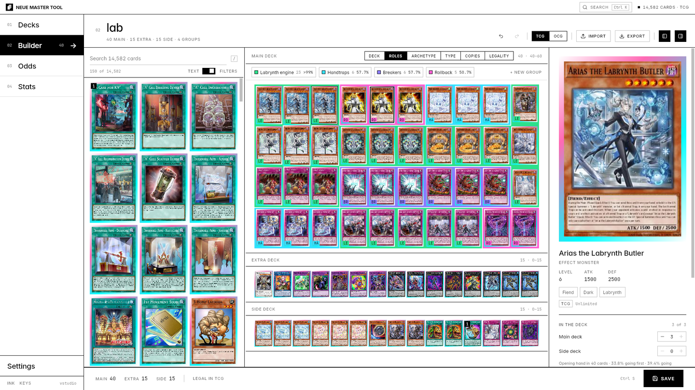
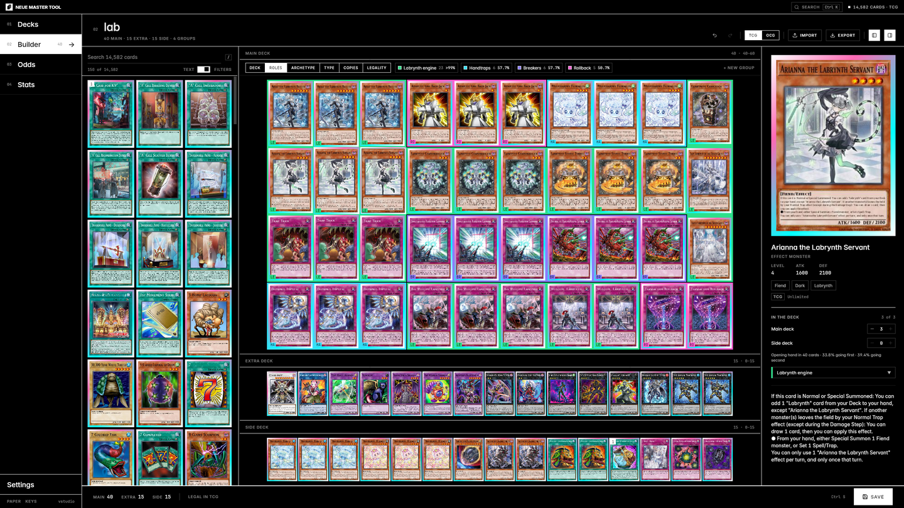

# Neue Master Tool

The deck builder for a desk: mouse, keyboard, a large display, and the
**Master UI** design language (`github.com/kaiharimoto/Master-UI`,
`kit/MASTER-UI.md`) — paper and ink, zero radius, no shadows, Inter, numbered
pages, a quiet voice.

It is a **separate application** from the tablet app and from the older
`:desktopApp`. It installs on its own, keeps its own data, updates itself from
its own release track, and shares only the rules: `:core` (every deck rule,
fitter, lens and odds calculation) and `:ui`'s state holders
(`DeckBuilderState`, whose behaviour is the tablet's by construction). None of
its look comes from `:ui`.




Play mode is not in it. kai will rebuild play from scratch later; Neue is the
builder, its odds and its statistics.

---

## 1. Where it lives

| | |
|---|---|
| `app/neue/` | the module: UI and `main`, JVM only |
| `app/neue/VERSION` | the version a local build carries; releases pass `-Pneue.versionName` |
| `app/neue/icons/` | installer icons, drawn by `tools/neue/mark.py` |
| `core/input/DeskShortcuts.kt` | the keyboard, as data |
| `core/prefs/NeuePreferences.kt` | its settings document (`"neue.ui"`) |
| `core/update/NeueReleaseTrack.kt` | how it finds its own releases |
| `.github/workflows/release-neue.yml` | the release |
| `studio/.../NeueStudio.kt` | headless screenshots: `tools/shoot.sh --neue` |

```
cd app && ./gradlew :neue:run                  # run it (needs the Android SDK, like :ui)
./gradlew :neue:jvmTest                         # the Master UI law test and the key map
tools/shoot.sh --neue --page=builder --theme=ink --width=2560 --height=1440 --name=b
```

---

## 2. Master UI, and the two exceptions

`neue/theme/` is `MASTER-UI.md` §2–§7 translated into Compose: `MuColors` is
paper, ink and the ink alpha ramp; Ink is `MuColors.of(ink = true)`, the exact
inversion; `MuType` is the 96/56/32/20/14/12/11 scale in Inter (bundled, OFL)
with JetBrains Mono for numbers; `MuMotion` is one easing and three durations.
`neue/kit/` is the component set — buttons, underline inputs, selects,
segmented controls, tabs, switches, sliders, meters, the hatch, the breathing
square, tooltips, menus, dialogs, drawers, toasts — built on foundation
primitives. **Material is not used**, not restyled: it is not imported.

**`MasterUiLawTest` is the kit's `check.mjs` for Kotlin** and runs in CI: a
radius, a shadow, a gradient, a colour literal, a Material import, weight 600,
a spring or an exclamation mark anywhere in `neue/` fails the build.

kai granted three exceptions. The law test names the files the two colour
ones live in; the third is motion, and lives in `core/motion/DeskLean.kt`:

- **`cards/Foil.kt`** and **`cards/Holo.kt`** — the foil border on a card's
  face. It is kept, as kai asked, and it is content rather than chrome (§17:
  the pixels of a picture keep their colour). See §2a.
- **`cards/GroupMarkers.kt`** — *"colors are allowed for deckbuilding markers
  only (like card groups in the deck itself assigned by the user)"*. A group's
  hue shows in the deck's cracks, on its key, on its mark. Lenses that are
  facts rather than the user's own drawing — type, copies, legality — are told
  apart by ink weight, the way everything else in Master UI is.

- **Cards move** — *"have the cards animate and react by tilting in a
  satisfying way"*, and a card that *"slightly tilts and lifts in 3d space"*
  when picked up. See §2b. Cards only: chrome never moves, and nothing uses a
  spring (the law test still refuses one) — a thing that follows a pointer has
  no duration, so its easing is `DeskLean.approach`, a frame-rate independent
  half-life.

Card art keeps its colour inside a §17 content frame. Nothing else does.

### 2a. The holographic foil

kai chose it from six Blender mockups (`tools/foil/`, variant C) and asked for it
to be made better; `Holo.kt` is the refined model, per pixel, as a runtime
shader through `ui/gpu/StageShader`. A foil stamp is a mirror with a
diffraction grating pressed into it:

- **silver** with an anisotropic highlight — a streak that slides round the
  band — under two lights, a key from the upper left and a bounce from the
  lower right;
- **diffraction** from concentric grooves: order *m* shows the wavelength
  `λ = d · |(L + V) · g| / m`, three orders, d = 1600 nm, added as light;
- **grooves** you can see up close, which break the rainbow into striations
  (their pitch never drops below 3 px — finer is moiré);
- a **rim** where the stamp meets the print, lit by the same key, with an ink
  hairline.

**The frame round the artwork is the same stamp.** One set of grooves runs
across the card, so the border and the art frame catch the light together. Where
that frame is depends on the card's template, and `core/layout/ArtFrame.kt`
holds the three, measured to the pixel off YGOPRODeck's renders (813 × 1185):
**standard** for every monster, spell, trap and token frame, a square bevel from
(86, 205) to (728, 846); **pendulum**, wider and reaching down past the scales
because the art runs on behind the pendulum-effect box, from (44, 204) to (769,
887); and **Link**, the standard square with the eight arrow sockets left
unfoiled, because they are printed over it. Skill cards have no frame here.
`ArtFrameTest` pins the shapes; `:studio:shootFoil --cards=id:frameType,...`
draws a row of card types for checking the alignment by eye.

The eye is a couple of card-widths away and the **pointer moves it**: a mouse
stands in for tilting the card, and the light glides there over 180 ms when
the pointer leaves. The card itself never moves. Where runtime shaders are
unavailable the classic two-hue band is drawn instead (DESIGN.md §6).

`tools/shoot.sh`'s studio has a mode for it — `:studio:shootFoil` draws the
real `drawFoil` on real card art at scripted pointer positions, or as a sweep
for a GIF — so the app's foil can be compared frame for frame with the Blender
reference. Settings → Foil offers Holographic (the default), Classic and Off.

### 2b. Cards that lean

One picture rather than two rules: **the pointer is a finger pressed up under
a cloth the cards lie on.** The card over it rises (3.5%); the cards around it
sit on the slope, each with its edge nearest the pointer higher than its far
edge, falling away over about a card and a half (`DeskLean.toward`). Sweep
across the deck and the bump travels with you, and each card's foil catches the
light as it turns. A card being carried lifts 7% and leans back against its own
motion, its leading edge up (`DeskLean.carried`); the deck makes way for it as
it passes over.

It is the play stage's recipe: one `LeanField` per deck, stepped by one frame
loop that **sleeps once the cards settle** (nothing idles), and every card reads
its pose inside its own `graphicsLayer`, so leaning never recomposes. Two things
are load-bearing. The hit area is outside the layer, so a leaning card never
changes what the pointer is over (a card that tilted away from the pointer and
lost the hover would flicker). And the eye is **2.2 of the card's own widths**
away: `cameraDistance` is in 72-pixel inches, so a fixed one leaves a small card
flat and throws a large one at the viewer.

### 2c. The name in foil

kai asked whether a card's *name* could be stamped in the foil too, saw three
versions (`:studio:shootNames`: as printed; foil letters; foil letters over an
ink outline) and chose **foil letters**, which is the default. Settings → Card
names offers the other two.

The letters are found in the pixels (`core/layout/NameInk.kt`): every render
sets the name in one bar left of the attribute icon, and the ink is black or
white by frame (spells, traps, Xyz and Link are white), which the frame says
more reliably than the pixels can. A letter is how far a pixel has gone from the
bar's median toward its ink, so the letters keep their antialiased edges. The
mask is read off the picture the card has already decoded (`cards/NameMasks.kt`,
off the UI thread, kept by card and size), and the stamp is `Holo`'s sheet mode
kept only where the mask has a letter, so the name and the border catch the
light together. Holographic foil only; the screenshot carries it too.

---

### 2d. The family cursor

Neue uses the pointer every Master app uses, **Crop caption** — four 2 px trim
marks around a 2 px point, in difference mode; over something clickable they
open out and frame it, and a micro-caps caption in the slug under the frame says
what a click will do. `docs/master-ui/CURSOR.md` is the spec, vendored from the
Master UI repo (where it lives, with `kit/cursor/cursor.js`, on the
`claude/beautiful-bell-7du12e` branch; `main` does not carry it yet).

`cursor.js` cannot run here — it reads intent off a DOM, and Compose has none —
so it is **ported, not installed**: the arithmetic is `core/input/CropCaption.kt`
(the reference script's numbers: 5 px pad, 6 px inset past 480 × 160, the caret
at 1.8 × the type between 20 and 56, the 36 × 14 drag bar, the caption 6 px
under the frame and flipped above near the bottom, 180 ms snaps, 120 ms fades,
a tick every 300 ms), tested in `CropCaptionTest`; the drawing is
`neue/cursor/FamilyCursor.kt`. Three differences are forced by Compose and
worth knowing:

- **Intent is declared, not read.** A target says what it is with
  `Modifier.cursor(…)` / `cursorPointer(…)` — `caption`, `label` (the
  `aria-label`), `reason`, `value`, `showsWords` — which is the kit's
  `data-cursor*` hooks as parameters. Which targets are under the pointer is
  Compose's own hit testing (their hover), so a dialog occludes what is under it
  exactly as it does for a click; the innermost wins.
- **Menus are not popups any more.** A Compose `Popup` draws above everything in
  the window, the cursor included, and the kit's menus must keep the family
  cursor. The context menu and the select list now open in the window's own layer
  (`AnchoredBox`, `Overlays`), under the cursor. Tooltips are still popups; they
  sit under the caption slot now (36 px below the component), so the two never
  overlap. The text field's own Cut/Copy/Paste menu is still a popup, and the
  system pointer shows over it — as over a native top-layer surface.
- **The system pointer is hidden by the window's root** (`pointerHoverIcon(…,
  overrideDescendants = true)` with a one-pixel transparent cursor), over every
  child's own icon, and comes back wherever the cursor steps aside. Where the
  toolkit cannot make that cursor (headless), the arrow stays, as the kit's
  does when its script never loads.

**Over a card the marks are heavier** (kai, 1.0.12): difference-mode marks two
pixels thick go muddy on card art, so framing a card draws them 3 px thick with
12 px arms and a 4 px point, in paper with a 1 px ink edge — they read on any
picture. It is `emphasis` on the target (`CropCaption.arm`, `weight`, `point`),
set by every card and nothing else; everywhere else the kit's marks are as
specified.

Busy: the pool while the card pool syncs (a region, `Working`), the update
download (`Downloading` and its percent) and the screenshot export
(`Exporting`). The crash reporter's window has no family cursor: it is drawn
theme-free, to render when nothing else can, and keeps the system arrow.
`tools/shoot.sh --neue --hovers=card@0.3,0.2;undo@0.47,0.02` photographs the
cursor at each point and logs what it resolved to.

## 3. The window

**One 48 px bar** — the mark, the page you are on, then whatever the page puts
there (the builder puts the deck's name, its legality, its tools and Save), the
update pill and immersive mode — the 232 px index rail —
`01 Decks · 02 Builder · 03 Odds · 04 Stats`; below the rule, what is being
fetched, `Search Ctrl K` and Settings — and the page. Until 1.0.10 the app and
the builder each had a bar; kai merged them, moved search to the rail beside
Settings, and let the card count go to the pool, where it is read.

**The rail folds away** until the pointer reaches the window's left edge, and
comes out *over* the page rather than pushing it: a rail that pushed would
re-fit the deck, and every card would jump. It can be pinned (Settings, or on
the rail itself). **Immersive mode** (`F11`, or the button in the title bar) is
full screen with the title bar and the builder's bar folded over the top,
coming out when the pointer reaches the edge —
the deck and the panes that build it get the whole screen. `Esc`, last in its
chain, leaves it; so does leaving full screen any other way. **It stays when
another window takes focus** (1.0.12): Compose goes full screen through the JDK's
exclusive mode, and on Windows the JDK both put the window into Direct3D exclusive
mode and added a listener that minimised it on focus loss — a click on a second
monitor minimised the builder. Neue turns Java2D's D3D pipeline off at start-up
(skiko draws with its own) and removes that listener (`Platform.keepFullScreen`).
In immersive mode the page keeps **32 px of paper at the top** (`IMMERSIVE_TOP`),
so the deck's own row is out of the bar's reach, and the deck's spare height is
shared above and below it — centred, not pushed down. Leaving goes
through `Floating` first and re-maximises a moment later: Compose's
`placement = Maximized` sets maximised and **never clears full screen**, which is
how 1.0.3 left a window stuck full screen with its bars back. And a click below
the folded-out header lets go of the deck name — on a desktop nothing else takes
focus from a text field, so a bar held out while you type never folded away. One pointer
watcher at the root, consuming nothing, decides all of it
(`core/layout/EdgeReveal.kt`): a bar comes out at 8 px from the edge and folds
once the pointer is 24 px clear of it; a deck name being typed holds the top
out; a carried card opens nothing.

**02 Builder** is three columns under the window's one bar. The pool (search,
inline filters, a flush grid of cards) and the inspector are resizable and
hideable; the deck between them is **fitted, never scrolled**, by the tablet's
own `DeckFitter.plan`: row widths in (10 main, 15 extra and side), one card size
out. On a large display the fitter simply hands back larger cards.

**Every pixel of chrome is a pixel off every card** — kai's brief for 1.0.9 and
again for 1.0.10. The exploration behind it measured the column at 1920 × 1080:
432 px of the 1080 went to bars, strips and padding, and the cards had 648.

| | 1.0.8 | 1.0.9 | 1.0.10 |
|---|---|---|---|
| app bar | 40 | 40 | **one bar, 48** — the app's and the builder's merged |
| page header | 92 | builder bar, 48 | (in the one bar) |
| footer | 64 | gone | gone |
| main strip + lens keys | 45 + 45 | 36 + 36 | **one row, 40**: Groups button, name, count, lens |
| extra and side strips | 37 each | 28 each | **none** — the names go where the deck has room to spare |
| padding round each grid | 24 | 12 | 12 |
| gap between cards | 2 | 0 | 0; with a lens on, tetris blocks |

**The section names go in the deck's own empty space** (`core/layout/DeckLabels.kt`).
A fitted deck is limited by one side and has room along the other: limited by
its height, there is paper beside the grids; by its width, paper under them. So
the deck is fitted both ways — the extra and side decks' names in a gutter to
the left of their cards, or in a 24 px row over them — and the arrangement that
draws the larger card wins. With the pool and the inspector out at 1920 × 1080
the deck is width-limited, the names take rows, and the rows cost nothing.

**Groups are tetris blocks** (`core/layout/GroupBlocks.kt`, `builder/Regions.kt`),
kai's picture: "cards in groups flush with no gaps between them, and the groups
themselves separated from other groups." Every card keeps its place and its size
— the breakdown never moves a card, and 1.0.9's crack, which shrank a card on
any side facing another group, left the cards of one block different sizes and
out of line. Instead, with a lens on, the grid opens one even 6 px seam between
every pair of cards, and each group fills the seams *inside itself* with its
colour and reaches 1 px past its edge. The seams between two groups stay paper.
A group reads as one solid piece, cells and all, and the pieces stand apart.
With the lens on Deck there are no seams at all and the deck is flush. The
screenshot export draws the same blocks.

**The Groups panel stands beside the deck, not over it.** The boxed **Groups**
button in the deck's top-left corner (or `K`) opens `GroupsPanel` down the
right: each key of the lens with its count and opening rate, click to isolate,
right-click a group to edit or delete it, and while a group is being drawn up,
the draft. It is closed by default (`NeuePreferences.groupsPanel`), because the
232 px it takes comes off every card when the deck is width-limited.

The bar keeps the words on Import, Export and Screenshot while it is 1500 px or
wider and drops to their icons (with their tooltips) below that; the wordmark
goes first. Its title field sets its own line height: the type scale's display
leading is tighter than a descender, and a single-line field clips to its line
— the tail of a `y` was cut off.

The pool's cards are drawn **the size of the main deck's** by default
(`DeckSized` in `PoolPane.kt`: as many columns as that width fills, rounded to
the nearest — `GridCells.Adaptive` only rounds down, so every card came out
larger than asked), and while the rail folds away the pool keeps **32 px of
empty paper** at the window's edge, because the rail comes out at that edge and
a pool running up to it put its first column where reaching for a card called
the rail.

**The inspector**: the picture on top (1.0.9 put the words first; kai moved the
picture back), then the name, the numbers and the card's text, then the details
(type, attribute, archetype, banlist) and the copies in the deck as sections that
fold shut with a click and stay shut (`NeuePreferences.inspectorFolded`).

**Contrast** is darker than the kit's ramp, in both themes, and Settings has a
*High* setting on top of that (`MuColors.of(ink, high)`; the table of alphas and
what each has to clear is on `MuColors`). The kit's `.60` meta text and `.25`
field borders sat at the edge of 4.5:1 and well under the 3:1 a control's
outline needs.

## 4. Mouse and keyboard

The mouse is a table too, `core/input/DeskMouse.kt`, and the help dialog
(`F1`) renders it:

| | a card in the pool | a card in the deck |
|---|---|---|
| hover | the inspector shows it | the inspector shows it |
| click | select | select |
| right-click | **add** to the main deck (the extra, for a card that lives there) | **remove this copy** |
| Shift right-click | add to the side deck | add another copy |
| hold | **open it large** | **open it large** |
| hold right | **add** | **add another copy** |
| double-click | add (Shift: side) | — |
| drag | pick it up | move it; drop it on the pool to remove |

That is kai's brief for 1.0.10, in their words: **"hold left click should open
the inspector, hold right click duplicates. just right click removes the card
from the deck."** A right-click is the quick edit in both places — in from the
pool, out of the deck — a held right button is one more copy, and a held left
button opens the card large: the art as tall as the window allows, the text in
16 px beside it, the copies, and every action the old menu had
(`builder/CardViewer.kt`). A click outside it, `Esc` or its ✕ closes it; `Space`
opens the selected card the same way. Shift is still "the other way". A
right-click is read on release, the first moment it is known not to be a hold.
`DeskMouseTest` holds these rows and no gesture meaning two things.

The table moved three times before this (1.0.3: right-click removes; 1.0.4:
right-click adds everywhere, hold is the menu; 1.0.9: hold left adds, hold right
opens). **Right-click did nothing from 1.0.3 to 1.0.8**, and the table was never
the reason: Compose's `awaitFirstDown` answers only to the *primary* button, so
a right press went past the card as though it were not there. `CardPointer`
waits for a press of any button (`awaitAnyDown`). The studio's `--mouse` flag
drives real presses through the real modifier and logs the deck's counts, so a
gesture is checked rather than read:
`--mouse="right@0.3,0.25;left-hold@0.3,0.25;right-hold@0.3,0.25"`.

A press selects at once, then becomes a click, a drag (past the slop) or a hold
(450 ms still), whichever comes first; the card rises under the button while
the hold counts down, so the press says what it is about to do.

The keyboard is `DeskShortcuts`, one table resolved in one place, rendered by
the help dialog (`F1`) and reachable by name from the palette (`Ctrl K`).
`DeskShortcutsTest` holds every action bound and no chord meaning two things at
once; `DeskKeysTest` holds every key in the table pressable. The pool keys
(`↑ ↓ Enter`, `Shift Enter` for the side) are live *while typing in the search
field* and nowhere else, so confirming a deck name never adds a card.

### 3a. Zen

In immersive mode, on the builder, doing nothing is a mode too
(`core/motion/Zen.kt`, `neue/zen/`):

- **Three seconds** idle: everything that is not a card fades — the rows, the
  rules, the search and its controls, the inspector's text, the scrollbars. The
  cards stay exactly where they are. Any movement brings it back.
- **Ten seconds**: this is zen. The pool and the inspector go too, and the deck
  comes to the middle of the window and grows into it (`ZenStage`: a transform
  about its own centre, never a re-fit, filling at most 72% of the width and 80%
  of the height so there is table round it). The cards **float in their blocks**
  — each lens group, or each section with no lens, drifting as one so it keeps
  its shape — and **flutter like scales**: a slow lean about the diagonal runs
  through each block corner to corner, one diagonal a moment behind the last
  (`ZenFloat.inBlock`). A card picked up and put down has left its block and
  floats on its own clock. Everything leans, dreamily, toward the pointer. (Until
  1.0.12 every card drifted its own way, which kai found chaotic.)
- **The cards are the garden.** kai scrapped the sand garden that stood behind
  the deck for six releases (spirals, rakes, a sun) — "they don't look good" —
  for the cards themselves: each floats over **its own shadow** (`ZenShadow`,
  drawn by `ZenShadows.kt` with Skia's analytic rect blur; the higher a card,
  the further, softer and fainter its shadow), and **the pointer picks them up
  and puts them down anywhere** (`ZenArrangement`). A card put down lands on top
  of what it is put on; one being carried floats higher and casts further. The
  arrangement is only a picture: the deck's order never changes. Waking draws
  every card home; the next zen puts them back where they were left.
- **Only a key wakes it.** In deep zen the pointer is for arranging, so neither
  moving it nor clicking ends zen; any key does, and that key does nothing else.
- **"Put the cards back"** comes out, faintly, when the pointer goes into the
  window's bottom-right corner (`ZenCorner`, 240 × 140) and something has been
  moved; it draws every card home over a slow beat and forgets the arrangement.

The shadow is **kai's exception to Master UI's "no shadows"**, and it is one
file: `MasterUiLawTest` refuses a blur or a mask filter anywhere else in
`neue/`. In Ink it is the exact inversion — a faint light under each card —
because a black shadow on black says nothing and dark is paper and ink swapped.
The studio photographs it with `--zen=deep --zen-move=dx,dy`, which carries two
cards before the still.

### 4a. Groups

Every row of the Groups drawer (`G`) says what can be done to it: the name is a
field (written on Enter or on leaving it, so one rename is one undo), the colour
is six swatches, and **Edit cards**, up, down and **Delete** are buttons on the
row. Delete keeps the cards and offers Undo. On the Roles lens, right-click a key
in the Groups panel for the same; `Edit groups` sits under `+ New group`. Before this, deleting a
group meant opening it and finding a link in the lens strip, and kai could not
tell it was possible.

### 4b. High-resolution art

YGOPRODeck's small renders are 268 px wide, and the inspector — and the deck, on
a large display — draws wider than that, which blurs the small print first.
`art/ArtLibrary.kt` downloads every card's 813 × 1185 original into
`<data>/card-art-hd` while the app is used: what is on screen first (the deck,
the card being read, the pool's results, anything drawn wider than 268 px), then
the rest of the pool. About 2 GB. Four at a time, under a dozen requests a
second (YGOPRODeck allows twenty and asks that images be kept, not re-fetched);
a file is written beside its name and moved into place, so quitting halfway
costs one picture. A card draws the original the moment it is on disk, over the
small render until it has decoded, so arriving never flashes. Settings has the
switch, the count, the size and the folder.

### 4c. The screenshot

`Ctrl Shift S`, or Screenshot in the header: main, extra and side as they stand,
with none of the window — and with the lens's colours and a legend if a lens was
on, because that is the part of a deck its builder drew. Above them, the deck's
name, its counts, its format, the date, and the newest TCG set already out on
that date (`cardsets.php`, `CardSetReleases.latest` — the feed lists announced
sets too). Drawn by `shot/DeckShot.kt` offscreen at 2× from the originals, 1600
dp wide, in the theme you are in. `tools/shoot.sh --neue --deckshot` renders it
headlessly.

---

## 5. Releases, updates and feedback — the permanent numbers

`release-neue.yml`, dispatched with a version, builds a `.msi` (Windows), a
`.dmg` (macOS) and a `.deb` (Linux) and publishes them as
`neue-master-tool-<version>.<ext>` under the tag **`neue-v<version>`**.

- **Every Neue release is a pre-release, and its tag is never `v*`.**
  `/releases/latest`, which every installed APK asks, returns the newest
  non-pre-release of any tag; a Neue release that was not a pre-release would
  hide the next APK from every tablet. The 3DS track learned this first
  (`release-3ds.yml`). Neue lists releases and filters by its prefix
  (`NeueReleaseTrack`), so the flag costs it nothing.
- **`windows.upgradeUuid` is permanent** (`app/neue/build.gradle.kts`). An MSI
  with a different one installs beside the old app rather than over it.
- **The version only goes up**, and is three numbers with major and minor
  under 256 — an MSI constraint. The workflow refuses anything else.
- The MSI is **per-user**, so an update needs no administrator. On Windows the
  app downloads the installer, starts a small script that runs `msiexec
  /passive` and reopens the new build, and quits. On macOS it opens the
  `.dmg`; on Linux it hands the `.deb` to the package installer.
- The installers are **not code-signed**. Windows SmartScreen and macOS
  Gatekeeper will warn once; the release notes say how to get past it.

A crash is written to `<data>/crash.txt` and shown on the next launch in a
window with no theme (so it renders when the theme was what broke), with
`Copy` and `Report →`. **Report an issue** (Settings and the palette) opens a
GitHub issue with the version and the system filled in.

Data lives in `%APPDATA%\NeueMasterTool`, `~/Library/Application
Support/NeueMasterTool` or `$XDG_DATA_HOME/neue-master-tool` — its own SQLite
database (schema version 3, the same migrations), its own card-art cache. Decks
move between Neue and the other builds by `.ydk`/`.ydkx`.

## 6. Shipping a change to Neue

The same discipline as the APK, on its own track: push to the `claude/**`
branch, wait for `build-app.yml` (its `neue` job runs the law test and
packages the `.deb`), fast-forward `main`, dispatch `release-neue.yml` on
`main` with the next patch, and confirm the tag and **all three** installers
are on the release before calling it shipped. A change that touches only
`neue/` does not need an APK release; one that changes `:core` or `:ui`
behaviour does, as always.
